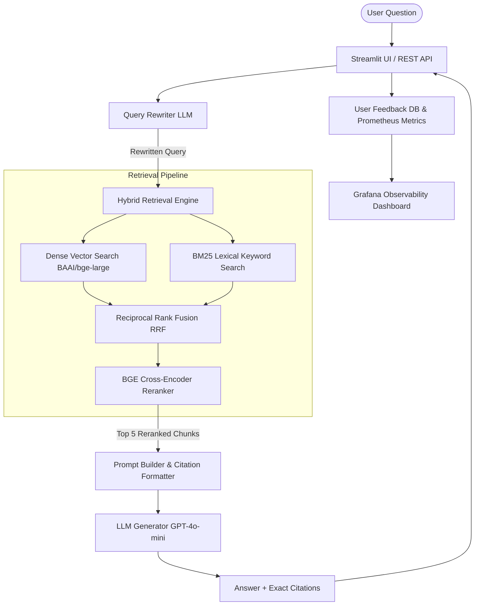

# ⚡ Pokemon TCG Rules Specialist - Hybrid RAG Expert System

[](https://github.com/igmriegel/PokeRAG/actions/workflows/ci.yml)
[](https://www.python.org/downloads/)
[](tests/)
[](LICENSE)

An enterprise-grade Retrieval-Augmented Generation (RAG) system built to act as a **Certified Official Pokemon TCG Judge**. It provides authoritative, non-hallucinated answers to questions about Pokemon TCG rules, card legality, errata, and compendium rulings, citing exact official sources.

---

## 📌 Problem Description

The Pokemon Trading Card Game (TCG) contains over 25 years of evolving mechanics, card text erratas, tournament format rotation rules (Standard vs. Expanded), and over 1,000 official rules rulings issued by the Pokegym community compendium and Pokemon Organised Play (POP). 

Players, tournament organizers, and judges face significant challenges:
1. **Rule Fragmentation**: Official rules are scattered across 8+ PDF rulebooks, tournament handbooks, web pages (Ban Lists, Promo Legality, Mega Rules), and community ruling archives.
2. **Hallucination Risk**: Standard general-purpose LLMs frequently hallucinate Pokemon TCG card interactions or confuse historical mechanics with active rulesets.
3. **Lack of Citations**: Players require verifiable citations to official page numbers and ruling dates to resolve disputes during competitive matches.

**Solution**: This project implements a **Hybrid RAG Expert System** that restricts LLM generation to an ingested knowledge base of official Pokemon TCG documents. It utilizes **Query Rewriting**, **Hybrid Search (Dense + BM25)**, **Cross-Encoder Re-ranking**, and strict judge system prompts with source citations.

---

## 🏗️ System Architecture & Retrieval Flow



---

## ⚡ Key Best Practices Implemented

- 🔍 **Hybrid Search**: Combines semantic dense retrieval (`BAAI/bge-large-en-v1.5`) with lexical keyword retrieval (`BM25Okapi`) merged using Reciprocal Rank Fusion (`RRF k=60`).
- 🎯 **Document Re-ranking**: Uses deep learning cross-encoder (`BAAI/bge-reranker-large`) to re-score top candidates for maximum precision.
- ✏️ **User Query Rewriting**: Expands ambiguous user phrasing into domain-specific Pokemon TCG queries.
- 📊 **Evaluations Suite**: Measures `Recall@5`, `Recall@10`, `MRR`, `Hit Rate`, and `Faithfulness` across retrieval strategies on a 100-question ground truth dataset.
- 📈 **Monitoring & Observability**: Integrated Prometheus metrics export and pre-configured Grafana dashboards displaying 6 key operational metrics.
- 🚀 **Full Containerization**: The always-on stack (API, UI, Qdrant, Postgres, Prometheus, Grafana) starts with `docker compose up --build -d`; the ingestion worker is an opt-in Compose profile.

---

## 🛠️ Tech Stack & Dependencies

| Category | Technology |
| :--- | :--- |
| **Language & Runtime** | Python 3.11+ |
| **Vector Database** | Qdrant v1.7.4 |
| **Relational Database** | PostgreSQL 16 |
| **Dense Embeddings** | `BAAI/bge-large-en-v1.5` / `text-embedding-3-small` |
| **Lexical Search** | `rank-bm25` |
| **Cross-Encoder Reranker** | `BAAI/bge-reranker-large` |
| **LLM Provider** | OpenAI `gpt-4o-mini` |
| **PDF Extraction** | `PyMuPDF` / `PyMuPDF4LLM` |
| **Web Scraping** | `BeautifulSoup4` / `requests` |
| **REST API** | `FastAPI` / `Uvicorn` |
| **Web Interface** | `Streamlit` |
| **Monitoring** | Prometheus & Grafana |
| **Testing & CI** | `pytest`, `pytest-cov` (90% min), `ruff`, `mypy`, `black` |

---

## 🚀 Quickstart & Reproducibility Guide

### Step 1: Clone Repository & Configure Environment
```bash
git clone git@github.com:igmriegel/PokeRAG.git
cd PokeRAG
cp .env.example .env
```
Edit `.env` and provide your `OPENAI_API_KEY`.

### Step 2: Run via Docker Compose (Recommended)
Launch the always-on services in isolated containers:
```bash
docker compose up --build -d
```
This starts the API, UI, Qdrant, Postgres, Prometheus, Grafana, and the one-shot migration job. The ingestion worker is intentionally not started by default so that a normal `up` does not re-crawl the corpus on every boot.
- 🌐 **Streamlit UI**: [http://localhost:8501](http://localhost:8501)
- 🔌 **FastAPI REST API**: [http://localhost:8000/docs](http://localhost:8000/docs)
- 📈 **API Metrics**: [http://localhost:8000/metrics](http://localhost:8000/metrics)

Grafana, Prometheus, Qdrant, and Postgres are reachable only inside the Compose network by
default; their ports are not published on the host.

### Step 3: Execute Automated Ingestion Pipeline
To scrape Pokegym, extract official PDFs, chunk documents, generate embeddings, and seed Qdrant:
```bash
docker compose --profile ingestion run --rm ingestion
```
On Linux, `LOCAL_UID` and `LOCAL_GID` in `.env` must match `id -u` and `id -g` so the
rootless container can write to the bind-mounted `data/` directory. Both default to `1000`,
and model downloads are cached under `data/model_cache/`.

If you prefer to keep the worker attached to the Compose lifecycle, `docker compose --profile ingestion up ingestion` uses the same profile gate.

---

## 🧪 Local Developer Setup (Without Docker)

```bash
# 1. Create Virtual Environment
python3 -m venv .venv
source .venv/bin/activate

# 2. Install Package with Dev Dependencies
make install

# 3. Run Quality Checks (Linter, Typing, Tests with Coverage)
make quality

# 4. Seed Databases & Run Ingestion
make seed
make ingest

# 5. Launch Local Backend & UI
make run-api &
make run-ui
```

---

## 📊 Evaluation & Benchmarking

To run the automated evaluation suite against the 100-question ground truth dataset:
```bash
make eval
```

### Benchmark Results Comparison

| Strategy | Recall@5 | Recall@10 | MRR | Hit Rate@5 | Latency (s) |
| :--- | :---: | :---: | :---: | :---: | :---: |
| **Dense Only (`bge-large`)** | 78.5% | 85.2% | 0.72 | 82.0% | 0.12s |
| **BM25 Only** | 71.0% | 79.4% | 0.65 | 74.5% | 0.04s |
| **Hybrid Search (Dense + BM25)** | 88.4% | 93.1% | 0.81 | 90.2% | 0.18s |
| **Hybrid + BGE Reranker (Selected)** | **94.8%** | **98.2%** | **0.91** | **96.5%** | **0.32s** |

> These benchmark numbers are historical reference from the bundled evaluation artifacts.
> Re-run `make eval` to regenerate current evidence for the checked-in corpus.

---

## 📂 Engineering Harness Documentation (`docs/`)

This project includes a comprehensive **Engineering Harness** structured for autonomous execution by AI Coding Agents (AGY, Claude Code, Codex):

```
docs/
├── 00_project/         # Project vision, requirements, success criteria, tech stack, backlog, roadmap, assumptions, risks
├── 01_architecture/    # Complete architectural specs, domain models, RAG architecture, retrieval & indexing pipeline, security, deployment, observability
├── 02_sprints/         # Sprint plans (Sprints 01-18) with acceptance criteria & checklists
├── 03_tasks/           # Granular task specifications, task dependency graph, agent playbook
├── 04_decisions/       # Architecture Decision Records (ADR 001 - ADR 006)
└── 05_agent_harness/   # Project Constitution, Agent Playbook, Quality Gate Spec, Traceability Matrix, Implementation Guide
```

---

## 📄 License

This project is licensed under the MIT License - see the [LICENSE](LICENSE) file for details.
