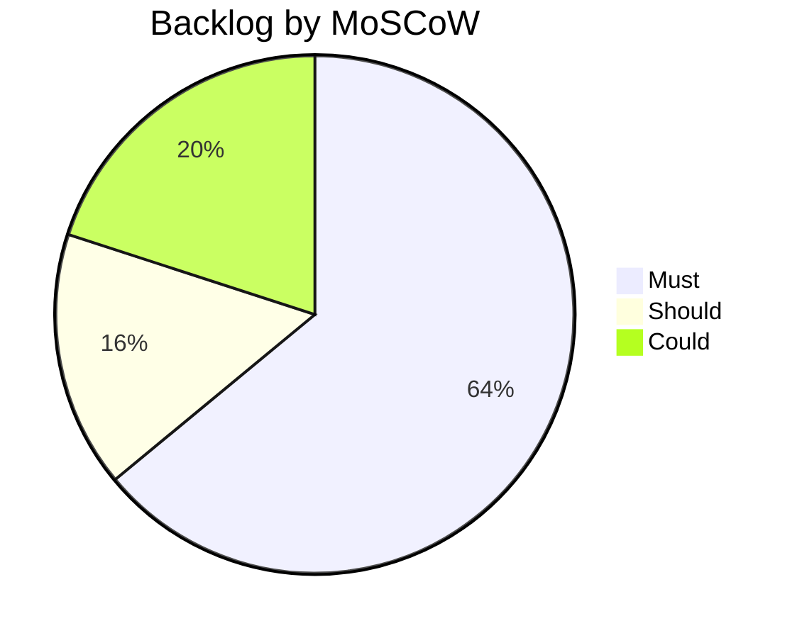

# Backlog.md - Prioritized Product & Engineering Backlog

## Objective

Maintain the **single prioritized backlog** for the Pokemon TCG Rules RAG Expert Assistant:
every deliverable from the source plan plus stretch items, each with a MoSCoW priority, a
link to the requirement it satisfies ([`REQUIREMENTS.md`](./REQUIREMENTS.md)), a target
sprint (`docs/02_sprints/`), and a status. The backlog is the flat, sortable view; the
[`ROADMAP.md`](./ROADMAP.md) provides the phased ordering.

## Scope

- **In scope:** all functional/non-functional work items and stretch experiments.
- **Out of scope:** task-level breakdown (see `docs/03_tasks/`).

**MoSCoW:** Must / Should / Could / Won't (this iteration).
**Status:** Todo / In-Progress / Done / Deferred.

---

## 1. Priority Distribution

---

## 2. Backlog Table

| ID | Title | Description | Priority | Linked REQ | Target Sprint | Status |
| :--- | :--- | :--- | :--- | :--- | :--- | :--- |
| **BL-001** | Repo scaffold & config | Clean Architecture package layout, `Settings`, tooling (ruff/mypy/pytest), compose shell. | Must | REQ-016, REQ-017 | SPRINT_01 | Todo |
| **BL-002** | Infra services up | Qdrant, Postgres, Prometheus, Grafana healthy in compose with provisioning. | Must | REQ-005, REQ-015, REQ-016 | SPRINT_01 | Todo |
| **BL-003** | Domain models | Finalize enums + models in `domain/models.py` as shared contract. | Must | REQ-004, REQ-012 | SPRINT_01 | Todo |
| **BL-004** | Pokegym crawler | Scrape all rulings; extract date/set/card/question/answer/url; save raw HTML + JSONL/Parquet. | Must | REQ-001 | SPRINT_02 | Todo |
| **BL-005** | PDF downloader + extractor | Auto-download 5 official PDFs; extract with PyMuPDF/pymupdf4llm preserving structure. | Must | REQ-002 | SPRINT_02 | Todo |
| **BL-006** | HTML legality scrapers | Scrape Ban List, Promo Legality, Mega Rules pages. | Must | REQ-003 | SPRINT_02 | Todo |
| **BL-007** | Normalization & chunking | Normalize docs; fixed-size chunking (Pokegym = 1 chunk/ruling); metadata enrichment + stable IDs. | Must | REQ-004 | SPRINT_03 | Todo |
| **BL-008** | Embed & index into Qdrant | Embed chunks with `bge-large-en-v1.5` (1024-d); index into `pokemon_tcg_rules`. | Must | REQ-005 | SPRINT_03 | Todo |
| **BL-009** | Dense retrieval | Dense vector search, top-10. | Must | REQ-006 | SPRINT_04 | Todo |
| **BL-010** | BM25 retrieval | Lexical retrieval via `rank-bm25`, top-10. | Must | REQ-007 | SPRINT_04 | Todo |
| **BL-011** | Hybrid search (RRF) | Fuse Dense + BM25 via Reciprocal Rank Fusion (k=60). | Must | REQ-008 | SPRINT_04 | Todo |
| **BL-012** | Cross-encoder rerank | Re-rank fused candidates with `bge-reranker-large`; final top-5. | Must | REQ-009 | SPRINT_04 | Todo |
| **BL-013** | Query rewriting | LLM rewrite of user query before retrieval. | Must | REQ-010 | SPRINT_05 | Todo |
| **BL-014** | Prompt builder + LLM chain | Certified-Judge prompt, context assembly, citations, "I don't know" guardrail. | Must | REQ-011, REQ-012 | SPRINT_05 | Todo |
| **BL-015** | FastAPI endpoints | `/query`, `/feedback`, `/health` with typed request/response. | Must | REQ-013, REQ-014 | SPRINT_05 | Todo |
| **BL-016** | Streamlit UI + feedback | Answer/sources/chunks view, latency/model/#docs, 👍/👎 + comment → Postgres. | Must | REQ-013, REQ-014 | SPRINT_06 | Todo |
| **BL-017** | Evaluation benchmark (100 Q) | Author/label 100 questions with expected sources. | Should | REQ-018, REQ-019 | SPRINT_07 | Todo |
| **BL-018** | Retrieval evaluation | Recall@5/@10, MRR, Hit Rate across 4 strategies; pick best. | Should | REQ-018 | SPRINT_07 | Todo |
| **BL-019** | LLM evaluation (RAGAS/DeepEval) | Faithfulness/Correctness/Citation/Completeness; Prompt A/B × model A/B. | Should | REQ-019 | SPRINT_07 | Todo |
| **BL-020** | Grafana dashboard (≥5 charts) | Questions/day, mean latency, #docs retrieved, 👍/👎, source distribution, top questions. | Must | REQ-015 | SPRINT_08 | Todo |
| **BL-021** | Full compose deploy | All 7 services up with `docker compose up`; startup < 60 s (warm). | Must | REQ-016 | SPRINT_08 | Todo |
| **BL-022** | Prometheus metrics exporter | Instrument query count, latency, retrieval size, feedback counters. | Must | REQ-015 | SPRINT_08 | Todo |
| **BL-023** | ≥90% test coverage + CI gates | Unit/integration/smoke/e2e/regression; ruff + mypy + coverage in CI. | Must | REQ-017 | SPRINT_07 | Todo |
| **BL-024** | Final docs + demo video | README/setup/architecture/evaluation; reproducibility validation; demo video. | Should | REQ-016 | SPRINT_08 | Todo |
| **BL-025** | Cloud deploy (bonus) | Deploy to Render/Railway/AWS; public reachable URL + `/health`. | Could | REQ-020 | SPRINT_08 | Deferred |
| **BL-026** | Second embedding model comparison | Benchmark `text-embedding-3-small` vs `bge-large-en-v1.5`; document winner. | Could | REQ-018 | SPRINT_07 | Deferred |
| **BL-027** | Semantic chunking experiment | Compare semantic vs fixed-size chunking on Recall@10. | Could | REQ-004, REQ-018 | SPRINT_07 | Deferred |
| **BL-028** | Chunk-size ablation | 256 × 512 × 1024 token comparison to fix the default. | Could | REQ-004, REQ-018 | SPRINT_07 | Deferred |
| **BL-029** | Cohere Rerank alternative | Evaluate Cohere Rerank vs `bge-reranker-large`. | Could | REQ-009, REQ-018 | SPRINT_07 | Deferred |
| **BL-030** | IaC / K8s manifests | Deployment manifests for cloud hosting. | Won't (this iter) | REQ-020 | SPRINT_08 | Deferred |

---

## 3. Prioritization Rationale

- **Must** items are the direct path to rubric points (retrieval flow, evaluation,
  interface, ingestion, monitoring, containerization, reproducibility, and the three
  best-practice points: Hybrid, Rerank, Query rewriting).
- **Should** items (evaluation depth, docs, coverage) protect quality gates in
  [`SUCCESS_CRITERIA.md`](./SUCCESS_CRITERIA.md) and provide the comparison evidence the
  rubric's "multiple approaches, best selected" lines require.
- **Could** items are bonus/stretch experiments that raise the score ceiling but do not
  block acceptance; several are the ablations that resolve open
  [`Assumptions.md`](./Assumptions.md) (ASSUMPTION-004/005 via BL-027/BL-028).
- **Won't (this iteration)**: full IaC/K8s (BL-030) is beyond the compose-first delivery;
  revisit if cloud deploy (BL-025) is pursued seriously.

---

## Cross-References

- [`REQUIREMENTS.md`](./REQUIREMENTS.md) · [`SUCCESS_CRITERIA.md`](./SUCCESS_CRITERIA.md) · [`ROADMAP.md`](./ROADMAP.md)
- [`Assumptions.md`](./Assumptions.md) — BL-026/027/028/029 resolve open assumptions.
- [`Risks.md`](./Risks.md) — RISK-007/009/010 relate to evaluation & deploy items.
- Sprint specs `docs/02_sprints/`; tasks `docs/03_tasks/`.
