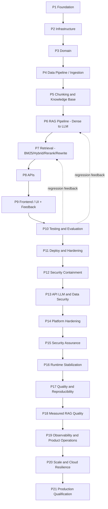

# ROADMAP.md - Macro Multi-Phase Implementation Roadmap

## Objective

Provide the **macro, phase-level plan** that sequences the entire build of the Pokemon TCG
Rules RAG Expert Assistant, mapping each phase to the sprint files under `docs/02_sprints/`
(SPRINT_01..18) and to the requirements in [`REQUIREMENTS.md`](./REQUIREMENTS.md). Each
phase carries an objective, its dependencies, the artifacts it produces, completion
criteria (linked to [`SUCCESS_CRITERIA.md`](./SUCCESS_CRITERIA.md)), and key risks (linked
to [`Risks.md`](./Risks.md)). This is the "what/when/in-what-order"; sprint files carry the
task-level detail.

Current repository state:

- core product, retrieval, evaluation, security, reproducibility, observability and release
  plumbing are implemented and tracked as `Done` in the harness docs;
- the ingestion worker is intentionally gated behind the `ingestion` Compose profile so a
  normal `docker compose up` does not re-crawl the corpus;
- public cloud deployment proof remains external to the repo, so the bonus cloud criterion
  stays pending until a live URL and remote `/health` evidence are recorded.

## Scope

- **In scope:** ordering, dependencies, and gating between the twenty-one named phases.
- **Out of scope:** granular tasks (see `docs/03_tasks/`) and per-sprint checklists (see
  `docs/02_sprints/`).

The phase ordering follows the "Roadmap de implementação" in the source plan
(`PlanejamentoRAG_Pokemon`, lines 514–526).

---

## 1. Phase → Sprint → Requirement Map

| Phase | Sprint(s) | Primary REQ IDs | Rubric contribution |
| :--- | :--- | :--- | :--- |
| **P1 Foundation** | [SPRINT_01](../02_sprints/SPRINT_01_FOUNDATION.md) | REQ-016, REQ-017 | Containerization, Reproducibility |
| **P2 Infrastructure** | [SPRINT_01](../02_sprints/SPRINT_01_FOUNDATION.md) | REQ-005, REQ-014, REQ-015, REQ-016 | Containerization, Monitoring base |
| **P3 Domain** | [SPRINT_01](../02_sprints/SPRINT_01_FOUNDATION.md) | REQ-004, REQ-012 | Problem/flow foundation |
| **P4 Data Pipeline (Ingestion)** | [SPRINT_02](../02_sprints/SPRINT_02_INGESTION.md) | REQ-001, REQ-002, REQ-003 | Ingestion pipeline |
| **P5 Chunking & Knowledge Base** | [SPRINT_03](../02_sprints/SPRINT_03_CHUNKING_INDEXING.md) | REQ-004, REQ-005 | Ingestion pipeline |
| **P6 RAG Pipeline** | [SPRINT_05](../02_sprints/SPRINT_05_RAG_LLM.md) | REQ-010, REQ-011, REQ-012 | Retrieval flow, Best practices |
| **P7 Retrieval** | [SPRINT_04](../02_sprints/SPRINT_04_RETRIEVAL.md) | REQ-006, REQ-007, REQ-008, REQ-009 | Retrieval eval, Best practices |
| **P8 APIs** | [SPRINT_05](../02_sprints/SPRINT_05_RAG_LLM.md), [SPRINT_06](../02_sprints/SPRINT_06_UI_FEEDBACK.md) | REQ-013, REQ-014 | Interface |
| **P9 Frontend / UI** | [SPRINT_06](../02_sprints/SPRINT_06_UI_FEEDBACK.md) | REQ-013, REQ-014 | Interface, Monitoring (feedback) |
| **P10 Testing & Evaluation** | [SPRINT_07](../02_sprints/SPRINT_07_EVALUATION.md) | REQ-017, REQ-018, REQ-019 | Retrieval & LLM evaluation |
| **P11 Deploy & Hardening** | [SPRINT_08](../02_sprints/SPRINT_08_MONITORING_DEPLOY.md) | REQ-015, REQ-016, REQ-020 | Monitoring, Containerization, Bonus |
| **P12 Security Containment** | [SPRINT_09](../02_sprints/SPRINT_09_SECURITY_CONTAINMENT.md) | REQ-021, REQ-024, REQ-028, REQ-030 | Critical exposure and supply-chain containment |
| **P13 API, LLM & Data Security** | [SPRINT_10](../02_sprints/SPRINT_10_API_LLM_SECURITY.md) | REQ-022, REQ-023, REQ-025, REQ-026 | Access control, abuse prevention, LLM/data boundaries |
| **P14 Platform Hardening** | [SPRINT_11](../02_sprints/SPRINT_11_PLATFORM_HARDENING.md) | REQ-021, REQ-024, REQ-027, REQ-028 | Least privilege, segmentation, immutable deployment |
| **P15 Security Assurance** | [SPRINT_12](../02_sprints/SPRINT_12_SECURITY_ASSURANCE.md) | REQ-021..REQ-030 | DevSecOps evidence and release decision |
| **P16 Runtime Stabilization** | [SPRINT_13](../02_sprints/SPRINT_13_RUNTIME_STABILIZATION.md) | REQ-031, REQ-032 | Functional retrieval flow and reproducibility |
| **P17 Quality & Reproducibility** | [SPRINT_14](../02_sprints/SPRINT_14_QUALITY_REPRODUCIBILITY.md) | REQ-033, REQ-034 | Real test pyramid and clean clone |
| **P18 Measured RAG Quality** | [SPRINT_15](../02_sprints/SPRINT_15_RETRIEVAL_QUALITY.md), [SPRINT_16](../02_sprints/SPRINT_16_LLM_QUALITY.md) | REQ-035..REQ-037 | Retrieval/LLM evaluation and best practices |
| **P19 Observability & Product Operations** | [SPRINT_17](../02_sprints/SPRINT_17_OBSERVABILITY_UX.md) | REQ-038, REQ-039 | Monitoring, feedback and UX |
| **P20 Scale & Cloud Resilience** | [SPRINT_18](../02_sprints/SPRINT_18_PRODUCTION_QUALIFICATION.md) | REQ-040, REQ-041 | Performance, cloud and recovery |
| **P21 Production Qualification** | [SPRINT_18](../02_sprints/SPRINT_18_PRODUCTION_QUALIFICATION.md) | REQ-042 | Evidence-backed production decision |

> Note: P6 (RAG Pipeline) and P7 (Retrieval) are logically distinct phases but are built in
> overlapping sprints — a minimal Dense→LLM pipeline (P6) is stood up first, then the full
> multi-strategy retrieval (P7) is layered under it, matching the plan's order
> "basic RAG → BM25/Hybrid → query rewriting → rerank".

---

## 2. Phase Ordering Diagram

```mermaid
gantt
    title Sprint Timeline (relative)
    dateFormat  X
    axisFormat  S%L
    section Setup
    SPRINT_01 Foundation/Infra/Domain      :s1, 0, 1
    section Data
    SPRINT_02 Ingestion                    :s2, after s1, 1
    SPRINT_03 Chunking and Indexing        :s3, after s2, 1
    section RAG
    SPRINT_04 Retrieval                    :s4, after s3, 1
    SPRINT_05 RAG/LLM/Rewrite              :s5, after s4, 1
    section Product
    SPRINT_06 UI and Feedback              :s6, after s5, 1
    SPRINT_07 Evaluation                   :s7, after s6, 1
    SPRINT_08 Monitoring and Deploy        :s8, after s7, 1
    section Security
    SPRINT_09 Security Containment         :s9, after s8, 1
    SPRINT_10 API LLM and Data Security    :s10, after s9, 1
    SPRINT_11 Platform Hardening           :s11, after s10, 1
    SPRINT_12 Security Assurance           :s12, after s11, 1
    section Stabilization
    SPRINT_13 Runtime Stabilization         :s13, after s12, 1
    SPRINT_14 Quality and Reproducibility   :s14, after s13, 1
    section Measured RAG
    SPRINT_15 Retrieval Quality             :s15, after s14, 1
    SPRINT_16 LLM Quality                   :s16, after s15, 1
    section Production
    SPRINT_17 Observability and UX          :s17, after s16, 1
    SPRINT_18 Production Qualification      :s18, after s17, 1
```

---

## 3. Phase Details

### P1 — Foundation
- **Objective:** Establish the repository skeleton, Clean Architecture package layout
  (`domain/ingestion/retrieval/llm/evaluation/monitoring/storage/api/ui/config`), Pydantic
  `Settings`, tooling (ruff/mypy/pytest), and the Docker Compose shell.
- **Dependencies:** none (entry phase).
- **Artifacts:** `pyproject.toml`, `requirements.txt`, `docker-compose.yml`, `.env.example`,
  `src/pokemon_tcg_rag/config/settings.py`, CI under `ci/`.
- **Completion criteria:** `ruff` + `mypy --strict` clean; `docker compose config` valid;
  empty test suite green. Links [SC-016](./SUCCESS_CRITERIA.md), [SC-020](./SUCCESS_CRITERIA.md).
- **Risks:** [RISK-008](./Risks.md) reproducibility drift.

### P2 — Infrastructure
- **Objective:** Bring up Qdrant, PostgreSQL, Prometheus, and Grafana as healthy compose
  services with provisioning and healthchecks; wire connection settings.
- **Dependencies:** P1.
- **Artifacts:** compose services + volumes, Prometheus/Grafana provisioning under `config/`
  and `infra/`, Alembic baseline migration for the feedback schema.
- **Completion criteria:** all services healthy < 60 s ([SC-014](./SUCCESS_CRITERIA.md));
  Qdrant collection `pokemon_tcg_rules` (dim 1024) creatable.
- **Risks:** [RISK-005](./Risks.md) Qdrant memory.

### P3 — Domain
- **Objective:** Finalize domain models and enums (`DocumentSource`, `RuleType`,
  `DocumentMetadata`, `Document`, `Chunk`, `RetrievedChunk`, `AnswerResponse`,
  `FeedbackRecord`) as the shared contract across layers.
- **Dependencies:** P1.
- **Artifacts:** `src/pokemon_tcg_rag/domain/models.py`, unit tests for validation.
- **Completion criteria:** models typed, validated, 100% covered; referenced by
  `docs/01_architecture/DomainModel.md`.
- **Risks:** metadata schema instability if source layouts differ ([RISK-002](./Risks.md)).

### P4 — Data Pipeline (Ingestion)
- **Objective:** Automated download + scrape of all 9 sources: Pokegym crawler, 5 PDFs,
  and 3 HTML legality pages; persist raw HTML/PDF/JSON.
- **Dependencies:** P3.
- **Artifacts:** downloader + scrapers, `data/raw_data/{pdfs,html,json}`, source manifest.
- **Completion criteria:** 100% sources fetched with 0 hard failures
  ([SC-015](./SUCCESS_CRITERIA.md)). REQ-001/002/003.
- **Risks:** [RISK-001](./Risks.md) scraping fragility; [RISK-006](./Risks.md) source ToS/license.

### P5 — Chunking & Knowledge Base
- **Objective:** Normalize/parse raw docs (PyMuPDF/pymupdf4llm + BeautifulSoup), chunk with
  metadata enrichment and stable IDs, embed with `BAAI/bge-large-en-v1.5`, index into Qdrant.
- **Dependencies:** P4, P2 (Qdrant up).
- **Artifacts:** `data/processed`, `data/chunks` (JSONL/Parquet), populated Qdrant collection.
- **Completion criteria:** 100% docs indexed, chunk counts > 0 per source ([SC-015](./SUCCESS_CRITERIA.md)). REQ-004/005.
- **Risks:** [RISK-002](./Risks.md) PDF extraction quality; [RISK-003](./Risks.md) embedding cost/time.

### P6 — RAG Pipeline (Dense → LLM)
- **Objective:** Stand up the minimal grounded pipeline: Dense retrieval → prompt builder
  (Certified Judge persona) → LLM (`gpt-4o-mini`, temp 0.0) → cited `AnswerResponse`; add
  LLM query rewriting before retrieval.
- **Dependencies:** P5.
- **Artifacts:** retrieval/llm modules, prompt templates (`docs/05_prompts/`), query rewriter.
- **Completion criteria:** end-to-end answer with citations; abstains when unsupported
  ([SC-011](./SUCCESS_CRITERIA.md)). REQ-010/011/012.
- **Risks:** [RISK-004](./Risks.md) LLM hallucination.

### P7 — Retrieval (BM25 / Hybrid / Rerank)
- **Objective:** Implement all four strategies — Dense, BM25 (`rank-bm25`), Hybrid via RRF
  (k=60), Hybrid+Rerank (`bge-reranker-large`) — behind a common interface.
- **Dependencies:** P6.
- **Artifacts:** four retriever implementations, RRF fusion, reranker stage.
- **Completion criteria:** all 4 selectable and benchmarkable ([SC-005](./SUCCESS_CRITERIA.md),
  [SC-022](./SUCCESS_CRITERIA.md)). REQ-006/007/008/009.
- **Risks:** [RISK-005](./Risks.md) reranker memory/latency.

### P8 — APIs
- **Objective:** Expose FastAPI `/query`, `/feedback`, `/health` returning typed
  `AnswerResponse`/`FeedbackRecord`; persist feedback to Postgres.
- **Dependencies:** P6 (query), P2 (Postgres).
- **Artifacts:** FastAPI app, API contracts (`docs/01_architecture/APIContracts.md`), tests.
- **Completion criteria:** endpoints conform to schema ([SC-021](./SUCCESS_CRITERIA.md)). REQ-013/014.
- **Risks:** [RISK-007](./Risks.md) input handling / injection.

### P9 — Frontend / UI + Feedback
- **Objective:** Streamlit UI: question → answer → sources → chunks, with latency/model/
  #docs, plus 👍/👎 + optional comment persisted via the API to Postgres.
- **Dependencies:** P8.
- **Artifacts:** Streamlit app, feedback wiring.
- **Completion criteria:** UI answers a query and records feedback ([SC-018](./SUCCESS_CRITERIA.md),
  [SC-021](./SUCCESS_CRITERIA.md)). REQ-013/014.
- **Risks:** UX gaps hiding citations ([RISK-004](./Risks.md)).

### P10 — Testing & Evaluation
- **Objective:** Build the 100-question benchmark and evaluation harness; compare 4
  retrieval strategies (Recall@5/@10, MRR, Hit Rate) and LLM configs (2 prompts × 2 models)
  on Faithfulness/Correctness/Citation/Completeness; enforce ≥90% coverage and regression
  gates.
- **Dependencies:** P7, P9.
- **Artifacts:** benchmark dataset, eval reports, regression baselines, full test suite.
- **Completion criteria:** [SC-001](./SUCCESS_CRITERIA.md)–SC-011, SC-016 met; best configs
  selected & documented. REQ-017/018/019.
- **Risks:** [RISK-009](./Risks.md) ground-truth labeling effort.

### P11 — Deploy & Hardening
- **Objective:** Finalize `docker compose up` for the always-on stack (streamlit, api,
  qdrant, postgres, prometheus, grafana), keep ingestion behind the opt-in profile,
  complete the Grafana dashboard (≥5 charts), docs, and optional cloud deploy
  (Render/Railway/AWS).
- **Dependencies:** P10.
- **Artifacts:** finalized compose + dashboards, README/setup/architecture/evaluation docs,
  optional IaC (REQ-020), demo video.
- **Completion criteria:** [SC-014](./SUCCESS_CRITERIA.md), [SC-017](./SUCCESS_CRITERIA.md),
  [SC-024](./SUCCESS_CRITERIA.md); optionally [SC-023](./SUCCESS_CRITERIA.md). REQ-015/016/020.
- **Risks:** [RISK-006](./Risks.md) legal/ToS for public deploy; [RISK-008](./Risks.md) drift.

### P12 — Security Containment
- **Objective:** close immediately exploitable SSRF/exposure/default-secret paths and restore a
  deterministic, scanned dependency graph and active CI.
- **Dependencies:** P11.
- **Artifacts:** locked dependencies, discoverable CI, isolated compose topology, trusted UI
  destination config, service-scoped secrets.
- **Completion criteria:** SC-025/026 and the applicable SC-030 controls pass.

### P13 — API, LLM & Data Security
- **Objective:** add identity and authorization, resource/cost controls, safe error boundaries,
  prompt/citation integrity, and feedback privacy.
- **Dependencies:** P12.
- **Artifacts:** API policy matrix, adversarial corpus, rate/cost controls, safe error model,
  retention and minimization policy.
- **Completion criteria:** SC-027–SC-029 and SC-032 pass.

### P14 — Platform Hardening
- **Objective:** enforce database, container, Kubernetes and network least privilege with
  immutable, attestable deployment artifacts.
- **Dependencies:** P13.
- **Artifacts:** restricted roles/workloads, NetworkPolicies/TLS, canonical IaC and provenance.
- **Completion criteria:** SC-030/031 pass.

### P15 — Security Assurance
- **Objective:** harden ingestion and production readiness, automate SAST/SCA/secret/IaC/
  container/DAST/adversarial gates, and close the audit with accountable evidence.
- **Dependencies:** P14.
- **Artifacts:** ingestion quarantine/provenance, security CI reports, SBOM, threat model,
  runbooks and final evidence bundle.
- **Completion criteria:** SC-033/034 pass and SEC-01..SEC-17 are closed or formally accepted.

### P16 — Runtime Stabilization
- **Objective:** hydrate lexical/vector indexes from one deterministic corpus, compose real
  production dependencies and prove query/feedback behavior.
- **Dependencies:** P15's secure runtime prerequisites.
- **Artifacts:** corpus bootstrap/manifest, BM25 parity, composition root and real journey evidence.
- **Completion criteria:** SC-035/036 pass (Sprint 13).

### P17 — Quality & Reproducibility
- **Objective:** make clean-clone quality, real integration and browser/API E2E gates green.
- **Dependencies:** P16.
- **Artifacts:** supported lock/runtime matrix, ≥90% coverage, real-stack tests and truthful docs.
- **Completion criteria:** SC-037/038 pass (Sprint 14).

### P18 — Measured RAG Quality
- **Objective:** select retrieval and LLM configurations from reviewed, real, reproducible evidence.
- **Dependencies:** P16 corpus/runtime; P17 test/evidence infrastructure.
- **Artifacts:** benchmark, ablations, automatic/human reports and citation validator.
- **Completion criteria:** SC-039..042 pass (Sprints 15–16).

### P19 — Observability & Product Operations
- **Objective:** trace, meter and operate a complete accessible user workflow.
- **Dependencies:** P16 and stable security/privacy boundaries.
- **Artifacts:** OTel, SLO/cost alerts, live dashboards, UX and tested runbooks.
- **Completion criteria:** SC-043/044 pass (Sprint 17).

### P20 — Scale & Cloud Resilience
- **Objective:** qualify cache/capacity/cost and prove immutable staging plus recovery.
- **Dependencies:** P18 selected configuration and P19 telemetry.
- **Artifacts:** load report, staging URL/evidence, restore/rollback and DORA baseline.
- **Completion criteria:** SC-045..047 pass (Sprint 18).

### P21 — Production Qualification
- **Objective:** make one evidence-backed go/no-go decision across every audit finding.
- **Dependencies:** P15, P17, P18, P19 and P20.
- **Artifacts:** fresh scorecard, evidence index and residual-risk approvals.
- **Completion criteria:** SC-048 and TEST-178 pass; SEC-01..17 and TECH-01..30 closed/accepted.

---

## 4. Critical Path & Parallelism

- **Critical path:** P1 → P2 → P4 → P5 → P6 → P7 → P10 → P11 → P12 → P13 → P14 →
  P15 → P16 → P17 → P18 → P19 → P20 → P21.
  Production release cannot precede containment, working runtime, measured RAG, operational
  qualification and fresh evidence.
- **Parallelizable:** P3 (Domain) alongside P2; P8/P9 (API/UI shell) can start against a
  stubbed pipeline once P6 exists; prompt authoring (`docs/05_prompts/`) can precede P6.
- Regression loop: P10 feeds fixes back into P6/P7 until [SUCCESS_CRITERIA.md](./SUCCESS_CRITERIA.md)
  targets hold.

---

## Cross-References

- [`REQUIREMENTS.md`](./REQUIREMENTS.md) · [`SUCCESS_CRITERIA.md`](./SUCCESS_CRITERIA.md) · [`TECH_STACK.md`](./TECH_STACK.md)
- [`Risks.md`](./Risks.md) · [`Assumptions.md`](./Assumptions.md) · [`Backlog.md`](./Backlog.md)
- Sprint specs: `docs/02_sprints/SPRINT_01..18`; tasks: `docs/03_tasks/`.
- Official evolution program: [`../05_agent_harness/EVOLUTION_PROGRAM.md`](../05_agent_harness/EVOLUTION_PROGRAM.md).
