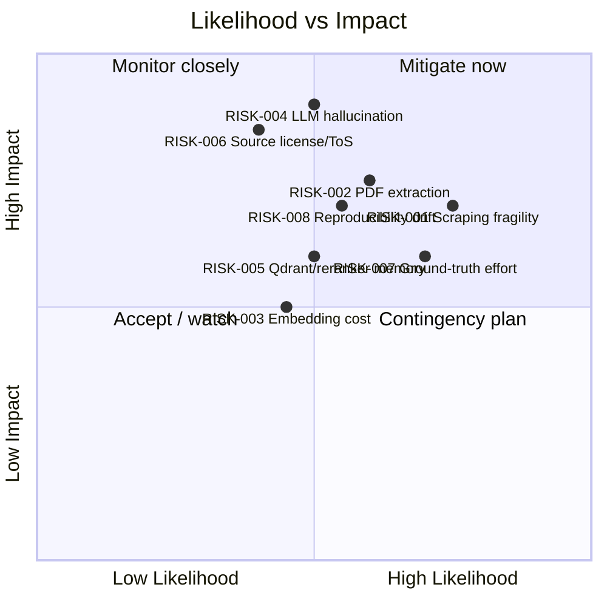

# Risks.md - Project Risk Register

## Objective

Maintain the **risk register** for the Pokemon TCG Rules RAG Expert Assistant: identified
threats to delivery, quality, and compliance, each with a likelihood/impact assessment, a
concrete mitigation, an owner, and traceability to the requirements
([`REQUIREMENTS.md`](./REQUIREMENTS.md)) and decisions (`docs/04_decisions/`) they touch.

## Scope

- **In scope:** technical, operational, domain, and legal risks that could prevent meeting
  [`SUCCESS_CRITERIA.md`](./SUCCESS_CRITERIA.md).
- **Out of scope:** granular per-task risks (handled inline in `docs/03_tasks/`).

**Likelihood / Impact scale:** Low / Medium / High.
**Owner roles:** Data Eng (ingestion), ML Eng (retrieval/LLM/eval), Platform (infra/deploy),
Lead (governance). Roles, not individuals.

---

## 1. Risk Heat Overview

---

## 2. Risk Register

| ID | Category | Description | Likelihood | Impact | Mitigation | Owner | Linked REQ / ADR |
| :--- | :--- | :--- | :--- | :--- | :--- | :--- | :--- |
| **RISK-001** | Technical / Operational | **Scraping fragility.** Pokegym and pokemon.com HTML markup or URLs change, breaking the crawler and the Ban/Promo/Mega scrapers. | High | High | Isolate selectors in one module; snapshot raw HTML to `data/raw_data/html`; `tenacity` retry/backoff; schema-validate parsed fields; alert on 0-record extraction; regression test parsers against saved fixtures. | Data Eng | REQ-001, REQ-003 |
| **RISK-002** | Technical / Domain | **PDF extraction quality.** Errata/handbook PDFs use dense/tabular layouts; PyMuPDF may mis-order text or lose section/page structure, corrupting citations. | Medium | High | Use pymupdf4llm for structure; QA spot-checks vs source pages; keep `page_number`/`section_title` in `DocumentMetadata`; add layout-specific parsing/OCR fallback only where QA fails. See [ASSUMPTION-010](./Assumptions.md). | Data Eng | REQ-002, REQ-004, [ADR_003](../04_decisions/ADR_003_CHUNKING.md) |
| **RISK-003** | Operational / Cost | **Embedding & LLM cost/time.** Full-corpus embedding and the embedding/model A/B experiments consume compute (local GPU/CPU time) or paid API tokens. | Medium | Medium | Default to local BGE embeddings (no per-call cost); batch embeddings; cache by content checksum; cap OpenAI usage to the comparison subset; log token spend. See [ASSUMPTION-003](./Assumptions.md). | ML Eng | REQ-005, REQ-006, REQ-019, [ADR_002](../04_decisions/ADR_002_EMBEDDINGS.md) |
| **RISK-004** | Technical / Domain | **LLM hallucination.** Model invents card interactions or rules not in context, or fails to cite, undermining trust. | Medium | High | Certified-Judge system prompt (answer only from context, always cite, say "I don't know"); temperature 0.0; Faithfulness gate > 0.85 ([SC-006](./SUCCESS_CRITERIA.md)); citation-resolvability check ([SC-008](./SUCCESS_CRITERIA.md)); adversarial no-answer probe ([SC-011](./SUCCESS_CRITERIA.md)). | ML Eng | REQ-011, REQ-012, REQ-019 |
| **RISK-005** | Technical / Operational | **Memory footprint.** Qdrant vectors plus torch + BGE embedder + cross-encoder reranker exceed container/host memory, causing OOM or slow rerank. | Medium | Medium | Pin container memory limits; lazy-load models; use CPU-friendly batch sizes; cap reranker input to fused top-N; measure in `docs/04_tests/PERFORMANCE.md`; enforce P95 latency ([SC-013](./SUCCESS_CRITERIA.md)). | Platform | REQ-005, REQ-009, REQ-015 |
| **RISK-006** | Legal / Domain | **Source license / ToS.** Pokegym and pokemon.com content is copyrighted; scraping/redistribution or public cloud hosting may violate ToS. | Low | High | Non-commercial educational use; cite sources + dates; honor robots.txt and rate limits; do not redistribute raw corpus; keep raw data out of public repo/deploy if required. See [ASSUMPTION-006](./Assumptions.md), [ASSUMPTION-011](./Assumptions.md). | Lead | REQ-001, REQ-020 |
| **RISK-007** | Operational | **Evaluation ground-truth effort.** Authoring and labeling 100 questions with expected source docs is labor-intensive and subjective. | High | Medium | Bootstrap from actual sources; template question/expected-source pairs; peer-review a sample; version the dataset; reuse across regression runs. See [ASSUMPTION-012](./Assumptions.md). | ML Eng | REQ-018, REQ-019 |
| **RISK-008** | Technical / Operational | **Reproducibility drift.** Unpinned images/model revisions or `latest` tags cause different results across machines, failing the reproducibility criterion. | Medium | High | Pin all deps ([SC-019](./SUCCESS_CRITERIA.md)); pin Docker image tags (no `latest`); pin HF model revisions; clean-clone validation ([SC-024](./SUCCESS_CRITERIA.md)); CI enforces `ruff`/`mypy`/coverage. See [ASSUMPTION-001](./Assumptions.md). | Platform | REQ-016, REQ-017 |
| **RISK-009** | Operational | **Cloud deploy overrun (bonus).** Managed hosting resource limits (memory for models, cold starts) make the public deploy unstable or costly. | Medium | Low | Treat as bonus, not blocking ([SC-023](./SUCCESS_CRITERIA.md)); prefer a slimmed profile (smaller/remote embeddings) for cloud; document limits. See [ASSUMPTION-009](./Assumptions.md). | Platform | REQ-020 |
| **RISK-010** | Technical | **Retrieval quality below target.** Best strategy fails Recall@10 > 0.90 due to chunking/embedding choices. | Medium | High | Run 4-strategy comparison + chunk-size/embedding ablations; select best; regression gate blocks merges that lower Recall. | ML Eng | REQ-018, [ADR_003](../04_decisions/ADR_003_CHUNKING.md) |
| **RISK-011** | Security / Network | **SSRF and unintended service reachability.** User-controlled destinations or public internal ports expose metadata and data planes. | High | High | Trusted destination configuration, IP/redirect validation, service isolation, default-deny egress and regression probes (TASK-043/044/054). | Platform | REQ-024, REQ-028 |
| **RISK-012** | Security / Access | **Anonymous abuse and unauthorized data mutation.** Missing identity, authorization and quotas permit forged feedback, resource exhaustion and denial-of-wallet. | High | High | Default-deny authz, owner-bound objects, rate/concurrency/payload/cost limits and authenticated DAST (TASK-046/047/050/059). | Lead | REQ-022, REQ-023, REQ-026 |
| **RISK-013** | Security / LLM | **Indirect prompt injection and forged citations.** Retrieved content overrides policy or induces secret/data disclosure. | High | High | Explicit trust-zone separation, output schema/citation verification, poisoned-document quarantine and adversarial regression (TASK-048/056/059). | ML Eng | REQ-025, REQ-029 |
| **RISK-014** | Security / Supply Chain | **Compromised or vulnerable dependencies/artifacts.** Conflicting locks, known CVEs or mutable images undermine builds and deployment integrity. | High | High | Hashed locks, SCA, SBOM, digest pinning, signatures/provenance and expiry-bound exceptions (TASK-041/052/055/058). | Platform | REQ-021, REQ-030 |
| **RISK-015** | Security / Secrets | **Credential compromise and privilege escalation.** Shared secrets, defaults, superuser DB access or overprivileged workloads increase blast radius. | High | High | Service-scoped secrets, rotation, restricted DB roles, non-root containers/K8s and secret-history scanning (TASK-043/045/051/052/053/058). | Platform | REQ-027, REQ-028 |
| **RISK-016** | Security / Assurance | **False confidence from inactive or incomplete controls.** Security checks documented outside active CI allow vulnerable releases. | High | High | Discoverable workflow, seeded scanner self-tests, DAST/adversarial suites and accountable evidence gate (TASK-042/058/059/060). | Lead | REQ-030 |
| **RISK-017** | Runtime | **Production composition remains non-functional.** Components pass isolation tests while the API cannot answer or persist feedback. | High | High | Typed composition root, truthful readiness, corpus parity and real user-journey tests in Sprint 13 (TASK-061..065). | Lead | REQ-031, REQ-032 |
| **RISK-018** | Data / Legal | **No reproducible or legally redistributable corpus.** Clean clones depend on ignored local artifacts or prohibited content. | High | High | Legal minimal fixture, allowlisted checksum bootstrap, licenses and content-addressed manifest (TASK-056/063). | Data Eng | REQ-029, REQ-032 |
| **RISK-019** | Quality | **Green unit suite masks integration defects.** Fake/static tests and sub-threshold coverage permit broken releases. | High | High | Active clean-clone gate, ≥90% meaningful coverage, real infrastructure and browser/API E2E (TASK-066..069). | Lead | REQ-033, REQ-034 |
| **RISK-020** | ML / Evaluation | **Synthetic or leaked benchmark overstates RAG quality.** Hardcoded scores and fabricated retrieval results select an inferior system. | High | High | Reviewed held-out benchmark, production adapters, ablations, calibrated automatic/human evaluation and matched regression gates (TASK-071..080). | ML Eng | REQ-035..REQ-037 |
| **RISK-021** | Observability / Privacy | **Telemetry is incomplete or leaks sensitive content.** Incidents and spend cannot be diagnosed safely. | Medium | High | Attribute allowlist/redaction, bounded-cardinality traces/metrics, alert tests and populated dashboards (TASK-081..085). | Platform | REQ-038, REQ-039 |
| **RISK-022** | Performance / Cost | **Model cold start or concurrency causes SLO/cost breach.** Unbounded queues or ineffective cache trigger overload or denial-of-wallet. | High | High | Tenant/version-safe cache, warm-up, backpressure and representative load/cost qualification (TASK-086/087). | Platform | REQ-040 |
| **RISK-023** | Cloud / Resilience | **IaC is unproven and recovery fails.** A manifest-only deployment or untested backup creates prolonged outage/data loss. | Medium | High | Immutable staged deploy, remote smoke, isolated restore and rollback drill with RPO/RTO (TASK-088/089). | Platform | REQ-041 |
| **RISK-024** | Governance | **Audit recommendations become stale or are declared closed without evidence.** Production proceeds with unknown residual risk. | Medium | High | Finding registers, evidence freshness checks, expiry-bound acceptance and multi-role final scorecard (TASK-090). | Lead | REQ-042 |

---

## 3. Monitoring & Review

| Trigger | Risks reviewed |
| :--- | :--- |
| Ingestion run produces 0/low records | RISK-001, RISK-002 |
| Retrieval regression run | RISK-010, RISK-003 |
| LLM regression run | RISK-004, RISK-003 |
| Container OOM / latency breach | RISK-005, RISK-008 |
| Before public/cloud deploy | RISK-006, RISK-009 |
| API, UI or network-boundary change | RISK-011, RISK-012 |
| Prompt, model or corpus change | RISK-013 |
| Dependency, image or IaC change | RISK-014, RISK-015 |
| Pull request and release candidate | RISK-014, RISK-016 |
| Runtime composition or corpus version change | RISK-017, RISK-018 |
| Test/evaluation implementation or benchmark change | RISK-019, RISK-020 |
| Telemetry, performance or cloud release change | RISK-021, RISK-022, RISK-023 |
| Sprint close / production decision | RISK-024 and every open High risk |

Risks are re-scored at each sprint boundary (see [`ROADMAP.md`](./ROADMAP.md)). Any risk that
materializes into a defect gets a regression test per the plan's TDD rule.

---

## Cross-References

- [`REQUIREMENTS.md`](./REQUIREMENTS.md) · [`SUCCESS_CRITERIA.md`](./SUCCESS_CRITERIA.md) · [`Assumptions.md`](./Assumptions.md)
- [`ROADMAP.md`](./ROADMAP.md) — phase-level risk callouts.
- ADRs `docs/04_decisions/` — decisions that mitigate these risks.
