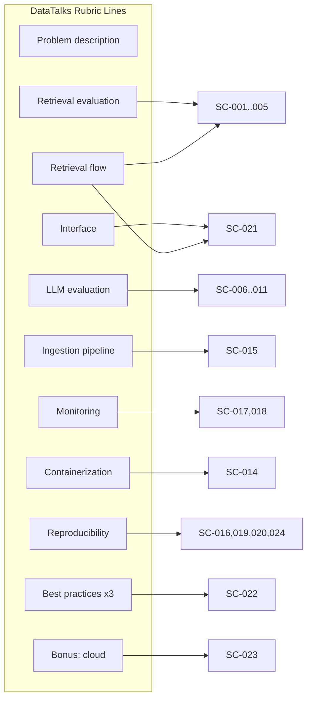

# SUCCESS_CRITERIA.md - Quantifiable Acceptance Thresholds

## Objective

Define the **measurable, verifiable pass/fail thresholds** that determine whether the
Pokemon TCG Rules RAG Expert Assistant is considered "done" and rubric-complete. Every
criterion carries a stable ID (`SC-###`), a single metric, an explicit numeric target, a
documented measurement procedure, and a cross-link to the requirement (`REQ-###`) it
validates. These criteria are the executable interpretation of
[`REQUIREMENTS.md`](./REQUIREMENTS.md) and the DataTalks / LLM Zoomcamp scoring rubric
captured in [`PROJECT.md`](./PROJECT.md).

## Scope

- **In scope:** functional quality gates (retrieval, generation), performance SLAs,
  reproducibility, coverage, monitoring completeness, and rubric-derived thresholds.
- **Out of scope:** the *how-to-measure* implementation details of the evaluation harness
  itself — those live in `docs/01_architecture/EvaluationPlan.md`. This document states the
  **numbers**; the evaluation plan states the **code**.

Genuine ambiguities (e.g. whether latency includes cold model load) are recorded in
[`Assumptions.md`](./Assumptions.md) and referenced here rather than silently resolved.

---

## 1. Success Criteria Matrix

Each criterion maps to a rubric line and one or more `REQ-###`. "How measured" names the
artifact or command that produces the evidence.

| ID | Metric | Target | How Measured | Linked REQ | Rubric Line |
| :--- | :--- | :--- | :--- | :--- | :--- |
| **SC-001** | Retrieval **Recall@10** (best strategy) | **> 0.90** | `EvaluationPlan.md` harness over the 100-question benchmark; best of {Dense, BM25, Hybrid RRF, Hybrid+Rerank}. | [REQ-018](./REQUIREMENTS.md) | Retrieval evaluation |
| **SC-002** | Retrieval **Recall@5** (best strategy) | **≥ 0.80** | Same harness, cut-off at final `RETRIEVAL_FINAL_TOP_K=5`. | [REQ-018](./REQUIREMENTS.md) | Retrieval evaluation |
| **SC-003** | Retrieval **MRR** (best strategy) | **≥ 0.75** | Mean Reciprocal Rank of first relevant chunk across 100 questions. | [REQ-018](./REQUIREMENTS.md) | Retrieval evaluation |
| **SC-004** | Retrieval **Hit Rate@10** | **≥ 0.92** | Fraction of questions with ≥1 relevant chunk in top 10. | [REQ-018](./REQUIREMENTS.md) | Retrieval evaluation |
| **SC-005** | **Multiple** retrieval strategies compared | **≥ 4** strategies benchmarked, best selected & documented | Comparison table in eval report (Dense vs BM25 vs Hybrid vs Hybrid+Rerank). | [REQ-006](./REQUIREMENTS.md)–[REQ-009](./REQUIREMENTS.md), [REQ-018](./REQUIREMENTS.md) | Retrieval evaluation (2 pts) |
| **SC-006** | LLM **Faithfulness** (RAGAS) | **> 0.85** | RAGAS `faithfulness` over benchmark answers with retrieved context. | [REQ-019](./REQUIREMENTS.md), [REQ-011](./REQUIREMENTS.md) | LLM evaluation |
| **SC-007** | LLM **Answer Correctness** | **≥ 0.80** | RAGAS/DeepEval correctness vs reference answers. | [REQ-019](./REQUIREMENTS.md) | LLM evaluation |
| **SC-008** | LLM **Citation Quality** | **≥ 0.90** answers with ≥1 valid, resolvable citation | Automated check that each `AnswerResponse.citations[*]` resolves to an indexed source. | [REQ-012](./REQUIREMENTS.md) | LLM evaluation |
| **SC-009** | LLM **Completeness** | **≥ 0.75** | DeepEval/RAGAS completeness metric vs reference. | [REQ-019](./REQUIREMENTS.md) | LLM evaluation |
| **SC-010** | **Multiple** LLM approaches compared | ≥ 2 prompts **and** ≥ 2 models, best selected | Prompt A vs Prompt B; `gpt-4o-mini` vs `gpt-4.1-mini` comparison table. | [REQ-019](./REQUIREMENTS.md) | LLM evaluation (2 pts) |
| **SC-011** | **Grounding / abstention** | 100% of unsupported queries return "I don't know" (no fabricated rule) on a 10-item adversarial set | Adversarial no-answer probe set; manual + automated review. | [REQ-011](./REQUIREMENTS.md) | LLM evaluation |
| **SC-012** | **Mean end-to-end query latency** | **< 2.0 s** (excludes one-time model warm-up) | P50 of `AnswerResponse.latency_seconds` over benchmark, warm cache. See [ASSUMPTION-007](./Assumptions.md). | [REQ-015](./REQUIREMENTS.md) | Reproducibility / NFR |
| **SC-013** | **P95 query latency** | **< 4.0 s** | 95th percentile of `latency_seconds` over benchmark. | [REQ-015](./REQUIREMENTS.md) | NFR |
| **SC-014** | **`docker compose up` startup** | Stack **healthy < 60 s** (image build & model download excluded) | Time from `up` to all healthchecks green, images pre-pulled. See [ASSUMPTION-008](./Assumptions.md). | [REQ-016](./REQUIREMENTS.md) | Containerization / Reproducibility |
| **SC-015** | **Documents fully indexed** | **100%** of 9 official sources ingested; 0 hard failures | Ingestion report: `sources_expected == sources_indexed`; chunk count > 0 per source. | [REQ-001](./REQUIREMENTS.md)–[REQ-005](./REQUIREMENTS.md) | Ingestion pipeline |
| **SC-016** | **Test coverage** | **≥ 90%** line coverage on `src/pokemon_tcg_rag` | `pytest --cov` gate (see [`pyproject.toml`](../../pyproject.toml) `addopts`). | [REQ-017](./REQUIREMENTS.md) | Reproducibility |
| **SC-017** | **Grafana dashboard** | **≥ 5 charts** live with real data | Dashboard JSON panel count + screenshot; feedback also collected. | [REQ-015](./REQUIREMENTS.md), [REQ-014](./REQUIREMENTS.md) | Monitoring (2 pts) |
| **SC-018** | **Feedback persistence** | 100% of 👍/👎 events written to Postgres | Query `feedback` table row count vs UI events in a scripted run. | [REQ-014](./REQUIREMENTS.md) | Monitoring |
| **SC-019** | **Dependency pinning** | 100% of runtime deps version-constrained | Lint of [`requirements.txt`](../../requirements.txt) / [`pyproject.toml`](../../pyproject.toml): every entry has a version specifier. | [REQ-016](./REQUIREMENTS.md), [REQ-017](./REQUIREMENTS.md) | Reproducibility (2 pts) |
| **SC-020** | **Static quality gate** | `ruff` 0 errors, `mypy --strict` 0 errors | CI job under `ci/`; see `pyproject.toml` `[tool.ruff]` / `[tool.mypy]`. | [REQ-017](./REQUIREMENTS.md) | Reproducibility |
| **SC-021** | **API contract** | `/query`, `/feedback`, `/health` respond per OpenAPI schema | Integration test hitting FastAPI (`AnswerResponse` / `FeedbackRecord` shape). | [REQ-013](./REQUIREMENTS.md), [REQ-014](./REQUIREMENTS.md) | Interface (2 pts) |
| **SC-022** | **Best-practice features present** | Hybrid search + Reranking + Query rewriting all implemented **and** ablated | Eval report shows on/off comparison for each of the 3. | [REQ-008](./REQUIREMENTS.md), [REQ-009](./REQUIREMENTS.md), [REQ-010](./REQUIREMENTS.md) | Best practices (3 pts) |
| **SC-023** | **Cloud deploy (bonus)** | Public reachable URL on Render/Railway/AWS | Live URL + `/health` 200 from public internet. See [ASSUMPTION-009](./Assumptions.md). | [REQ-020](./REQUIREMENTS.md) | Bonus (2 pts) |
| **SC-024** | **Reproducible from clean clone** | Fresh clone → `.env` → `docker compose up` → answered query, no manual patching | Documented in README; validated on a clean machine/CI. | [REQ-016](./REQUIREMENTS.md) | Reproducibility (2 pts) |
| **SC-025** | **Supply-chain risk** | Clean hashed-lock install; SBOM generated; **0 unaccepted Critical/High** runtime dependency or image findings | Clean-environment install plus SCA/image scan against the resolved graph and exception register. | [REQ-021](./REQUIREMENTS.md) | Security release gate |
| **SC-026** | **SSRF and destination control** | **100%** private, loopback, link-local, metadata, encoded-IP and cross-origin redirect probes blocked before connection | TEST-132/TEST-142 adversarial destination corpus with network capture. | [REQ-024](./REQUIREMENTS.md) | OWASP SSRF |
| **SC-027** | **API access control** | **100%** protected-route and object-access matrix enforced; malformed/expired/under-scoped tokens denied | OpenAPI policy check plus TEST-134 positive/negative authorization matrix. | [REQ-022](./REQUIREMENTS.md) | OWASP API1/API2 |
| **SC-028** | **Resource and cost abuse controls** | **100%** configured payload/rate/concurrency/timeout limits enforced; no unbounded retry path | TEST-135 boundary and load suite with deterministic 4xx/429/timeout behavior. | [REQ-023](./REQUIREMENTS.md) | OWASP API4 |
| **SC-029** | **LLM trust-boundary integrity** | **100%** release adversarial cases either grounded with valid retrieved citations or safely abstained | Versioned prompt-injection, poisoned-document, exfiltration and forged-citation corpus. | [REQ-025](./REQUIREMENTS.md) | OWASP LLM01/LLM08 |
| **SC-030** | **Secrets and data-plane least privilege** | 0 usable default credentials; 0 unintended public internal-service ports; service-specific secrets; API DB role cannot perform admin/DDL | Rendered compose/K8s inspection, network probes, secret-boundary tests and DB privilege matrix. | [REQ-028](./REQUIREMENTS.md) | Security configuration |
| **SC-031** | **Container and Kubernetes posture** | 100% workloads non-root and compliant with restricted policy; 0 unaccepted Critical/High image/IaC findings | TEST-140/TEST-141 policy-as-code and runtime assertions. | [REQ-027](./REQUIREMENTS.md) | Platform security |
| **SC-032** | **Privacy and data minimization** | 100% feedback bound to its authenticated query owner; documented retention/deletion; 0 full internal chunks or sensitive error/log fields in normal flows | TEST-137/TEST-138 privacy, replay, enumeration and leakage suite. | [REQ-026](./REQUIREMENTS.md) | Privacy / OWASP API3 |
| **SC-033** | **Trusted ingestion and truthful readiness** | 100% unapproved/oversized/malformed sources rejected or quarantined; readiness is false for every required unavailable dependency | TEST-144 source/parser corpus plus TEST-145 degraded-stack matrix. | [REQ-029](./REQUIREMENTS.md), [REQ-030](./REQUIREMENTS.md) | Secure operations |
| **SC-034** | **Security verification and release** | SAST/SCA/secret/IaC/container/DAST/adversarial gates pass with **0 unaccepted Critical/High** findings; SEC-01..SEC-17 have evidence | CI reports and TEST-148 signed-off evidence bundle. | [REQ-030](./REQUIREMENTS.md) | DevSecOps release gate |
| **SC-035** | **Operational RAG journey** | Authenticated clean-stack `/query` returns a grounded answer and exactly one owned `/feedback` record persists; readiness is truthful | TEST-152/153 against fresh real dependencies. | [REQ-031](./REQUIREMENTS.md) | Runtime architecture |
| **SC-036** | **Deterministic corpus parity** | Clean clone obtains a non-empty verified corpus; Qdrant and BM25 expose identical manifest/hash/chunk IDs | TEST-149/151 plus parity report. | [REQ-032](./REQUIREMENTS.md) | Data reproducibility |
| **SC-037** | **Green code-quality gate** | Ruff, Black and strict mypy: 0 errors; application line coverage **≥90%** on every supported Python runtime | TEST-154/155 active CI artifacts. | [REQ-033](./REQUIREMENTS.md) | Quality |
| **SC-038** | **Real test pyramid** | 100% of critical persistence/retrieval/provider and user journeys cross real infrastructure/process boundaries without hidden local state | TEST-156/157 evidence and fixture classification. | [REQ-033](./REQUIREMENTS.md), [REQ-034](./REQUIREMENTS.md) | Reproducibility |
| **SC-039** | **Reviewed benchmark** | ≥100 unique source-resolvable questions; fixed split/corpus hash; reviewer evidence and dataset card complete | TEST-159 dataset validation and review artifact. | [REQ-035](./REQUIREMENTS.md) | Evaluation data |
| **SC-040** | **Retrieval quality gate** | Recall@10 **>0.90**, MRR **≥0.75**, real strategy/ablation evidence; no matched-baseline quality regression >2% | TEST-160..163 and versioned report/raw ranks. | [REQ-036](./REQUIREMENTS.md) | Retrieval quality |
| **SC-041** | **LLM quality gate** | Real-output Faithfulness **>0.85** with calibrated automatic/human evaluation and documented latency/cost budget | TEST-164..166/168 and versioned report. | [REQ-037](./REQUIREMENTS.md) | LLM quality |
| **SC-042** | **Claim/citation validity** | **≥0.95** material claims reference existing retrieved evidence; unsupported claims safely abstain/qualify | TEST-167 adversarial and release benchmark results. | [REQ-025](./REQUIREMENTS.md), [REQ-037](./REQUIREMENTS.md) | LLM guardrails |
| **SC-043** | **Telemetry and SLO completeness** | 100% test requests metered for stage latency/token/cost; critical journey traceable; alert fixtures fire/resolve; 0 forbidden sensitive attributes | TEST-169..171 and populated dashboard evidence. | [REQ-038](./REQUIREMENTS.md) | Observability |
| **SC-044** | **Usable feedback workflow** | Browser history/citation/comment/degraded/accessibility journeys pass; positive feedback target **≥80% over ≥100 production-like ratings** once sample exists | TEST-172 plus feedback dashboard/sample metadata. | [REQ-039](./REQUIREMENTS.md) | Product UX |
| **SC-045** | **Performance and cost** | Warm query P50 **<2s**, P95 **<4s**, overload remains bounded and 100% requests respect the approved cost budget | TEST-174/175 and reproducible load report. | [REQ-040](./REQUIREMENTS.md) | Performance |
| **SC-046** | **Cloud staging proof** | Reachable TLS staging URL runs approved image digest and completes authenticated remote query/feedback smoke | TEST-176 plus deployment/digest evidence. | [REQ-041](./REQUIREMENTS.md) | Cloud deployment |
| **SC-047** | **Recovery and delivery operations** | Restore/rollback drill meets approved RPO/RTO; lead time, deployment frequency, change failure rate and MTTR derive from auditable events | TEST-177 and timed drill report. | [REQ-041](./REQUIREMENTS.md) | Resilience / DORA |
| **SC-048** | **Production qualification** | SEC-01..17 and TECH-01..30 are evidenced closed or expiry-bound accepted; every blocking criterion passes against released hashes | TEST-178 final scorecard and approvals. | [REQ-042](./REQUIREMENTS.md) | Release governance |

---

## 2. Rubric-to-Criteria Coverage

`R1` (Problem description) is satisfied narratively by [`PROJECT.md`](./PROJECT.md) §2 and
has no numeric threshold. `R2` (Retrieval flow: KB + LLM both used) is proven by SC-001
(retrieval works) combined with SC-021 (the `/query` flow returns a grounded answer).

---

## 3. Measurement Cadence & Gates

| Gate | When | Criteria enforced | Blocking? |
| :--- | :--- | :--- | :--- |
| **Per-PR quality gate** | Every pull request | SC-016, SC-019, SC-020 | Yes |
| **Per-PR security gate** | Every pull request after TASK-058 | SC-025, SC-027, SC-030, SC-031, SC-034 (applicable automated checks) | Yes |
| **Smoke gate** | Every PR / nightly | SC-014, SC-021 (basic) | Yes |
| **Retrieval regression** | After any retrieval/chunking change | SC-001–SC-005 | Yes — must not regress vs baseline |
| **LLM regression** | After any prompt/model change | SC-006–SC-011 | Yes — must not regress vs baseline |
| **Adversarial security regression** | After any API, prompt, ingestion or network-policy change | SC-026–SC-029, SC-032, SC-033 | Yes |
| **Clean-stack runtime gate** | Every merge after Sprint 14 | SC-035–SC-038 | Yes |
| **Measured RAG gate** | Retrieval/prompt/model/corpus change | SC-039–SC-042 | Yes |
| **Operational qualification** | Nightly staging / before release | SC-043–SC-047 | Yes |
| **Release / demo gate** | Before final submission | All SC-### | Yes |
| **Bonus gate** | Optional | SC-023 | No |

Regression rule (from the plan's TDD section): if a change lowers Recall, Faithfulness, or
raises latency past its target, the pipeline **fails**. Baselines are stored alongside the
evaluation report described in `docs/01_architecture/EvaluationPlan.md`.

---

## 4. Acceptance Definition

The project is **accepted** when:

1. Every `SC-###` with a "Yes" blocking gate passes at its stated target.
2. The best retrieval strategy (SC-005) and best LLM configuration (SC-010) are explicitly
   documented with the comparison evidence.
3. A clean-clone reproducibility run (SC-024) succeeds end-to-end.

Bonus criteria (SC-023) are additive and do not block acceptance.

---

## Cross-References

- [`REQUIREMENTS.md`](./REQUIREMENTS.md) — requirement definitions (REQ-###).
- [`PROJECT.md`](./PROJECT.md) — problem statement and rubric.
- [`ROADMAP.md`](./ROADMAP.md) — the phases/sprints that deliver each criterion.
- [`Risks.md`](./Risks.md) — risks threatening these targets.
- [`Assumptions.md`](./Assumptions.md) — ASSUMPTION-007/008/009 qualify SC-012/014/023.
- `docs/01_architecture/EvaluationPlan.md` — measurement implementation.
