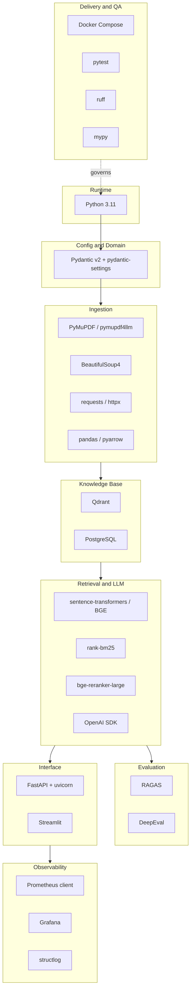

# TECH_STACK.md - Technology Stack Specification

## Objective

Enumerate the **complete technology stack** of the Pokemon TCG Rules RAG Expert Assistant,
grouped by architectural layer, with the **exact pinned-version intent**, the **purpose**,
and the **rationale** for every dependency. This document is the human-readable companion
to the machine-readable [`requirements.txt`](../../requirements.txt) and
[`pyproject.toml`](../../pyproject.toml); the version specifiers below must stay in sync
with those files (reproducibility criterion [SC-019](./SUCCESS_CRITERIA.md)).

## Scope

- **In scope:** every runtime and developer dependency, the language runtime, and the
  infrastructure services (Qdrant, Postgres, Prometheus, Grafana) orchestrated via Docker
  Compose.
- **Out of scope:** transitive dependency trees and the concrete lockfile — those are
  produced by the package resolver. Choices between competing technologies are justified in
  the ADRs under `docs/04_decisions/` and are cross-linked here.

Version specifiers reflect the **intended floor** as declared in `pyproject.toml`
(`>=` minimum-compatible). Reproducibility ([REQ-016](./REQUIREMENTS.md),
[REQ-017](./REQUIREMENTS.md)) additionally relies on Docker image tags and, where used, a
resolver lockfile.

---

## 1. Stack at a Glance

---

## 2. Language Runtime & Config Layer

| Technology | Version intent | Purpose | Rationale |
| :--- | :--- | :--- | :--- |
| **Python** | `3.11+` (`requires-python >=3.10`, target 3.11) | Primary implementation language for all layers. | Mature async, typing generics (`list[float]`, `X | None`), strong ML/RAG ecosystem. Plan mandates Python 3.11+. See [ASSUMPTION-001](./Assumptions.md) on the 3.10 vs 3.11 floor. |
| **Pydantic** | `>=2.5.0` (v2) | Domain models (`Document`, `Chunk`, `RetrievedChunk`, `AnswerResponse`, `FeedbackRecord`) and validation. | v2 gives fast Rust-core validation and clean typed models used across the codebase (`src/pokemon_tcg_rag/domain/models.py`). |
| **pydantic-settings** | `>=2.1.0` | Environment-driven configuration (`Settings` in `src/pokemon_tcg_rag/config/settings.py`). | Enforces the "no hardcoded values, all config via `.env`" principle from the plan. |
| **python-dotenv** | `>=1.0.0` | Loads `.env` for local/dev runs. | Backs the `.env` reproducibility workflow. |
| **PyYAML** | `>=6.0.1` | Parse YAML config (Prometheus/Grafana provisioning, source manifests). | Standard for the config assets under `config/`. |

---

## 3. Ingestion & Parsing Layer

| Technology | Version intent | Purpose | Rationale |
| :--- | :--- | :--- | :--- |
| **PyMuPDF** (`pymupdf`) | `>=1.23.0` | Core PDF text/layout extraction from the 5 official PDFs. | Fast, accurate layout retention; plan explicitly names PyMuPDF. See [REQ-002](./REQUIREMENTS.md). |
| **pymupdf4llm** | `>=0.0.1` | Markdown-structured extraction preserving headings/sections for chunking. | Plan notes it "preserves structure better"; feeds section-aware chunking. See [ADR_003](../04_decisions/ADR_003_CHUNKING.md). |
| **BeautifulSoup4** | `>=4.12.0` | HTML parsing for Pokegym rulings and the Ban/Promo/Mega pages. | De-facto standard, tolerant of messy markup. [REQ-001](./REQUIREMENTS.md), [REQ-003](./REQUIREMENTS.md). |
| **requests** | `>=2.31.0` | Synchronous downloads of PDFs and HTML. | Simple, reliable for the crawler/downloader. |
| **httpx** | `>=0.26.0` | Async/HTTP2-capable client where concurrency helps (scraping fan-out). | Modern client; usable by both API and ingestion. |
| **pandas** | `>=2.1.0` | Tabular transforms of extracted rulings before serialization. | Convenient for the raw→processed dataframe stage. |
| **pyarrow** | `>=14.0.0` | Parquet serialization of processed docs/chunks. | Plan specifies JSONL/Parquet outputs; Arrow is the Parquet backend. |

---

## 4. Knowledge Base Layer

| Technology | Version intent | Purpose | Rationale |
| :--- | :--- | :--- | :--- |
| **Qdrant** (server) | image `qdrant/qdrant` (pinned tag in `docker-compose.yml`) | Vector store; collection `pokemon_tcg_rules`, dim `1024`. | Excellent metadata filtering, hybrid search and payload support. Chosen over Chroma/pgvector in [ADR_001](../04_decisions/ADR_001_VECTOR_DB.md). [REQ-005](./REQUIREMENTS.md). |
| **qdrant-client** | `>=1.7.0` | Python client for indexing and search against Qdrant. | Official client; gRPC (`6334`) + REST (`6333`) per `settings.py`. |
| **PostgreSQL** (server) | image `postgres` (pinned tag in `docker-compose.yml`) | Persist user feedback (`FeedbackRecord`) and monitoring rows. | Reliable relational store; feeds Grafana. [REQ-014](./REQUIREMENTS.md). |
| **psycopg2-binary** | `>=2.9.9` | Postgres driver. | Standard synchronous driver. |
| **SQLAlchemy** | `>=2.0.0` | ORM / typed data access for the feedback store. | 2.0 typed API; decouples storage from schema. |
| **Alembic** | `>=1.13.0` | Database schema migrations. | Versioned, reproducible schema evolution. |

---

## 5. Retrieval, Embeddings & LLM Layer

| Technology | Version intent | Purpose | Rationale |
| :--- | :--- | :--- | :--- |
| **sentence-transformers** | `>=2.2.2` | Runs the primary embedding model `BAAI/bge-large-en-v1.5` (1024-d) and the cross-encoder reranker. | Local, cost-free embeddings; 1024-d matches `EMBEDDING_DIMENSION`. [REQ-006](./REQUIREMENTS.md). |
| **BAAI/bge-large-en-v1.5** (model) | HF model, pinned by revision intent | Primary dense embedding model. | Strong English retrieval quality; compared vs `text-embedding-3-small` in [ADR_002](../04_decisions/ADR_002_EMBEDDINGS.md). |
| **transformers** | `>=4.36.0` | Backing library for HF model loading (embeddings + reranker). | Dependency of sentence-transformers; explicit for reproducibility. |
| **torch** | `>=2.0.0` | Tensor backend for embeddings/reranker inference. | Required by transformers/sentence-transformers. See [Risks.md RISK-005](./Risks.md) (memory). |
| **rank-bm25** | `>=0.2.2` | Lexical BM25 retrieval strategy. | Lightweight pure-Python BM25; plan names it explicitly. [REQ-007](./REQUIREMENTS.md). |
| **BAAI/bge-reranker-large** (model) | HF model, pinned by revision intent | Cross-encoder re-ranking of fused candidates. | Best-practice rerank point; `RERANKER_MODEL` in `settings.py`. [REQ-009](./REQUIREMENTS.md), [ADR_004](../04_decisions/ADR_004_RERANKING.md). |
| **OpenAI SDK** (`openai`) | `>=1.10.0` | LLM generation (default `gpt-4o-mini`, temp `0.0`) and the secondary embedding model `text-embedding-3-small`; OpenAI-compatible endpoint. | Reliable, well-typed client; model configurable via `OPENAI_MODEL_NAME`. [REQ-011](./REQUIREMENTS.md), [ASSUMPTION-002](./Assumptions.md). |
| **tenacity** | `>=8.2.3` | Retry/backoff around network calls (LLM, scraping, embeddings). | Resilience against transient API/scrape failures. |

Hybrid fusion uses **Reciprocal Rank Fusion (RRF, k=60)** implemented in-code (no extra
dependency), with `RETRIEVAL_TOP_K_DENSE=10`, `RETRIEVAL_TOP_K_BM25=10`, and
`RETRIEVAL_FINAL_TOP_K=5` per `settings.py`. [REQ-008](./REQUIREMENTS.md).

---

## 6. Evaluation Layer

| Technology | Version intent | Purpose | Rationale |
| :--- | :--- | :--- | :--- |
| **RAGAS** | `>=0.1.0` | Faithfulness, Answer Correctness, Completeness metrics on the 100-question benchmark. | Purpose-built RAG metrics; validates [SC-006](./SUCCESS_CRITERIA.md)–SC-009. [REQ-019](./REQUIREMENTS.md). |
| **DeepEval** | `>=0.20.0` | Complementary LLM-as-judge metrics and prompt/model A/B comparison. | Second opinion + assertion-style tests; supports SC-010. See [ASSUMPTION-004](./Assumptions.md). |

Retrieval metrics (Recall@5, Recall@10, MRR, Hit Rate) are computed in-code from the
labeled benchmark; no dedicated library is required.

---

## 7. Interface Layer

| Technology | Version intent | Purpose | Rationale |
| :--- | :--- | :--- | :--- |
| **FastAPI** | `>=0.109.0` | REST API: `/query`, `/feedback`, `/health`. | Typed, async, OpenAPI out-of-the-box; pairs with Pydantic models. [REQ-013](./REQUIREMENTS.md). |
| **uvicorn** | `>=0.27.0` | ASGI server hosting FastAPI. | Standard production ASGI server. |
| **Streamlit** | `>=1.30.0` | Web UI: question → answer → sources → chunks, timing/model info, 👍/👎 + comment. | Fastest path to a rich RAG UI; plan specifies Streamlit. [REQ-013](./REQUIREMENTS.md), [REQ-014](./REQUIREMENTS.md). |

---

## 8. Observability Layer

| Technology | Version intent | Purpose | Rationale |
| :--- | :--- | :--- | :--- |
| **prometheus-client** | `>=0.19.0` | Exposes app metrics (query count, latency, docs retrieved, feedback). | Feeds the Grafana dashboard (≥5 charts). [REQ-015](./REQUIREMENTS.md). |
| **Prometheus** (server) | image `prom/prometheus` (pinned tag) | Scrapes and stores time-series metrics. | Standard metrics backend; part of compose. |
| **Grafana** (server) | image `grafana/grafana` (pinned tag) | Dashboard with ≥5 charts over Prometheus + Postgres. | Rubric monitoring point (2 pts). [SC-017](./SUCCESS_CRITERIA.md). |
| **structlog** | `>=24.1.0` | Structured JSON logging across layers. | Traceable, machine-parseable logs for debugging/monitoring. |

---

## 9. Delivery & Quality Assurance Layer

| Technology | Version intent | Purpose | Rationale |
| :--- | :--- | :--- | :--- |
| **Docker Compose** | Compose v2 (`docker-compose.yml` at repo root) | Orchestrates streamlit, api, qdrant, postgres, prometheus, grafana, ingestion. | Everything up with `docker compose up` (rubric containerization, 2 pts). [REQ-016](./REQUIREMENTS.md), [SC-014](./SUCCESS_CRITERIA.md). |
| **pytest** | `>=8.0.0` | Test runner across unit/integration/smoke/e2e/eval/perf markers. | Markers configured in `pyproject.toml` `[tool.pytest.ini_options]`. [REQ-017](./REQUIREMENTS.md). |
| **pytest-cov** | `>=4.1.0` | Coverage measurement, ≥90% gate. | Enforces [SC-016](./SUCCESS_CRITERIA.md). |
| **pytest-asyncio** | `>=0.23.0` | Async test support (httpx/FastAPI flows). | Needed for async endpoints/clients. |
| **pytest-mock** | `>=3.12.0` | Mocking external calls (LLM, network) in unit tests. | Deterministic unit tests. |
| **ruff** | `>=0.2.0` | Linter + import sorting (`E,F,W,I,N,UP,B,A,C4,SIM`, line 100). | Fast, single-tool lint; config in `pyproject.toml`. [SC-020](./SUCCESS_CRITERIA.md). |
| **mypy** | `>=1.8.0` | Strict static type checking (`strict = true`). | Mandatory typing principle from the plan. [SC-020](./SUCCESS_CRITERIA.md). |
| **black** | `>=24.1.0` | Deterministic code formatting. | Consistent style; complements ruff. |
| **isort** | `>=5.13.0` | Import ordering (aligned with ruff `I`). | Consistent imports. |

---

## 10. Version-Pinning Policy (Reproducibility)

1. Every runtime dependency in [`requirements.txt`](../../requirements.txt) /
   [`pyproject.toml`](../../pyproject.toml) carries a version specifier — no unpinned
   entries ([SC-019](./SUCCESS_CRITERIA.md)).
2. Infrastructure images in [`docker-compose.yml`](../../docker-compose.yml) use pinned
   tags (never `latest`) to prevent reproducibility drift ([Risks.md RISK-008](./Risks.md)).
3. HF model weights (BGE embedder + reranker) are referenced by intended revision; drift is
   tracked as a risk.
4. Model/config values (model names, top-k, RRF k, dimension) come from
   `Settings`/`.env`, never hardcoded.

---

## Cross-References

- [`requirements.txt`](../../requirements.txt), [`pyproject.toml`](../../pyproject.toml) — source of truth for versions.
- [`docker-compose.yml`](../../docker-compose.yml) — service images and orchestration.
- [`REQUIREMENTS.md`](./REQUIREMENTS.md) — REQ mapping.
- [`SUCCESS_CRITERIA.md`](./SUCCESS_CRITERIA.md) — SC-019/SC-020 pinning & static gates.
- ADRs `docs/04_decisions/` — technology-choice rationale.
- [`Assumptions.md`](./Assumptions.md), [`Risks.md`](./Risks.md) — open questions & risks.
