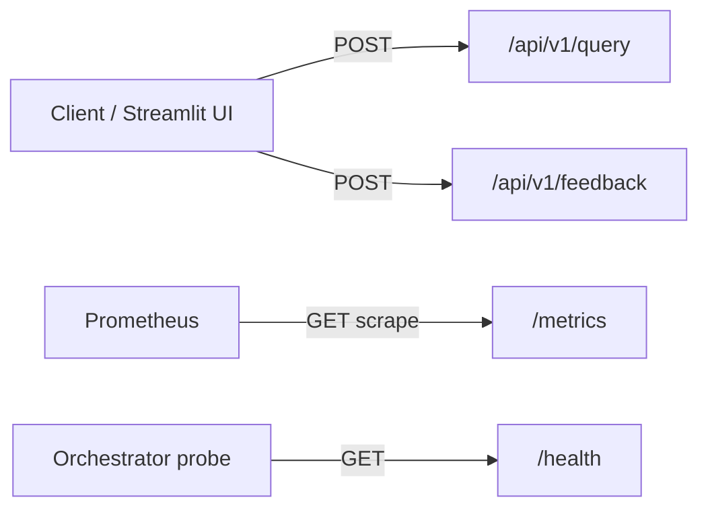

# APIContracts.md — REST API Contracts

> Part of the [Engineering Harness](../README.md) · Grounded in `src/pokemon_tcg_rag/api/main.py`, `api/routes.py`, `api/schemas.py` · Siblings: [DomainModel.md](./DomainModel.md) · [DataModel.md](./DataModel.md) · [FunctionalRequirements.md](./FunctionalRequirements.md)

## Objective

Provide the OpenAPI-style contract for every FastAPI endpoint: method, path, request/response schemas with field types and constraints, status codes, error responses, and concrete JSON examples. All schemas are grounded exactly in `api/schemas.py`.

## Scope

- **In scope:** `POST /api/v1/query`, `POST /api/v1/feedback`, `GET /health` (and a note on `/metrics`).
- **Out of scope:** internal domain models (see [DomainModel.md](./DomainModel.md)); persistence (see [DataModel.md](./DataModel.md)).

## Service metadata & versioning

| Property | Value | Source |
| :--- | :--- | :--- |
| Title | `Pokemon TCG Rules RAG Expert API` | `api/main.py` |
| Version | `0.1.0` | `FastAPI(version=...)` and `HealthResponse.version` |
| API prefix | `/api/v1` | `app.include_router(router, prefix="/api/v1")` |
| Content-Type | `application/json` (request & response) | FastAPI/Pydantic default |
| Interactive docs | `/docs` (Swagger), `/openapi.json` | FastAPI default |

**Versioning note.** Business endpoints are namespaced under `/api/v1`; the version segment is the compatibility boundary — breaking changes ship under `/api/v2`. Operational endpoints (`/health`, `/metrics`) are intentionally **unversioned** (mounted at root) so probes and scrapers have stable URLs. The `version` string (`0.1.0`) is the build/app version returned by `/health`, independent of the URL API version.

### Endpoint map


---

## 1. `POST /api/v1/query`

Executes the RAG pipeline over official Pokemon TCG docs. Implements REQ-006..012.

- **Method / Path:** `POST /api/v1/query`
- **Success status:** `200 OK`
- **Content-Type:** `application/json`

### Request — `QueryRequest`
| Field | Type | Required | Constraint / default | Description |
| :--- | :--- | :--- | :--- | :--- |
| `question` | string | yes | — (example: "Posso usar a carta Rare Candy no primeiro turno do jogo?") | User rules question |
| `top_k` | integer | no | default `5`, `ge=1`, `le=20` | Requested number of context chunks |

### Response — `QueryResponse`
| Field | Type | Nullable | Description |
| :--- | :--- | :--- | :--- |
| `query` | string | no | Original question |
| `rewritten_query` | string | yes (`null` default) | LLM-rewritten query (REQ-010) |
| `answer` | string | no | Grounded answer with citations |
| `citations` | array<`CitationSchema`> | no | Sources used (REQ-012) |
| `retrieved_chunks` | array<`ChunkSnippetSchema`> | no | Evidence chunks |
| `model_name` | string | no | LLM model (e.g. `gpt-4o-mini`) |
| `latency_seconds` | number(float) | no | End-to-end latency |

**`CitationSchema`**
| Field | Type | Nullable |
| :--- | :--- | :--- |
| `source` | string | no |
| `document_title` | string | no |
| `page_number` | integer | yes |
| `rule_type` | string | no |
| `card_name` | string | yes |

**`ChunkSnippetSchema`**
| Field | Type | Nullable |
| :--- | :--- | :--- |
| `chunk_id` | string | no |
| `text` | string | no |
| `score` | number(float) | no |
| `retrieval_method` | string | no |

> `QueryResponse` maps from the domain `AnswerResponse` but **omits `timestamp`** (present on the domain model, not exposed over the API — see [DomainModel.md](./DomainModel.md)).

### Status & error codes
| Code | Meaning | Body |
| :--- | :--- | :--- |
| `200` | Success | `QueryResponse` |
| `422` | Validation error (e.g. `top_k` out of `[1,20]`, missing `question`) | FastAPI validation error object |
| `500` | Pipeline failure — any exception in `RAGChain.query` (`LLMProviderError`, `RetrievalError`, `VectorDBError`) | `{"detail": "<error message>"}` |

### Example request
```json
POST /api/v1/query
Content-Type: application/json

{ "question": "Can Rare Candy be played on the first turn?", "top_k": 5 }
```
### Example response (`200`)
```json
{
  "query": "Can Rare Candy be played on the first turn?",
  "rewritten_query": "Pokemon TCG ruling Rare Candy first turn play legality",
  "answer": "According to the Official Rulebook (p. 15), Trainer item cards such as Rare Candy may be played... [Rulebook, p.15]",
  "citations": [
    { "source": "rulebook_pdf", "document_title": "Official Rulebook", "page_number": 15, "rule_type": "general_rule", "card_name": null }
  ],
  "retrieved_chunks": [
    { "chunk_id": "rulebook_pdf:cri_rulebook#42", "text": "Trainer cards...", "score": 0.87, "retrieval_method": "reranked" }
  ],
  "model_name": "gpt-4o-mini",
  "latency_seconds": 1.23
}
```
### Example error (`500`)
```json
{ "detail": "LLM provider timeout" }
```

**Behavioral note (bootstrap/fallback).** When `_rag_chain` is not yet injected (`set_dependencies` not called — e.g. during initial test runs), `query_rag` returns a deterministic stub `QueryResponse` with a sample rulebook citation and `model_name="gpt-4o-mini"`, `latency_seconds=0.42`, still HTTP `200`. This keeps the contract testable before wiring.

---

## 2. `POST /api/v1/feedback`

Records a thumbs up/down rating. Implements REQ-014.

- **Method / Path:** `POST /api/v1/feedback`
- **Success status:** `201 Created`
- **Content-Type:** `application/json`

### Request — `FeedbackRequest`
| Field | Type | Required | Constraint | Description |
| :--- | :--- | :--- | :--- | :--- |
| `query` | string | yes | — | Question that was answered |
| `answer` | string | yes | — | Answer being rated |
| `rating` | integer | yes | `+1` up / `-1` down (by convention) | User rating |
| `comment` | string | no | `null` default | Optional free-text comment |
| `model_name` | string | yes | — | Model that produced the answer |
| `latency_seconds` | number(float) | yes | — | Reported latency |

> No `feedback_id` is accepted from the client — it is generated server-side when building the domain `FeedbackRecord` (see [DomainModel.md](./DomainModel.md) / [DataModel.md](./DataModel.md)).

### Response
Plain JSON object (not a declared schema model):
```json
{ "status": "success", "message": "Feedback recorded successfully." }
```

### Status & error codes
| Code | Meaning | Body |
| :--- | :--- | :--- |
| `201` | Feedback accepted (and metric recorded) | `{"status":"success","message":"Feedback recorded successfully."}` |
| `422` | Validation error (missing required field / wrong type) | FastAPI validation error object |

**Behavioral note.** Persistence is best-effort: if `_feedback_store` is unset, the row is skipped; DB errors inside `save_feedback` are caught/rolled back and logged. In all non-validation cases the endpoint still records the Prometheus metric (`MetricsCollector.record_feedback`) and returns `201`.

### Example
```json
POST /api/v1/feedback
Content-Type: application/json

{ "query": "Can Rare Candy be played first turn?", "answer": "According to the Rulebook (p.15)...", "rating": 1, "comment": "Clear and cited.", "model_name": "gpt-4o-mini", "latency_seconds": 1.23 }
```

---

## 3. `GET /health`

Liveness probe. Unversioned (root path). Implements NFR availability probe.

- **Method / Path:** `GET /health`
- **Success status:** `200 OK`

### Response — `HealthResponse`
| Field | Type | Example |
| :--- | :--- | :--- |
| `status` | string | `"healthy"` |
| `version` | string | `"0.1.0"` |

```json
{ "status": "healthy", "version": "0.1.0" }
```
| Code | Meaning |
| :--- | :--- |
| `200` | Service alive |

---

## 4. `GET /metrics` (operational)

Prometheus exposition endpoint mounted at root via `make_asgi_app()` (`api/main.py`). Content-Type `text/plain; version=0.0.4` (Prometheus format), scraped by the `prometheus` service. Not JSON; not part of the versioned API. See [Observability.md](./Observability.md).

---

## Acceptance Criteria

| # | Criterion | Verified by |
| :--- | :--- | :--- |
| AC-1 | Request/response fields and constraints match `api/schemas.py` exactly. | Contract test vs `/openapi.json` |
| AC-2 | `POST /api/v1/query` returns `200` + valid `QueryResponse`; `top_k` outside `[1,20]` → `422`. | API test (REQ-013) |
| AC-3 | `POST /api/v1/feedback` returns `201` and persists to `user_feedback`. | Integration test (REQ-014) |
| AC-4 | `GET /health` returns `{status:"healthy", version:"0.1.0"}`. | Smoke test |
| AC-5 | Pipeline exceptions surface as `500 {"detail":...}`. | Fault-injection test |

## Cross-references
- Domain mapping (`AnswerResponse`, `FeedbackRecord`): [DomainModel.md](./DomainModel.md)
- Persistence of feedback: [DataModel.md](./DataModel.md)
- Endpoint behavior specs: [FunctionalRequirements.md](./FunctionalRequirements.md)
- Metrics exposition: [Observability.md](./Observability.md)
