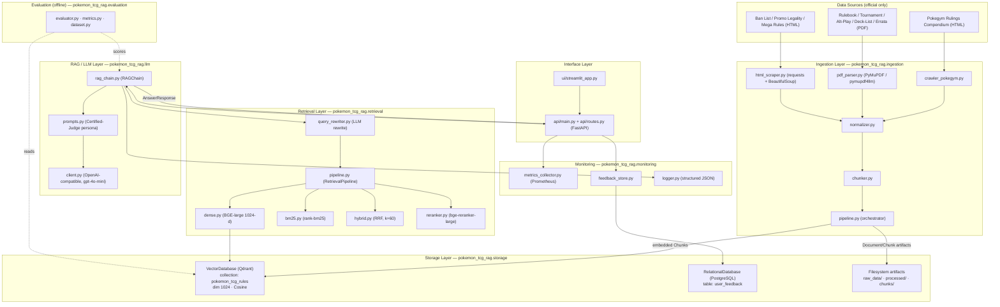
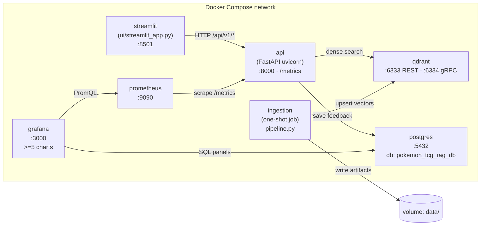
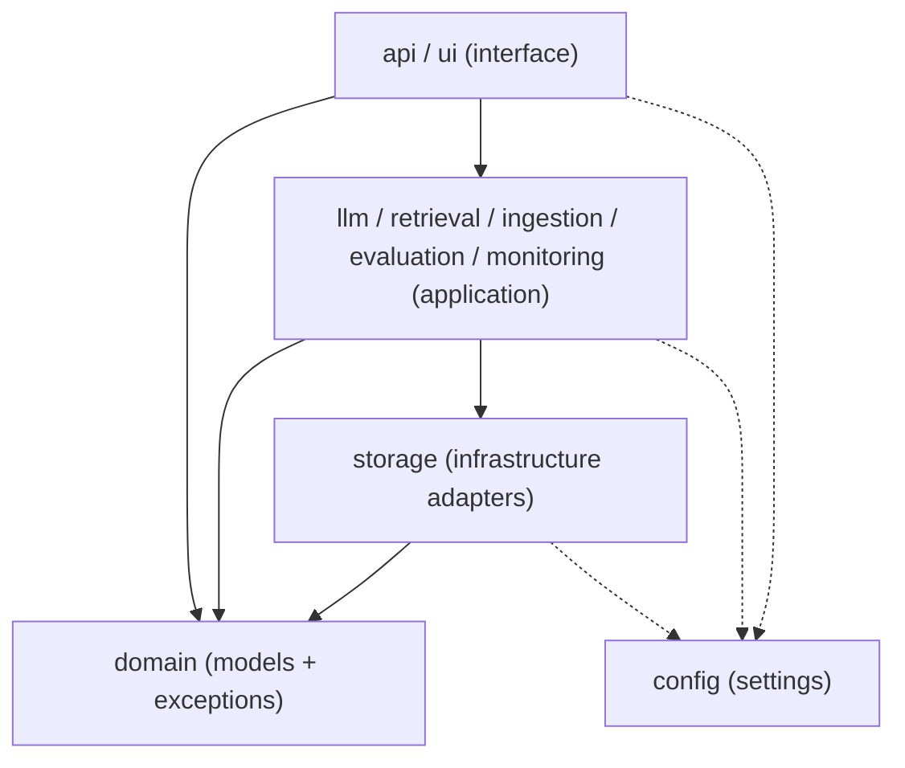
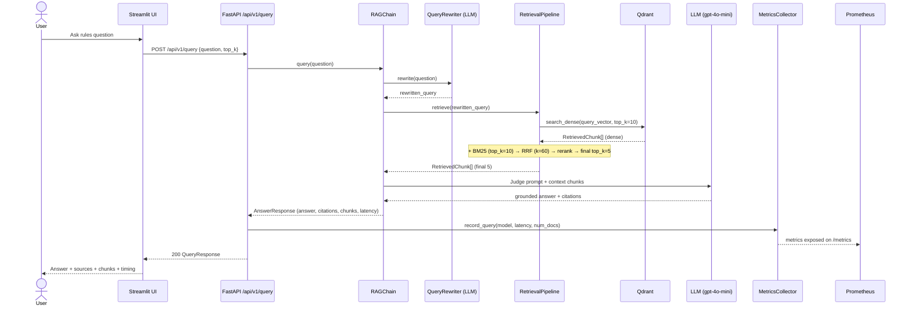

# Architecture.md — System Architecture

> Part of the [Engineering Harness](../README.md) · Sibling docs: [DomainModel.md](./DomainModel.md) · [DataModel.md](./DataModel.md) · [APIContracts.md](./APIContracts.md) · [FunctionalRequirements.md](./FunctionalRequirements.md) · [NonFunctionalRequirements.md](./NonFunctionalRequirements.md)

## Objective

Define the end-to-end technical architecture of the **Pokemon TCG Rules RAG Expert Assistant**: its logical components, its physical (container) deployment topology, the Clean Architecture layering contract that all code must respect, and the runtime flow of a single user query. This document contains **diagrams and contracts only — no implementation code**.

## Scope

- **In scope:** logical component decomposition (data sources → ingestion → storage → retrieval → RAG chain → API/UI → monitoring), Docker Compose deployment view, layer dependency rules, query sequence.
- **Out of scope:** algorithm internals of retrieval/reranking (see [RetrievalPipeline.md](./RetrievalPipeline.md)), prompt text (see [PromptEngineering.md](./PromptEngineering.md)), and evaluation methodology (see [EvaluationPlan.md](./EvaluationPlan.md)). Persistence schemas live in [DataModel.md](./DataModel.md).

All names below map directly to real modules under `src/pokemon_tcg_rag/` and settings in `src/pokemon_tcg_rag/config/settings.py`.

---

## 1. Logical Component Architecture

**Reading the diagram.** Official sources are ingested by the ingestion pipeline, normalized into `Document`s, chunked into embedded `Chunk`s, and persisted both to disk artifacts and to Qdrant. At query time the interface layer calls `RAGChain`, which rewrites the query, runs the multi-strategy `RetrievalPipeline` against Qdrant/BM25, builds the Judge prompt, and calls the LLM. Every query is metered by Prometheus; feedback flows to PostgreSQL. Evaluation runs offline against the same components.

---

## 2. Container / Deployment View (docker-compose)

All services are brought up by a single `docker compose up`, satisfying **REQ-016**. Ingestion runs as a one-shot job that populates Qdrant, then exits.

| Service | Image / base | Ports | Depends on | Responsibility | Persistence |
| :--- | :--- | :--- | :--- | :--- | :--- |
| `streamlit` | app image | 8501 | `api` | User-facing UI (REQ-013) | — |
| `api` | app image (uvicorn) | 8000 | `qdrant`, `postgres` | REST endpoints + `/metrics` (REQ-013/015) | — |
| `ingestion` | app image (job) | — | `qdrant` | Scrape/parse/chunk/index (REQ-001..005) | volume `data/` |
| `qdrant` | `qdrant/qdrant` | 6333/6334 | — | Vector store `pokemon_tcg_rules` (REQ-005) | named volume |
| `postgres` | `postgres` | 5432 | — | `user_feedback` store (REQ-014) | named volume |
| `prometheus` | `prom/prometheus` | 9090 | `api` | Scrape metrics (REQ-015) | named volume |
| `grafana` | `grafana/grafana` | 3000 | `prometheus`, `postgres` | Dashboard >=5 charts (REQ-015) | named volume |

> Ports/hosts are the defaults in `settings.py` (`QDRANT_PORT=6333`, `QDRANT_GRPC_PORT=6334`, `POSTGRES_PORT=5432`). See [Deployment.md](./Deployment.md) for the compose file itself.

---

## 3. Clean Architecture Layering

The package `pokemon_tcg_rag` enforces a strict inward dependency rule: **dependencies point toward the domain; the domain depends on nothing**. Configuration (`config`) is a cross-cutting utility consumable by outer layers only.

| Layer | Responsibility | Modules (`src/pokemon_tcg_rag/…`) | Allowed dependencies |
| :--- | :--- | :--- | :--- |
| **Domain** | Pure entities, value objects, enums, domain exceptions. No I/O. | `domain/models.py`, `domain/exceptions.py` | Standard lib + Pydantic only |
| **Application** | Use-case orchestration: ingest, retrieve, generate, evaluate, monitor. | `ingestion/*`, `retrieval/*`, `llm/*`, `evaluation/*`, `monitoring/*` | Domain, Infrastructure interfaces, `config` |
| **Infrastructure** | External-system adapters (DB clients). | `storage/vector_db.py`, `storage/relational_db.py` | Domain, `config`, external SDKs (qdrant-client, SQLAlchemy) |
| **Interface** | Delivery mechanisms (HTTP, web UI). | `api/main.py`, `api/routes.py`, `api/schemas.py`, `ui/streamlit_app.py` | Application, Domain, `config` |
| **Config (cross-cutting)** | Typed settings singleton from `.env`. | `config/settings.py` | Standard lib + pydantic-settings |

**Invariants**
- Domain models (`Document`, `Chunk`, `AnswerResponse`, …) never import from `storage`, `api`, or external SDKs. Adapters translate between the domain and the outside world (e.g. `VectorDatabase` reconstructs `Chunk`/`RetrievedChunk` from Qdrant payloads).
- No hardcoded configuration: every host, port, model name, and top-k value is read via `get_settings()` (REQ-016 / [NonFunctionalRequirements.md](./NonFunctionalRequirements.md) NFR maintainability).
- Domain errors (`DomainError` subclasses in `domain/exceptions.py`) surface upward and are mapped to HTTP status codes at the interface boundary (see [APIContracts.md](./APIContracts.md)).

---

## 4. Query Sequence

Runtime flow of one `POST /api/v1/query`, grounded in `api/routes.py::query_rag` and the retrieval/LLM layers.

> If `RAGChain` is not yet wired (test/bootstrap state), `routes.py` returns a deterministic fallback `QueryResponse` — see [APIContracts.md](./APIContracts.md) §Behavioral notes.

---

## Acceptance Criteria

| # | Criterion | Verified by |
| :--- | :--- | :--- |
| AC-1 | Every logical component maps to a real module path under `src/pokemon_tcg_rag/`. | Code review vs this doc |
| AC-2 | `docker compose up` starts streamlit, api, ingestion, qdrant, postgres, prometheus, grafana. | Smoke test (REQ-016) |
| AC-3 | No module violates the layer dependency table (domain imports nothing outward). | Import-linter / review (REQ-017) |
| AC-4 | The query path matches the sequence diagram (rewrite → retrieve → rerank → generate → meter). | Integration test (REQ-006..012) |

## Cross-references
- Domain entities: [DomainModel.md](./DomainModel.md)
- Persistence schemas: [DataModel.md](./DataModel.md)
- Endpoint contracts: [APIContracts.md](./APIContracts.md)
- Functional detail per module: [FunctionalRequirements.md](./FunctionalRequirements.md)
- SLAs / quality: [NonFunctionalRequirements.md](./NonFunctionalRequirements.md)
