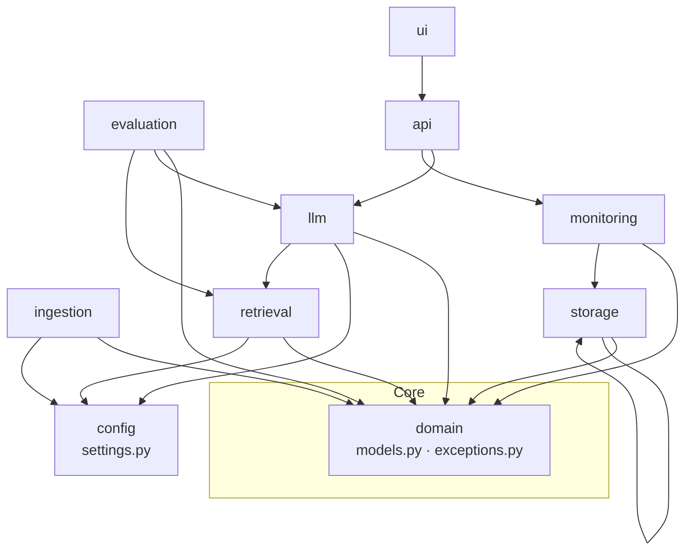

# CodingStandards.md — Coding Conventions, Type Safety, Linting & TDD Rules

## Objective

Define the **binding engineering conventions** for the `pokemon_tcg_rag` codebase so that
human developers and autonomous AI Code Agents (Claude Code, Codex, Cursor) produce
uniform, type-safe, testable, and reproducible code. Every rule below is grounded in the
real tooling configuration in [`pyproject.toml`](../../pyproject.toml),
[`Makefile`](../../Makefile), [`scripts/check_quality.sh`](../../scripts/check_quality.sh),
[`ci/workflows/ci.yml`](../../ci/workflows/ci.yml), and the source layout under
`src/pokemon_tcg_rag/`.

## Scope

- **In scope:** language version, type hints, docstrings, naming, imports, Clean
  Architecture dependency rules, configuration policy, error handling, logging, TDD,
  coverage, and the tool configs (ruff, mypy, black, pre-commit) that enforce them.
- **Out of scope:** the test *matrix* itself ([`TestingStrategy.md`](./TestingStrategy.md)),
  merge gate orchestration ([`QUALITY_GATE_SPECIFICATION.md`](../05_agent_harness/QUALITY_GATE_SPECIFICATION.md)),
  and per-endpoint contracts ([`APIContracts.md`](./APIContracts.md)).

Genuine ambiguities are recorded in [`Assumptions.md`](../00_project/Assumptions.md) rather
than silently resolved (see [ASSUMPTION-LANG](#appendix-a-known-tooling-ambiguities)).

---

## 1. Language & Runtime

| Rule | Value | Source of truth |
| :--- | :--- | :--- |
| Minimum Python | **3.10+** (`requires-python = ">=3.10"`) | [`pyproject.toml`](../../pyproject.toml) `[project]` |
| Ruff / mypy target | `py310` / `python_version = "3.10"` | `[tool.ruff]`, `[tool.mypy]` |
| CI interpreter | Python **3.10** (`actions/setup-python`) | [`ci/workflows/ci.yml`](../../ci/workflows/ci.yml) |
| Recommended dev/prod | **3.11** (faster, matches Docker base image intent) | [`Deployment.md`](./Deployment.md) |

> The Shared Context Brief names "Python 3.11+" while the real tooling pins `py310`. This
> doc is grounded in the committed config: **write code that runs on 3.10, use only syntax
> available in 3.10** (e.g. `X | None` unions are allowed — already used across
> `domain/models.py`). See [Appendix A](#appendix-a-known-tooling-ambiguities).

---

## 2. Type Hints (Mandatory)

Type hints are **required on every function signature and every module-level constant**.
`mypy` runs in `strict` mode with `disallow_untyped_defs = true`
([`pyproject.toml`](../../pyproject.toml) `[tool.mypy]`), so an untyped def fails CI.

| ✅ Good | ❌ Bad |
| :--- | :--- |
| `def calculate_mrr(retrieved_chunks: list[RetrievedChunk], ground_truth_doc_ids: list[str]) -> float:` | `def calculate_mrr(retrieved_chunks, ground_truth_doc_ids):` |
| `def submit_feedback(self, query: str, rating: int, comment: str \| None) -> FeedbackRecord:` | `def submit_feedback(self, query, rating, comment):` |
| `EMBEDDING_DIMENSION: int = 1024` | `EMBEDDING_DIMENSION = 1024` |
| Use builtin generics `list[str]`, `dict[str, int]` (py310) | `List[str]`, `Dict[str, int]` from `typing` |
| `X \| None` for optionals | `Optional[X]` (allowed but not preferred) |

Rules:
1. No bare `Any` unless justified with an inline `# type: ignore[<code>]` **and** a comment.
2. Pydantic models (`BaseModel`) are the canonical typed data carriers — see
   `domain/models.py`. Do not pass raw `dict`s across layer boundaries.
3. Public return types must be explicit, never inferred.

---

## 3. Docstrings

Style: **concise triple-quoted summary line**, matching the existing codebase (see
`monitoring/metrics_collector.py`, `evaluation/metrics.py`). One-line summary for simple
functions; add an Args/Returns/Raises block when behavior is non-obvious.

```python
def calculate_recall_at_k(
    retrieved_chunks: list[RetrievedChunk],
    ground_truth_doc_ids: list[str],
    k: int,
) -> float:
    """Calculate Recall@K: fraction of ground-truth docs present in the top-k results.

    Args:
        retrieved_chunks: Ranked retrieval output (best first).
        ground_truth_doc_ids: Expected relevant document IDs for the query.
        k: Cut-off rank.
    Returns:
        Recall in [0.0, 1.0]; 0.0 when no ground truth is provided.
    """
```

- Every module starts with a one-line module docstring (already the convention).
- Every **public** class and function has a docstring. Private helpers (`_name`) may omit it.

---

## 4. Naming Conventions

Enforced by ruff rule set `N` (`pep8-naming`, see `[tool.ruff] select`).

| Element | Convention | Example (real code) |
| :--- | :--- | :--- |
| Module / package | `snake_case` | `metrics_collector.py`, `crawler_pokegym.py` |
| Class | `PascalCase` | `MetricsCollector`, `RAGEvaluator`, `FeedbackStore` |
| Function / method | `snake_case` | `record_query`, `run_evaluation`, `build_prompt` |
| Variable | `snake_case` | `retrieved_chunks`, `rating_type` |
| Constant / class-const | `UPPER_SNAKE_CASE` | `QUERY_COUNTER`, `SYSTEM_PROMPT`, `LATENCY_HISTOGRAM` |
| Enum member | `UPPER_SNAKE_CASE` | `DocumentSource.RULEBOOK_PDF`, `RuleType.BAN_STATUS` |
| Pydantic settings field | `UPPER_SNAKE_CASE` | `QDRANT_COLLECTION_NAME`, `RETRIEVAL_FINAL_TOP_K` |
| Private helper | leading underscore | `_normalize_text` |
| Test module | `test_<unit>.py` | `test_chunker.py` |
| Test function | `test_<behavior>()` | `test_chunk_size`, `test_missing_fields` |

`pytest` discovery is pinned to `test_*.py` / `test_*` in `[tool.pytest.ini_options]`.

---

## 5. Import Ordering

Import sorting is owned by ruff rule set `I` (`isort`-compatible), plus `isort` in dev deps.
Three groups, blank-line separated, alphabetized within group:

```python
# 1. Standard library
import uuid
from pathlib import Path

# 2. Third-party
import structlog
from prometheus_client import Counter, Histogram
from pydantic import BaseModel

# 3. First-party (absolute, always `pokemon_tcg_rag.*`)
from pokemon_tcg_rag.domain.models import FeedbackRecord
from pokemon_tcg_rag.storage.relational_db import RelationalDatabase
```

Rules:
1. **Absolute imports only** for first-party code (`from pokemon_tcg_rag.… import …`). No
   relative imports across modules — matches `feedback_store.py`, `evaluator.py`.
2. No wildcard imports (`from x import *`) — flagged by `F403`/`F405`.
3. `__init__.py` may re-export the package's public surface via `__all__` (see
   `monitoring/__init__.py`, `evaluation/__init__.py`).

---

## 6. Clean Architecture Dependency Rules

The package is layered (per the Shared Context Brief). Dependencies point **inward only**:
`domain` is the stable core and imports nothing from the project; outer layers may depend on
inner ones, never the reverse.



| Layer | May import | Must NOT import |
| :--- | :--- | :--- |
| `domain` | stdlib, pydantic only | any other project layer |
| `config` | stdlib, pydantic-settings | domain business logic |
| `storage` | `domain`, `config` | `retrieval`, `llm`, `api`, `ui` |
| `ingestion` | `domain`, `config`, `storage` | `llm`, `api`, `ui` |
| `retrieval` | `domain`, `config`, `storage` | `api`, `ui` |
| `llm` | `domain`, `config`, `retrieval` | `api`, `ui` |
| `evaluation` | `domain`, `llm`, `retrieval` | `api`, `ui` |
| `monitoring` | `domain`, `config`, `storage` | `api`, `ui` |
| `api` | `llm`, `monitoring`, `domain` | `ui` |
| `ui` | `api` (HTTP) / `domain` DTOs | direct DB / vector access |

**Verified against real code:** `evaluation/evaluator.py` imports `llm.rag_chain`;
`monitoring/feedback_store.py` imports `domain.models` + `storage.relational_db`;
`domain/*` imports nothing from the project. A dependency that points outward is a review
blocker. See [Architecture.md](./Architecture.md) for the full component view.

---

## 7. No Hardcoded Values — Everything via Settings / `.env`

**All tunables come from the typed settings singleton**, never literals in business code.
Source of truth: `config/settings.py` (`Settings(BaseSettings)`, `env_file=".env"`) loaded
via `get_settings()` (`@lru_cache`). Defaults are documented in
[`.env.example`](../../.env.example) and [`config/default_config.yaml`](../../config/default_config.yaml).

| ✅ Good | ❌ Bad |
| :--- | :--- |
| `settings.RETRIEVAL_FINAL_TOP_K` | `top_k = 5` |
| `settings.QDRANT_COLLECTION_NAME` | `collection = "pokemon_tcg_rules"` |
| `settings.EMBEDDING_DIMENSION` | `dim = 1024` |
| `settings.OPENAI_MODEL_NAME` | `model = "gpt-4o-mini"` |
| `settings.postgres_uri` (derived property) | inline connection string |

Rules:
1. Secrets (`OPENAI_API_KEY`, `POSTGRES_PASSWORD`, `QDRANT_API_KEY`) come **only** from the
   environment — never committed. See [`Security.md`](./Security.md).
2. New tunable ⇒ add a typed field to `Settings` **and** a line to `.env.example`.
3. `get_settings()` is the single entry point; do not read `os.environ` directly.

---

## 8. Error Handling Policy

Raise **domain-specific exceptions** from `domain/exceptions.py`. All inherit `DomainError`.

| Failure site | Exception | Defined in |
| :--- | :--- | :--- |
| Fetch / PDF / HTML parse failure | `IngestionError` | `domain/exceptions.py` |
| Chunking / segmentation failure | `ChunkingError` | `domain/exceptions.py` |
| Qdrant connect / upsert / search failure | `VectorDBError` | `domain/exceptions.py` |
| Dense / BM25 / hybrid failure | `RetrievalError` | `domain/exceptions.py` |
| LLM provider error / timeout | `LLMProviderError` | `domain/exceptions.py` |

```python
# ✅ Good — wrap the low-level cause, raise a domain error
try:
    self.client.upsert(collection_name=settings.QDRANT_COLLECTION_NAME, points=points)
except Exception as exc:  # noqa: BLE001 — re-raised as domain error
    raise VectorDBError("Failed to upsert chunks into Qdrant") from exc

# ❌ Bad — swallow the error, hide the cause, return None
try:
    self.client.upsert(...)
except Exception:
    return None
```

Rules:
1. Never `except: pass` and never bare `except Exception` without re-raising a `DomainError`.
2. Preserve the cause with `raise … from exc`.
3. Transient network/LLM calls use `tenacity` retries (a pinned dependency) before raising.
4. API layer maps `DomainError` subclasses to HTTP codes — see [`APIContracts.md`](./APIContracts.md).

---

## 9. Logging — Structured JSON via `structlog`

Logging is centralized in `monitoring/logger.py` (`setup_logging()`), which configures
`structlog` with `JSONRenderer` and an ISO `TimeStamper`. Level comes from
`settings.LOG_LEVEL` (`.env`, default `INFO`).

| ✅ Good | ❌ Bad |
| :--- | :--- |
| `log.info("query_served", model=m, latency=lat, num_docs=n)` | `print(f"served in {lat}s")` |
| `log.error("qdrant_upsert_failed", collection=c, error=str(e))` | `logging.error("failed: " + str(e))` |
| Bind context: `structlog.contextvars.bind_contextvars(request_id=rid)` | string-formatting the request id into every message |

Rules:
1. Call `setup_logging()` once at process start (API, UI, ingestion entrypoints).
2. Emit **event names + key/value fields**, not interpolated sentences — JSON must stay
   machine-parseable for Grafana/Loki. See [`Observability.md`](./Observability.md).
3. Never log secrets or full user PII (feedback comments are the only free text — see
   [`Security.md`](./Security.md)).
4. No `print()` in `src/` (only in `scripts/` CLIs).

---

## 10. TDD & Coverage Requirements

Grounded in the plan's TDD mandate and the enforced gates.

1. **Test-first (TDD):** write the failing test before the implementation. Every public
   class/function must have tests ([REQ-017](../00_project/REQUIREMENTS.md)).
2. **Coverage ≥ 90%** on `src/pokemon_tcg_rag`. Enforced by:
   - `Makefile` `test`: `pytest … --cov-fail-under=90`
   - `ci/workflows/ci.yml`: `pytest tests/unit/ … --cov-fail-under=90`
   - `scripts/check_quality.sh` step 3
   - Corresponds to [SC-016](../00_project/SUCCESS_CRITERIA.md).
3. **Every fixed bug gets a regression test** before the fix is merged.
4. **No `TODO`/`FIXME` on `main`** — dangling markers are a merge blocker (rule from the
   plan's IMPLEMENTATION_GUIDE). Track work in [`Backlog.md`](../00_project/Backlog.md) / tasks instead.
5. Tests carry markers (`unit`, `integration`, `smoke`, `e2e`, `evaluation`, `performance`)
   declared in `[tool.pytest.ini_options]`; `--strict-markers` rejects unknown markers.

Full matrix and per-module test names: [`TestingStrategy.md`](./TestingStrategy.md).

---

## 11. Tooling Configuration (Authoritative)

### 11.1 Ruff (lint + import sort)

From [`pyproject.toml`](../../pyproject.toml) `[tool.ruff]`:

| Setting | Value | Meaning |
| :--- | :--- | :--- |
| `line-length` | `100` | max line length |
| `target-version` | `py310` | syntax target |
| `select` | `E, F, W, I, N, UP, B, A, C4, SIM` | pycodestyle, pyflakes, isort, naming, pyupgrade, bugbear, builtins-shadow, comprehensions, simplify |
| `ignore` | `E501` | line-too-long handled by formatter |

Commands: `make lint` → `ruff check src/ tests/`; `make format` → `ruff check --fix` + `black`.

### 11.2 Mypy (strict)

`[tool.mypy]`: `strict = true`, `warn_return_any = true`, `warn_unused_configs = true`,
`disallow_untyped_defs = true`, `python_version = "3.10"`. Command: `make typecheck` → `mypy src/`.

### 11.3 Black

`black` (dev dep) formats code; CI runs `black --check src/ tests/`. Ruff and black agree on
100-col width; ruff owns import order, black owns formatting.

### 11.4 Pre-commit (recommended local gate)

Mirror the CI quality-gate locally so failures are caught before push. Suggested
`.pre-commit-config.yaml` hooks (equivalent to `scripts/check_quality.sh`):

```yaml
repos:
  - repo: local
    hooks:
      - id: ruff
        name: ruff check
        entry: ruff check src/ tests/
        language: system
        pass_filenames: false
      - id: black
        name: black --check
        entry: black --check src/ tests/
        language: system
        pass_filenames: false
      - id: mypy
        name: mypy strict
        entry: mypy src/
        language: system
        pass_filenames: false
```

> If no `.pre-commit-config.yaml` is committed yet, running
> [`scripts/check_quality.sh`](../../scripts/check_quality.sh) before every commit is the
> mandatory equivalent (see [ASSUMPTION-PRECOMMIT](#appendix-a-known-tooling-ambiguities)).

---

## 12. Acceptance Criteria

| ID | Criterion | Verified by |
| :--- | :--- | :--- |
| CS-AC-1 | `ruff check src/ tests/` → 0 errors | `make lint`, CI `quality-gate` |
| CS-AC-2 | `mypy src/` (strict) → 0 errors | `make typecheck`, CI `quality-gate` |
| CS-AC-3 | `black --check src/ tests/` → clean | CI `quality-gate` |
| CS-AC-4 | Coverage ≥ 90% | `make test`, CI, [SC-016](../00_project/SUCCESS_CRITERIA.md) |
| CS-AC-5 | No hardcoded config; all via `Settings`/`.env` | code review + grep for literals |
| CS-AC-6 | Errors raise `DomainError` subclasses | code review |
| CS-AC-7 | No `TODO`/`FIXME` and no untyped defs on `main` | ruff + review |

---

## Appendix A — Known Tooling Ambiguities

| ID | Ambiguity | Interim resolution |
| :--- | :--- | :--- |
| **ASSUMPTION-LANG** | Brief says "Python 3.11+", config pins `py310`/CI 3.10. | Code MUST run on 3.10; 3.11 recommended at runtime. Record in [`Assumptions.md`](../00_project/Assumptions.md). |
| **ASSUMPTION-PRECOMMIT** | No `.pre-commit-config.yaml` committed yet. | Use `scripts/check_quality.sh` as the mandatory pre-push gate until the hook file lands. |

---

## Cross-References

- [`TestingStrategy.md`](./TestingStrategy.md) — full test matrix and TEST-### IDs.
- [`Security.md`](./Security.md) — secrets, logging redaction.
- [`Observability.md`](./Observability.md) — structlog fields, metrics.
- [`QUALITY_GATE_SPECIFICATION.md`](../05_agent_harness/QUALITY_GATE_SPECIFICATION.md) — merge gates.
- [`REQUIREMENTS.md`](../00_project/REQUIREMENTS.md) · [`SUCCESS_CRITERIA.md`](../00_project/SUCCESS_CRITERIA.md).
