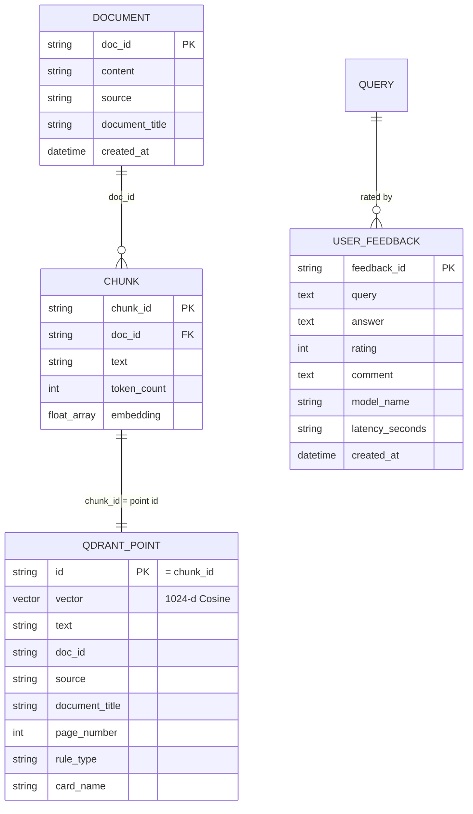

# DataModel.md — Persistence & Data Schemas

> Part of the [Engineering Harness](../README.md) · Persistence mapping of [DomainModel.md](./DomainModel.md) · Siblings: [Architecture.md](./Architecture.md) · [APIContracts.md](./APIContracts.md)

## Objective

Specify every persistence schema in the system: the Qdrant vector collection, the PostgreSQL relational tables, and the on-disk data artifacts (`raw_data/`, `processed/`, `chunks/`). Each schema is grounded in the real code (`storage/vector_db.py`, `storage/relational_db.py`, `config/settings.py`) and mapped back to the domain entities.

## Scope

- **In scope:** Qdrant collection config + payload schema/indexes, PostgreSQL DDL, and file artifact formats (Parquet/JSONL) with column tables.
- **Out of scope:** domain semantics/invariants (see [DomainModel.md](./DomainModel.md)) and API DTOs (see [APIContracts.md](./APIContracts.md)).

---

## 1. Storage Overview (ER)



| Store | Technology | Holds | Source module |
| :--- | :--- | :--- | :--- |
| Vector DB | Qdrant | Embedded chunks (`pokemon_tcg_rules`) | `storage/vector_db.py` |
| Relational | PostgreSQL | User feedback (`user_feedback`) | `storage/relational_db.py` |
| Filesystem | Parquet / JSONL | Raw + processed + chunk artifacts | `ingestion/*`, paths in `settings.py` |

---

## 2. Qdrant Vector Collection

**Collection:** `pokemon_tcg_rules` (`QDRANT_COLLECTION_NAME`). Created by `VectorDatabase.init_collection` if absent.

### Vector params (`VectorParams`)
| Param | Value | Source |
| :--- | :--- | :--- |
| `size` | `1024` | `EMBEDDING_DIMENSION` (BGE-large) |
| `distance` | `Cosine` | `qmodels.Distance.COSINE` |
| Point `id` | `chunk_id` (str) | `PointStruct(id=chunk.chunk_id …)` |
| Vector | `chunk.embedding` | 1024 floats |

### Payload schema (mirrors `DocumentMetadata`)
Written by `upsert_chunks`; read back by `search_dense`.

| Payload key | Type | Domain origin | Nullable |
| :--- | :--- | :--- | :--- |
| `text` | string | `Chunk.text` | no |
| `doc_id` | string | `Chunk.doc_id` | no |
| `source` | string (enum value) | `metadata.source.value` | no |
| `document_title` | string | `metadata.document_title` | no |
| `page_number` | integer | `metadata.page_number` | yes |
| `rule_type` | string (enum value) | `metadata.rule_type.value` | no |
| `card_name` | string | `metadata.card_name` | yes |

> Note: `section_title`, `publication_date`, `source_url`, and `checksum` from `DocumentMetadata` are **not** persisted in the current Qdrant payload (only the seven keys above are upserted). This is an intentional minimal payload; full metadata remains in the `chunks/` JSONL artifacts (§4). Flagged for [../00_project/Assumptions.md](../00_project/Assumptions.md) if broader payload filtering is later required.

### Recommended payload indexes (metadata filtering)
To support filtered retrieval (e.g. restrict to ban list or a specific card), create keyword/integer payload indexes:

| Field | Qdrant index type | Enables |
| :--- | :--- | :--- |
| `source` | keyword | Filter by document source |
| `rule_type` | keyword | Filter by rule category |
| `card_name` | keyword | Card-specific ruling lookup |
| `doc_id` | keyword | Group/delete by document |
| `page_number` | integer | Page-range filtering |

### Distance rationale
Cosine matches BGE-large's normalized-embedding training objective; scores returned in `RetrievedChunk.score` are cosine similarities (higher = more relevant).

---

## 3. PostgreSQL Relational Schema

Single table `user_feedback`, defined by `FeedbackORM` (`storage/relational_db.py`), created via `RelationalDatabase.init_db`. Connection URI built from settings: `postgresql://{POSTGRES_USER}:{POSTGRES_PASSWORD}@{POSTGRES_HOST}:{POSTGRES_PORT}/{POSTGRES_DB}`.

### `user_feedback` DDL
```sql
CREATE TABLE user_feedback (
    feedback_id       VARCHAR   PRIMARY KEY,
    query             TEXT      NOT NULL,
    answer            TEXT      NOT NULL,
    rating            INTEGER   NOT NULL,   -- +1 thumbs up / -1 thumbs down
    comment           TEXT      NULL,
    model_name        VARCHAR   NOT NULL,
    latency_seconds   VARCHAR   NOT NULL,   -- stored as string (str(float)) in ORM
    created_at        TIMESTAMP NOT NULL
);
```

| Column | Type | Nullable | Domain field | Notes |
| :--- | :--- | :--- | :--- | :--- |
| `feedback_id` | VARCHAR | no (PK) | `FeedbackRecord.feedback_id` | Server-generated id |
| `query` | TEXT | no | `.query` | Question rated |
| `answer` | TEXT | no | `.answer` | Answer rated |
| `rating` | INTEGER | no | `.rating` | `{+1,-1}` |
| `comment` | TEXT | yes | `.comment` | Optional |
| `model_name` | VARCHAR | no | `.model_name` | LLM identity |
| `latency_seconds` | VARCHAR | no | `.latency_seconds` | Cast to `str` in `save_feedback` |
| `created_at` | TIMESTAMP | no | `.created_at` | UTC |

> `latency_seconds` is stored as `String` per the current ORM; Grafana panels needing numeric aggregation must cast (`latency_seconds::float`). Flagged for [../00_project/Assumptions.md](../00_project/Assumptions.md).

### `query_log` (planned, not yet in code)
No query-audit table exists in `storage/relational_db.py` today; per-query telemetry flows to Prometheus via `MetricsCollector`, not Postgres. A future `query_log` table (id, query, rewritten_query, model_name, num_docs, latency_seconds, created_at) is a documented extension point, not a current schema.

---

## 4. On-Disk Artifacts

Directory layout from `settings.py`: `DATA_RAW_DIR=data/raw_data`, `DATA_PROCESSED_DIR=data/processed`, `DATA_CHUNKS_DIR=data/chunks`.

```
data/
├── raw_data/
│   ├── pdfs/     # downloaded source PDFs
│   ├── html/     # raw scraped HTML (pokegym, ban list, promo, mega)
│   └── json/     # structured pokegym rulings (JSONL)
├── processed/    # normalized Document records (Parquet)
└── chunks/       # embeddable Chunk records (JSONL)
```

### `processed/` — Parquet (one row per `Document`)
| Column | Type | Domain field |
| :--- | :--- | :--- |
| `doc_id` | string | `Document.doc_id` |
| `content` | string | `Document.content` |
| `source` | string | `metadata.source` |
| `document_title` | string | `metadata.document_title` |
| `page_number` | int64 (nullable) | `metadata.page_number` |
| `section_title` | string (nullable) | `metadata.section_title` |
| `card_name` | string (nullable) | `metadata.card_name` |
| `rule_type` | string | `metadata.rule_type` |
| `publication_date` | string (nullable) | `metadata.publication_date` |
| `source_url` | string (nullable) | `metadata.source_url` |
| `checksum` | string (nullable) | `metadata.checksum` |
| `created_at` | timestamp | `Document.created_at` |

### `chunks/` — JSONL (one JSON object per line per `Chunk`)
| Field | Type | Domain field |
| :--- | :--- | :--- |
| `chunk_id` | string | `Chunk.chunk_id` |
| `doc_id` | string | `Chunk.doc_id` |
| `text` | string | `Chunk.text` |
| `token_count` | int | `Chunk.token_count` |
| `embedding` | array[float] \| null | `Chunk.embedding` (len 1024 when set) |
| `metadata` | object | full `DocumentMetadata` (all 9 fields) |

Example line:
```json
{"chunk_id":"errata_pdf:tcg_errata#12","doc_id":"errata_pdf:tcg_errata","text":"...","token_count":118,"embedding":null,"metadata":{"source":"errata_pdf","document_title":"TCG Errata","page_number":3,"section_title":"Card Errata","card_name":"Rare Candy","rule_type":"errata","publication_date":"2023-01-01","source_url":"https://...","checksum":"a1b2..."}}
```

### `raw_data/json/` — Pokegym rulings (JSONL)
| Field | Type | Notes |
| :--- | :--- | :--- |
| `date` | string | Ruling publication date |
| `set` | string | Card set |
| `card` | string | Card name |
| `question` | string | Ruling question |
| `answer` | string | Ruling answer |
| `url` | string | Source URL |

These map into `Document`/`DocumentMetadata` (`source=POKEGYM`, `rule_type=RULING`, `card_name=card`, `publication_date=date`, `source_url=url`).

---

## Acceptance Criteria

| # | Criterion | Verified by |
| :--- | :--- | :--- |
| AC-1 | Qdrant collection created with size=1024, distance=Cosine. | `init_collection` integration test (REQ-005) |
| AC-2 | Every upserted point payload contains the 7 mapped keys; point id == `chunk_id`. | Upsert/search round-trip test |
| AC-3 | `user_feedback` table matches the DDL; feedback rows persist. | Integration test (REQ-014) |
| AC-4 | `processed/` Parquet and `chunks/` JSONL follow the column tables above. | Artifact schema test (REQ-004) |
| AC-5 | Recommended payload indexes exist to support metadata filtering. | Qdrant index check |

## Cross-references
- Entity definitions & invariants: [DomainModel.md](./DomainModel.md)
- Storage components: [Architecture.md](./Architecture.md) §1
- Feedback API mapping: [APIContracts.md](./APIContracts.md)
