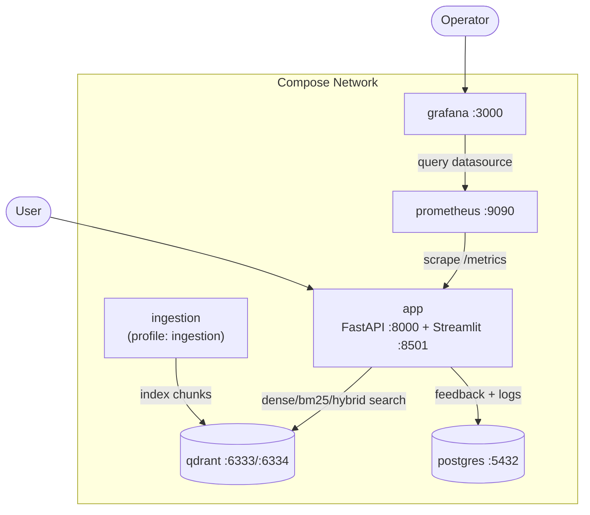
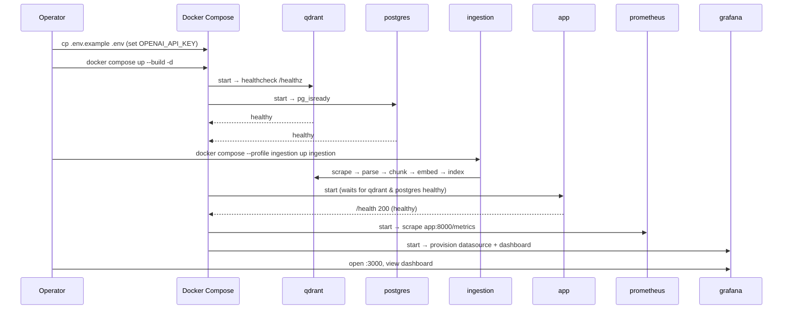

# Deployment.md — Docker Compose, Kubernetes IaC & Cloud Deployment

## Objective

Provide the **operational deployment guide** for the Pokemon TCG RAG system: a
service-by-service description of the Docker Compose stack, the one-command bootstrap
sequence, environment configuration, cloud-deployment options (bonus), Kubernetes manifests,
and rollback/data-persistence notes. Grounded in
[`docker-compose.yml`](../../docker-compose.yml), [`.env.example`](../../.env.example),
[`Makefile`](../../Makefile), and [`infra/k8s/deployment.yaml`](../../infra/k8s/deployment.yaml).

## Scope

- **In scope:** local/prod Compose deployment, env config, startup order, cloud options
  (Render/Railway/AWS), K8s reference, rollback & persistence.
- **Out of scope:** security hardening detail ([`Security.md`](./Security.md)), metrics/dash
  config ([`Observability.md`](./Observability.md)), ingestion internals
  ([`IndexingPipeline.md`](./IndexingPipeline.md)).

Satisfies [REQ-016](../00_project/REQUIREMENTS.md) (all services in Compose),
[REQ-020](../00_project/REQUIREMENTS.md) (IaC/K8s), and [SC-014](../00_project/SUCCESS_CRITERIA.md)
/ [SC-024](../00_project/SUCCESS_CRITERIA.md) (reproducibility).

---

## 1. Service Topology



> **Note on service naming:** the plan lists `streamlit`, `api`, `qdrant`, `postgres`,
> `prometheus`, `grafana`, `ingestion`. In the committed [`docker-compose.yml`](../../docker-compose.yml)
> the **FastAPI (`:8000`) and Streamlit (`:8501`) interfaces run inside a single `app`
> service** (`docker/Dockerfile.app`). The list below documents the real stack; the K8s
> manifest mirrors this (one `app` container exposing both ports).

---

## 2. Service-by-Service Reference

Grounded field-for-field in [`docker-compose.yml`](../../docker-compose.yml).

| Service | Image / Build | Ports | Volumes | depends_on | Healthcheck |
| :--- | :--- | :--- | :--- | :--- | :--- |
| **qdrant** | `qdrant/qdrant:v1.7.4` | `6333`, `6334` | `qdrant_storage:/qdrant/storage` | — | `curl -f http://localhost:6333/healthz` (10s/5s×5) |
| **postgres** | `postgres:15-alpine` | `5432` | `postgres_data:/var/lib/postgresql/data` | — | `pg_isready -U $POSTGRES_USER -d $POSTGRES_DB` (5s/5s×5) |
| **ingestion** | build `docker/Dockerfile.ingestion` | — | `./data:/app/data`, `./config:/app/config` | qdrant (healthy) | — (batch job, `profiles: [ingestion]`) |
| **app** (API + UI) | build `docker/Dockerfile.app` | `8000` (API), `8501` (UI) | `./data:/app/data` | qdrant (healthy), postgres (healthy) | `curl -f http://localhost:8000/health` (10s/5s×5) |
| **prometheus** | `prom/prometheus:v2.48.1` | `9090` | `./config/prometheus.yml:/etc/prometheus/prometheus.yml`, `prometheus_data:/prometheus` | — | — |
| **grafana** | `grafana/grafana:10.2.3` | `3000` | `./config/grafana/datasource.yml`, `./config/grafana/dashboards.json`, `grafana_data:/var/lib/grafana` | prometheus | — |

Named volumes (persistent): `qdrant_storage`, `postgres_data`, `prometheus_data`,
`grafana_data`. `restart: unless-stopped` is set on qdrant, postgres, app, prometheus,
grafana.

Key environment wiring (Compose → container):
- `app`: `QDRANT_HOST=qdrant`, `QDRANT_PORT=6333`, `POSTGRES_HOST=postgres`,
  `POSTGRES_PORT=5432`, `POSTGRES_USER/PASSWORD/DB`, `OPENAI_API_KEY`, `ENVIRONMENT`.
- `ingestion`: `QDRANT_HOST=qdrant`, `QDRANT_PORT=6333`, `OPENAI_API_KEY`, `ENVIRONMENT`.
- Service hostnames use **compose DNS names** (`qdrant`, `postgres`), overriding the
  `localhost` defaults in [`.env.example`](../../.env.example) — this is why config must
  come from env, never hardcoded ([`CodingStandards.md`](./CodingStandards.md) §7).

---

## 3. Bootstrap Sequence (`docker compose up`)



Ordering guarantees from Compose `depends_on ... condition: service_healthy`:
`qdrant` + `postgres` become healthy **before** `app` starts; `ingestion` waits on healthy
`qdrant`; `grafana` waits on `prometheus`.

Target: stack healthy in **< 60 s** with images pre-pulled and models cached
([SC-014](../00_project/SUCCESS_CRITERIA.md); build/model-download excluded — see
[`Assumptions.md`](../00_project/Assumptions.md) ASSUMPTION-008).

---

## 4. One-Command Reproducibility

From a clean clone ([SC-024](../00_project/SUCCESS_CRITERIA.md)):

```bash
git clone <repo> && cd RAG_Pokemon
cp .env.example .env                 # set OPENAI_API_KEY (and prod passwords)
make docker-up                       # docker-compose up --build -d  (Makefile)
make ingest                          # OR: docker compose --profile ingestion up ingestion
#   → app UI:      http://localhost:8501
#   → app API:     http://localhost:8000  (/health, /query, /feedback)
#   → Grafana:     http://localhost:3000  (admin/admin — change in prod)
#   → Prometheus:  http://localhost:9090
make docker-down                     # docker-compose down -v  (removes volumes)
```

Relevant `Makefile` targets: `docker-up`, `docker-down`, `ingest`, `seed-db`, `run-api`,
`run-ui`. Reproducibility rests on pinned deps ([`requirements.txt`](../../requirements.txt),
`pyproject.toml`) and pinned images ([SC-019](../00_project/SUCCESS_CRITERIA.md)).

---

## 5. Environment Configuration

All runtime config comes from `.env` (loaded by `config/settings.py`). Minimum to run:

| Variable | Purpose | Prod action |
| :--- | :--- | :--- |
| `OPENAI_API_KEY` | LLM + `text-embedding-3-small` access | **required** secret |
| `POSTGRES_USER/PASSWORD/DB` | feedback store creds | override dev defaults |
| `QDRANT_HOST/PORT` | vector DB (set to `qdrant`/`6333` in compose) | internal only |
| `EMBEDDING_MODEL_PRIMARY`, `EMBEDDING_DIMENSION` | `bge-large-en-v1.5`, 1024 | keep in sync with collection |
| `OPENAI_MODEL_NAME`, `OPENAI_TEMPERATURE` | `gpt-4o-mini`, `0.0` | tune per eval |
| `ENVIRONMENT`, `LOG_LEVEL` | runtime mode + logging | `production`, `INFO` |

Full list: [`.env.example`](../../.env.example). See [`Security.md`](./Security.md) §2 for
secret handling.

---

## 6. Cloud Deployment (Bonus — [REQ-020](../00_project/REQUIREMENTS.md) / [SC-023](../00_project/SUCCESS_CRITERIA.md))

A public reachable URL earns the bonus. Three grounded options:

### 6.1 Render (Compose-friendly, simplest)

1. Push repo to GitHub.
2. Create a **Web Service** from `docker/Dockerfile.app` (exposes `8000`/`8501`).
3. Add **Managed PostgreSQL** (Render add-on) → set `POSTGRES_*` env vars.
4. Run **Qdrant** as a Render Private Service (from `qdrant/qdrant:v1.7.4`) with a persistent
   disk mounted at `/qdrant/storage`; set `QDRANT_HOST` to its internal address.
5. Set `OPENAI_API_KEY` and other env vars in the Render dashboard (secrets).
6. Run ingestion as a one-off Render Job before first traffic.

### 6.2 Railway

1. New project → deploy service from `docker/Dockerfile.app`.
2. Add Railway **Postgres** plugin (auto-injects `DATABASE_URL`; map to `POSTGRES_*`).
3. Deploy Qdrant from its Docker image with a volume; wire `QDRANT_HOST`.
4. Configure env vars/secrets; expose `app` publicly; verify `/health` returns 200.

### 6.3 AWS (most control)

| Concern | AWS service |
| :--- | :--- |
| App container(s) | ECS Fargate (or EKS — see §7) from `Dockerfile.app` |
| Vector DB | Qdrant on ECS/EC2 with EBS volume, **or** Qdrant Cloud |
| Relational | RDS PostgreSQL 15 |
| Secrets | AWS Secrets Manager / SSM Parameter Store → injected as env |
| Ingress/TLS | ALB + ACM certificate → `app:8000/8501` |
| Metrics | Prometheus + Grafana on ECS, or Amazon Managed Grafana |

Common steps: build & push image to ECR → define task/service → attach RDS + Qdrant
endpoints via env → run ingestion task once → point ALB at the app.

---

## 7. Kubernetes (IaC reference)

[`infra/k8s/deployment.yaml`](../../infra/k8s/deployment.yaml) provides the app tier:

- **Deployment** `pokemon-rag-app`: `replicas: 2`, image `pokemon-rag-app:latest`, ports
  `8000` + `8501`, env from **ConfigMap** `pokemon-rag-config`.
- **Resources:** requests `512Mi`/`500m`, limits `2Gi`/`2000m`.
- **Service** `pokemon-rag-service`: `type: LoadBalancer`, ports `8000` (api) + `8501` (ui).

To complete a production K8s deploy, add: a `Secret` for `OPENAI_API_KEY`/`POSTGRES_PASSWORD`
(instead of ConfigMap for secrets), StatefulSets + PVCs for `qdrant` and `postgres`, liveness
/readiness probes on `/health` and `/healthz`, and Prometheus/Grafana (e.g. kube-prometheus).
Pin the app image to an immutable tag rather than `:latest` for reproducibility.

---

## 8. Rollback & Data Persistence

### 8.1 Persistence

| Data | Backing store | Volume | Loss on `down -v`? |
| :--- | :--- | :--- | :--- |
| Vector index | Qdrant | `qdrant_storage` | **yes** — re-run `make ingest` to rebuild |
| Feedback + logs | Postgres | `postgres_data` | **yes** — back up before teardown |
| Metrics history | Prometheus | `prometheus_data` | yes (non-critical) |
| Dashboards/state | Grafana | `grafana_data` | yes (dashboard re-provisioned from `config/`) |
| Raw/processed/chunks | host bind mount | `./data` | no (persists on host) |

`make docker-down` runs `docker-compose down -v` and **deletes named volumes** — use plain
`docker compose down` (no `-v`) to preserve data across restarts.

### 8.2 Rollback

1. **Application:** pin image tags per release; roll back by redeploying the previous tag
   (K8s: `kubectl rollout undo deployment/pokemon-rag-app`; Compose: change tag + `up -d`).
2. **Data:** back up Postgres (`pg_dump`) and Qdrant snapshots before upgrades; restore on
   rollback. The vector index is fully reproducible from source via `make ingest`.
3. **Config/dashboards:** version-controlled under `config/` and re-provisioned on restart,
   so a bad dashboard/datasource change is reverted by redeploy.
4. **Quality gate:** the retrieval/LLM **regression gate** (baseline in
   `data/evaluation/`) blocks promotion of a change that worsens metrics — see
   [`EvaluationPlan.md`](./EvaluationPlan.md) §6 and [`TestingStrategy.md`](./TestingStrategy.md) §7.

---

## 9. Acceptance Criteria

| ID | Criterion | Verified by |
| :--- | :--- | :--- |
| DEP-AC-1 | All services start via a single `docker compose up` | [REQ-016](../00_project/REQUIREMENTS.md), `make docker-up` |
| DEP-AC-2 | Stack healthy < 60 s (images pre-pulled) | [SC-014](../00_project/SUCCESS_CRITERIA.md) |
| DEP-AC-3 | Clean-clone reproducibility works end-to-end | [SC-024](../00_project/SUCCESS_CRITERIA.md) |
| DEP-AC-4 | `app` healthcheck `/health` green; UI + API reachable | compose healthcheck, [SC-021](../00_project/SUCCESS_CRITERIA.md) |
| DEP-AC-5 | K8s manifests provided | [REQ-020](../00_project/REQUIREMENTS.md), `infra/k8s/deployment.yaml` |
| DEP-AC-6 | (Bonus) public cloud URL reachable, `/health` 200 | [SC-023](../00_project/SUCCESS_CRITERIA.md) |
| DEP-AC-7 | Data persists across `down`/`up` (without `-v`); rollback documented | this doc §8 |

---

## Cross-References

- [`Observability.md`](./Observability.md) — Prometheus scrape, Grafana provisioning.
- [`Security.md`](./Security.md) — port exposure, secrets, TLS.
- [`IndexingPipeline.md`](./IndexingPipeline.md) — ingestion service internals.
- [`SUCCESS_CRITERIA.md`](../00_project/SUCCESS_CRITERIA.md) — SC-014/021/023/024.
- [`REQUIREMENTS.md`](../00_project/REQUIREMENTS.md) — REQ-016, REQ-020.
- [`Assumptions.md`](../00_project/Assumptions.md) — ASSUMPTION-008 (startup timing), ASSUMPTION-009 (cloud).
