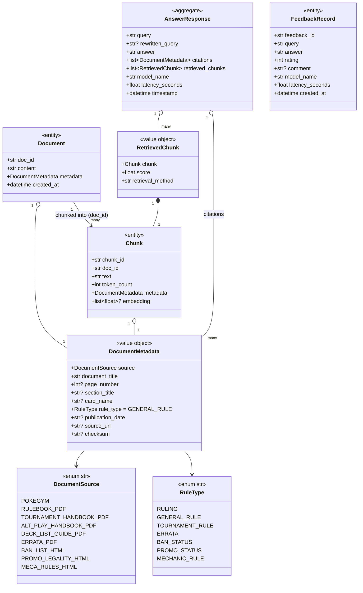
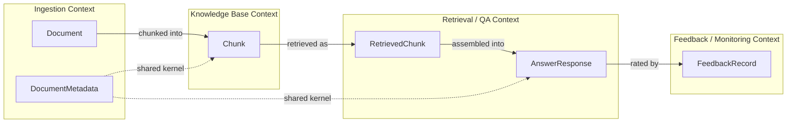
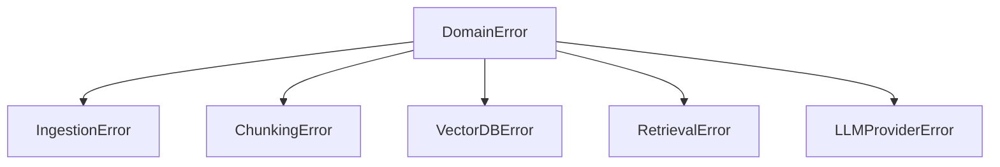

# DomainModel.md — DDD Domain Model

> Part of the [Engineering Harness](../README.md) · Grounded in `src/pokemon_tcg_rag/domain/models.py` and `src/pokemon_tcg_rag/domain/exceptions.py` · Siblings: [Architecture.md](./Architecture.md) · [DataModel.md](./DataModel.md) · [APIContracts.md](./APIContracts.md)

## Objective

Describe the complete Domain-Driven Design model of the Pokemon TCG RAG system: every enum, value object, and entity defined in `domain/models.py`, with fields, types, invariants, responsibilities, and lifecycle; the bounded contexts that own them; and the ID-generation strategy for `doc_id` / `chunk_id`.

## Scope

- **In scope:** the domain layer only — `DocumentSource`, `RuleType`, `DocumentMetadata`, `Document`, `Chunk`, `RetrievedChunk`, `AnswerResponse`, `FeedbackRecord`, plus the `DomainError` exception hierarchy.
- **Out of scope:** persistence mapping (see [DataModel.md](./DataModel.md)) and transport DTOs such as `QueryRequest`/`QueryResponse` (those live in `api/schemas.py`; see [APIContracts.md](./APIContracts.md)).

The domain layer is pure: it depends only on the standard library and Pydantic, and is imported by every outer layer (see the layering table in [Architecture.md](./Architecture.md) §3).

---

## 1. Class Diagram

---

## 2. Enums (Value Types)

### `DocumentSource(str, Enum)`
Closed set of the official source categories the system is permitted to ingest. Each member's value is the canonical string persisted in the Qdrant payload `source` field and echoed in citations.

| Member | Value | Origin | Format |
| :--- | :--- | :--- | :--- |
| `POKEGYM` | `pokegym_rulings` | Compendium crawl | HTML |
| `RULEBOOK_PDF` | `rulebook_pdf` | Official Rulebook | PDF |
| `TOURNAMENT_HANDBOOK_PDF` | `tournament_handbook_pdf` | Tournament Handbook | PDF |
| `ALT_PLAY_HANDBOOK_PDF` | `alt_play_handbook_pdf` | Alternative Play Handbook | PDF |
| `DECK_LIST_GUIDE_PDF` | `deck_list_guide_pdf` | Deck List Guide | PDF |
| `ERRATA_PDF` | `errata_pdf` | TCG Errata | PDF |
| `BAN_LIST_HTML` | `ban_list_html` | Banned Card List | HTML |
| `PROMO_LEGALITY_HTML` | `promo_legality_html` | Promo Legality Status | HTML |
| `MEGA_RULES_HTML` | `mega_rules_html` | Mega Evolution Rules | HTML |

**Invariant:** ingestion MUST reject any content whose provenance is not one of these members (enforces "official sources only" from [PROJECT.md](../00_project/PROJECT.md) §4).

### `RuleType(str, Enum)`
Semantic classification of a document/chunk, used for metadata filtering and citation labelling. Default is `GENERAL_RULE`.

| Member | Value | Typical source |
| :--- | :--- | :--- |
| `RULING` | `ruling` | Pokegym compendium |
| `GENERAL_RULE` | `general_rule` | Rulebook (default) |
| `TOURNAMENT_RULE` | `tournament_rule` | Tournament / Alt-Play Handbook |
| `ERRATA` | `errata` | Errata PDF |
| `BAN_STATUS` | `ban_status` | Ban List HTML |
| `PROMO_STATUS` | `promo_status` | Promo Legality HTML |
| `MECHANIC_RULE` | `mechanic_rule` | Mega Rules HTML |

Both enums subclass `str`, so members serialize transparently to JSON and Qdrant payloads without custom encoders.

---

## 3. Value Objects & Entities

### `DocumentMetadata` — Value Object
Immutable descriptor attached to **every** `Document`, `Chunk`, and citation. It is the single provenance contract across ingestion, storage, and answer generation.

| Field | Type | Required | Default | Notes |
| :--- | :--- | :--- | :--- | :--- |
| `source` | `DocumentSource` | yes | — | Provenance category |
| `document_title` | `str` | yes | — | Human-readable title |
| `page_number` | `int \| None` | no | `None` | PDF page (cited to user) |
| `section_title` | `str \| None` | no | `None` | Section heading |
| `card_name` | `str \| None` | no | `None` | For card-specific rulings |
| `rule_type` | `RuleType` | yes | `GENERAL_RULE` | Semantic class |
| `publication_date` | `str \| None` | no | `None` | Ruling/errata date |
| `source_url` | `str \| None` | no | `None` | Origin URL |
| `checksum` | `str \| None` | no | `None` | Content hash for change detection |

**Invariants / responsibilities**
- `source` and `document_title` are mandatory — a citation cannot be rendered without them (REQ-012).
- `checksum` supports idempotent re-ingestion: unchanged HTML pages (ban list, promo, mega) are skipped when the hash matches (the plan notes these pages change over time).
- Value semantics: metadata equality is by field value, not identity.

### `Document` — Entity
Raw, normalized text of one source artifact **before** chunking.

| Field | Type | Default | Notes |
| :--- | :--- | :--- | :--- |
| `doc_id` | `str` | — | Stable unique identity (§5) |
| `content` | `str` | — | Full normalized text |
| `metadata` | `DocumentMetadata` | — | Provenance |
| `created_at` | `datetime` | `utcnow()` | Ingestion timestamp |

**Identity:** `doc_id`. **Lifecycle:** produced by `ingestion/normalizer.py`, persisted as a `processed/` artifact, then split by `ingestion/chunker.py` into many `Chunk`s.

### `Chunk` — Entity
Normalized, embeddable text segment — the atomic unit indexed in Qdrant.

| Field | Type | Default | Notes |
| :--- | :--- | :--- | :--- |
| `chunk_id` | `str` | — | Stable unique identity, also the Qdrant point id |
| `doc_id` | `str` | — | Foreign reference to parent `Document` |
| `text` | `str` | — | Chunk body |
| `token_count` | `int` | — | Token length (chunk-size experiments) |
| `metadata` | `DocumentMetadata` | — | Inherited from parent document |
| `embedding` | `list[float] \| None` | `None` | 1024-d vector (BGE-large) once embedded |

**Invariants:** every `Chunk` carries a valid `doc_id` and non-empty `text`; `embedding`, when present, has length `EMBEDDING_DIMENSION` (1024). `VectorDatabase.upsert_chunks` skips chunks whose `embedding` is falsy.
**Lifecycle:** created by the chunker → embedded → upserted to Qdrant → later reconstructed (without stored embedding) from the Qdrant payload inside a `RetrievedChunk`.

### `RetrievedChunk` — Value Object
A `Chunk` scored by a retrieval strategy.

| Field | Type | Notes |
| :--- | :--- | :--- |
| `chunk` | `Chunk` | The retrieved chunk (embedding usually `None` after reconstruction) |
| `score` | `float` | Relevance score (raw or fused/rerank) |
| `retrieval_method` | `str` | One of `dense`, `bm25`, `hybrid`, `reranked` |

**Responsibility:** carry per-result provenance so the UI can show which strategy surfaced each chunk. `retrieval_method` is a free-form string by type but constrained by convention to the four values above.

### `AnswerResponse` — Aggregate Root (of a QA turn)
The complete result of one RAG query, assembling answer text, citations, and evidence.

| Field | Type | Default | Notes |
| :--- | :--- | :--- | :--- |
| `query` | `str` | — | Original user question |
| `rewritten_query` | `str \| None` | `None` | LLM-rewritten query (REQ-010) |
| `answer` | `str` | — | Grounded answer text |
| `citations` | `list[DocumentMetadata]` | — | Sources cited (REQ-012) |
| `retrieved_chunks` | `list[RetrievedChunk]` | — | Evidence used |
| `model_name` | `str` | — | LLM identity (e.g. `gpt-4o-mini`) |
| `latency_seconds` | `float` | — | End-to-end latency |
| `timestamp` | `datetime` | `utcnow()` | Answer time |

**Invariants:** a non-"I don't know" answer MUST have a non-empty `citations` list (REQ-011/012). `latency_seconds` feeds `MetricsCollector.record_query` (see [Architecture.md](./Architecture.md) §4). This aggregate is mapped to the transport DTO `QueryResponse` (which drops `timestamp`) in [APIContracts.md](./APIContracts.md).

### `FeedbackRecord` — Entity
User rating of an answer, persisted to PostgreSQL for the monitoring dashboard.

| Field | Type | Default | Notes |
| :--- | :--- | :--- | :--- |
| `feedback_id` | `str` | — | Unique identity (server-generated) |
| `query` | `str` | — | The question rated |
| `answer` | `str` | — | The answer rated |
| `rating` | `int` | — | `+1` thumbs up / `-1` thumbs down |
| `comment` | `str \| None` | `None` | Optional free text |
| `model_name` | `str` | — | Model that produced the answer |
| `latency_seconds` | `float` | — | Reported latency |
| `created_at` | `datetime` | `utcnow()` | Feedback time |

**Invariant:** `rating ∈ {+1, -1}` by convention. **Lifecycle:** built from a `FeedbackRequest` (no client-supplied id), passed to `FeedbackStore`, and mapped to `FeedbackORM` (`user_feedback` table) where `latency_seconds` is stored as `String` — see [DataModel.md](./DataModel.md).

---

## 4. Bounded Contexts

| Context | Owns | Consumes | Relationship |
| :--- | :--- | :--- | :--- |
| **Ingestion** | `Document`, `DocumentSource`, `RuleType` | Raw sources | Upstream; publishes `Document`s |
| **Knowledge Base** | `Chunk` (+ embeddings), Qdrant collection | `Document` | Customer/Supplier of Ingestion |
| **Retrieval / QA** | `RetrievedChunk`, `AnswerResponse` | `Chunk`, LLM | Core domain; drives the API |
| **Feedback / Monitoring** | `FeedbackRecord` | `AnswerResponse` (query/answer/model/latency) | Downstream of QA |

`DocumentMetadata` (with its two enums) is the **shared kernel** flowing unchanged across all four contexts, guaranteeing that provenance and citation semantics are identical everywhere.

---

## 5. ID Generation Strategy

`doc_id` and `chunk_id` are plain `str` in the domain and must be **deterministic, stable, and collision-free** so that re-ingestion is idempotent and vector upserts are idempotent (Qdrant point id = `chunk_id`).

| ID | Recommended derivation | Rationale |
| :--- | :--- | :--- |
| `doc_id` | Deterministic hash of `source.value` + `source_url`/`document_title` (e.g. UUIDv5 over a stable natural key), or `"{source.value}:{slug(document_title)}"`. | Re-running ingestion on an unchanged source yields the same `doc_id`; content changes are detected via `metadata.checksum`, not the id. |
| `chunk_id` | Deterministic function of `doc_id` + chunk ordinal (e.g. `"{doc_id}#{index}"` or UUIDv5 over that key). | Stable across re-chunking so `upsert_chunks` overwrites rather than duplicates the same Qdrant point. |

**Constraints**
- `chunk_id` is used verbatim as the Qdrant `PointStruct.id`, so it must satisfy Qdrant's point-id rules (UUID string or unsigned integer). A UUIDv5 string derived from the natural key satisfies this while remaining deterministic.
- On reconstruction, `VectorDatabase.search_dense` sets `chunk_id = str(res.id)`, confirming the round-trip: the id persisted equals the id returned.
- Exact algorithm choice (UUIDv5 vs slug) is an open decision recorded in [../00_project/Assumptions.md](../00_project/Assumptions.md) if not yet finalized; both satisfy the determinism invariant above.

---

## 6. Domain Exception Hierarchy

From `domain/exceptions.py`; raised by the application layer and mapped to HTTP codes at the API boundary ([APIContracts.md](./APIContracts.md)).

| Exception | Raised when | Raised by (layer) |
| :--- | :--- | :--- |
| `DomainError` | Base for all domain errors | — |
| `IngestionError` | Document fetch/parse fails | `ingestion/*` |
| `ChunkingError` | Text segmentation fails | `ingestion/chunker.py` |
| `VectorDBError` | Qdrant connect/op failure | `storage/vector_db.py` |
| `RetrievalError` | Dense/BM25/hybrid failure | `retrieval/*` |
| `LLMProviderError` | LLM provider error | `llm/client.py` |

---

## Acceptance Criteria

| # | Criterion | Verified by |
| :--- | :--- | :--- |
| AC-1 | Every field/type here matches `domain/models.py` exactly. | Review vs source |
| AC-2 | Non-"I don't know" `AnswerResponse` has >=1 citation. | Unit test (REQ-012) |
| AC-3 | Re-ingesting an unchanged source produces identical `doc_id`/`chunk_id` (no Qdrant duplicates). | Integration test (REQ-004/005) |
| AC-4 | `FeedbackRecord.rating ∈ {+1,-1}`. | Unit test (REQ-014) |

## Cross-references
- Persistence mapping: [DataModel.md](./DataModel.md)
- Transport DTOs: [APIContracts.md](./APIContracts.md)
- Layering rules: [Architecture.md](./Architecture.md)
