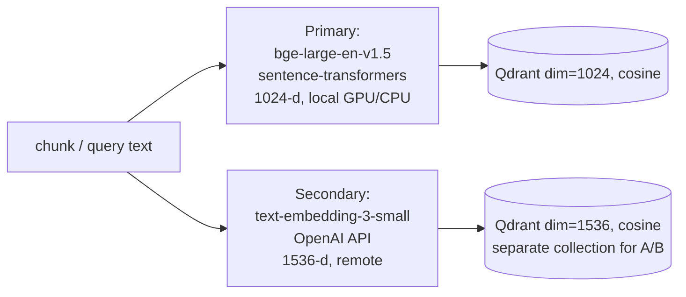

# EmbeddingStrategy.md - Embedding Model Strategy & Experiment

## Objective

Define how text is turned into vectors for dense retrieval, and document the **embeddings
experiment** the rubric rewards: `BAAI/bge-large-en-v1.5` (local, 1024-d) versus
`text-embedding-3-small` (OpenAI, 1536-d). State normalization, batching, and caching
policy; describe how the two models are compared; and record which is the default and why.

## Scope

- **In scope:** the two candidate embedding models, comparison dimensions, encoding
  mechanics, and the chunk-size interaction experiment (256 / 512 / 1024).
- **Out of scope:** how dense search consumes the vectors ([`RetrievalPipeline.md`](./RetrievalPipeline.md)),
  the Qdrant collection schema ([`DataModel.md`](./DataModel.md)), and the numeric
  evaluation harness ([`EvaluationPlan.md`](./EvaluationPlan.md)).

Implements [REQ-005](../00_project/REQUIREMENTS.md)/[REQ-006](../00_project/REQUIREMENTS.md);
the model choice is recorded in [`ADR_002_EMBEDDINGS.md`](../04_decisions/ADR_002_EMBEDDINGS.md).

---

## 1. Candidate Models

Both are declared in [`config/settings.py`](../../src/pokemon_tcg_rag/config/settings.py):

```python
EMBEDDING_MODEL_PRIMARY   = "BAAI/bge-large-en-v1.5"      # default, local
EMBEDDING_MODEL_SECONDARY = "text-embedding-3-small"      # OpenAI, comparison
EMBEDDING_DIMENSION       = 1024                          # Qdrant vector size
```



The dense retriever (`DenseRetriever`) loads `EMBEDDING_MODEL_PRIMARY` lazily via
`SentenceTransformer` and encodes the query with `.encode(query).tolist()` — the same
model that embedded the corpus, so query and document live in one vector space.

---

## 2. Comparison Table

| Dimension | `BAAI/bge-large-en-v1.5` (primary) | `text-embedding-3-small` (secondary) |
| :--- | :--- | :--- |
| Provider / runtime | Local, `sentence-transformers` | OpenAI hosted API |
| Vector dimension | **1024** | 1536 |
| Cost | Free after download (compute only) | Per-token API cost |
| Latency | Local inference; GPU fast, CPU slower; one-time model load | Network round-trip per batch |
| Offline capability | **Yes** — no external calls, fully containerizable | No — requires internet + API key |
| Quality (English rules text) | Strong MTEB retrieval scores; tuned for retrieval | Strong general-purpose |
| Data privacy | Text never leaves the host | Text sent to OpenAI |
| Qdrant collection dim | 1024 (`EMBEDDING_DIMENSION`) | 1536 (requires a parallel collection) |
| Reproducibility | Deterministic, version-pinned weights | Depends on remote model version |

---

## 3. Encoding Mechanics

- **Normalization:** cosine similarity is the Qdrant distance (`Distance.COSINE` in
  `VectorDatabase.init_collection`). BGE models are trained to be used with normalized
  embeddings; `sentence-transformers` cosine + Qdrant cosine make magnitude irrelevant,
  so L2-normalization is effectively applied at the similarity step.
- **Batching:** corpus embedding is done in batches at ingestion time
  (`model.encode(list_of_texts, batch_size=...)`) for throughput; query embedding is a
  single `.encode(query)` call at query time.
- **Caching:** the model object is **lazily loaded and cached** on the retriever instance
  (`self._embedding_model`), so the (expensive) load happens once per process, not per
  query — this is why the [SC-012](../00_project/SUCCESS_CRITERIA.md) latency target
  excludes the one-time warm-up.
- **Symmetry:** the identical model must embed both corpus and query; switching the
  primary model requires re-indexing the whole collection.

---

## 4. How the Comparison Is Evaluated

The two models are swapped as the `EMBEDDING_MODEL_PRIMARY` (each into its own
dimension-matched Qdrant collection), and the **same 100-question benchmark** is run under
the **same retrieval strategy** (Dense, then Hybrid) for each. Metrics: **Recall@5,
Recall@10, MRR, Hit Rate** — defined and executed in
[`EvaluationPlan.md`](./EvaluationPlan.md). The winner (best Recall@10 / MRR at acceptable
latency and cost) is promoted to `EMBEDDING_MODEL_PRIMARY`.

| Experiment | Variable | Held constant | Decision metric |
| :--- | :--- | :--- | :--- |
| Embeddings A/B | bge-large-en-v1.5 vs text-embedding-3-small | corpus, chunking, top_k, strategy | Recall@10, MRR (SC-001/003) |

---

## 5. Chunk-Size Interaction Experiment

Embedding quality interacts with chunk length: too small loses context; too large dilutes
the signal and inflates cost. Per the plan's experiment matrix, three sizes are compared
against the same model (default 512, per `DocumentChunker(chunk_size=512, chunk_overlap=64)`):

| Chunk size (words) | Overlap | Trade-off | Expectation |
| :---: | :---: | :--- | :--- |
| 256 | ~32 | More, tighter chunks; higher precision, risk of splitting a ruling | Best precision, more chunks/cost |
| **512** (default) | 64 | Balanced context vs precision | Baseline |
| 1024 | ~128 | Fewer, broader chunks; more context per hit, coarser | Higher recall, lower precision |

Each size is measured with the same metrics as §4; the best size is recorded in
[`ADR_003_CHUNKING.md`](../04_decisions/ADR_003_CHUNKING.md). See
[`IndexingPipeline.md`](./IndexingPipeline.md) §2.1 for the chunker mechanics.

---

## 6. Default & Rationale

**Default: `BAAI/bge-large-en-v1.5` (1024-d).** Chosen because it:

1. Runs **fully offline** — no API key, no per-query cost, satisfying the
   containerization/reproducibility rubric ([SC-014](../00_project/SUCCESS_CRITERIA.md),
   [SC-019](../00_project/SUCCESS_CRITERIA.md)) and keeping rules text private.
2. Matches the fixed architectural facts: Qdrant collection is `dim=1024`
   (`EMBEDDING_DIMENSION`), aligned with BGE-large.
3. Delivers strong English retrieval quality on rule-style text.

`text-embedding-3-small` remains the documented secondary/comparison model so the rubric's
"multiple approaches evaluated, best used" is satisfied. Full trade-off record:
[`ADR_002_EMBEDDINGS.md`](../04_decisions/ADR_002_EMBEDDINGS.md).

> **Note ([`Assumptions.md`](../00_project/Assumptions.md)):** running the secondary model
> requires a parallel 1536-d Qdrant collection; the primary path is 1024-d and is the only
> collection provisioned by default.

---

## 7. Acceptance Criteria

| Criterion | Target | Linked SC |
| :--- | :--- | :--- |
| ≥ 2 embedding models evaluated, best selected | BGE vs OpenAI documented | [SC-005](../00_project/SUCCESS_CRITERIA.md) context |
| Vector dimension matches collection | 1024 primary / 1536 secondary | this doc §1 |
| Default runs offline & pinned | No API dependency for primary path | [SC-014](../00_project/SUCCESS_CRITERIA.md), [SC-019](../00_project/SUCCESS_CRITERIA.md) |
| Chunk-size experiment documented | 256 / 512 / 1024 compared | [`ADR_003`](../04_decisions/ADR_003_CHUNKING.md) |

---

## Cross-References

- [`RetrievalPipeline.md`](./RetrievalPipeline.md) — dense search over these vectors.
- [`IndexingPipeline.md`](./IndexingPipeline.md) — corpus embedding & chunking.
- [`EvaluationPlan.md`](./EvaluationPlan.md) — Recall@K / MRR comparison methodology.
- [`DataModel.md`](./DataModel.md) — Qdrant vector/payload schema.
- ADRs: [`ADR_002_EMBEDDINGS.md`](../04_decisions/ADR_002_EMBEDDINGS.md) ·
  [`ADR_003_CHUNKING.md`](../04_decisions/ADR_003_CHUNKING.md).
- [`REQUIREMENTS.md`](../00_project/REQUIREMENTS.md) · [`SUCCESS_CRITERIA.md`](../00_project/SUCCESS_CRITERIA.md).
