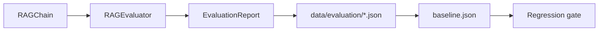

# EvaluationPlan.md — RAG Evaluation Plan: Retrieval (Recall@K, MRR) & LLM (RAGAS/DeepEval)

## Objective

Define **how** the Pokemon TCG RAG system is evaluated and how the best configuration is
selected: the retrieval benchmark and its metrics, the LLM-output quality evaluation, the
full experiment matrix, the results-recording format, and the link to acceptance thresholds.
This document states the *code and procedure*; the *numeric targets* are owned by
[`SUCCESS_CRITERIA.md`](../00_project/SUCCESS_CRITERIA.md). Grounded in the real evaluation
package (`evaluation/dataset.py`, `evaluation/metrics.py`, `evaluation/evaluator.py`) and the
experiment table in [`PlanejamentoRAG_Pokemon`](../../PlanejamentoRAG_Pokemon).

## Scope

- **In scope:** retrieval evaluation (100-question benchmark, Recall@5/@10, MRR, Hit Rate,
  strategy comparison), LLM evaluation (Faithfulness, Correctness, Citation Quality,
  Completeness via RAGAS/DeepEval, prompt & model comparison), the experiment matrix, and
  evaluation-report artifacts.
- **Out of scope:** numeric pass/fail thresholds ([`SUCCESS_CRITERIA.md`](../00_project/SUCCESS_CRITERIA.md)),
  regression test wiring ([`TestingStrategy.md`](./TestingStrategy.md) §7), and retrieval
  algorithm design ([`RetrievalPipeline.md`](./RetrievalPipeline.md)).

---

## 1. Evaluation Overview

```mermaid
graph TD
    DS[benchmark_100_questions.json<br/>EvaluationDatasetLoader] --> RE[Retrieval Eval]
    DS --> LE[LLM Eval]
    RE -->|Recall@5/@10, MRR, Hit Rate| CMP1[Strategy comparison<br/>Dense vs BM25 vs Hybrid vs Hybrid+Rerank]
    LE -->|Faithfulness, Correctness,<br/>Citation, Completeness| CMP2[Prompt A/B &amp; Model A/B]
    CMP1 --> RPT[Evaluation Report<br/>data/evaluation/]
    CMP2 --> RPT
    RPT --> SC[SUCCESS_CRITERIA.md gates]
```

Two evaluation tracks share **one** ground-truth benchmark of 100 questions.

---

## 2. Benchmark Dataset

Loaded by `EvaluationDatasetLoader` from
`data/evaluation/benchmark_100_questions.json` (falls back to a 1-item mock when the file is
absent — `evaluation/dataset.py`). Each item is an `EvalTestCase` (Pydantic):

### 2.1 Real schema (`EvalTestCase`)

| Field | Type | Meaning |
| :--- | :--- | :--- |
| `question_id` | `str` | stable ID, e.g. `Q001` |
| `question` | `str` | natural-language user question |
| `expected_doc_ids` | `list[str]` | ground-truth relevant document IDs (e.g. `rulebook_pdf_p15`, `pokegym_102`) |
| `expected_answer_keywords` | `list[str]` | keywords the correct answer must contain |

### 2.2 Plan-level authoring schema

The plan describes each row as **{question, relevant_docs, expected_source}**. Mapping to the
implemented schema:

| Plan field | Implemented as | Example |
| :--- | :--- | :--- |
| `question` | `question` | "Can Rare Candy be played on the first turn of the game?" |
| `relevant_docs` | `expected_doc_ids` | `["rulebook_pdf_p15", "pokegym_102"]` |
| `expected_source` | derivable from doc-id prefix → `DocumentSource` | `RULEBOOK_PDF`, `POKEGYM` |

Example JSON row:

```json
{
  "question_id": "Q001",
  "question": "Can Rare Candy be played on the first turn of the game?",
  "expected_doc_ids": ["rulebook_pdf_p15", "pokegym_102"],
  "expected_answer_keywords": ["first turn", "Rare Candy", "evolution"]
}
```

The benchmark must cover all 9 sources ([`PROJECT.md`](../00_project/PROJECT.md) §3),
including the three E2E scenarios (Rare Candy, Mew VMAX legality, attack after Mega
Evolution — see [`TestingStrategy.md`](./TestingStrategy.md) §6).

---

## 3. Retrieval Evaluation

### 3.1 Metrics (implemented in `evaluation/metrics.py`)

| Metric | Function | Definition | Target (SC) |
| :--- | :--- | :--- | :--- |
| Recall@5 | `calculate_recall_at_k(..., k=5)` | fraction of `expected_doc_ids` present in top-5 | [SC-002](../00_project/SUCCESS_CRITERIA.md) ≥ 0.80 |
| Recall@10 | `calculate_recall_at_k(..., k=10)` | same at top-10 | [SC-001](../00_project/SUCCESS_CRITERIA.md) > 0.90 |
| MRR | `calculate_mrr(...)` | reciprocal rank of first relevant chunk | [SC-003](../00_project/SUCCESS_CRITERIA.md) ≥ 0.75 |
| Hit Rate@K | `calculate_hit_rate(..., k)` | 1 if ≥ 1 relevant chunk in top-K, else 0 | [SC-004](../00_project/SUCCESS_CRITERIA.md) ≥ 0.92 |

Aggregated by `RAGEvaluator.run_evaluation()` into `EvaluationReport`
(`total_questions`, `mean_recall_at_5`, `mean_recall_at_10`, `mean_mrr`,
`mean_hit_rate_at_5`).

### 3.2 Strategy comparison (compare ≥ 4, pick best — [SC-005](../00_project/SUCCESS_CRITERIA.md))

Run the same 100 questions through each retrieval strategy and fill this template:

| Strategy | Recall@5 | Recall@10 | MRR | Hit Rate@10 | Mean latency (s) | Selected? |
| :--- | :--- | :--- | :--- | :--- | :--- | :--- |
| Dense (`bge-large-en-v1.5`, top_k=10) | _tbd_ | _tbd_ | _tbd_ | _tbd_ | _tbd_ | ☐ |
| BM25 (`rank-bm25`, top_k=10) | _tbd_ | _tbd_ | _tbd_ | _tbd_ | _tbd_ | ☐ |
| Hybrid (Dense + BM25, RRF k=60) | _tbd_ | _tbd_ | _tbd_ | _tbd_ | _tbd_ | ☐ |
| **Hybrid + Rerank** (`bge-reranker-large`, final top_k=5) | _tbd_ | _tbd_ | _tbd_ | _tbd_ | _tbd_ | ☐ |

Parameters are pulled from settings (`RETRIEVAL_TOP_K_DENSE=10`, `RETRIEVAL_TOP_K_BM25=10`,
`RETRIEVAL_HYBRID_RRF_K=60`, `RETRIEVAL_FINAL_TOP_K=5`, `RERANKER_MODEL`) — never hardcoded.
The strategy with the best Recall@10/MRR (subject to the latency SLA) is promoted to the
default pipeline and recorded in [`ADR_004_RERANKING.md`](../04_decisions/ADR_004_RERANKING.md).

---

## 4. LLM Output Evaluation

Uses **RAGAS** and **DeepEval** (both pinned in [`requirements.txt`](../../requirements.txt) /
`pyproject.toml`). `evaluation/metrics.py` ships `calculate_faithfulness(...)` as a heuristic
stub that the RAGAS/DeepEval integration replaces in the evaluation pipeline.

### 4.1 Criteria

| Criterion | Tool metric | Meaning | Target (SC) |
| :--- | :--- | :--- | :--- |
| Faithfulness | RAGAS `faithfulness` | answer claims grounded in retrieved context (no hallucination) | [SC-006](../00_project/SUCCESS_CRITERIA.md) > 0.85 |
| Correctness | RAGAS/DeepEval answer correctness | agreement with reference answer | [SC-007](../00_project/SUCCESS_CRITERIA.md) ≥ 0.80 |
| Citation Quality | custom check on `AnswerResponse.citations` | ≥ 1 valid, resolvable citation per answer | [SC-008](../00_project/SUCCESS_CRITERIA.md) ≥ 0.90 |
| Completeness | DeepEval/RAGAS completeness | answer covers the reference's key points | [SC-009](../00_project/SUCCESS_CRITERIA.md) ≥ 0.75 |
| Grounding / abstention | adversarial no-answer probe | unsupported query → "I don't know" (per Judge prompt) | [SC-011](../00_project/SUCCESS_CRITERIA.md) 100% |

Citation Quality checks each `AnswerResponse.citations[*]` (`DocumentMetadata`) resolves to an
indexed source; the Judge prompt (`llm/prompts.py`) mandates the
`[Fonte: <doc>, Página: <p>]` citation format and the explicit abstention sentence.

### 4.2 Prompt & model comparison (compare ≥ 2 each, pick best — [SC-010](../00_project/SUCCESS_CRITERIA.md))

| Config | Faithfulness | Correctness | Citation | Completeness | Mean latency (s) | Selected? |
| :--- | :--- | :--- | :--- | :--- | :--- | :--- |
| Prompt A (strict Judge) · `gpt-4o-mini` | _tbd_ | _tbd_ | _tbd_ | _tbd_ | _tbd_ | ☐ |
| Prompt B (variant) · `gpt-4o-mini` | _tbd_ | _tbd_ | _tbd_ | _tbd_ | _tbd_ | ☐ |
| Prompt A · `gpt-4.1-mini` | _tbd_ | _tbd_ | _tbd_ | _tbd_ | _tbd_ | ☐ |
| Prompt B · `gpt-4.1-mini` | _tbd_ | _tbd_ | _tbd_ | _tbd_ | _tbd_ | ☐ |

Model/temperature come from settings (`OPENAI_MODEL_NAME`, default `gpt-4o-mini`;
`OPENAI_TEMPERATURE=0.0`). Prompt variants documented in
[`PromptEngineering.md`](./PromptEngineering.md); model choice recorded in
[`ADR_002_EMBEDDINGS.md`](../04_decisions/ADR_002_EMBEDDINGS.md) and prompt ADRs.

---

## 5. Experiment Matrix

Every axis below (from the plan) must be run and documented to maximize rubric score. Fixed
defaults are drawn from [`config/default_config.yaml`](../../config/default_config.yaml) /
[`.env.example`](../../.env.example).

| # | Category | Variants | Default (config) | Metric that decides |
| :--- | :--- | :--- | :--- | :--- |
| E1 | Embeddings | `BAAI/bge-large-en-v1.5` vs `text-embedding-3-small` | primary = bge-large (1024-d) | Recall@10, MRR |
| E2 | Chunking | Fixed-with-overlap vs Semantic | `fixed_with_overlap` | Recall@10, Faithfulness |
| E3 | Chunk size | 256 vs 512 vs 1024 tokens | 512 (overlap 64) | Recall@10, latency |
| E4 | Retrieval | Dense vs BM25 vs Hybrid | Hybrid (RRF k=60) | Recall@10, MRR |
| E5 | Re-ranking | With vs Without | With (`bge-reranker-large`) | Recall@5, MRR |
| E6 | Query rewriting | With vs Without | With (LLM rewrite) | Recall@10, Correctness |
| E7 | Prompt | Prompt A vs Prompt B | Prompt A (strict Judge) | Faithfulness, Citation |
| E8 | LLM | `gpt-4o-mini` vs `gpt-4.1-mini` | `gpt-4o-mini` @ temp 0.0 | Faithfulness, Correctness, latency |

E4/E5/E6 also serve as the **best-practice ablations** required by
[SC-022](../00_project/SUCCESS_CRITERIA.md) (Hybrid, Rerank, Query-rewrite on/off).

---

## 6. How Results Are Recorded

1. `RAGEvaluator.run_evaluation()` returns an `EvaluationReport` (Pydantic) per configuration.
2. Reports are serialized to **`data/evaluation/`** as timestamped, versioned artifacts:

```
data/evaluation/
├── benchmark_100_questions.json          # ground truth (input)
├── report_retrieval_<strategy>_<ts>.json # per-strategy retrieval metrics
├── report_llm_<prompt>_<model>_<ts>.json # per-config LLM metrics
├── comparison_retrieval.md               # filled §3.2 table
├── comparison_llm.md                      # filled §4.2 table
└── baseline.json                          # promoted best config = regression baseline
```

3. `baseline.json` is the reference for the **regression gate**: any change that lowers
   Recall/Faithfulness or raises latency past target fails the pipeline
   ([`TestingStrategy.md`](./TestingStrategy.md) §7, [`SUCCESS_CRITERIA.md`](../00_project/SUCCESS_CRITERIA.md) §3).
4. Each config carries its exact settings snapshot (embeddings, chunk size, retrieval,
   rerank, rewrite, prompt id, model) so runs are reproducible.
5. The demo-ready comparison tables and best-config selection are summarized in the project
   README / `docs/04_tests/EVALUATION_DATASET.md`.



---

## 7. Acceptance Criteria

| ID | Criterion | Linked SC |
| :--- | :--- | :--- |
| EP-AC-1 | 100-question benchmark exists and covers all 9 sources | [SC-015](../00_project/SUCCESS_CRITERIA.md) |
| EP-AC-2 | ≥ 4 retrieval strategies benchmarked; best selected & documented | [SC-005](../00_project/SUCCESS_CRITERIA.md) |
| EP-AC-3 | Recall@10 > 0.90, Recall@5 ≥ 0.80, MRR ≥ 0.75, Hit@10 ≥ 0.92 (best strategy) | SC-001–SC-004 |
| EP-AC-4 | ≥ 2 prompts and ≥ 2 models compared; best selected | [SC-010](../00_project/SUCCESS_CRITERIA.md) |
| EP-AC-5 | Faithfulness > 0.85, Correctness ≥ 0.80, Citation ≥ 0.90, Completeness ≥ 0.75 | SC-006–SC-009 |
| EP-AC-6 | Best-practice ablations (Hybrid/Rerank/Rewrite) recorded | [SC-022](../00_project/SUCCESS_CRITERIA.md) |
| EP-AC-7 | Reports + baseline persisted under `data/evaluation/` | this doc §6 |

---

## Cross-References

- [`SUCCESS_CRITERIA.md`](../00_project/SUCCESS_CRITERIA.md) — numeric thresholds (SC-###).
- [`TestingStrategy.md`](./TestingStrategy.md) — regression wiring & TEST-### IDs.
- [`RetrievalPipeline.md`](./RetrievalPipeline.md) — retrieval algorithm design.
- [`PromptEngineering.md`](./PromptEngineering.md) — Prompt A/B definitions.
- [`REQUIREMENTS.md`](../00_project/REQUIREMENTS.md) — REQ-018, REQ-019.
- ADRs: [`ADR_002_EMBEDDINGS.md`](../04_decisions/ADR_002_EMBEDDINGS.md), [`ADR_003_CHUNKING.md`](../04_decisions/ADR_003_CHUNKING.md), [`ADR_004_RERANKING.md`](../04_decisions/ADR_004_RERANKING.md), [`ADR_005_QUERY_REWRITING.md`](../04_decisions/ADR_005_QUERY_REWRITING.md).
