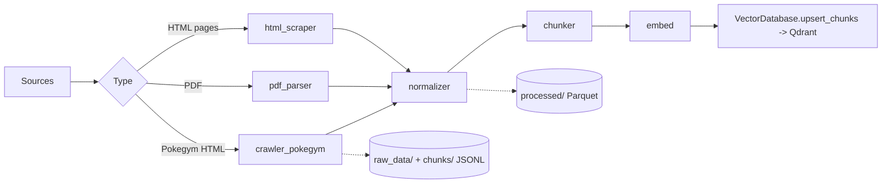
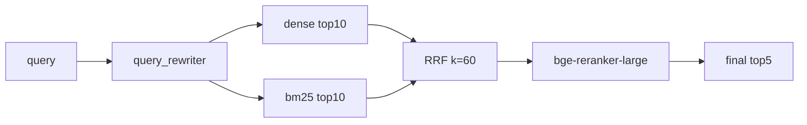
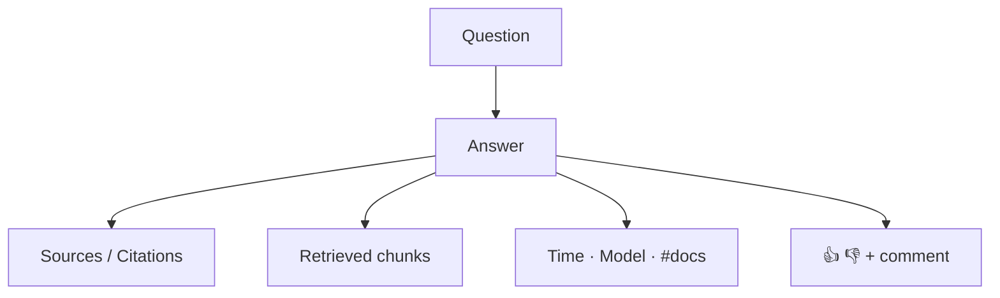

# FunctionalRequirements.md — Functional Specifications

> Part of the [Engineering Harness](../README.md) · Expands [../00_project/REQUIREMENTS.md](../00_project/REQUIREMENTS.md) · Siblings: [Architecture.md](./Architecture.md) · [DomainModel.md](./DomainModel.md) · [APIContracts.md](./APIContracts.md) · [NonFunctionalRequirements.md](./NonFunctionalRequirements.md)

## Objective

Expand each functional `REQ-###` from [REQUIREMENTS.md](../00_project/REQUIREMENTS.md) into a testable functional specification, grouped by module (Ingestion, Retrieval, RAG/LLM, UI, Feedback), with inputs, processing, outputs, error handling, and acceptance criteria.

## Scope

- **In scope:** functional REQs REQ-001 … REQ-014 (plus retrieval/LLM evaluation REQ-018/019 where they define functional behavior).
- **Out of scope:** non-functional REQs (REQ-015/016/017/020) — see [NonFunctionalRequirements.md](./NonFunctionalRequirements.md).

### Traceability convention
Each spec links its `REQ-###` to sprint/task/test IDs following the harness convention (`SPRINT_##`, `TASK-###`, `TEST-###`) defined in the [brief](../README.md). Task specs live under `docs/03_tasks/`, tests under `docs/04_tests/`.

| Module | REQs covered | Owning code package |
| :--- | :--- | :--- |
| Ingestion | REQ-001, REQ-002, REQ-003, REQ-004, REQ-005 | `ingestion/*`, `storage/vector_db.py` |
| Retrieval | REQ-006, REQ-007, REQ-008, REQ-009, REQ-010, REQ-018 | `retrieval/*` |
| RAG / LLM | REQ-011, REQ-012, REQ-019 | `llm/*` |
| UI | REQ-013 | `ui/streamlit_app.py`, `api/*` |
| Feedback | REQ-014 | `monitoring/feedback_store.py`, `storage/relational_db.py` |

---

## 1. Ingestion Module

Automated pipeline (`ingestion/pipeline.py`) that satisfies "automated ingestion with a special tool" for full marks.

### REQ-001 — Scrape Pokegym rulings
| Aspect | Specification |
| :--- | :--- |
| **Input** | URL `https://compendium.pokegym.net/all-rulings-by-date/` |
| **Processing** | Crawl ruling pages; extract `date`, `set`, `card`, `question`, `answer`, `url`; build `Document` with `source=POKEGYM`, `rule_type=RULING`, `card_name`, `publication_date`, `source_url`. |
| **Output** | Raw HTML in `raw_data/html/`; structured records as JSONL in `raw_data/json/`. |
| **Errors** | Network/parse failure → `IngestionError`; per-page failures logged and skipped (partial success allowed). |
| **Acceptance** | AC: all reachable rulings captured; each record has non-empty `question`+`answer`+`source_url`. |
| **Trace** | SPRINT_02 · TASK (crawler) · TEST-* (`test_extract_question`, `test_extract_answer`, `test_missing_fields`) |

### REQ-002 — Download & parse 5 official PDFs
| Aspect | Specification |
| :--- | :--- |
| **Input** | Rulebook, Tournament Handbook, Alt-Play Handbook, Deck List Guide, Errata PDFs (URLs in [PROJECT.md](../00_project/PROJECT.md) §3). |
| **Processing** | Download to `raw_data/pdfs/`; extract text+layout via PyMuPDF/pymupdf4llm preserving structure; record `page_number`, `section_title`; set `source`/`rule_type` per document. |
| **Output** | `Document` per PDF with page-attributed content. |
| **Errors** | Download failure → `IngestionError`; unparsable page logged, page skipped. |
| **Acceptance** | 100% of the 5 PDFs downloaded and parsed; `page_number` populated on chunks. |
| **Trace** | SPRINT_02 · TEST-* (PDF parser) |

### REQ-003 — Scrape HTML rule pages
| Aspect | Specification |
| :--- | :--- |
| **Input** | Ban List, Promo Legality, Mega Rules URLs. |
| **Processing** | requests + BeautifulSoup; map to `source` (`BAN_LIST_HTML`/`PROMO_LEGALITY_HTML`/`MEGA_RULES_HTML`) and `rule_type` (`BAN_STATUS`/`PROMO_STATUS`/`MECHANIC_RULE`); compute `checksum`. |
| **Output** | `Document`s + raw HTML in `raw_data/html/`. |
| **Errors** | `IngestionError` on fetch failure; unchanged `checksum` → skip re-index (idempotent). |
| **Acceptance** | 3 pages captured; re-run with unchanged content produces no duplicate chunks. |
| **Trace** | SPRINT_02 |

### REQ-004 — Normalize & chunk with metadata
| Aspect | Specification |
| :--- | :--- |
| **Input** | `Document` objects. |
| **Processing** | Clean text; split into `Chunk`s with `token_count`; propagate `DocumentMetadata`; assign deterministic `chunk_id`/`doc_id` (see [DomainModel.md](./DomainModel.md) §5). |
| **Output** | `Chunk`s persisted as JSONL in `chunks/` (schema in [DataModel.md](./DataModel.md)). |
| **Errors** | Segmentation failure → `ChunkingError`. |
| **Acceptance** | Every chunk carries full metadata + valid `doc_id`; chunk sizes match configured strategy. |
| **Trace** | SPRINT_03 · TEST-* (`test_chunk_size`, `test_overlap`, `test_preserve_metadata`, `test_empty_document`, `test_unicode`) |

### REQ-005 — Index into Qdrant
| Aspect | Specification |
| :--- | :--- |
| **Input** | Embedded `Chunk`s (`embedding` length = `EMBEDDING_DIMENSION` 1024). |
| **Processing** | `VectorDatabase.init_collection` (Cosine); `upsert_chunks` → `PointStruct(id=chunk_id, vector=embedding, payload={text, doc_id, source, document_title, page_number, rule_type, card_name})`. Chunks without embedding are skipped. |
| **Output** | Populated `pokemon_tcg_rules` collection. |
| **Errors** | Connection/op failure → `VectorDBError`. |
| **Acceptance** | Indexed point count == embedded chunk count; upsert is idempotent by `chunk_id`. |
| **Trace** | SPRINT_03 · Integration TEST-* (download→parse→chunk→embed→vectorDB) |

---

## 2. Retrieval Module

Four strategies plus query rewriting; the best strategy is selected by evaluation (REQ-018). Defaults from `settings.py`: dense/BM25 top-k = 10, RRF k = 60, final top-k = 5.

### REQ-006 — Dense retrieval
| Aspect | Specification |
| :--- | :--- |
| **Input** | Query text → embedded with `BAAI/bge-large-en-v1.5` (1024-d). |
| **Processing** | `VectorDatabase.search_dense(query_vector, top_k=10)` (Cosine). |
| **Output** | `RetrievedChunk[]` with `retrieval_method="dense"`, `score` = cosine similarity. |
| **Errors** | On Qdrant error, `search_dense` logs and returns `[]` (degrade, not crash). |
| **Acceptance** | Returns <=`RETRIEVAL_TOP_K_DENSE` results; reconstructed chunks carry payload metadata. |
| **Trace** | SPRINT_04 · REQ-018 eval |

### REQ-007 — BM25 lexical retrieval
| Aspect | Specification |
| :--- | :--- |
| **Input** | Query text; corpus of chunk texts. |
| **Processing** | `rank-bm25` scoring over the chunk corpus; top 10. |
| **Output** | `RetrievedChunk[]` with `retrieval_method="bm25"`. |
| **Errors** | `RetrievalError` on scoring failure. |
| **Acceptance** | Returns <=`RETRIEVAL_TOP_K_BM25` ranked by BM25 score. |
| **Trace** | SPRINT_04 |

### REQ-008 — Hybrid search (RRF)
| Aspect | Specification |
| :--- | :--- |
| **Input** | Dense + BM25 ranked lists. |
| **Processing** | Reciprocal Rank Fusion: `score = Σ 1/(k + rank)`, `k=RETRIEVAL_HYBRID_RRF_K` (60). |
| **Output** | Fused `RetrievedChunk[]`, `retrieval_method="hybrid"`. |
| **Errors** | `RetrievalError`. |
| **Acceptance** | Fusion is order-independent and deterministic for equal inputs. |
| **Trace** | SPRINT_04 · best-practice point (hybrid) |

### REQ-009 — Cross-encoder reranking
| Aspect | Specification |
| :--- | :--- |
| **Input** | Hybrid candidate list. |
| **Processing** | `BAAI/bge-reranker-large` scores (query, chunk) pairs; keep `RETRIEVAL_FINAL_TOP_K` (5). |
| **Output** | `RetrievedChunk[]`, `retrieval_method="reranked"`. |
| **Errors** | `RetrievalError`; on reranker failure, fall back to hybrid ordering. |
| **Acceptance** | Exactly <=5 chunks returned to the LLM; ordering by rerank score. |
| **Trace** | SPRINT_04 · best-practice point (reranking) |

### REQ-010 — LLM query rewriting
| Aspect | Specification |
| :--- | :--- |
| **Input** | Raw user question. |
| **Processing** | `retrieval/query_rewriter.py` calls the LLM to expand into a rules-focused query (e.g. "Can I use this card?" → "Pokemon card legality regarding <card>"). |
| **Output** | `rewritten_query` string used for retrieval; surfaced in `AnswerResponse.rewritten_query`. |
| **Errors** | On LLM failure, fall back to the original query (no hard failure). |
| **Acceptance** | `rewritten_query` populated and used by retrieval; original preserved in `query`. |
| **Trace** | SPRINT_05 · best-practice point (query rewriting) |

### REQ-018 — Retrieval evaluation
| Aspect | Specification |
| :--- | :--- |
| **Input** | 100-question benchmark with expected sources (`evaluation/dataset.py`). |
| **Processing** | Run Dense vs BM25 vs Hybrid vs Reranked; compute Recall@5, Recall@10, MRR, Hit Rate (`evaluation/metrics.py`). |
| **Output** | Comparison report; best strategy selected for production. |
| **Acceptance** | All four strategies scored; winner documented (see [EvaluationPlan.md](./EvaluationPlan.md)). |
| **Trace** | SPRINT_07 |

---

## 3. RAG / LLM Module

### REQ-011 — Certified-Judge grounded persona
| Aspect | Specification |
| :--- | :--- |
| **Input** | User query + final top-5 `RetrievedChunk`s. |
| **Processing** | `llm/prompts.py` builds the Certified-Judge prompt: answer only from provided context, always cite, say "I don't know" if unsupported, never invent rules. `llm/client.py` calls OpenAI-compatible model (`OPENAI_MODEL_NAME`=`gpt-4o-mini`, `OPENAI_TEMPERATURE`=0.0). |
| **Output** | Grounded `answer` string inside `AnswerResponse`. |
| **Errors** | `LLMProviderError` on provider failure → HTTP 500 at API boundary. |
| **Acceptance** | With empty/irrelevant context, model responds "I don't know"; no ungrounded claims. |
| **Trace** | SPRINT_05 · TEST-* (no-hallucination) |

### REQ-012 — Mandatory citations
| Aspect | Specification |
| :--- | :--- |
| **Input** | Chunks used to generate the answer. |
| **Processing** | Populate `AnswerResponse.citations: list[DocumentMetadata]` (source, title, page, rule_type, card_name). |
| **Output** | Citations rendered in UI/API (`CitationSchema`). |
| **Errors** | If a substantive answer lacks citations → treat as invalid (regression test guard). |
| **Acceptance** | Every non-"I don't know" answer has >=1 citation with source + title. |
| **Trace** | SPRINT_05 · TEST-* (`test_source_citations`) |

### REQ-019 — LLM output evaluation
| Aspect | Specification |
| :--- | :--- |
| **Input** | Benchmark Q&A + generated answers. |
| **Processing** | Compare Prompt A vs Prompt B and `gpt-4o-mini` vs `gpt-4.1-mini`; score Faithfulness, Correctness, Citation Quality, Completeness via RAGAS/DeepEval. |
| **Output** | Comparative report; best prompt+model chosen. |
| **Acceptance** | Multiple prompts/models evaluated; winner documented. |
| **Trace** | SPRINT_07 · [EvaluationPlan.md](./EvaluationPlan.md) |

---

## 4. UI Module — REQ-013

| Aspect | Specification |
| :--- | :--- |
| **Input** | User question typed in Streamlit (`ui/streamlit_app.py`). |
| **Processing** | Call `POST /api/v1/query`; render answer, citations (sources), retrieved chunks, and display metrics: latency (`latency_seconds`), `model_name`, number of retrieved chunks. Present 👍/👎 + optional comment controls. |
| **Output** | Rendered answer view + feedback widget. |
| **Errors** | API error → user-facing error banner; UI stays responsive. |
| **Acceptance** | Answer, sources, chunks, timing, model, and doc-count all visible; feedback controls present. |
| **Trace** | SPRINT_06 · E2E TEST-* |

---

## 5. Feedback Module — REQ-014

| Aspect | Specification |
| :--- | :--- |
| **Input** | `POST /api/v1/feedback` `{query, answer, rating(+1/-1), comment?, model_name, latency_seconds}`. |
| **Processing** | `routes.submit_feedback` → `FeedbackStore.submit_feedback` builds `FeedbackRecord` (server-generated `feedback_id`) → `RelationalDatabase.save_feedback` → `user_feedback` table; `MetricsCollector.record_feedback(rating)` updates Prometheus. |
| **Output** | `201 Created` `{"status":"success","message":"Feedback recorded successfully."}`. |
| **Errors** | DB failure is caught and logged (rollback) inside `save_feedback`; API still returns success + records the metric (best-effort persistence). |
| **Acceptance** | Positive/negative feedback persisted and reflected in Grafana; comment optional. |
| **Trace** | SPRINT_06 · REQ-015 dashboard · TEST-* |

---

## Acceptance Criteria (roll-up)

| REQ | Key acceptance | Test convention |
| :--- | :--- | :--- |
| REQ-001..003 | All official sources ingested; idempotent by checksum | Integration TEST-* |
| REQ-004..005 | Full metadata on every chunk; indexed count == embedded count | Unit + Integration |
| REQ-006..009 | 4 strategies return bounded, ranked results; final top-5 | Unit + eval |
| REQ-010 | Rewrite used, original preserved | Unit |
| REQ-011..012 | Grounded answer + >=1 citation, else "I don't know" | Unit + E2E |
| REQ-013 | UI shows answer/sources/chunks/timing/model/#docs + feedback | E2E |
| REQ-014 | Feedback persisted to Postgres + Prometheus | Integration |

## Cross-references
- Endpoint contracts: [APIContracts.md](./APIContracts.md)
- Domain entities: [DomainModel.md](./DomainModel.md)
- Component/flow diagrams: [Architecture.md](./Architecture.md)
- SLAs & quality gates: [NonFunctionalRequirements.md](./NonFunctionalRequirements.md)
