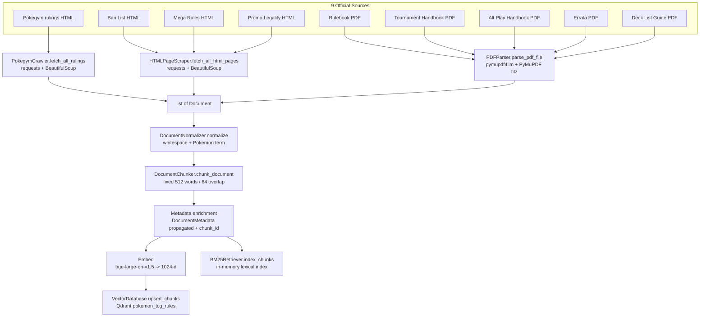
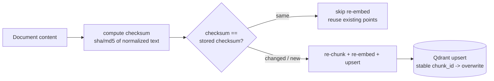

# IndexingPipeline.md - Ingestion & Indexing Pipeline

## Objective

Specify the **offline** pipeline that turns the 9 official Pokemon TCG sources into an
embedded, searchable knowledge base: Download -> Parse (HTML / PDF) -> Normalize -> Chunk
-> Metadata enrichment -> Embed -> Qdrant upsert (plus the in-memory BM25 corpus). This is
the automated-ingestion evidence for the rubric and the producer of every `Chunk` consumed
by [`RetrievalPipeline.md`](./RetrievalPipeline.md).

## Scope

- **In scope:** per-source acquisition & parsing, normalization, chunking rules, metadata
  enrichment, embedding + upsert, directory layout, idempotency/checksum re-index policy.
- **Out of scope:** query-time retrieval ([`RetrievalPipeline.md`](./RetrievalPipeline.md)),
  the embedding-model comparison itself ([`EmbeddingStrategy.md`](./EmbeddingStrategy.md)),
  and the orchestrator decision ([`ADR_006_INGESTION_ORCHESTRATOR.md`](../04_decisions/ADR_006_INGESTION_ORCHESTRATOR.md)).

Implements [REQ-001](../00_project/REQUIREMENTS.md)–[REQ-005](../00_project/REQUIREMENTS.md);
proves [SC-015](../00_project/SUCCESS_CRITERIA.md) (100% of 9 sources indexed).

---

## 1. Flowchart



The coordinator is
[`ingestion/pipeline.py`](../../src/pokemon_tcg_rag/ingestion/pipeline.py)
(`IngestionPipeline.run`): it fetches Pokegym docs, HTML-page docs (PDFs parsed via
`PDFParser`), then for each `Document` runs `normalizer.normalize` -> `chunker.chunk_document`,
accumulating a `list[Chunk]`. Embedding + Qdrant upsert + BM25 indexing are the terminal
steps wiring the output into the retrieval layer.

---

## 2. Per-Source Handling

The 9 sources map to three acquisition paths and enum values from
[`domain/models.py`](../../src/pokemon_tcg_rag/domain/models.py) (`DocumentSource`, `RuleType`).

| # | Source | `DocumentSource` | Parser / module | `RuleType` | Chunking rule |
| :- | :--- | :--- | :--- | :--- | :--- |
| 1 | Pokegym rulings compendium | `POKEGYM` | `PokegymCrawler` (BeautifulSoup: `div.ruling` -> `question`/`answer`/`date`/`card`) | `RULING` | **1 Q+A per chunk** — each ruling becomes one `Document` (`Question: ...\nAnswer: ...`); short enough to stay a single chunk |
| 2 | Rulebook | `RULEBOOK_PDF` | `PDFParser` (`pymupdf4llm.to_markdown` + `fitz` page text) | `GENERAL_RULE` | **section -> paragraph -> chunk**: one `Document` per page, then fixed windowing |
| 3 | Tournament Handbook | `TOURNAMENT_HANDBOOK_PDF` | `PDFParser` | `TOURNAMENT_RULE` | page -> fixed windowing |
| 4 | Alternative Play Handbook | `ALT_PLAY_HANDBOOK_PDF` | `PDFParser` | `GENERAL_RULE` | page -> fixed windowing |
| 5 | TCG Errata | `ERRATA_PDF` | `PDFParser` | `ERRATA` | page -> fixed windowing (errata entries kept together) |
| 6 | Deck List Guide | `DECK_LIST_GUIDE_PDF` | `PDFParser` | `TOURNAMENT_RULE` | page -> fixed windowing |
| 7 | Banned Card List | `BAN_LIST_HTML` | `HTMLPageScraper` (`main`/`article`/`body` text) | `BAN_STATUS` | full page -> fixed windowing |
| 8 | Mega Evolution Rules | `MEGA_RULES_HTML` | `HTMLPageScraper` | `MECHANIC_RULE` | full page -> fixed windowing |
| 9 | Promo Legality Status | `PROMO_LEGALITY_HTML` | `HTMLPageScraper` | `PROMO_STATUS` | full page -> fixed windowing |

The PDF source registry (URL, `DocumentSource`, `RuleType`) lives in
`PDFParser.PDF_SOURCES`; the HTML registry in `HTMLPageScraper.TARGET_PAGES`; all URLs
match [`PROJECT.md`](../00_project/PROJECT.md) §3 verbatim.

### 2.1 Chunking mechanics (current implementation)

`DocumentChunker(chunk_size=512, chunk_overlap=64)` splits `document.content` on
whitespace and slides a `512`-word window with `64`-word overlap
(`start += chunk_size - chunk_overlap`, i.e. stride 448). Each chunk gets:

- `chunk_id = f"{doc_id}_chunk_{md5(doc_id_idx_text[:50])[:8]}"` (deterministic).
- `token_count = len(segment_words)`.
- `metadata` = the parent `Document`'s `DocumentMetadata` (propagated verbatim).

> **Design vs implementation note ([`Assumptions.md`](../00_project/Assumptions.md) / [`ADR_003_CHUNKING.md`](../04_decisions/ADR_003_CHUNKING.md)):**
> the plan specifies *source-aware* chunking (Pokegym = one Q+A chunk; Rulebook =
> section -> paragraph -> chunk). Today this is achieved at the **Document boundary**
> (the crawler emits one Q+A `Document`; the PDF parser emits one `Document` per page)
> combined with a **uniform fixed 512/64 windower**. Because a Pokegym Q+A is short, it
> yields a single chunk in practice. A dedicated semantic/section splitter is the
> chunk-size experiment tracked in [`EmbeddingStrategy.md`](./EmbeddingStrategy.md) §5 and
> ADR_003. `token_count` currently counts whitespace words, not model tokens.

---

## 3. Normalization

[`ingestion/normalizer.py`](../../src/pokemon_tcg_rag/ingestion/normalizer.py) `DocumentNormalizer.normalize`:

1. Collapse 3+ newlines to a blank line (`\n{3,}` -> `\n\n`).
2. Collapse runs of spaces/tabs (`[ \t]+` -> single space).
3. Standardize terminology: `"Pokémon"` -> `"Pokemon"` (accent-free, matches BM25
   lowercase tokenization and query normalization).
4. `strip()` leading/trailing whitespace.

Metadata is preserved unchanged; only `content` is rewritten.

---

## 4. Metadata Enrichment

Every chunk carries the full `DocumentMetadata` schema:

| Field | Type | Set by |
| :--- | :--- | :--- |
| `source` | `DocumentSource` | parser/crawler |
| `document_title` | `str` | parser/crawler |
| `page_number` | `int \| None` | `PDFParser` (`page_num + 1`) |
| `section_title` | `str \| None` | reserved for section-aware chunking |
| `card_name` | `str \| None` | `PokegymCrawler` (`span.card`) |
| `rule_type` | `RuleType` | per-source mapping (§2) |
| `publication_date` | `str \| None` | `PokegymCrawler` (`span.date`) |
| `source_url` | `str \| None` | parser/crawler |
| `checksum` | `str \| None` | idempotency (see §6) |

On upsert, `VectorDatabase.upsert_chunks` writes a filterable payload:
`text`, `doc_id`, `source`, `document_title`, `page_number`, `rule_type`, `card_name` —
the fields used for citations and metadata filtering
([`RetrievalPipeline.md`](./RetrievalPipeline.md) §7).

---

## 5. Directory Layout

Per the plan and `config/settings.py` (`DATA_RAW_DIR`, `DATA_PROCESSED_DIR`, `DATA_CHUNKS_DIR`):

```
data/
├── raw_data/
│   ├── pdfs/      # downloaded official PDFs (rulebook, tournament, alt-play, errata, deck-list)
│   ├── html/      # raw HTML of ban list / mega rules / promo legality
│   └── json/      # raw Pokegym rulings (PokegymCrawler.raw_output_dir)
├── processed/     # normalized Document objects (JSONL)
└── chunks/        # final Chunk records with metadata (JSONL / Parquet)
```

Stage outputs are persisted as JSONL/Parquet so the pipeline is resumable and auditable,
and so the evaluation harness ([`EvaluationPlan.md`](./EvaluationPlan.md)) can read a
frozen chunk set.

---

## 6. Idempotency & Checksum Re-Index Strategy

The HTML sources (ban list, promo legality, mega rules) change over time, so re-ingestion
must be safe to run repeatedly.



- **Stable IDs:** `chunk_id` is a deterministic md5 of `doc_id + index + text-prefix`, so
  re-upserting an unchanged chunk **overwrites the same Qdrant point** rather than
  duplicating (`upsert` is idempotent on `id`).
- **Checksum gate:** `DocumentMetadata.checksum` stores the content hash; a source is
  re-embedded only when its checksum differs from the stored one — avoiding needless
  embedding cost on unchanged official PDFs.
- **Deterministic re-runs:** normalization + fixed chunking + stable IDs mean the same
  input always yields the same chunk set.

---

## 7. Failure Handling

| Failure | Behavior | Source |
| :--- | :--- | :--- |
| Network / HTTP error (Pokegym) | Logged warning, returns collected docs so far | `crawler_pokegym.py` `except` |
| HTTP error on an HTML page | Logged warning, that page skipped, others continue | `html_scraper.py` per-target `try` |
| PDF file missing | Error logged, empty doc list for that file | `pdf_parser.py` `path.exists()` guard |
| PDF parse error | Error logged, file skipped | `pdf_parser.py` `except` |
| Empty document content | Chunker returns `[]` (no words) | `chunker.py` guard |

Per-source isolation means one failing source never aborts the whole run — supporting the
"0 hard failures" acceptance target.

---

## 8. Acceptance Criteria

| Criterion | Target | Linked SC |
| :--- | :--- | :--- |
| All 9 official sources ingested | 100%; `sources_expected == sources_indexed` | [SC-015](../00_project/SUCCESS_CRITERIA.md) |
| No hard failures | 0 uncaught exceptions abort the run | this doc §7 |
| Chunk count per source | > 0 for every source | [SC-015](../00_project/SUCCESS_CRITERIA.md) |
| Full ingestion timing | Per plan Sprint acceptance (< 30 s per PDF parse target) | [`SPRINT_02`](../02_sprints/SPRINT_02_INGESTION.md) |
| Idempotent re-run | Re-running produces no duplicate Qdrant points | this doc §6 |
| Metadata completeness | Every chunk has `source`, `document_title`, `rule_type` | §4 |

---

## Cross-References

- [`RAGArchitecture.md`](./RAGArchitecture.md) — where indexing feeds retrieval.
- [`RetrievalPipeline.md`](./RetrievalPipeline.md) — consumers of the chunk corpus.
- [`EmbeddingStrategy.md`](./EmbeddingStrategy.md) — embedding + chunk-size experiments.
- [`DataModel.md`](./DataModel.md) — Qdrant payload / Parquet schema.
- [`DomainModel.md`](./DomainModel.md) — `Document`, `Chunk`, `DocumentMetadata`.
- ADRs: [`ADR_003_CHUNKING.md`](../04_decisions/ADR_003_CHUNKING.md) ·
  [`ADR_006_INGESTION_ORCHESTRATOR.md`](../04_decisions/ADR_006_INGESTION_ORCHESTRATOR.md).
- [`REQUIREMENTS.md`](../00_project/REQUIREMENTS.md) · [`SUCCESS_CRITERIA.md`](../00_project/SUCCESS_CRITERIA.md).
