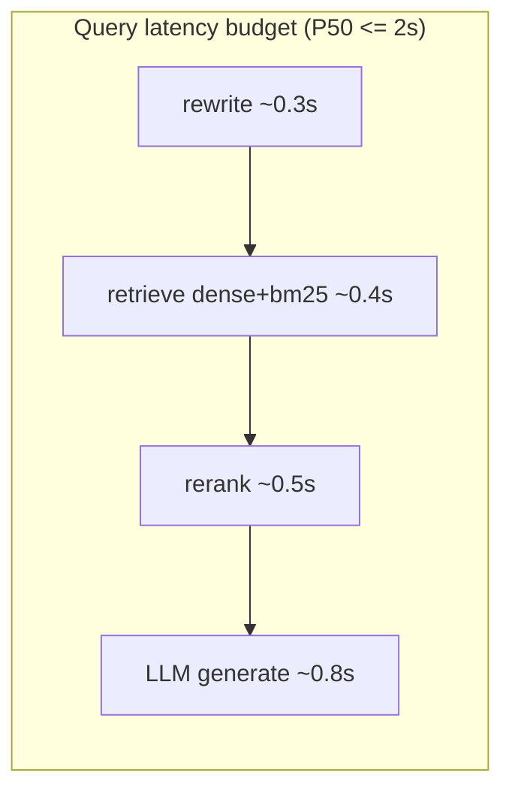

# NonFunctionalRequirements.md — Non-Functional Requirements

> Part of the [Engineering Harness](../README.md) · Complements [FunctionalRequirements.md](./FunctionalRequirements.md) · Extends REQ-015/016/017/020 from [../00_project/REQUIREMENTS.md](../00_project/REQUIREMENTS.md) · Security detail in [Security.md](./Security.md)

## Objective

Define the measurable quality attributes of the Pokemon TCG RAG system — performance/latency SLAs, scalability, availability, reproducibility, maintainability, portability, cost, test coverage, and security posture — each with a target and a verification method, traced to functional REQs.

## Scope

- **In scope:** system-wide NFRs (NFR-001 … NFR-014) and their verification.
- **Out of scope:** functional behavior (see [FunctionalRequirements.md](./FunctionalRequirements.md)); detailed security controls (see [Security.md](./Security.md)).

---

## 1. NFR Matrix

| NFR-### | Category | Requirement | Target | Verification | Linked REQ |
| :--- | :--- | :--- | :--- | :--- | :--- |
| **NFR-001** | Performance (latency) | End-to-end query P50 | <= 2.0 s | Load test / Prometheus histogram on `latency_seconds` | REQ-006..012 |
| **NFR-002** | Performance (latency) | Query P95 | <= 4.0 s | Load test (see [../04_tests/PERFORMANCE.md] equivalent) | REQ-006..012 |
| **NFR-003** | Performance (latency) | Query P99 | <= 6.0 s | Load test | REQ-006..012 |
| **NFR-004** | Performance (retrieval) | Reranker stage overhead | <= 800 ms for 20 candidates | Micro-benchmark | REQ-009 |
| **NFR-005** | Scalability | Vector index capacity | >= 50k chunks, sub-linear dense search | Qdrant benchmark @ 1k/5k/10k docs | REQ-005 |
| **NFR-006** | Scalability | API concurrency | >= 20 concurrent queries without error-rate increase | Concurrency load test | REQ-013 |
| **NFR-007** | Availability | Health liveness | `GET /health` returns `healthy`; used as compose/orchestrator probe | Smoke test | REQ-016 |
| **NFR-008** | Availability | Graceful degradation | Qdrant failure returns `[]` (no crash); LLM failure → 500, service stays up | Fault-injection test | REQ-006/011 |
| **NFR-009** | Reproducibility | Deterministic env | Pinned dependency versions; `.env`-driven config; `docker compose up` one-command bring-up | Clean-clone rebuild | REQ-016 |
| **NFR-010** | Reproducibility | Deterministic generation | `OPENAI_TEMPERATURE=0.0` for evaluation runs | Config audit | REQ-011/019 |
| **NFR-011** | Maintainability | Clean Architecture + typing; no hardcoded config | 0 layer violations; all config via `get_settings()`; mypy strict | mypy + import-linter in CI | REQ-016/017 |
| **NFR-012** | Maintainability | Test coverage | >= 90% unit + integration | `pytest --cov` gate in CI | **REQ-017** |
| **NFR-013** | Portability | Containerized, OS-agnostic | Runs on any Docker host; optional cloud (Render/Railway/AWS) | Deploy to a second host | REQ-016/020 |
| **NFR-014** | Cost | Bounded LLM/embedding cost | Default `gpt-4o-mini`; local BGE embeddings/reranker (no per-call cost) | Cost review | REQ-006/011 |
| **NFR-015** | Security | See [Security.md](./Security.md) | Secrets via `.env`, input sanitization, least-privilege | Security review | REQ-016 |

---

## 2. Performance & Latency SLAs

| Percentile | Target | Instrument |
| :--- | :--- | :--- |
| P50 | <= 2.0 s | `MetricsCollector.record_query(latency=…)` → Prometheus histogram |
| P95 | <= 4.0 s | Prometheus `histogram_quantile(0.95, …)` |
| P99 | <= 6.0 s | Prometheus `histogram_quantile(0.99, …)` |

`latency_seconds` is measured end-to-end in `AnswerResponse` and recorded for every `/query` call (see [Architecture.md](./Architecture.md) §4). SLA targets align with the plan's "tempo médio < 2 segundos" success criterion.

---

## 3. Scalability & Availability

- **Vector search** scales via Qdrant HNSW; capacity target 50k+ chunks (NFR-005). Benchmark at 1k/5k/10k docs mirrors the plan's PERFORMANCE benchmarks.
- **Stateless API**: the FastAPI service holds no per-user state, enabling horizontal scaling behind a load balancer (NFR-006).
- **Graceful degradation** (NFR-008): `VectorDatabase.search_dense` catches exceptions and returns `[]` rather than propagating, so a transient Qdrant issue yields an "I don't know" answer instead of a 5xx. `save_feedback` swallows/rolls back DB errors so feedback submission never breaks the UX.
- **Liveness** (NFR-007): `GET /health` → `HealthResponse{status:"healthy", version:"0.1.0"}`, used as the container health probe.

---

## 4. Reproducibility

| Control | Mechanism |
| :--- | :--- |
| One-command bring-up | `docker compose up` starts all services (REQ-016) |
| Pinned versions | All dependencies version-locked (targets Reproducibility rubric = 2 pts) |
| Config via env | `Settings` (pydantic-settings) loads `.env`; no hardcoded hosts/keys/models |
| Deterministic LLM | `OPENAI_TEMPERATURE=0.0` |
| Accessible data | Automated ingestion re-fetches all official sources from public URLs |

---

## 5. Maintainability & Coverage

- **Clean Architecture** dependency rules enforced (see [Architecture.md](./Architecture.md) §3); domain layer has zero outward imports.
- **Type safety**: full type hints; mypy in the quality gate.
- **Coverage >= 90%** (NFR-012 / **REQ-017**) enforced by `pytest --cov` in CI; every public class has tests; every fixed bug gets a regression test (per the plan's TDD rules).
- **No hardcoded values**: all configuration flows from `.env` through `get_settings()`.

---

## 6. Portability & Cost

- **Portability** (NFR-013): the entire stack is containerized and OS-agnostic; optional cloud deployment (Render/Railway/AWS) targets the bonus rubric (REQ-020). See [Deployment.md](./Deployment.md).
- **Cost** (NFR-014): local open-weight models (`BAAI/bge-large-en-v1.5` embeddings, `BAAI/bge-reranker-large` reranker) incur no per-call fees; only the OpenAI-compatible generation model (`gpt-4o-mini`) has marginal cost, minimized by small final context (top-k=5) and temperature 0.

---

## 7. Security Posture (summary)

Full policy in [Security.md](./Security.md). Key NFR-level controls:

| Control | Requirement |
| :--- | :--- |
| Secrets | `OPENAI_API_KEY`, `QDRANT_API_KEY`, Postgres credentials only via `.env` / env vars — never committed |
| Input handling | Sanitize/limit `question` length; `top_k` constrained (`ge=1, le=20` in `QueryRequest`) |
| Grounding | Judge persona prevents ungrounded output (defense against prompt-injection producing invented rules) |
| Least privilege | Postgres app user scoped to `user_feedback`; Qdrant API key optional-gated |
| Transport | HTTPS termination at the edge in cloud deploys |

---

## Acceptance Criteria

| # | Criterion | Verified by |
| :--- | :--- | :--- |
| AC-1 | P50/P95/P99 within NFR-001..003 on the benchmark load. | Load test + Prometheus |
| AC-2 | Coverage report >= 90%. | CI `pytest --cov` (REQ-017) |
| AC-3 | Clean-clone `docker compose up` reproduces the running system. | Reproducibility check (REQ-016) |
| AC-4 | Qdrant/LLM fault injection does not crash the API. | Fault-injection test (NFR-008) |
| AC-5 | No secret or host is hardcoded outside `.env`/settings. | Security review (REQ-016) |

## Cross-references
- Functional behavior: [FunctionalRequirements.md](./FunctionalRequirements.md)
- Deployment topology: [Architecture.md](./Architecture.md) §2 · [Deployment.md](./Deployment.md)
- Security: [Security.md](./Security.md)
- Observability instruments: [Observability.md](./Observability.md)
