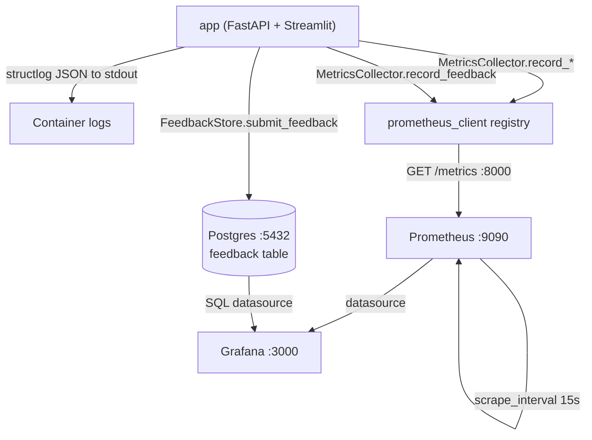
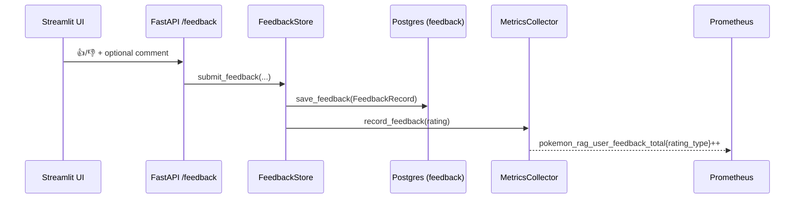

# Observability.md — Prometheus Metrics, Grafana Dashboards & Structured Logging

## Objective

Define the **observability stack** for the Pokemon TCG RAG system: structured JSON logging,
the Prometheus metrics catalog, the Grafana dashboard specification (≥ 6 panels), and the
feedback pipeline into PostgreSQL. Grounded in `monitoring/logger.py`,
`monitoring/metrics_collector.py`, `monitoring/feedback_store.py`,
[`config/prometheus.yml`](../../config/prometheus.yml),
[`config/grafana/dashboards.json`](../../config/grafana/dashboards.json), and
[`docker-compose.yml`](../../docker-compose.yml).

## Scope

- **In scope:** logging fields, metrics catalog, dashboard panels + PromQL/SQL, feedback
  pipeline, telemetry flow.
- **Out of scope:** evaluation metrics ([`EvaluationPlan.md`](./EvaluationPlan.md)), network
  exposure of monitoring ports ([`Security.md`](./Security.md) §5,
  [`Deployment.md`](./Deployment.md)).

Satisfies [REQ-015](../00_project/REQUIREMENTS.md) (Prometheus + Grafana ≥ 5 charts),
[REQ-014](../00_project/REQUIREMENTS.md) (feedback), [SC-017](../00_project/SUCCESS_CRITERIA.md),
[SC-018](../00_project/SUCCESS_CRITERIA.md).

---

## 1. Telemetry Flow



Prometheus scrape config ([`config/prometheus.yml`](../../config/prometheus.yml)):
`scrape_interval: 15s`, job `pokemon_rag_app`, `metrics_path: /metrics`, target `app:8000`.

---

## 2. Structured Logging (structlog JSON)

Configured once via `setup_logging()` (`monitoring/logger.py`). Processor chain:
`merge_contextvars` → `add_log_level` → `StackInfoRenderer` → `set_exc_info` →
`TimeStamper(fmt="iso")` → `JSONRenderer`. Level from `settings.LOG_LEVEL` (default `INFO`).

| JSON field | Source | Example |
| :--- | :--- | :--- |
| `event` | log call event name | `"query_served"` |
| `level` | `add_log_level` | `"info"` |
| `timestamp` | `TimeStamper(fmt="iso")` | `"2026-07-23T12:00:00Z"` |
| context vars | `merge_contextvars` (e.g. `request_id`) | `"req_abc123"` |
| custom kv | passed at call site | `model="gpt-4o-mini"`, `latency=1.42`, `num_docs=5` |
| `exception`/`stack` | `set_exc_info` / `StackInfoRenderer` | traceback on error |

Conventions (see [`CodingStandards.md`](./CodingStandards.md) §9): emit **event name +
key/value fields**, never interpolated sentences; never log secrets or full feedback PII
([`Security.md`](./Security.md) §6). JSON lines to stdout are collected by the container
runtime (and are Loki/ELK-ready).

Recommended structured events:

| Event | Emitted at | Key fields |
| :--- | :--- | :--- |
| `query_received` | `/query` entry | `request_id`, `query_len` |
| `query_rewritten` | after rewriter | `request_id`, `rewritten` |
| `retrieval_done` | after hybrid+rerank | `request_id`, `method`, `num_docs` |
| `query_served` | answer returned | `request_id`, `model`, `latency`, `num_docs`, `status` |
| `feedback_submitted` | `/feedback` | `feedback_id`, `rating` |
| `*_error` | any `DomainError` | `error`, relevant ids |

---

## 3. Prometheus Metrics Catalog

Defined in `monitoring/metrics_collector.py` and updated via the `MetricsCollector` helper.

| Metric | Type | Labels | Buckets | Meaning | Updated by |
| :--- | :--- | :--- | :--- | :--- | :--- |
| `pokemon_rag_queries_total` | Counter | `model`, `status` | — | total RAG queries processed | `record_query()` |
| `pokemon_rag_query_latency_seconds` | Histogram | — | `0.1, 0.5, 1.0, 2.0, 5.0, 10.0` | end-to-end query latency | `record_query()` |
| `pokemon_rag_retrieved_docs_count` | Histogram | — | `1, 3, 5, 10, 20` | # context docs retrieved per query | `record_query()` |
| `pokemon_rag_user_feedback_total` | Counter | `rating_type` (`positive`/`negative`) | — | user feedback events by sentiment | `record_feedback()` |

Helper API:
- `MetricsCollector.record_query(model, latency, num_docs, status="success")` →
  increments `queries_total{model,status}`, observes latency + retrieved-docs histograms.
- `MetricsCollector.record_feedback(rating)` → maps `rating > 0` to `positive` else
  `negative`, increments `user_feedback_total{rating_type}`.

Histograms auto-expose `_bucket`, `_sum`, `_count` series used by the PromQL below.

---

## 4. Grafana Dashboard Specification (≥ 6 panels)

Dashboard `pokemon_rag_dash` (title *"Pokemon TCG RAG Expert - Monitoring Dashboard"*),
provisioned from [`config/grafana/dashboards.json`](../../config/grafana/dashboards.json)
(mounted read-only in the `grafana` service; datasource from `config/grafana/datasource.yml`).
`refresh: 5s`. Panels 1–6 exist in the committed JSON; panels 7–8 are the plan-required
Postgres-backed additions.

| # | Panel title | Type | Data source | Query |
| :--- | :--- | :--- | :--- | :--- |
| 1 | Queries processed per day / status | timeseries | Prometheus | `rate(pokemon_rag_queries_total[5m])` by `{{status}}` |
| 2 | Mean query latency (s) | timeseries | Prometheus | `rate(pokemon_rag_query_latency_seconds_sum[5m]) / rate(pokemon_rag_query_latency_seconds_count[5m])` |
| 3 | Retrieved-docs distribution | histogram | Prometheus | `pokemon_rag_retrieved_docs_count_bucket` |
| 4 | User feedback (positive vs negative) | piechart | Prometheus | `pokemon_rag_user_feedback_total` by `{{rating_type}}` |
| 5 | Distribution by LLM model | piechart | Prometheus | `sum(pokemon_rag_queries_total) by (model)` |
| 6 | Latency P95 & P99 | timeseries | Prometheus | `histogram_quantile(0.95\|0.99, sum(rate(pokemon_rag_query_latency_seconds_bucket[5m])) by (le))` |
| 7 | Source distribution (used sources) | barchart / piechart | Postgres (SQL) | see §4.1 |
| 8 | Top questions | table | Postgres (SQL) | see §4.1 |

This satisfies the plan's suggested metrics (queries/day, mean latency, retrieved docs,
positive feedback, negative feedback, source distribution, top questions) and clears the
≥ 5-charts bar with margin ([SC-017](../00_project/SUCCESS_CRITERIA.md)).

Panel-to-plan mapping:

| Plan metric | Panel |
| :--- | :--- |
| Perguntas por dia | 1 |
| Tempo médio | 2 |
| Nº de documentos recuperados | 3 |
| Feedback positivo / negativo | 4 |
| Distribuição das fontes usadas | 7 |
| Top perguntas | 8 |
| (extra) latency P95/P99, model split | 6, 5 |

### 4.1 Postgres-backed panels (panels 7–8)

Backed by the feedback table (`FeedbackRecord` → Postgres). Positive/negative feedback split
(plan lists both) is served by panel 4 from Prometheus **and** cross-checkable in Postgres:

```sql
-- Panel 8: Top questions (most frequently asked)
SELECT query, COUNT(*) AS occurrences
FROM feedback
GROUP BY query
ORDER BY occurrences DESC
LIMIT 10;

-- Feedback sentiment split (Postgres cross-check of panel 4)
SELECT CASE WHEN rating > 0 THEN 'positive' ELSE 'negative' END AS sentiment,
       COUNT(*) AS n
FROM feedback
GROUP BY sentiment;
```

> **Source distribution (panel 7):** answers cite `DocumentMetadata.source`
> (`DocumentSource` enum). To drive panel 7, persist the answer's cited source(s) alongside
> feedback/query logs (e.g. a `sources_used` column or a per-query log table), then:
> `SELECT source, COUNT(*) FROM query_sources GROUP BY source ORDER BY 2 DESC;`. This column
> is a small monitoring extension of the current `feedback` schema — tracked in
> [`Assumptions.md`](../00_project/Assumptions.md) (ASSUMPTION-SRCLOG). Until then, source
> distribution is derivable offline from structured `retrieval_done` logs.

---

## 5. Feedback Pipeline to PostgreSQL

`FeedbackStore.submit_feedback(query, answer, rating, comment, model_name, latency)`
(`monitoring/feedback_store.py`):

1. Builds a `FeedbackRecord` (`domain/models.py`) with `feedback_id = fb_<uuid10>`, `query`,
   `answer`, `rating` (`+1`/`-1`), optional `comment`, `model_name`, `latency_seconds`,
   `created_at`.
2. Persists it via `RelationalDatabase.save_feedback(record)` (storage layer, Postgres).
3. Increments the Prometheus counter via `MetricsCollector.record_feedback(rating)`.



100% of 👍/👎 events must reach Postgres ([SC-018](../00_project/SUCCESS_CRITERIA.md)); the
UI exposes ratings + optional comment ([REQ-014](../00_project/REQUIREMENTS.md)).

---

## 6. Acceptance Criteria

| ID | Criterion | Verified by |
| :--- | :--- | :--- |
| OBS-AC-1 | Logs are structured JSON with level + ISO timestamp | inspect container logs |
| OBS-AC-2 | `/metrics` exposes the 4 catalog metrics; Prometheus scrapes `app:8000` | `curl app:8000/metrics`, Prometheus targets |
| OBS-AC-3 | Grafana dashboard provisioned with ≥ 5 (here ≥ 6) live panels | [SC-017](../00_project/SUCCESS_CRITERIA.md), dashboard JSON |
| OBS-AC-4 | Feedback persisted to Postgres + counter incremented | [SC-018](../00_project/SUCCESS_CRITERIA.md), TEST-023 |
| OBS-AC-5 | No secrets/PII in logs or metrics labels | [`Security.md`](./Security.md) §6 |
| OBS-AC-6 | Latency panels reflect the SLA buckets | [SC-012](../00_project/SUCCESS_CRITERIA.md)/[SC-013](../00_project/SUCCESS_CRITERIA.md) |

---

## Cross-References

- [`Deployment.md`](./Deployment.md) — prometheus/grafana service config & ports.
- [`Security.md`](./Security.md) — monitoring exposure, log redaction, feedback PII.
- [`CodingStandards.md`](./CodingStandards.md) §9 — logging rules.
- [`EvaluationPlan.md`](./EvaluationPlan.md) — offline quality metrics (distinct from runtime).
- [`REQUIREMENTS.md`](../00_project/REQUIREMENTS.md) — REQ-014, REQ-015.
- [`SUCCESS_CRITERIA.md`](../00_project/SUCCESS_CRITERIA.md) — SC-017, SC-018.
