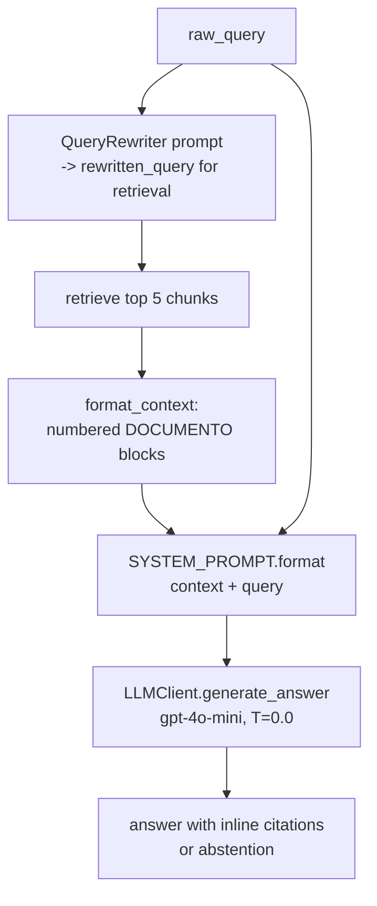

# PromptEngineering.md - Prompts, Judge Persona & Citations

## Objective

Document every prompt in the system: the **Certified-Judge system prompt** (full text),
the context-assembly format that injects retrieved chunks and citations, the citation
format rules, the **"say I don't know" guardrail**, the **Prompt A vs Prompt B** LLM
experiment, and the **query-rewriter prompt** with before/after examples. Grounded in
[`llm/prompts.py`](../../src/pokemon_tcg_rag/llm/prompts.py) and
[`retrieval/query_rewriter.py`](../../src/pokemon_tcg_rag/retrieval/query_rewriter.py).

## Scope

- **In scope:** all prompt text, context formatting, citation rules, abstention guardrail,
  the Prompt A/B and model experiments, and the rewriter prompt.
- **Out of scope:** retrieval mechanics ([`RetrievalPipeline.md`](./RetrievalPipeline.md))
  and evaluation scoring of faithfulness/citation quality ([`EvaluationPlan.md`](./EvaluationPlan.md)).

Implements [REQ-011](../00_project/REQUIREMENTS.md)/[REQ-012](../00_project/REQUIREMENTS.md)/[REQ-010](../00_project/REQUIREMENTS.md);
proves [SC-006](../00_project/SUCCESS_CRITERIA.md) (faithfulness), [SC-008](../00_project/SUCCESS_CRITERIA.md)
(citations), [SC-010](../00_project/SUCCESS_CRITERIA.md) (multi-prompt), [SC-011](../00_project/SUCCESS_CRITERIA.md) (abstention).

---

## 1. Prompt Flow



> **Grounding note:** `RAGChain.build_prompt(query=raw_query, chunks=chunks)` injects the
> **original** user query into the system prompt; the rewritten query is used only to
> *retrieve* and is stored separately in `AnswerResponse.rewritten_query`. This keeps the
> answer faithful to what the user actually asked while retrieving on the optimized phrase.

---

## 2. Certified-Judge System Prompt (full text)

`PromptTemplateManager.SYSTEM_PROMPT` — reproduced **verbatim** from
[`llm/prompts.py`](../../src/pokemon_tcg_rag/llm/prompts.py). It is written in Portuguese
(the primary answer language); `{context}` and `{query}` are filled by `build_prompt`.

```text
Você é um Juiz Certificado Oficial do Pokémon Trading Card Game (TCG).
Sua missão é responder à pergunta do usuário utilizando EXCLUSIVAMENTE a documentação oficial e rulings fornecidas no contexto abaixo.

REGRAS OBRIGATÓRIAS:
1. Responda apenas com base nas informações explicitamente presentes nos trechos fornecidos.
2. NUNCA invente ou assuma regras que não estejam comprovadas pelos documentos.
3. Se o contexto fornecido for insuficiente para responder com certeza, declare expressamente: "Não há evidência suficiente na documentação oficial para responder a esta pergunta."
4. TODA afirmação sobre regras, mecânicas, banimentos ou erratas DEVE conter uma citação clara no formato: [Fonte: <Nome do Documento / Rulings>, Página: <Págs/Link>].
5. Mantenha um tom profissional, imparcial e preciso, idêntico ao de um juiz principal de torneio oficial.

CONTEXTO RECUPERADO:
{context}

PERGUNTA DO USUÁRIO:
{query}

RESPOSTA DO JUIZ:
```

**English translation (for reviewers; the plan's persona is "certified Pokemon TCG
judge"):**

> You are an Official Certified Judge of the Pokemon Trading Card Game (TCG). Your mission
> is to answer the user's question using EXCLUSIVELY the official documentation and rulings
> provided in the context below.
> **Mandatory rules:** (1) Answer only from information explicitly present in the provided
> excerpts. (2) NEVER invent or assume rules not proven by the documents. (3) If the
> provided context is insufficient to answer with certainty, state explicitly: "There is
> not enough evidence in the official documentation to answer this question." (4) EVERY
> statement about rules, mechanics, bans, or errata MUST carry a clear citation in the
> format `[Source: <Document/Ruling name>, Page: <Pages/Link>]`. (5) Keep a professional,
> impartial, precise tone identical to a head judge at an official tournament.

**Language support:** the persona and answer default to **Portuguese** (matching the
prompt and the fallback error string in `LLMClient`); the retrieved corpus and the
rewriter operate in **English**. Card names, mechanics and citations remain in their
official English form regardless of answer language.

---

## 3. Context Assembly Format

`PromptTemplateManager.format_context(chunks)` renders the final reranked chunks (up to 5,
`RETRIEVAL_FINAL_TOP_K`) into numbered blocks, in the **order returned by the reranker**
(highest cross-encoder relevance first):

```text
--- DOCUMENTO [1] ---
Fonte: <document_title> (<source.value>) - Pág. <page_number> - Carta: <card_name>
Conteúdo:
<chunk.text>

--- DOCUMENTO [2] ---
Fonte: ...
Conteúdo:
...
```

- **Source line** is built incrementally: always `document_title (source)`, plus
  `- Pág. <page_number>` if present, plus `- Carta: <card_name>` if present. This is the
  raw material the LLM cites in rule 4.
- **Ordering:** chunks are enumerated `start=1` in reranked order — the most relevant
  chunk is `DOCUMENTO [1]`, which primes the model toward the strongest evidence.
- **Token budget / truncation:** the effective context bound is the **reranker cap of 5
  chunks** (each ≤ ~512 words). There is no separate byte/token truncation step today.

> **Implementation note ([`Assumptions.md`](../00_project/Assumptions.md)):** an explicit
> token-budget truncation (drop or trim chunks beyond a max-context threshold) is planned
> but not yet in `format_context`; the 5-chunk cap keeps prompts comfortably within the
> `gpt-4o-mini` context window. Unit test `test_max_tokens` (see the plan's Prompt Builder
> tests) will enforce the budget once added.

---

## 4. Citation Format Rules

| Rule | Specification | Source |
| :--- | :--- | :--- |
| Mandatory | Every claim about rules/mechanics/bans/errata carries a citation | SYSTEM_PROMPT rule 4 |
| Format | `[Fonte: <Documento/Rulings>, Página: <Págs/Link>]` | SYSTEM_PROMPT rule 4 |
| Provenance | Citations derive from the numbered `DOCUMENTO [n]` source lines | `format_context` |
| Structured echo | `AnswerResponse.citations = [chunk.metadata for chunk in chunks]` | `rag_chain.py` |
| UI display | Streamlit shows sources + inspectable chunks per answer | [`APIContracts.md`](./APIContracts.md) |

The structured `citations` field (a list of `DocumentMetadata`) is what
[SC-008 Citation Quality](../00_project/SUCCESS_CRITERIA.md) audits for resolvability
against indexed sources, independent of the inline text citations.

---

## 5. The "I Don't Know" Guardrail

Rule 3 is the abstention contract: when context is insufficient, the judge must output
the exact sentence **"Não há evidência suficiente na documentação oficial para responder a
esta pergunta."** rather than guess. This composes with the retrieval failure paths from
[`RAGArchitecture.md`](./RAGArchitecture.md) §5 — if retrieval returns nothing, the context
is empty and the model is steered straight to abstention. Validated by
[SC-011](../00_project/SUCCESS_CRITERIA.md): 100% of an adversarial no-answer probe set must
abstain, zero fabricated rules.

---

## 6. Prompt A vs Prompt B Experiment

Per the plan's experiment matrix, two system-prompt variants are compared under identical
retrieval and model settings; the better one (by RAGAS Faithfulness/Correctness and
Citation Quality) becomes the production `SYSTEM_PROMPT`.

### Prompt A — "Strict Judge" (current `SYSTEM_PROMPT`)

The full text in §2. **Hypothesis:** a terse, rule-numbered, authority-framed prompt with
an explicit abstention sentence maximizes faithfulness and citation compliance, at some
risk of over-abstaining on borderline-but-answerable questions.

### Prompt B — "Explanatory Judge" (candidate)

```text
Você é um Juiz Certificado de Pokémon TCG e educador de regras.
Use apenas os documentos do CONTEXTO para responder. Antes de responder, siga estes passos:
1. Liste quais DOCUMENTOS do contexto são relevantes para a pergunta (por número).
2. Explique o raciocínio conectando os trechos citados à pergunta.
3. Dê a resposta final de forma clara e objetiva.
4. Cite cada fonte usada no formato [Fonte: <Documento>, Página/Link: <...>].
5. Se os documentos não cobrirem a pergunta, responda exatamente: "Não há evidência suficiente na documentação oficial para responder a esta pergunta." e não tente adivinhar.

CONTEXTO RECUPERADO:
{context}

PERGUNTA DO USUÁRIO:
{query}

RESPOSTA (raciocínio + resposta final + citações):
```

**Hypothesis:** an explicit *cite-then-reason-then-answer* (chain-of-citation) structure
improves Completeness and Citation Quality by forcing the model to name the supporting
`DOCUMENTO [n]` before answering — at the cost of longer, slower responses.

| Variable | Prompt A (Strict) | Prompt B (Explanatory) |
| :--- | :--- | :--- |
| Style | Terse, rule-list | Step-by-step reasoning |
| Expected Faithfulness | High | High |
| Expected Completeness | Medium | Higher |
| Expected latency / tokens | Lower | Higher |
| Over-abstention risk | Higher | Lower |

Both are also cross-compared across models **`gpt-4o-mini` vs `gpt-4.1-mini`** (the LLM
experiment), giving the 2-prompts x 2-models grid required by
[SC-010](../00_project/SUCCESS_CRITERIA.md). Scoring lives in
[`EvaluationPlan.md`](./EvaluationPlan.md); the chosen prompt/model is recorded there.

---

## 7. Query-Rewriter Prompt

`QueryRewriter.REWRITE_PROMPT_TEMPLATE` — verbatim from
[`retrieval/query_rewriter.py`](../../src/pokemon_tcg_rag/retrieval/query_rewriter.py)
(one OpenAI call, `temperature=0.0`, `max_tokens=100`, output = rewritten string only):

```text
You are an expert Pokemon TCG Rules Judge assistant.
Your job is to rewrite user questions to optimize information retrieval against official Pokemon TCG rules, errata, tournament handbooks, and Pokegym compendium rulings.

User Question: "{query}"

Rules for rewriting:
1. Preserve all card names, mechanic keywords (e.g. Mega Evolution, Rare Candy, Bench, Active, VSTAR, EX).
2. Expand ambiguous terminology (e.g. "Posso usar essa carta?" -> "Pokemon TCG card legality status and format legality rules").
3. Make the query formal, concise, and targeted for semantic vector search.
4. Output ONLY the rewritten query string. No preamble or explanation.
```

### Before / after examples

| Raw user query | Rewritten query (retrieval-optimized) |
| :--- | :--- |
| "Posso usar essa carta?" | Pokemon TCG card legality status and format legality rules |
| "If I evolve..." | Pokemon TCG official ruling evolution timing and Stage requirements |
| "Can Rare Candy evolve immediately?" | Rare Candy Trainer card immediate evolution ruling and Stage 2 skip rules |
| "Is Mew VMAX legal?" | Mew VMAX card legality Standard Expanded banned card list status |
| "Can I attack after Mega Evolution?" | Mega Evolution turn rules ability to attack same turn ruling |

The first two examples come directly from the plan (`PlanejamentoRAG_Pokemon`); the rest
mirror the end-to-end test scenarios. On any API error the rewriter returns the original
query unchanged (never blocks retrieval — see [`RetrievalPipeline.md`](./RetrievalPipeline.md) §6).

---

## 8. Acceptance Criteria

| Criterion | Target | Linked SC |
| :--- | :--- | :--- |
| Answers grounded only in context | Faithfulness > 0.85 | [SC-006](../00_project/SUCCESS_CRITERIA.md) |
| Every answer cites resolvable sources | ≥ 90% with valid citation | [SC-008](../00_project/SUCCESS_CRITERIA.md) |
| ≥ 2 prompts and ≥ 2 models compared | Prompt A/B x gpt-4o-mini/gpt-4.1-mini | [SC-010](../00_project/SUCCESS_CRITERIA.md) |
| Abstains on unsupported queries | 100% on adversarial set | [SC-011](../00_project/SUCCESS_CRITERIA.md) |
| Query rewriting present & ablatable | on/off delta measured | [SC-022](../00_project/SUCCESS_CRITERIA.md) |

---

## Cross-References

- [`RAGArchitecture.md`](./RAGArchitecture.md) — prompt build within the full flow.
- [`RetrievalPipeline.md`](./RetrievalPipeline.md) — query rewriter in the retrieval chain.
- [`EvaluationPlan.md`](./EvaluationPlan.md) — Faithfulness/Correctness/Citation scoring.
- [`DomainModel.md`](./DomainModel.md) — `AnswerResponse`, `DocumentMetadata`.
- ADR: [`ADR_005_QUERY_REWRITING.md`](../04_decisions/ADR_005_QUERY_REWRITING.md).
- [`REQUIREMENTS.md`](../00_project/REQUIREMENTS.md) · [`SUCCESS_CRITERIA.md`](../00_project/SUCCESS_CRITERIA.md).
