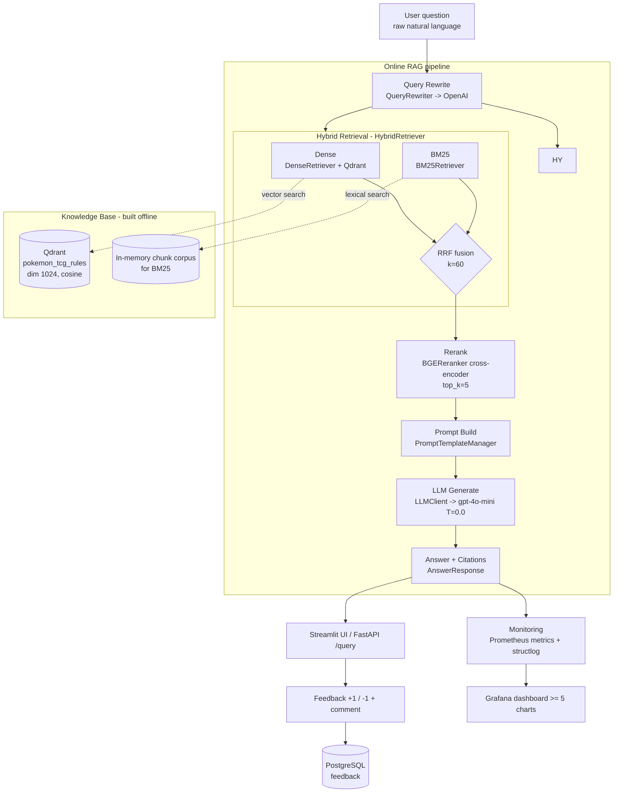
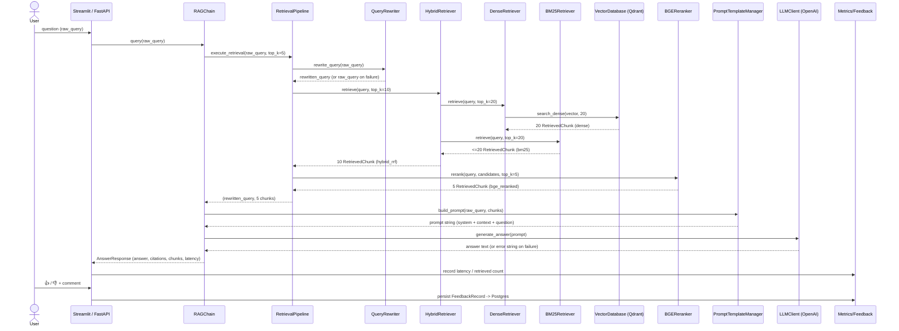
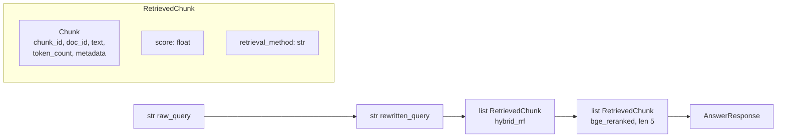
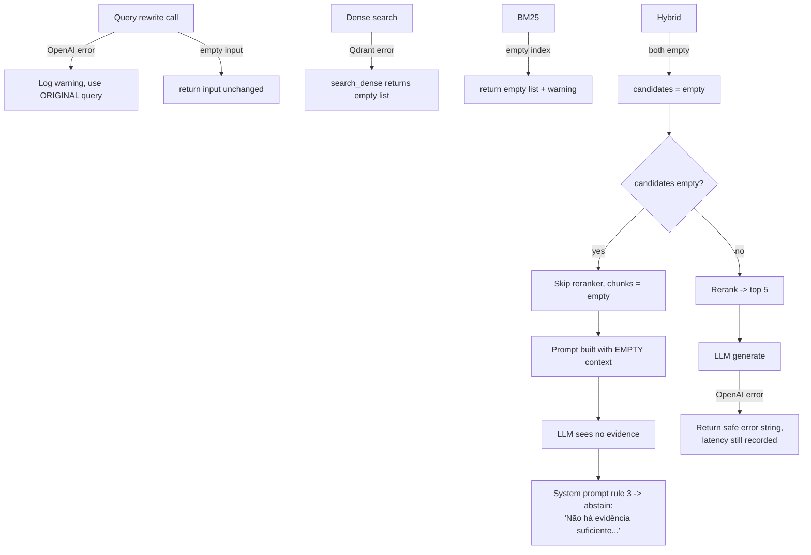

# RAGArchitecture.md - End-to-End RAG Architecture

## Objective

Describe the complete runtime path a user question travels through the **Pokemon TCG
Rules RAG Expert Assistant**: from raw natural-language input, through query rewriting,
multi-stage retrieval, cross-encoder reranking, prompt assembly, LLM generation, and
finally a grounded, cited `AnswerResponse` — plus the monitoring/feedback loop that
observes every request. This document is the *system-level* map; the deep dives live in
[`RetrievalPipeline.md`](./RetrievalPipeline.md), [`IndexingPipeline.md`](./IndexingPipeline.md),
[`EmbeddingStrategy.md`](./EmbeddingStrategy.md) and [`PromptEngineering.md`](./PromptEngineering.md).

## Scope

- **In scope:** the online (query-time) RAG flow, the data contracts (`Chunk`,
  `RetrievedChunk`, `AnswerResponse`) that flow between stages, component responsibilities
  mapped to real modules, and the failure / fallback / "I don't know" behavior.
- **Out of scope:** the offline indexing flow (see [`IndexingPipeline.md`](./IndexingPipeline.md)),
  strategy internals (see [`RetrievalPipeline.md`](./RetrievalPipeline.md)), evaluation
  (see [`EvaluationPlan.md`](./EvaluationPlan.md)) and UI/API surface (see
  [`APIContracts.md`](./APIContracts.md)).

This document proves rubric line **Retrieval flow** (a knowledge base **and** an LLM are
both used — [SC-001](../00_project/SUCCESS_CRITERIA.md), [SC-021](../00_project/SUCCESS_CRITERIA.md))
and satisfies [REQ-006](../00_project/REQUIREMENTS.md)–[REQ-012](../00_project/REQUIREMENTS.md).

---

## 1. High-Level Flow

The offline half (Download -> Parse -> Chunk -> Embed -> Upsert) populates the Qdrant
collection and the BM25 corpus; it is fully specified in
[`IndexingPipeline.md`](./IndexingPipeline.md). Everything inside `ONLINE` runs per query.

---

## 2. Request Sequence

---

## 3. Component Responsibilities

Every stage maps to a concrete module under `src/pokemon_tcg_rag/`.

| # | Stage | Module / Class | Responsibility | Key config |
| :- | :--- | :--- | :--- | :--- |
| 1 | Orchestration | `llm/rag_chain.py` · `RAGChain.query()` | Times the request, calls retrieval, builds prompt, calls LLM, assembles `AnswerResponse`. | `RETRIEVAL_FINAL_TOP_K` |
| 2 | Query rewrite | `retrieval/query_rewriter.py` · `QueryRewriter.rewrite_query()` | Expand/normalize the question into a domain-optimized search phrase via OpenAI. Falls back to the original query on any error. | `OPENAI_MODEL_NAME`, `temperature=0.0`, `max_tokens=100` |
| 3a | Dense retrieval | `retrieval/dense.py` · `DenseRetriever.retrieve()` | Encode query with `bge-large-en-v1.5`, cosine search in Qdrant. | `EMBEDDING_MODEL_PRIMARY` |
| 3b | Lexical retrieval | `retrieval/bm25.py` · `BM25Retriever.retrieve()` | `BM25Okapi` keyword search over the tokenized chunk corpus. | in-memory corpus |
| 3c | Fusion | `retrieval/hybrid.py` · `HybridRetriever.retrieve()` | Reciprocal Rank Fusion of dense + BM25 rankings. | `RETRIEVAL_HYBRID_RRF_K=60` |
| 4 | Reranking | `retrieval/reranker.py` · `BGEReranker.rerank()` | `bge-reranker-large` cross-encoder scores each `[query, text]` pair; keep top 5. | `RERANKER_MODEL`, `top_k=5` |
| — | Retrieval glue | `retrieval/pipeline.py` · `RetrievalPipeline.execute_retrieval()` | Wires rewrite -> hybrid -> rerank; feature flags `enable_query_rewrite`, `enable_reranking`. | — |
| 5 | Prompt build | `llm/prompts.py` · `PromptTemplateManager.build_prompt()` | Format chunks into numbered `DOCUMENTO [n]` blocks, inject Certified-Judge system prompt. | — |
| 6 | Generation | `llm/client.py` · `LLMClient.generate_answer()` | Call OpenAI chat completion at `temperature=0.0`; on error returns a safe error string. | `OPENAI_MODEL_NAME`, `OPENAI_TEMPERATURE` |
| 7 | Vector store | `storage/vector_db.py` · `VectorDatabase` | Qdrant collection lifecycle, upsert, `search_dense`. | `QDRANT_*`, `EMBEDDING_DIMENSION=1024` |
| 8 | Monitoring | `monitoring/metrics_collector.py`, `monitoring/logger.py`, `monitoring/feedback_store.py` | Prometheus counters/histograms, structured logs, feedback persistence to Postgres. | see [`Observability.md`](./Observability.md) |

---

## 4. Data Contracts Between Stages

The objects that flow between stages are the Pydantic models in
[`domain/models.py`](../../src/pokemon_tcg_rag/domain/models.py) — see
[`DomainModel.md`](./DomainModel.md) for the full field-by-field spec.

| Boundary | Object flowing | Shape (key fields) | Producer -> Consumer |
| :--- | :--- | :--- | :--- |
| User -> rewrite | `str` | raw question | UI -> `QueryRewriter` |
| Rewrite -> retrieval | `str` | `rewritten_query` (or original on fallback) | `QueryRewriter` -> `HybridRetriever` |
| Qdrant -> dense | `RetrievedChunk` | `chunk` reconstructed from Qdrant payload, `score`=cosine, `retrieval_method="dense"` | `VectorDatabase.search_dense` -> `DenseRetriever` |
| BM25 -> hybrid | `RetrievedChunk` | `score`=BM25, `retrieval_method="bm25"` | `BM25Retriever` -> `HybridRetriever` |
| Hybrid -> rerank | `list[RetrievedChunk]` (10) | `score`=RRF float, `retrieval_method="hybrid_rrf"` | `HybridRetriever` -> `BGEReranker` |
| Rerank -> prompt | `list[RetrievedChunk]` (5) | `score`=cross-encoder relevance, `retrieval_method="bge_reranked"` | `BGEReranker` -> `PromptTemplateManager` |
| Prompt -> LLM | `str` | full prompt (system + numbered context + question) | `PromptTemplateManager` -> `LLMClient` |
| LLM -> user | `AnswerResponse` | `query`, `rewritten_query`, `answer`, `citations: list[DocumentMetadata]`, `retrieved_chunks`, `model_name`, `latency_seconds`, `timestamp` | `RAGChain` -> UI/API |
| UI -> store | `FeedbackRecord` | `rating` ∈ {+1,-1}, `comment`, `query`, `answer`, `model_name`, `latency_seconds` | UI -> `feedback_store` -> Postgres |

**Citation derivation:** `RAGChain.query()` sets `citations = [item.chunk.metadata for
item in chunks]` — i.e. citations are exactly the `DocumentMetadata` of the final 5
reranked chunks. This is what the UI renders as sources and what
[SC-008 (Citation Quality)](../00_project/SUCCESS_CRITERIA.md) audits.

---

## 5. Failure, Fallback & "I don't know" Behavior

The pipeline is designed to **degrade gracefully** rather than crash, and to **abstain**
rather than hallucinate.

| Failure point | Behavior | Source |
| :--- | :--- | :--- |
| Query rewrite fails / empty | Falls back to original query, logs warning | `query_rewriter.py` `except` branch |
| Qdrant search fails | Returns `[]` (dense contributes nothing to fusion) | `vector_db.py` `search_dense` `except` |
| BM25 index empty | Returns `[]` with warning | `bm25.py` guard |
| No candidates | Reranker short-circuits, `final_chunks = candidates[:top_k]` = `[]` | `pipeline.py` / `reranker.py` |
| Empty / weak context | LLM instructed to answer **"Não há evidência suficiente na documentação oficial para responder a esta pergunta."** | `prompts.py` SYSTEM_PROMPT rule 3 |
| LLM call fails | Returns Portuguese safe error string; `latency_seconds` still populated so monitoring sees the failure | `client.py` `except` |

The **"I don't know" guardrail** is a *prompt-level* contract (grounding rule) validated
by [SC-011](../00_project/SUCCESS_CRITERIA.md): 100% of an adversarial no-answer probe set
must abstain rather than fabricate a rule. Full prompt text and citation rules are in
[`PromptEngineering.md`](./PromptEngineering.md).

> **Implementation note (see [`Assumptions.md`](../00_project/Assumptions.md)):**
> `RAGChain.build_prompt` currently passes the **raw** query to the prompt (the rewritten
> query is used only for retrieval and stored in `AnswerResponse.rewritten_query`). There
> is no explicit token-budget truncation of context yet; the reranker cap of 5 chunks is
> the effective context bound. Both are documented in [`PromptEngineering.md`](./PromptEngineering.md).

---

## 6. Acceptance Criteria

| Criterion | Target | Linked SC |
| :--- | :--- | :--- |
| KB + LLM both used in flow | `/query` returns grounded answer from retrieved chunks | [SC-021](../00_project/SUCCESS_CRITERIA.md) |
| Every answer carries citations | ≥ 90% answers with ≥1 resolvable citation | [SC-008](../00_project/SUCCESS_CRITERIA.md) |
| Abstention on unsupported queries | 100% on adversarial set | [SC-011](../00_project/SUCCESS_CRITERIA.md) |
| Mean end-to-end latency | < 2.0 s (P50, warm) | [SC-012](../00_project/SUCCESS_CRITERIA.md) |
| Graceful degradation | No unhandled exception surfaces to the user | this doc §5 |

---

## Cross-References

- [`RetrievalPipeline.md`](./RetrievalPipeline.md) — the 4 retrieval strategies in depth.
- [`IndexingPipeline.md`](./IndexingPipeline.md) — how the knowledge base is built.
- [`EmbeddingStrategy.md`](./EmbeddingStrategy.md) — embedding model choices.
- [`PromptEngineering.md`](./PromptEngineering.md) — the Certified-Judge prompt & citations.
- [`DomainModel.md`](./DomainModel.md) / [`DataModel.md`](./DataModel.md) — object schemas.
- [`APIContracts.md`](./APIContracts.md) — `/query`, `/feedback`, `/health`.
- [`Observability.md`](./Observability.md) — monitoring & feedback.
- [`REQUIREMENTS.md`](../00_project/REQUIREMENTS.md) · [`SUCCESS_CRITERIA.md`](../00_project/SUCCESS_CRITERIA.md).
