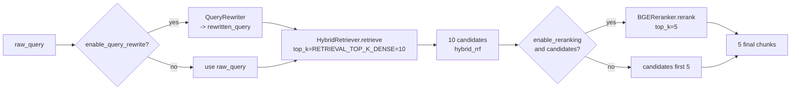
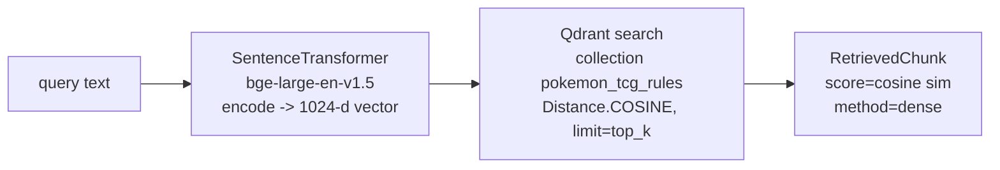
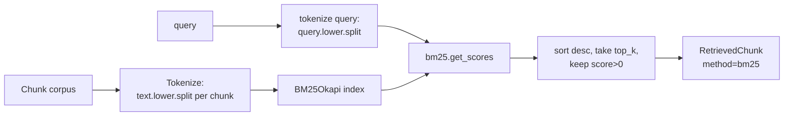
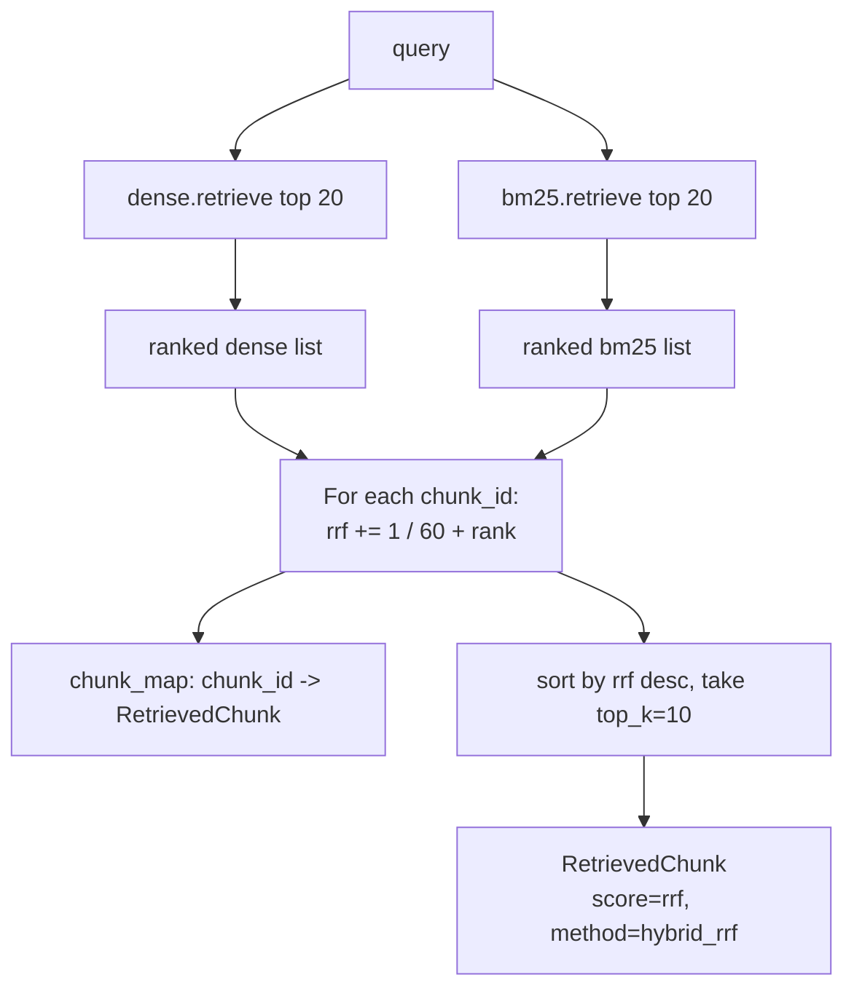
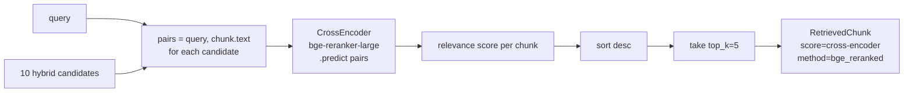

# RetrievalPipeline.md - Multi-Strategy Retrieval

## Objective

Specify, in exhaustive detail, the four retrieval strategies of the Pokemon TCG RAG
system and the multi-stage pipeline that composes them: **Dense**, **BM25**, **Hybrid
(Reciprocal Rank Fusion)**, and **Hybrid + Cross-Encoder Rerank**, preceded by **LLM query
rewriting** and supported by **Qdrant metadata filtering**. This is the single most
load-bearing architecture document: it is the direct evidence for the rubric's *Retrieval
evaluation* (multiple approaches, best selected) and all three *Best-practice* points
(hybrid search, reranking, query rewriting).

## Scope

- **In scope:** each strategy's algorithm, exact scoring/fusion math (with a worked
  numeric example), when each is used, metadata filtering, and the config knobs.
- **Out of scope:** how the strategies are *scored against each other* (Recall@K, MRR) —
  that is [`EvaluationPlan.md`](./EvaluationPlan.md); the embedding model comparison —
  [`EmbeddingStrategy.md`](./EmbeddingStrategy.md); prompt building — [`PromptEngineering.md`](./PromptEngineering.md).

Implements [REQ-006](../00_project/REQUIREMENTS.md)–[REQ-010](../00_project/REQUIREMENTS.md);
proves [SC-005](../00_project/SUCCESS_CRITERIA.md) and [SC-022](../00_project/SUCCESS_CRITERIA.md).

---

## 1. Pipeline Overview

The production path is orchestrated by
[`retrieval/pipeline.py`](../../src/pokemon_tcg_rag/retrieval/pipeline.py)
(`RetrievalPipeline.execute_retrieval`). Strategies 1–3 are also independently callable so
the evaluation harness can benchmark each in isolation.



**Fan-out arithmetic (as coded):** `execute_retrieval` calls the hybrid retriever with
`top_k = RETRIEVAL_TOP_K_DENSE = 10`. `HybridRetriever.retrieve` internally requests
`top_k * 2 = 20` from *each* of dense and BM25, fuses them, and returns the top **10**.
The reranker then narrows those 10 to the final **5** (`RETRIEVAL_FINAL_TOP_K`).

```
raw_query
  -> rewrite (1 OpenAI call)
  -> dense top 20  ─┐
                    ├─ RRF fuse -> top 10
  -> bm25  top 20  ─┘
  -> cross-encoder rerank -> top 5   (feeds the LLM)
```

---

## 2. Strategy 1 — Dense Vector Retrieval

**Module:** [`retrieval/dense.py`](../../src/pokemon_tcg_rag/retrieval/dense.py) ·
`DenseRetriever` + [`storage/vector_db.py`](../../src/pokemon_tcg_rag/storage/vector_db.py) `search_dense`.



- **Model:** `BAAI/bge-large-en-v1.5` (1024-d), loaded lazily via `sentence-transformers`
  (see [`EmbeddingStrategy.md`](./EmbeddingStrategy.md)).
- **Similarity:** cosine — the Qdrant collection is created with
  `Distance.COSINE` and `size=EMBEDDING_DIMENSION=1024` (`vector_db.init_collection`).
- **Default `top_k`:** 10 (method signature default; the pipeline drives 20 via hybrid).
- **Output:** `RetrievedChunk` objects with `retrieval_method="dense"`, `score` = Qdrant
  cosine score. The `Chunk` is reconstructed from the Qdrant payload
  (`text`, `doc_id`, `source`, `document_title`, `page_number`, `rule_type`, `card_name`).
- **Strength:** semantic/paraphrase matching ("evolve immediately" ~ "skip a Stage").
- **Weakness:** exact card names / rare tokens (e.g. "VSTAR", a specific errata code) can
  be under-weighted — that is what BM25 recovers.

---

## 3. Strategy 2 — BM25 Lexical Retrieval

**Module:** [`retrieval/bm25.py`](../../src/pokemon_tcg_rag/retrieval/bm25.py) · `BM25Retriever`
(backed by `rank-bm25`'s `BM25Okapi`).



- **Indexing:** `index_chunks` builds `tokenized_corpus = [chunk.text.lower().split() for
  chunk in chunks]` and constructs `BM25Okapi(tokenized_corpus)`. The corpus is held **in
  memory** (not in Qdrant) — see the note on corpus provisioning below.
- **Tokenization:** whitespace split on the lowercased text for **both** corpus and query
  (`query.lower().split()`). Simple and deterministic; no stemming/stop-word removal.
- **Scoring:** BM25 term-frequency/inverse-document-frequency with length normalization
  (`BM25Okapi` defaults k1≈1.5, b≈0.75). Only chunks with `score > 0` are returned.
- **Strength:** exact-token recall — card names, errata identifiers, ban keywords.
- **Weakness:** no semantic generalization; a paraphrase with zero shared tokens scores 0.

> **Corpus provisioning note ([`Assumptions.md`](../00_project/Assumptions.md)):** the
> `BM25Retriever` is constructed with the chunk list (or `index_chunks` is called after
> ingestion). The indexing pipeline that produces those chunks is
> [`IndexingPipeline.md`](./IndexingPipeline.md).

---

## 4. Strategy 3 — Hybrid Search via Reciprocal Rank Fusion (RRF)

**Module:** [`retrieval/hybrid.py`](../../src/pokemon_tcg_rag/retrieval/hybrid.py) · `HybridRetriever`.

RRF fuses two **rank lists** (not raw scores), which sidesteps the incomparable scales of
cosine similarity (≈0–1) and BM25 (unbounded). Only ordinal position matters.

### 4.1 The exact formula (as implemented)

For each candidate chunk *c* appearing in the dense list and/or the BM25 list:

```
              1                 1
RRF(c) =  ─────────  +  ─────────           (a term is added only for lists c appears in)
          k + r_dense    k + r_bm25
```

where `k = RETRIEVAL_HYBRID_RRF_K = 60` and `r` is the **1-based rank** of *c* in that
list (`enumerate(..., start=1)` in the code). A chunk found by only one retriever gets a
single term; a chunk found by both gets the sum of both terms (fusion reward). Final
ranking is by descending `RRF(c)`, cut to `top_k`.

### 4.2 Worked numeric fusion example

Assume dense and BM25 each returned 5 candidates (`k = 60`). Ranks are 1-based.

| Chunk | Dense rank | BM25 rank | Dense term `1/(60+r)` | BM25 term `1/(60+r)` | **RRF score** | Final rank |
| :--- | :---: | :---: | :---: | :---: | :---: | :---: |
| C-A | 1 | 3 | 1/61 = 0.016393 | 1/63 = 0.015873 | **0.032266** | 1 |
| C-B | 2 | 1 | 1/62 = 0.016129 | 1/61 = 0.016393 | **0.032522** | *see note* |
| C-C | 3 | — | 1/63 = 0.015873 | — | **0.015873** | 4 |
| C-D | — | 2 | — | 1/62 = 0.016129 | **0.016129** | 3 |
| C-E | 4 | 5 | 1/64 = 0.015625 | 1/65 = 0.015385 | **0.031010** | 2 |

Sorting descending: **C-B (0.032522) > C-A (0.032266) > C-E (0.031010) > C-D (0.016129) >
C-C (0.015873)**. Note how **C-B**, ranked #1 by BM25 and #2 by dense, wins overall even
though no single retriever put it first — this is the fusion reward for cross-retriever
agreement. **C-D**, found only by BM25 at rank 2, still outranks **C-C** (dense-only rank
3), because a strong single-list position can beat a weaker single-list position.

### 4.3 Diagram



- **No score normalization is needed** — RRF is rank-based by construction. The emitted
  `score` on the hybrid `RetrievedChunk` is the raw RRF float (small, ~0.01–0.05 range).
- **De-duplication:** the code keeps one `RetrievedChunk` per `chunk_id` in `chunk_map`
  (first occurrence wins for the stored chunk body; scores from both lists are summed).

---

## 5. Strategy 4 — Hybrid + Cross-Encoder Reranking

**Module:** [`retrieval/reranker.py`](../../src/pokemon_tcg_rag/retrieval/reranker.py) · `BGEReranker`.

The top 10 hybrid candidates are re-scored by a **cross-encoder** that reads the query and
each chunk *together* (full cross-attention), which is far more precise than the
bi-encoder cosine used for first-stage recall — at higher per-pair cost, hence applied
only to the shortlist.



- **Model:** `BAAI/bge-reranker-large` via `sentence_transformers.CrossEncoder`, lazily
  loaded (`RERANKER_MODEL`).
- **Input:** `pairs = [[query, item.chunk.text] for item in candidate_chunks]`.
- **Output:** re-scored `RetrievedChunk` (`retrieval_method="bge_reranked"`), sorted
  descending, truncated to `top_k=5` (`RETRIEVAL_FINAL_TOP_K`).
- **Empty-input guard:** returns `[]` immediately if there are no candidates.
- **Ablation:** the pipeline flag `enable_reranking=False` makes it fall back to
  `candidates[:top_k]` (i.e. the top 5 hybrid results) — this is the on/off comparison
  required by [SC-022](../00_project/SUCCESS_CRITERIA.md).

---

## 6. Query Rewriting (pre-retrieval)

**Module:** [`retrieval/query_rewriter.py`](../../src/pokemon_tcg_rag/retrieval/query_rewriter.py) · `QueryRewriter`.

A single OpenAI call (`OPENAI_MODEL_NAME`, `temperature=0.0`, `max_tokens=100`) rewrites
the raw question into a formal, keyword-preserving search phrase before retrieval. Card
names and mechanics (Mega Evolution, Rare Candy, VSTAR, EX...) are preserved; ambiguous
phrasing is expanded. On any exception it logs a warning and returns the original query
(never blocks retrieval). Full prompt text and before/after examples are in
[`PromptEngineering.md`](./PromptEngineering.md). Ablation via `enable_query_rewrite`.

---

## 7. Metadata Filtering

Every Qdrant point carries a payload with filterable fields (written by
`VectorDatabase.upsert_chunks`):

| Payload field | Source | Example filter use |
| :--- | :--- | :--- |
| `source` | `DocumentSource` enum value | Restrict to `ban_list_html` for legality questions |
| `rule_type` | `RuleType` enum value | Restrict to `errata` / `ban_status` / `promo_status` |
| `card_name` | `DocumentMetadata.card_name` | Restrict to a specific card's rulings |
| `document_title`, `page_number`, `doc_id` | metadata | Trace / display citations |

Filtering is expressed as a Qdrant payload `Filter` (e.g. `FieldCondition` on `source` or
`rule_type`) passed to the search call. This is what makes questions like *"Is Mew VMAX
legal?"* route toward ban-list / promo-legality chunks. See the routing hints in
[`RAGArchitecture.md`](./RAGArchitecture.md) §1 and the E2E scenarios in the plan.

> **Implementation status ([`Assumptions.md`](../00_project/Assumptions.md)):**
> `VectorDatabase` is described as "supporting dense vector search **and payload
> filtering**", and the payload is written with all the fields above; the current
> `search_dense` signature does not yet forward a `query_filter`. Adding an optional
> `filters: dict | None` that builds a `qmodels.Filter` is the planned extension and is
> tracked as a backlog item. The metadata contract (fields, enum values) is stable today.

---

## 8. When Each Strategy Is Used

| Context | Strategy | Rationale |
| :--- | :--- | :--- |
| **Production `/query`** | Query rewrite -> Hybrid RRF -> Rerank (top 5) | Best expected quality; all best-practice features on. |
| **Evaluation: Dense baseline** | Dense only, top 10 | Isolate semantic recall ([`EvaluationPlan.md`](./EvaluationPlan.md)). |
| **Evaluation: BM25 baseline** | BM25 only, top 10 | Isolate lexical recall. |
| **Evaluation: Hybrid** | RRF fusion, no rerank | Measures fusion lift over each single retriever. |
| **Evaluation: Hybrid+Rerank** | Full pipeline | Measures rerank lift; expected best (selected for prod). |
| **Ablations** | Toggle `enable_query_rewrite` / `enable_reranking` | On/off deltas for the 3 best-practice points ([SC-022](../00_project/SUCCESS_CRITERIA.md)). |
| **Card-specific / legality** | Any strategy + metadata filter on `source`/`rule_type`/`card_name` | Narrow the candidate space to the authoritative source. |

---

## 9. Configuration Knobs

All from [`config/settings.py`](../../src/pokemon_tcg_rag/config/settings.py) (overridable via `.env`):

| Setting | Default | Meaning | Used by |
| :--- | :---: | :--- | :--- |
| `EMBEDDING_MODEL_PRIMARY` | `BAAI/bge-large-en-v1.5` | Dense query/doc encoder | `DenseRetriever` |
| `EMBEDDING_DIMENSION` | `1024` | Qdrant vector size (cosine) | `VectorDatabase` |
| `RETRIEVAL_TOP_K_DENSE` | `10` | `top_k` passed to hybrid (dense fetches 2x) | `RetrievalPipeline` |
| `RETRIEVAL_TOP_K_BM25` | `10` | BM25 candidate budget | `BM25Retriever` |
| `RETRIEVAL_HYBRID_RRF_K` | `60` | RRF constant *k* in `1/(k+rank)` | `HybridRetriever` |
| `RERANKER_MODEL` | `BAAI/bge-reranker-large` | Cross-encoder model | `BGEReranker` |
| `RETRIEVAL_FINAL_TOP_K` | `5` | Chunks handed to the LLM | pipeline / reranker |
| `OPENAI_MODEL_NAME` | `gpt-4o-mini` | Rewriter LLM | `QueryRewriter` |
| `OPENAI_TEMPERATURE` | `0.0` | Determinism | rewriter / generation |
| Pipeline flag `enable_query_rewrite` | `True` | Toggle rewrite stage | `RetrievalPipeline` |
| Pipeline flag `enable_reranking` | `True` | Toggle rerank stage | `RetrievalPipeline` |

---

## 10. Acceptance Criteria

| Criterion | Target | Linked SC |
| :--- | :--- | :--- |
| ≥ 4 retrieval strategies benchmarked, best selected & documented | Dense, BM25, Hybrid, Hybrid+Rerank | [SC-005](../00_project/SUCCESS_CRITERIA.md) |
| Best-practice trio implemented **and** ablated | Hybrid + Rerank + Rewrite on/off deltas | [SC-022](../00_project/SUCCESS_CRITERIA.md) |
| Recall@10 (best strategy) | > 0.90 | [SC-001](../00_project/SUCCESS_CRITERIA.md) |
| Recall@5 (best strategy) | ≥ 0.80 | [SC-002](../00_project/SUCCESS_CRITERIA.md) |
| MRR (best strategy) | ≥ 0.75 | [SC-003](../00_project/SUCCESS_CRITERIA.md) |
| RRF fusion is rank-based, k=60, verifiable | Matches §4.1 formula | this doc |

---

## Cross-References

- [`RAGArchitecture.md`](./RAGArchitecture.md) — where retrieval sits end-to-end.
- [`EmbeddingStrategy.md`](./EmbeddingStrategy.md) — the dense encoder choice & experiment.
- [`PromptEngineering.md`](./PromptEngineering.md) — query-rewriter prompt & context build.
- [`EvaluationPlan.md`](./EvaluationPlan.md) — Recall@K / MRR / Hit Rate methodology.
- [`IndexingPipeline.md`](./IndexingPipeline.md) — how the indexed/BM25 corpus is built.
- ADR: [`ADR_004_RERANKING.md`](../04_decisions/ADR_004_RERANKING.md) ·
  [`ADR_005_QUERY_REWRITING.md`](../04_decisions/ADR_005_QUERY_REWRITING.md).
- [`REQUIREMENTS.md`](../00_project/REQUIREMENTS.md) · [`SUCCESS_CRITERIA.md`](../00_project/SUCCESS_CRITERIA.md).
