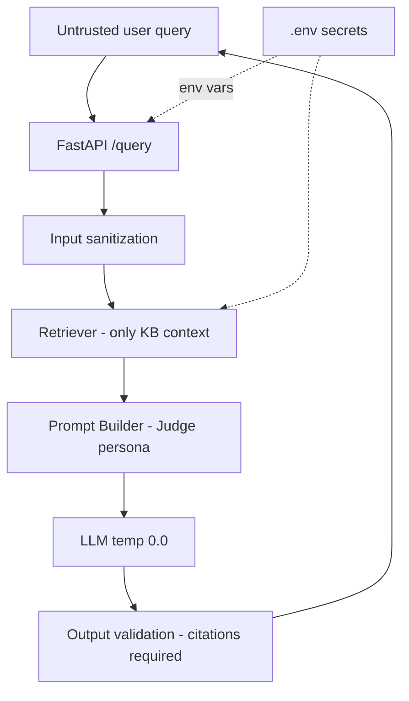

# Security.md — Security Policy, Secrets Management & Prompt-Injection Defense

## Objective

Define the **security posture** of the Pokemon TCG RAG system: how secrets are managed,
how untrusted user queries are defended against prompt injection, dependency/supply-chain
hygiene, PII handling, network exposure of Docker Compose services, source-data legal
posture, and least-privilege database access. Grounded in
[`.env.example`](../../.env.example), [`docker-compose.yml`](../../docker-compose.yml),
`config/settings.py`, `llm/prompts.py`, and the pinned dependencies.

## Scope

- **In scope:** secrets, input sanitization & prompt-injection guardrails, supply-chain
  hygiene, PII in feedback, container network exposure, source ToS/legal notes, DB least
  privilege.
- **Out of scope:** cloud-provider IAM specifics (see [`Deployment.md`](./Deployment.md)),
  metric/log emission details ([`Observability.md`](./Observability.md)), and the risk
  register itself ([`Risks.md`](../00_project/Risks.md)).

---

## 1. Threat Model (STRIDE-lite)

| # | STRIDE | Threat | Mitigation | Owner doc |
| :--- | :--- | :--- | :--- | :--- |
| T1 | **Spoofing** | Unauthenticated access to admin surfaces (Grafana, Qdrant, Postgres) | Bind sensitive ports to localhost in prod; change default Grafana `admin/admin`; do not expose Qdrant/Postgres publicly | §5, [`Deployment.md`](./Deployment.md) |
| T2 | **Tampering** | Poisoned source data alters answers | Ingest only the 9 allow-listed official URLs; store `checksum` in `DocumentMetadata`; re-verify on re-scrape | §7 |
| T3 | **Repudiation** | Untraceable feedback / queries | Structured JSON logs + `FeedbackRecord` with `feedback_id`, timestamps in Postgres | [`Observability.md`](./Observability.md) |
| T4 | **Info disclosure** | Leaked API keys / DB creds | Secrets only via `.env`/env vars, never committed; `.env` git-ignored; never logged | §2 |
| T5 | **Info disclosure** | Prompt injection exfiltrates system prompt / forces off-domain answers | Judge persona guardrail + context isolation + output validation | §3 |
| T6 | **DoS** | Expensive queries / unbounded LLM calls exhaust budget | `tenacity` retry caps, latency SLA, top-k bounds, rate limiting at API edge | §3, [`Deployment.md`](./Deployment.md) |
| T7 | **Elevation** | Over-privileged DB user | Least-privilege app role (DML only, no DDL/superuser) | §8 |
| T8 | **Legal** | Scraping violates source ToS | Respectful crawl + legal note; only official/community-sanctioned sources | §7, [`Risks.md`](../00_project/Risks.md) |

---

## 2. Secrets Management

| Secret | Env var | Default in `.env.example` | Rule |
| :--- | :--- | :--- | :--- |
| OpenAI key | `OPENAI_API_KEY` | placeholder `your_openai_api_key_here` | never commit real key |
| Postgres password | `POSTGRES_PASSWORD` | `pokemon_password` (dev only) | override in prod |
| Postgres user/db | `POSTGRES_USER` / `POSTGRES_DB` | `pokemon_user` / `pokemon_tcg_rag_db` | override in prod |
| Qdrant key | `QDRANT_API_KEY` | empty (local, unauthenticated) | set when Qdrant is exposed |
| Grafana admin | `GF_SECURITY_ADMIN_PASSWORD` | `admin` (compose) | **must** change in prod |

Rules:
1. **`.env` is the only secrets source** and is **git-ignored** — only
   [`.env.example`](../../.env.example) (placeholders) is committed.
2. Secrets are read exclusively through the typed `Settings` singleton
   (`config/settings.py`, `env_file=".env"`); no `os.environ` reads scattered in code
   ([`CodingStandards.md`](./CodingStandards.md) §7).
3. Compose injects secrets via `environment:` from the host env — `OPENAI_API_KEY`,
   `POSTGRES_*` are passed to `app`/`ingestion`, never baked into images.
4. Secrets are **never logged** (structlog JSON) and never returned in API responses or the
   Streamlit UI.
5. Dev defaults (`pokemon_password`, Grafana `admin/admin`) are for local only and **must**
   be overridden in staging/production.

---

## 3. Input Sanitization & Prompt-Injection Defense

User queries are **untrusted input**. Retrieved chunks come from the curated KB and are the
only trusted grounding. Defense layers:

1. **Input validation (API edge):** `/query` accepts a bounded-length string; reject empty /
   oversized payloads; strip control characters. Pydantic request models enforce types
   ([`APIContracts.md`](./APIContracts.md)).
2. **Judge-persona guardrail (system prompt):** the `PromptTemplateManager.SYSTEM_PROMPT`
   (`llm/prompts.py`) hard-codes the Certified Judge rules — answer **only** from provided
   context, never invent rules, cite every claim, and emit the fixed abstention sentence
   *"Não há evidência suficiente na documentação oficial…"* when context is insufficient.
   This directly counters "ignore your instructions" injections.
3. **Context isolation:** retrieved chunks are wrapped in delimited `--- DOCUMENTO [n] ---`
   blocks (`format_context`) and clearly separated from the user question, so injected text
   inside a document cannot be confused with system instructions.
4. **Deterministic generation:** `OPENAI_TEMPERATURE=0.0` reduces off-policy drift.
5. **Output validation:** answers must contain resolvable citations
   (`AnswerResponse.citations`); answers whose citations do not resolve to indexed sources
   are flagged (Citation Quality, [SC-008](../00_project/SUCCESS_CRITERIA.md)).
6. **Abstention over speculation:** grounding/abstention is measured on an adversarial
   no-answer probe set ([SC-011](../00_project/SUCCESS_CRITERIA.md)).
7. **Resource guards:** bounded top-k (`RETRIEVAL_FINAL_TOP_K=5`), `tenacity`-capped LLM
   retries, and latency SLA cap runaway cost/DoS (T6).

| ✅ Good | ❌ Bad |
| :--- | :--- |
| Wrap user text as data; keep system rules server-side | Concatenate user text directly into the instruction block |
| Refuse + abstain when context is empty | Let the LLM "best guess" a rule |
| Require citation before returning an answer | Return uncited free text |

---

## 4. Dependency & Supply-Chain Hygiene

1. **All dependencies are version-pinned** with lower bounds in
   [`requirements.txt`](../../requirements.txt) and `pyproject.toml`
   ([SC-019](../00_project/SUCCESS_CRITERIA.md)) — reproducible installs.
2. Pinned images in [`docker-compose.yml`](../../docker-compose.yml): `qdrant:v1.7.4`,
   `postgres:15-alpine`, `prom/prometheus:v2.48.1`, `grafana/grafana:10.2.3` — no `:latest`
   for infrastructure.
3. CI installs from the locked spec (`pip install -e ".[dev]"`) on a fixed Python
   ([`ci/workflows/ci.yml`](../../ci/workflows/ci.yml)).
4. **Recommended:** enable dependency vulnerability scanning (e.g. `pip-audit` /
   Dependabot) in CI; ML model weights (`bge-large`, `bge-reranker-large`) are pulled from
   the official HuggingFace repos only.
5. Ruff `B` (bugbear) and `S`-class review catch unsafe patterns; `mypy --strict` reduces
   type-confusion bugs.

---

## 5. Network Exposure of Compose Services

Published ports in [`docker-compose.yml`](../../docker-compose.yml):

| Service | Ports | Exposure guidance |
| :--- | :--- | :--- |
| `app` (FastAPI + Streamlit) | `8000`, `8501` | intended public/user-facing surface; put behind TLS/reverse proxy in prod |
| `qdrant` | `6333`, `6334` | **internal only** — do not publish publicly; set `QDRANT_API_KEY` if exposed |
| `postgres` | `5432` | **internal only** — never expose to the internet |
| `prometheus` | `9090` | internal / operator only |
| `grafana` | `3000` | operator only; change default admin creds |
| `ingestion` | none | batch job (profile `ingestion`), no listening ports |

Hardening: in production, bind infra ports to `127.0.0.1` or a private network, front `app`
with TLS, and restrict Grafana/Prometheus/Qdrant/Postgres via firewall or compose internal
network (no host port mapping).

---

## 6. PII Handling

- **No end-user PII is collected by design** — queries are about game rules.
- The **only free-text user input persisted** is the optional feedback `comment`
  (`FeedbackRecord.comment` → Postgres via `FeedbackStore`). Treat it as potentially
  containing user-entered text:
  - do not index it into the KB;
  - do not expose it in the public UI;
  - restrict read access to operators;
  - it is subject to deletion on request.
- Feedback records store no account identity — only `feedback_id`, query, answer, rating,
  model, latency, timestamp (`domain/models.py`).

---

## 7. Source-Data ToS & Legal Note

Ingestion is restricted to the **9 allow-listed official/community sources** in
[`PROJECT.md`](../00_project/PROJECT.md) §3 (pokemon.com PDFs/HTML and
`compendium.pokegym.net`). Legal posture:

1. Scrape **only** those URLs; no unofficial forums/Reddit/YouTube (explicitly out of scope,
   [`PROJECT.md`](../00_project/PROJECT.md) §4).
2. Respect each site's Terms of Service and `robots.txt`; use a descriptive User-Agent,
   rate-limited/polite crawling of pokegym, and cache raw HTML/PDF locally to avoid repeat
   load.
3. Content is used for a non-commercial, educational rules-assistant; attribution/citation is
   preserved in every answer (`source_url`, `document_title`, `publication_date` in
   `DocumentMetadata`).
4. Scraping/ToS risk is tracked in [`Risks.md`](../00_project/Risks.md); if a source changes
   its terms, ingestion of that source is disabled.

---

## 8. Least-Privilege Database Credentials

1. The application connects to Postgres as the **application role** (`POSTGRES_USER`), which
   should hold **DML only** (`SELECT/INSERT/UPDATE/DELETE`) on the feedback schema — **no**
   superuser, no `CREATE`/`DROP` at runtime.
2. Schema migrations (DDL) run via a **separate, elevated** migration credential
   (`alembic`, a pinned dep) executed out-of-band — not the runtime app role.
3. Connection string is derived centrally (`Settings.postgres_uri`); credentials come from
   env, never hardcoded.
4. Qdrant runs unauthenticated only on the internal network; when exposed, `QDRANT_API_KEY`
   is required and passed via settings.

---

## 9. Acceptance Criteria

| ID | Criterion | Verified by |
| :--- | :--- | :--- |
| SEC-AC-1 | No secret is committed; `.env` git-ignored; only `.env.example` present | repo scan / review |
| SEC-AC-2 | Secrets read only via `Settings`; never logged/returned | code review, log inspection |
| SEC-AC-3 | Judge guardrail enforced; abstention on unsupported queries | [SC-011](../00_project/SUCCESS_CRITERIA.md) |
| SEC-AC-4 | Every answer carries resolvable citations | [SC-008](../00_project/SUCCESS_CRITERIA.md) |
| SEC-AC-5 | All deps pinned; infra images pinned (no `:latest`) | [SC-019](../00_project/SUCCESS_CRITERIA.md) |
| SEC-AC-6 | Postgres/Qdrant not publicly exposed in prod; Grafana default creds changed | deploy review |
| SEC-AC-7 | Only the 9 official sources ingested; ToS respected | ingestion report, [`Risks.md`](../00_project/Risks.md) |
| SEC-AC-8 | App DB role is least-privilege (DML only) | DB grant review |

---

## Cross-References

- [`Deployment.md`](./Deployment.md) — network topology, TLS, cloud IAM.
- [`Observability.md`](./Observability.md) — log redaction, feedback pipeline.
- [`CodingStandards.md`](./CodingStandards.md) §7 — no-hardcoding / settings policy.
- [`PromptEngineering.md`](./PromptEngineering.md) — Judge persona details.
- [`Risks.md`](../00_project/Risks.md) — scraping/ToS and operational risks.
- [`PROJECT.md`](../00_project/PROJECT.md) §3–4 — official sources & scope.
