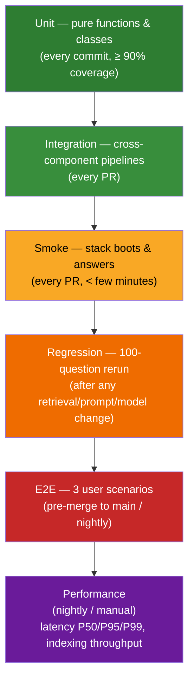
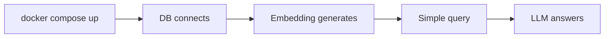
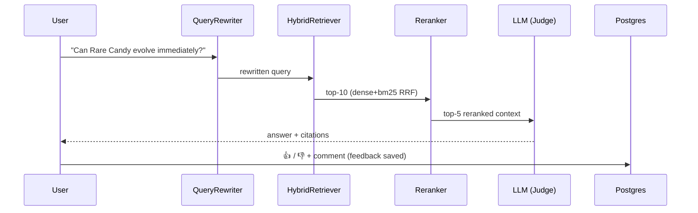

# TestingStrategy.md — Testing Matrix: Unit, Integration, Smoke, E2E, Regression, Performance

## Objective

Define the **complete, traceable test strategy** for the Pokemon TCG RAG system: what is
tested at each level, the concrete test names, how each test maps to requirements
(`REQ-###`) and success criteria (`SC-###`), the coverage gates, the fixtures, and the
regression policy. This document is the executable interpretation of the plan's testing
section and is grounded in the real test scaffold under `tests/`
([`tests/conftest.py`](../../tests/conftest.py)), the markers in
[`pyproject.toml`](../../pyproject.toml), and the targets in [`Makefile`](../../Makefile).

## Scope

- **In scope:** the 6 test levels (Unit, Integration, Smoke, E2E, Regression, Performance),
  test naming (`TEST-###`), REQ mapping, coverage gates, fixtures, and test data.
- **Out of scope:** the *numeric* retrieval/LLM quality thresholds (owned by
  [`SUCCESS_CRITERIA.md`](../00_project/SUCCESS_CRITERIA.md)) and the evaluation *harness*
  design (owned by [`EvaluationPlan.md`](./EvaluationPlan.md)). Regression here **runs** that
  harness and asserts non-regression.

---

## 1. The Test Pyramid

Directory layout (real): `tests/{unit,integration,smoke,e2e,evaluation,performance}/` plus
`tests/conftest.py`. Markers are declared in `[tool.pytest.ini_options]`:
`unit, integration, smoke, e2e, evaluation, performance` (`--strict-markers` enforced).

| Level | Marker | Make target | Runs when |
| :--- | :--- | :--- | :--- |
| Unit | `unit` | `make test-unit` | every commit / PR (CI `unit-and-integration-tests`) |
| Integration | `integration` | `make test-integration` | every PR |
| Smoke | `smoke` | `make test-smoke` | every PR (fast) |
| E2E | `e2e` | `make test-e2e` | pre-merge to `main` / nightly |
| Regression | `evaluation` | `make eval` | after retrieval/prompt/model change |
| Performance | `performance` | `pytest tests/performance -m performance` | nightly / manual |

---

## 2. Naming & Traceability Convention

- Test IDs use `TEST-###` and are recorded in the
  [`TRACEABILITY_MATRIX.md`](../05_agent_harness/TRACEABILITY_MATRIX.md) against `REQ-###`.
- Test **functions** follow `test_<behavior>()` inside `test_<unit>.py` (see
  [`CodingStandards.md`](./CodingStandards.md) §4).
- Each test carries exactly one level marker.

---

## 3. Unit Tests (`tests/unit/`, marker `unit`)

Fast, isolated, no network / no containers. External I/O (Qdrant, Postgres, OpenAI,
HuggingFace) is mocked via `pytest-mock`. These deliver the ≥ 90% coverage gate.

### 3.1 Chunker — `tests/unit/test_chunker.py` (targets `ingestion/chunker.py`)

| TEST-ID | Test function | Asserts | REQ |
| :--- | :--- | :--- | :--- |
| TEST-001 | `test_chunk_size()` | chunks respect `chunking.chunk_size = 512` tokens | [REQ-004](../00_project/REQUIREMENTS.md) |
| TEST-002 | `test_overlap()` | consecutive chunks overlap by `chunk_overlap = 64` | REQ-004 |
| TEST-003 | `test_preserve_metadata()` | `Chunk.metadata` equals source `DocumentMetadata` | REQ-004 |
| TEST-004 | `test_empty_document()` | empty input → `[]` or `ChunkingError`, no crash | REQ-004 |
| TEST-005 | `test_unicode()` | accents / Pokémon glyphs preserved, no mojibake | REQ-004 |
| TEST-006 | `test_long_paragraph()` | oversized paragraph split into multiple valid chunks | REQ-004 |

### 3.2 HTML Parser — `tests/unit/test_html_scraper.py` (targets `ingestion/html_scraper.py`)

| TEST-ID | Test function | Asserts | REQ |
| :--- | :--- | :--- | :--- |
| TEST-007 | `test_extract_title()` | document/section title extracted | [REQ-003](../00_project/REQUIREMENTS.md) |
| TEST-008 | `test_extract_question()` | Pokegym ruling `question` field parsed | [REQ-001](../00_project/REQUIREMENTS.md) |
| TEST-009 | `test_extract_answer()` | Pokegym ruling `answer` field parsed | REQ-001 |
| TEST-010 | `test_missing_fields()` | missing card/date → `None`, no exception | REQ-001 |

### 3.3 Embeddings — `tests/unit/test_embeddings.py` (targets `retrieval/dense.py` embedder)

| TEST-ID | Test function | Asserts | REQ |
| :--- | :--- | :--- | :--- |
| TEST-011 | `test_embedding_dimension()` | vector length == `EMBEDDING_DIMENSION` (1024) | [REQ-006](../00_project/REQUIREMENTS.md) |
| TEST-012 | `test_empty_embedding()` | empty string → handled (zero-vector or error), not crash | REQ-006 |
| TEST-013 | `test_duplicate_embedding()` | identical text → identical (deterministic) vector | REQ-006 |

### 3.4 Prompt Builder — `tests/unit/test_prompts.py` (targets `llm/prompts.py`)

| TEST-ID | Test function | Asserts | REQ |
| :--- | :--- | :--- | :--- |
| TEST-014 | `test_context_order()` | chunks numbered `[1..n]` in retrieval order in context | [REQ-011](../00_project/REQUIREMENTS.md) |
| TEST-015 | `test_max_tokens()` | assembled prompt stays within context budget | REQ-011 |
| TEST-016 | `test_source_citations()` | each block carries `Fonte:` + page/card from `DocumentMetadata` | [REQ-012](../00_project/REQUIREMENTS.md) |

### 3.5 Additional unit targets (public surface must be tested)

| TEST-ID | Module | Representative tests | REQ |
| :--- | :--- | :--- | :--- |
| TEST-017 | `evaluation/metrics.py` | `test_recall_at_k_perfect()`, `test_recall_at_k_zero_gt()`, `test_mrr_first_rank()`, `test_hit_rate_miss()` | [REQ-018](../00_project/REQUIREMENTS.md) |
| TEST-018 | `retrieval/hybrid.py` | `test_rrf_fusion_k60()`, `test_rrf_tie_break()` (RRF, k=60) | [REQ-008](../00_project/REQUIREMENTS.md) |
| TEST-019 | `retrieval/bm25.py` | `test_bm25_topk()`, `test_bm25_tokenization()` | [REQ-007](../00_project/REQUIREMENTS.md) |
| TEST-020 | `retrieval/reranker.py` | `test_rerank_reorders()`, `test_rerank_final_top_k_5()` | [REQ-009](../00_project/REQUIREMENTS.md) |
| TEST-021 | `retrieval/query_rewriter.py` | `test_rewrite_expands_legality_query()`, `test_rewrite_noop_on_clear_query()` | [REQ-010](../00_project/REQUIREMENTS.md) |
| TEST-022 | `monitoring/metrics_collector.py` | `test_record_query_increments_counter()`, `test_record_feedback_positive_vs_negative()` | [REQ-015](../00_project/REQUIREMENTS.md) |
| TEST-023 | `monitoring/feedback_store.py` | `test_submit_feedback_persists_and_counts()` (mock DB) | [REQ-014](../00_project/REQUIREMENTS.md) |
| TEST-024 | `config/settings.py` | `test_postgres_uri_built()`, `test_env_override()` | [REQ-016](../00_project/REQUIREMENTS.md) |

---

## 4. Integration Tests (`tests/integration/`, marker `integration`)

Cross-component flows against ephemeral real dependencies (Qdrant/Postgres containers or
in-process fakes). OpenAI is mocked to keep CI deterministic and free.

### 4.1 Pipeline A — Ingestion: download → parse → chunk → embed → vectordb

| TEST-ID | Test function | Asserts | REQ |
| :--- | :--- | :--- | :--- |
| TEST-030 | `test_ingest_pipeline_chunk_count()` | # chunks > 0 and matches parser output | [REQ-002](../00_project/REQUIREMENTS.md), [REQ-004](../00_project/REQUIREMENTS.md) |
| TEST-031 | `test_ingest_pipeline_embedding_count()` | # embeddings == # chunks, each dim 1024 | [REQ-005](../00_project/REQUIREMENTS.md) |
| TEST-032 | `test_ingest_pipeline_doc_count_indexed()` | Qdrant collection point count == # chunks | REQ-005 |
| TEST-033 | `test_ingest_metadata_roundtrip()` | payload (source, page, card_name) survives upsert→search | REQ-004 |

### 4.2 Pipeline B — Query: retriever → LLM → answer

| TEST-ID | Test function | Asserts | REQ |
| :--- | :--- | :--- | :--- |
| TEST-034 | `test_query_returns_correct_context()` | retrieved chunks match expected doc_ids | [REQ-006](../00_project/REQUIREMENTS.md)–[REQ-009](../00_project/REQUIREMENTS.md) |
| TEST-035 | `test_answer_contains_citations()` | `AnswerResponse.citations` non-empty & resolvable | [REQ-012](../00_project/REQUIREMENTS.md) |
| TEST-036 | `test_no_obvious_hallucination()` | answer text traces to provided context (mock LLM echoes context) | [REQ-011](../00_project/REQUIREMENTS.md) |
| TEST-037 | `test_query_records_metrics()` | `QUERY_COUNTER` / `LATENCY_HISTOGRAM` updated | [REQ-015](../00_project/REQUIREMENTS.md) |

---

## 5. Smoke Tests (`tests/smoke/`, marker `smoke`) — every PR, minutes

Prove the stack is alive end-to-end. Ordered chain from the plan:

| TEST-ID | Test function | Asserts | REQ / SC |
| :--- | :--- | :--- | :--- |
| TEST-040 | `test_stack_up_healthchecks_green()` | all compose healthchecks pass < 60s | [SC-014](../00_project/SUCCESS_CRITERIA.md) |
| TEST-041 | `test_qdrant_connects()` | `/healthz` 200; collection reachable | [REQ-005](../00_project/REQUIREMENTS.md) |
| TEST-042 | `test_postgres_connects()` | `pg_isready` / trivial `SELECT 1` | [REQ-014](../00_project/REQUIREMENTS.md) |
| TEST-043 | `test_embedding_generates()` | embedder returns a 1024-d vector | [REQ-006](../00_project/REQUIREMENTS.md) |
| TEST-044 | `test_simple_query_answered()` | `/query` returns `AnswerResponse` 200 | [REQ-013](../00_project/REQUIREMENTS.md), [SC-021](../00_project/SUCCESS_CRITERIA.md) |
| TEST-045 | `test_api_health_endpoint()` | `/health` 200 (matches compose healthcheck) | [SC-021](../00_project/SUCCESS_CRITERIA.md) |

---

## 6. End-to-End Tests (`tests/e2e/`, marker `e2e`) — the 3 user scenarios

Full user journeys (rewrite → retrieve → rerank → LLM → answer → feedback), using the real
pipeline against a seeded index; LLM may be real (gated) or a high-fidelity mock.

| TEST-ID | Scenario | Flow | Expected source(s) | REQ |
| :--- | :--- | :--- | :--- | :--- |
| TEST-050 | **Rare Candy** — "Can Rare Candy evolve immediately / be played turn 1?" | rewrite → retrieve → rerank → LLM → answer → **feedback saved** | Rulebook PDF, Pokegym rulings | [REQ-010](../00_project/REQUIREMENTS.md)–[REQ-014](../00_project/REQUIREMENTS.md) |
| TEST-051 | **Mew VMAX legality** — "Is Mew VMAX legal?" | retrieve → answer citing legality docs | Ban List HTML, Promo Legality HTML | [REQ-003](../00_project/REQUIREMENTS.md), [REQ-011](../00_project/REQUIREMENTS.md), [REQ-012](../00_project/REQUIREMENTS.md) |
| TEST-052 | **Attack after Mega Evolution** — "Can I attack after Mega Evolution?" | retrieve → answer citing mega rules | Mega Rules HTML | [REQ-011](../00_project/REQUIREMENTS.md), [REQ-012](../00_project/REQUIREMENTS.md) |

E2E assertions for each: (1) an answer is produced; (2) ≥ 1 citation resolves to the
expected `DocumentSource`; (3) no fabricated rule (grounding); (4) for TEST-050,
`FeedbackRecord` is persisted to Postgres and `FEEDBACK_COUNTER` increments.

---

## 7. Regression Tests (marker `evaluation`) — 100-question rerun

After **any** change to chunking, retrieval, reranking, rewriting, prompts, or the model,
rerun the 100-question benchmark and **compare to the stored baseline**. Driven by
`evaluation/evaluator.py` (`RAGEvaluator.run_evaluation()` → `EvaluationReport`) over the
dataset from `EvaluationDatasetLoader` (`data/evaluation/benchmark_100_questions.json`).

| TEST-ID | Test function | Fails the pipeline if… | Threshold source |
| :--- | :--- | :--- | :--- |
| TEST-060 | `test_recall_at_10_not_regressed()` | `mean_recall_at_10` < baseline (or < 0.90) | [SC-001](../00_project/SUCCESS_CRITERIA.md) |
| TEST-061 | `test_recall_at_5_not_regressed()` | `mean_recall_at_5` < baseline (or < 0.80) | [SC-002](../00_project/SUCCESS_CRITERIA.md) |
| TEST-062 | `test_mrr_not_regressed()` | `mean_mrr` < baseline (or < 0.75) | [SC-003](../00_project/SUCCESS_CRITERIA.md) |
| TEST-063 | `test_faithfulness_not_regressed()` | RAGAS faithfulness < baseline (or < 0.85) | [SC-006](../00_project/SUCCESS_CRITERIA.md) |
| TEST-064 | `test_latency_not_regressed()` | P50 latency > 2.0 s or worse than baseline | [SC-012](../00_project/SUCCESS_CRITERIA.md) |

**Regression rule (from the plan):** if Recall, Faithfulness, or latency worsen versus the
baseline, the pipeline **fails**. Baselines are stored next to the evaluation report — see
[`EvaluationPlan.md`](./EvaluationPlan.md) §"How results are recorded" and the gate table in
[`SUCCESS_CRITERIA.md`](../00_project/SUCCESS_CRITERIA.md) §3.

---

## 8. Performance Tests (`tests/performance/`, marker `performance`)

Benchmarks; thresholds and full methodology live in `docs/04_tests/PERFORMANCE.md` (per the
plan's `PERFORMANCE.md`). Metrics reuse `LATENCY_HISTOGRAM` buckets
`[0.1, 0.5, 1.0, 2.0, 5.0, 10.0]` from `monitoring/metrics_collector.py`.

| TEST-ID | Benchmark | Measure | Target | SC |
| :--- | :--- | :--- | :--- | :--- |
| TEST-070 | Query latency | P50 / P95 / P99 (warm cache) | P50 < 2.0 s, P95 < 4.0 s | [SC-012](../00_project/SUCCESS_CRITERIA.md), [SC-013](../00_project/SUCCESS_CRITERIA.md) |
| TEST-071 | Indexing throughput | docs/sec at 1k / 5k / 10k docs | documented, no hard cap | [SC-015](../00_project/SUCCESS_CRITERIA.md) |
| TEST-072 | Reranker overhead | added latency of `bge-reranker-large` | documented ablation | [SC-022](../00_project/SUCCESS_CRITERIA.md) |
| TEST-073 | Memory footprint | peak RSS during query/index | documented | NFR |

---

## 9. Coverage Gates

| Gate | Command | Threshold | Where |
| :--- | :--- | :--- | :--- |
| Local full | `make test` → `pytest … --cov-fail-under=90` | ≥ 90% | [`Makefile`](../../Makefile) |
| CI unit+cov | `pytest tests/unit/ --cov=src/pokemon_tcg_rag --cov-fail-under=90 --cov-report=xml` | ≥ 90% | [`ci/workflows/ci.yml`](../../ci/workflows/ci.yml) |
| Quality script | `scripts/check_quality.sh` step 3 | ≥ 90% | [`scripts/check_quality.sh`](../../scripts/check_quality.sh) |
| Report format | `--cov-report=term-missing --cov-report=html` (`addopts`) | HTML in `htmlcov/` | [`pyproject.toml`](../../pyproject.toml) |

Maps to [REQ-017](../00_project/REQUIREMENTS.md) / [SC-016](../00_project/SUCCESS_CRITERIA.md).

---

## 10. Fixtures & Test Data

Shared fixtures live in [`tests/conftest.py`](../../tests/conftest.py):

| Fixture | Returns | Notes |
| :--- | :--- | :--- |
| `sample_document` | `Document` (Rare Candy, Rulebook PDF, page 15) | reused across chunker/parser/prompt tests |
| `sample_chunk` | `Chunk` (1024-d `[0.1]*1024` embedding) | matches `EMBEDDING_DIMENSION`; derived from `sample_document` |

Fixture conventions:
1. Domain objects come from `domain/models.py` (`Document`, `Chunk`, `DocumentMetadata`,
   `DocumentSource`, `RuleType`) — never hand-built dicts.
2. External services (Qdrant, Postgres, OpenAI, HF models) mocked with `pytest-mock` in unit
   tests; real ephemeral containers in integration/smoke.
3. **Evaluation data:** `data/evaluation/benchmark_100_questions.json`
   (`{question_id, question, expected_doc_ids, expected_answer_keywords}`); loader falls back
   to a 1-item mock when absent (`EvaluationDatasetLoader.load_dataset`). Schema detailed in
   [`EvaluationPlan.md`](./EvaluationPlan.md).
4. Async tests use `pytest-asyncio`.

---

## 11. Acceptance Criteria

| ID | Criterion | Verified by |
| :--- | :--- | :--- |
| TS-AC-1 | All unit tests green, coverage ≥ 90% | CI, `make test` |
| TS-AC-2 | Both integration pipelines (A & B) pass | `make test-integration` |
| TS-AC-3 | Smoke chain green < few minutes on every PR | `make test-smoke` |
| TS-AC-4 | 3 E2E scenarios pass incl. feedback persistence | `make test-e2e` |
| TS-AC-5 | Regression rerun does not worsen Recall/Faithfulness/latency | `make eval` |
| TS-AC-6 | Performance benchmarks recorded | `docs/04_tests/PERFORMANCE.md` |
| TS-AC-7 | Every REQ maps to ≥ 1 TEST-### | [`TRACEABILITY_MATRIX.md`](../05_agent_harness/TRACEABILITY_MATRIX.md) |

---

## Cross-References

- [`CodingStandards.md`](./CodingStandards.md) — TDD, naming, coverage rules.
- [`EvaluationPlan.md`](./EvaluationPlan.md) — retrieval/LLM eval harness & baselines.
- [`SUCCESS_CRITERIA.md`](../00_project/SUCCESS_CRITERIA.md) — SC-### thresholds.
- [`REQUIREMENTS.md`](../00_project/REQUIREMENTS.md) — REQ-### definitions.
- [`TRACEABILITY_MATRIX.md`](../05_agent_harness/TRACEABILITY_MATRIX.md) — REQ↔TASK↔TEST map.
