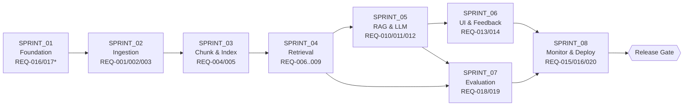

# DONE_CHECKLIST — Cross-Sprint Definition of Done

> The single release gate for the Pokemon TCG Rules RAG Expert Assistant. The
> project is **accepted** only when every non-bonus row below is checked. Rows
> cross-link to [`REQUIREMENTS.md`](../00_project/REQUIREMENTS.md),
> [`SUCCESS_CRITERIA.md`](../00_project/SUCCESS_CRITERIA.md), and the sprint that
> delivers them.

## Sprint Sequencing (delivery order)

---

## 1. Rubric Coverage (DataTalks / LLM Zoomcamp)

| Rubric Line | Max pts | Evidence | Sprint | Done |
| :--- | :--- | :--- | :--- | :--- |
| Problem description | 2 | [PROJECT.md](../00_project/PROJECT.md) §2 clearly states the domain problem. | — | [ ] |
| Retrieval flow (KB + LLM) | 2 | `rag_chain` uses Qdrant KB + LLM; [SC-021](../00_project/SUCCESS_CRITERIA.md). | [S5](./SPRINT_05_RAG_LLM.md) | [ ] |
| Retrieval evaluation (multi, best) | 2 | 4 strategies benchmarked, best selected; [SC-005](../00_project/SUCCESS_CRITERIA.md). | [S7](./SPRINT_07_EVALUATION.md) | [ ] |
| LLM evaluation (multi, best) | 2 | ≥2 prompts + ≥2 models; [SC-010](../00_project/SUCCESS_CRITERIA.md). | [S7](./SPRINT_07_EVALUATION.md) | [ ] |
| Interface (UI/API) | 2 | Streamlit UI + FastAPI; [SC-021](../00_project/SUCCESS_CRITERIA.md). | [S6](./SPRINT_06_UI_FEEDBACK.md) | [ ] |
| Ingestion pipeline (automated) | 2 | Automated crawler + PDF + HTML orchestrator; [SC-015](../00_project/SUCCESS_CRITERIA.md). | [S2](./SPRINT_02_INGESTION.md) | [ ] |
| Monitoring (feedback + dashboard ≥5 charts) | 2 | Feedback → Postgres + Grafana ≥6 charts; [SC-017](../00_project/SUCCESS_CRITERIA.md)/018. | [S6](./SPRINT_06_UI_FEEDBACK.md), [S8](./SPRINT_08_MONITORING_DEPLOY.md) | [ ] |
| Containerization (all in compose) | 2 | 7 services in one `docker-compose.yml`; [SC-024](../00_project/SUCCESS_CRITERIA.md). | [S8](./SPRINT_08_MONITORING_DEPLOY.md) | [ ] |
| Reproducibility (pinned deps) | 2 | Clean-clone `up`; pinned versions; [SC-014](../00_project/SUCCESS_CRITERIA.md)/019/024. | [S1](./SPRINT_01_FOUNDATION.md), [S8](./SPRINT_08_MONITORING_DEPLOY.md) | [ ] |
| Best practice: Hybrid search | +1 | RRF hybrid implemented + ablated; [SC-022](../00_project/SUCCESS_CRITERIA.md). | [S4](./SPRINT_04_RETRIEVAL.md), [S7](./SPRINT_07_EVALUATION.md) | [ ] |
| Best practice: Re-ranking | +1 | `bge-reranker-large` + ablated; [SC-022](../00_project/SUCCESS_CRITERIA.md). | [S4](./SPRINT_04_RETRIEVAL.md), [S7](./SPRINT_07_EVALUATION.md) | [ ] |
| Best practice: Query rewriting | +1 | LLM rewrite + ablated; [SC-022](../00_project/SUCCESS_CRITERIA.md). | [S5](./SPRINT_05_RAG_LLM.md), [S7](./SPRINT_07_EVALUATION.md) | [ ] |
| Bonus: Cloud deploy | +2 | Public URL `/health` 200; [SC-023](../00_project/SUCCESS_CRITERIA.md) (non-blocking). | [S8](./SPRINT_08_MONITORING_DEPLOY.md) | [ ] |

---

## 2. Per-Requirement Validation

| REQ | Requirement | Sprint | SC / Test evidence | Done |
| :--- | :--- | :--- | :--- | :--- |
| [REQ-001](../00_project/REQUIREMENTS.md) | Pokegym rulings scraped → JSON | [S2](./SPRINT_02_INGESTION.md) | [SC-015](../00_project/SUCCESS_CRITERIA.md) | [ ] |
| [REQ-002](../00_project/REQUIREMENTS.md) | PDFs downloaded + parsed (PyMuPDF) | [S2](./SPRINT_02_INGESTION.md) | [SC-015](../00_project/SUCCESS_CRITERIA.md) | [ ] |
| [REQ-003](../00_project/REQUIREMENTS.md) | Ban/promo/mega HTML scraped | [S2](./SPRINT_02_INGESTION.md) | [SC-015](../00_project/SUCCESS_CRITERIA.md) | [ ] |
| [REQ-004](../00_project/REQUIREMENTS.md) | Normalize + chunk + metadata | [S3](./SPRINT_03_CHUNKING_INDEXING.md) | [SC-015](../00_project/SUCCESS_CRITERIA.md) | [ ] |
| [REQ-005](../00_project/REQUIREMENTS.md) | Index embeddings into Qdrant | [S3](./SPRINT_03_CHUNKING_INDEXING.md) | [SC-015](../00_project/SUCCESS_CRITERIA.md) | [ ] |
| [REQ-006](../00_project/REQUIREMENTS.md) | Dense retrieval (BGE) | [S4](./SPRINT_04_RETRIEVAL.md) | [SC-005](../00_project/SUCCESS_CRITERIA.md) | [ ] |
| [REQ-007](../00_project/REQUIREMENTS.md) | BM25 retrieval | [S4](./SPRINT_04_RETRIEVAL.md) | [SC-005](../00_project/SUCCESS_CRITERIA.md) | [ ] |
| [REQ-008](../00_project/REQUIREMENTS.md) | Hybrid RRF | [S4](./SPRINT_04_RETRIEVAL.md) | [SC-005](../00_project/SUCCESS_CRITERIA.md)/022 | [ ] |
| [REQ-009](../00_project/REQUIREMENTS.md) | Cross-encoder rerank | [S4](./SPRINT_04_RETRIEVAL.md) | [SC-022](../00_project/SUCCESS_CRITERIA.md) | [ ] |
| [REQ-010](../00_project/REQUIREMENTS.md) | LLM query rewriting | [S5](./SPRINT_05_RAG_LLM.md) | [SC-022](../00_project/SUCCESS_CRITERIA.md) | [ ] |
| [REQ-011](../00_project/REQUIREMENTS.md) | Certified-Judge grounding | [S5](./SPRINT_05_RAG_LLM.md) | [SC-006](../00_project/SUCCESS_CRITERIA.md)/011 | [ ] |
| [REQ-012](../00_project/REQUIREMENTS.md) | Mandatory citations | [S5](./SPRINT_05_RAG_LLM.md) | [SC-008](../00_project/SUCCESS_CRITERIA.md) | [ ] |
| [REQ-013](../00_project/REQUIREMENTS.md) | Streamlit UI | [S6](./SPRINT_06_UI_FEEDBACK.md) | [SC-021](../00_project/SUCCESS_CRITERIA.md) | [ ] |
| [REQ-014](../00_project/REQUIREMENTS.md) | Feedback → Postgres | [S6](./SPRINT_06_UI_FEEDBACK.md) | [SC-018](../00_project/SUCCESS_CRITERIA.md) | [ ] |
| [REQ-015](../00_project/REQUIREMENTS.md) | Prometheus + Grafana ≥5 charts | [S8](./SPRINT_08_MONITORING_DEPLOY.md) | [SC-017](../00_project/SUCCESS_CRITERIA.md) | [ ] |
| [REQ-016](../00_project/REQUIREMENTS.md) | All services in Docker Compose | [S1](./SPRINT_01_FOUNDATION.md)*, [S8](./SPRINT_08_MONITORING_DEPLOY.md) | [SC-014](../00_project/SUCCESS_CRITERIA.md)/024 | [ ] |
| [REQ-017](../00_project/REQUIREMENTS.md) | ≥90% coverage, CI-enforced | [S1](./SPRINT_01_FOUNDATION.md)* (all sprints) | [SC-016](../00_project/SUCCESS_CRITERIA.md)/020 | [ ] |
| [REQ-018](../00_project/REQUIREMENTS.md) | Retrieval eval (Recall@K, MRR) | [S7](./SPRINT_07_EVALUATION.md) | [SC-001](../00_project/SUCCESS_CRITERIA.md)–005 | [ ] |
| [REQ-019](../00_project/REQUIREMENTS.md) | LLM eval (Faithfulness, Correctness) | [S7](./SPRINT_07_EVALUATION.md) | [SC-006](../00_project/SUCCESS_CRITERIA.md)–010 | [ ] |
| [REQ-020](../00_project/REQUIREMENTS.md) | Cloud/IaC deploy (bonus) | [S8](./SPRINT_08_MONITORING_DEPLOY.md) | [SC-023](../00_project/SUCCESS_CRITERIA.md) | [ ] |

`*` = partial in Sprint 1, completed later.

---

## 3. Global Quality Gates

| Gate | Criterion | Command / Evidence | SC | Done |
| :--- | :--- | :--- | :--- | :--- |
| All tests pass | Unit + integration + smoke green | `pytest` on `main` | — | [ ] |
| Coverage ≥ 90% | Line coverage on `src/pokemon_tcg_rag` | `pytest --cov` gate | [SC-016](../00_project/SUCCESS_CRITERIA.md) | [ ] |
| Lint clean | `ruff` 0 errors | `ruff check` | [SC-020](../00_project/SUCCESS_CRITERIA.md) | [ ] |
| Types clean | `mypy --strict` 0 errors | `mypy src/pokemon_tcg_rag` | [SC-020](../00_project/SUCCESS_CRITERIA.md) | [ ] |
| Deps pinned | 100% version-constrained | lint `requirements.txt`/`pyproject.toml` | [SC-019](../00_project/SUCCESS_CRITERIA.md) | [ ] |
| Compose up works | Stack healthy < 60 s | `docker compose up` (images pre-pulled) | [SC-014](../00_project/SUCCESS_CRITERIA.md) | [ ] |
| Clean-clone reproducible | Fresh clone → `.env` → `up` → answered query | Validated on clean machine/CI | [SC-024](../00_project/SUCCESS_CRITERIA.md) | [ ] |
| Evaluation report produced | Comparison tables + best config + baselines | [S7](./SPRINT_07_EVALUATION.md) artifact | [SC-005](../00_project/SUCCESS_CRITERIA.md)/010 | [ ] |
| Docs updated | All `docs/` reflect implemented reality | README sitemap + [TRACEABILITY_MATRIX.md](../05_agent_harness/TRACEABILITY_MATRIX.md) | — | [ ] |
| No stray TODO/FIXME | Clean `main` branch | grep of source tree | — | [ ] |
| No hardcoded config | Everything via `Settings`/`.env` | review + [Security.md](../01_architecture/Security.md) | — | [ ] |

---

## 4. Performance & Grounding Gates

| Gate | Target | SC | Done |
| :--- | :--- | :--- | :--- |
| Mean end-to-end latency | < 2.0 s (warm) | [SC-012](../00_project/SUCCESS_CRITERIA.md) | [ ] |
| P95 latency | < 4.0 s | [SC-013](../00_project/SUCCESS_CRITERIA.md) | [ ] |
| Abstention on unsupported queries | 100% "I don't know" (10-item set) | [SC-011](../00_project/SUCCESS_CRITERIA.md) | [ ] |
| Best Recall@10 | > 0.90 | [SC-001](../00_project/SUCCESS_CRITERIA.md) | [ ] |
| Faithfulness | > 0.85 | [SC-006](../00_project/SUCCESS_CRITERIA.md) | [ ] |
| Regression baselines stored | Recall/Faithfulness/latency do not regress | [§3 SUCCESS_CRITERIA](../00_project/SUCCESS_CRITERIA.md) | [ ] |

---

## 5. Acceptance Statement

The project is **accepted** when:

1. Every non-bonus row in §1–§4 is checked.
2. Best retrieval strategy ([SC-005](../00_project/SUCCESS_CRITERIA.md)) and best LLM config ([SC-010](../00_project/SUCCESS_CRITERIA.md)) are documented with comparison evidence.
3. A clean-clone reproducibility run ([SC-024](../00_project/SUCCESS_CRITERIA.md)) succeeds end-to-end.

Bonus row (cloud deploy, [SC-023](../00_project/SUCCESS_CRITERIA.md)) is additive and does not block acceptance.

## Cross-References

- Sprints: [S1](./SPRINT_01_FOUNDATION.md) · [S2](./SPRINT_02_INGESTION.md) · [S3](./SPRINT_03_CHUNKING_INDEXING.md) · [S4](./SPRINT_04_RETRIEVAL.md) · [S5](./SPRINT_05_RAG_LLM.md) · [S6](./SPRINT_06_UI_FEEDBACK.md) · [S7](./SPRINT_07_EVALUATION.md) · [S8](./SPRINT_08_MONITORING_DEPLOY.md)
- [REQUIREMENTS.md](../00_project/REQUIREMENTS.md) · [SUCCESS_CRITERIA.md](../00_project/SUCCESS_CRITERIA.md) · [QUALITY_GATE_SPECIFICATION.md](../05_agent_harness/QUALITY_GATE_SPECIFICATION.md) · [TRACEABILITY_MATRIX.md](../05_agent_harness/TRACEABILITY_MATRIX.md)
