# DONE_CHECKLIST — Cross-Sprint Definition of Done

> The single release gate for the Pokemon TCG Rules RAG Expert Assistant. The
> project is **accepted** only when every non-bonus row below is checked. Rows
> cross-link to [`REQUIREMENTS.md`](../00_project/REQUIREMENTS.md),
> [`SUCCESS_CRITERIA.md`](../00_project/SUCCESS_CRITERIA.md), and the sprint that
> delivers them.

## Sprint Sequencing (delivery order)

```mermaid
flowchart LR
    S1[SPRINT_01<br/>Foundation<br/>REQ-016/017*]
    S2[SPRINT_02<br/>Ingestion<br/>REQ-001/002/003]
    S3[SPRINT_03<br/>Chunk &amp; Index<br/>REQ-004/005]
    S4[SPRINT_04<br/>Retrieval<br/>REQ-006..009]
    S5[SPRINT_05<br/>RAG &amp; LLM<br/>REQ-010/011/012]
    S6[SPRINT_06<br/>UI &amp; Feedback<br/>REQ-013/014]
    S7[SPRINT_07<br/>Evaluation<br/>REQ-018/019]
    S8[SPRINT_08<br/>Monitor &amp; Deploy<br/>REQ-015/016/020]
    S9[SPRINT_09<br/>Containment<br/>REQ-021/024/028/030]
    S10[SPRINT_10<br/>API &amp; LLM Security<br/>REQ-022/023/025/026]
    S11[SPRINT_11<br/>Platform Hardening<br/>REQ-021/024/027/028]
    S12[SPRINT_12<br/>Security Assurance<br/>REQ-029/030]
    S13[SPRINT_13<br/>Runtime Stabilization<br/>REQ-031/032]
    S14[SPRINT_14<br/>Quality/Repro<br/>REQ-033/034]
    S15[SPRINT_15<br/>Retrieval Quality<br/>REQ-035/036]
    S16[SPRINT_16<br/>LLM Quality<br/>REQ-037]
    S17[SPRINT_17<br/>Observability/UX<br/>REQ-038/039]
    S18[SPRINT_18<br/>Production<br/>REQ-040/041/042]

    S1 --> S2 --> S3 --> S4 --> S5 --> S6
    S4 --> S7
    S5 --> S7
    S6 --> S8
    S7 --> S8
    S8 --> S9 --> S10 --> S11 --> S12 --> S13 --> S14
    S14 --> S15 --> S16 --> S17 --> S18 --> DONE{{Production Release Gate}}
```

---

## 1. Rubric Coverage (DataTalks / LLM Zoomcamp)

| Rubric Line | Max pts | Evidence | Sprint | Done |
| :--- | :--- | :--- | :--- | :--- |
| Problem description | 2 | [PROJECT.md](../00_project/PROJECT.md) §2 clearly states the domain problem. | — | [ ] |
| Retrieval flow (KB + LLM) | 2 | `rag_chain` uses Qdrant KB + LLM; [SC-021](../00_project/SUCCESS_CRITERIA.md). | [S5](./SPRINT_05_RAG_LLM.md) | [ ] |
| Retrieval evaluation (multi, best) | 2 | 4 strategies benchmarked, best selected; [SC-005](../00_project/SUCCESS_CRITERIA.md). | [S7](./SPRINT_07_EVALUATION.md) | [ ] |
| LLM evaluation (multi, best) | 2 | ≥2 prompts + ≥2 models; [SC-010](../00_project/SUCCESS_CRITERIA.md). | [S7](./SPRINT_07_EVALUATION.md) | [ ] |
| Interface (UI/API) | 2 | Streamlit UI + FastAPI; [SC-021](../00_project/SUCCESS_CRITERIA.md). | [S6](./SPRINT_06_UI_FEEDBACK.md) | [ ] |
| Ingestion pipeline (automated) | 2 | Automated crawler + PDF + HTML orchestrator; [SC-015](../00_project/SUCCESS_CRITERIA.md). | [S2](./SPRINT_02_INGESTION.md) | [ ] |
| Monitoring (feedback + dashboard ≥5 charts) | 2 | Feedback → Postgres + Grafana ≥6 charts; [SC-017](../00_project/SUCCESS_CRITERIA.md)/018. | [S6](./SPRINT_06_UI_FEEDBACK.md), [S8](./SPRINT_08_MONITORING_DEPLOY.md) | [ ] |
| Containerization (all in compose) | 2 | 7 services in one `docker-compose.yml`; [SC-024](../00_project/SUCCESS_CRITERIA.md). | [S8](./SPRINT_08_MONITORING_DEPLOY.md) | [ ] |
| Reproducibility (pinned deps) | 2 | Clean-clone `up`; pinned versions; [SC-014](../00_project/SUCCESS_CRITERIA.md)/019/024. | [S1](./SPRINT_01_FOUNDATION.md), [S8](./SPRINT_08_MONITORING_DEPLOY.md) | [ ] |
| Best practice: Hybrid search | +1 | RRF hybrid implemented + ablated; [SC-022](../00_project/SUCCESS_CRITERIA.md). | [S4](./SPRINT_04_RETRIEVAL.md), [S7](./SPRINT_07_EVALUATION.md) | [ ] |
| Best practice: Re-ranking | +1 | `bge-reranker-large` + ablated; [SC-022](../00_project/SUCCESS_CRITERIA.md). | [S4](./SPRINT_04_RETRIEVAL.md), [S7](./SPRINT_07_EVALUATION.md) | [ ] |
| Best practice: Query rewriting | +1 | LLM rewrite + ablated; [SC-022](../00_project/SUCCESS_CRITERIA.md). | [S5](./SPRINT_05_RAG_LLM.md), [S7](./SPRINT_07_EVALUATION.md) | [ ] |
| Bonus: Cloud deploy | +2 | Public URL `/health` 200; [SC-023](../00_project/SUCCESS_CRITERIA.md) (non-blocking). | [S8](./SPRINT_08_MONITORING_DEPLOY.md) | [ ] |

---

## 2. Per-Requirement Validation

| REQ | Requirement | Sprint | SC / Test evidence | Done |
| :--- | :--- | :--- | :--- | :--- |
| [REQ-001](../00_project/REQUIREMENTS.md) | Pokegym rulings scraped → JSON | [S2](./SPRINT_02_INGESTION.md) | [SC-015](../00_project/SUCCESS_CRITERIA.md) | [ ] |
| [REQ-002](../00_project/REQUIREMENTS.md) | PDFs downloaded + parsed (PyMuPDF) | [S2](./SPRINT_02_INGESTION.md) | [SC-015](../00_project/SUCCESS_CRITERIA.md) | [ ] |
| [REQ-003](../00_project/REQUIREMENTS.md) | Ban/promo/mega HTML scraped | [S2](./SPRINT_02_INGESTION.md) | [SC-015](../00_project/SUCCESS_CRITERIA.md) | [ ] |
| [REQ-004](../00_project/REQUIREMENTS.md) | Normalize + chunk + metadata | [S3](./SPRINT_03_CHUNKING_INDEXING.md) | [SC-015](../00_project/SUCCESS_CRITERIA.md) | [ ] |
| [REQ-005](../00_project/REQUIREMENTS.md) | Index embeddings into Qdrant | [S3](./SPRINT_03_CHUNKING_INDEXING.md) | [SC-015](../00_project/SUCCESS_CRITERIA.md) | [ ] |
| [REQ-006](../00_project/REQUIREMENTS.md) | Dense retrieval (BGE) | [S4](./SPRINT_04_RETRIEVAL.md) | [SC-005](../00_project/SUCCESS_CRITERIA.md) | [ ] |
| [REQ-007](../00_project/REQUIREMENTS.md) | BM25 retrieval | [S4](./SPRINT_04_RETRIEVAL.md) | [SC-005](../00_project/SUCCESS_CRITERIA.md) | [ ] |
| [REQ-008](../00_project/REQUIREMENTS.md) | Hybrid RRF | [S4](./SPRINT_04_RETRIEVAL.md) | [SC-005](../00_project/SUCCESS_CRITERIA.md)/022 | [ ] |
| [REQ-009](../00_project/REQUIREMENTS.md) | Cross-encoder rerank | [S4](./SPRINT_04_RETRIEVAL.md) | [SC-022](../00_project/SUCCESS_CRITERIA.md) | [ ] |
| [REQ-010](../00_project/REQUIREMENTS.md) | LLM query rewriting | [S5](./SPRINT_05_RAG_LLM.md) | [SC-022](../00_project/SUCCESS_CRITERIA.md) | [ ] |
| [REQ-011](../00_project/REQUIREMENTS.md) | Certified-Judge grounding | [S5](./SPRINT_05_RAG_LLM.md) | [SC-006](../00_project/SUCCESS_CRITERIA.md)/011 | [ ] |
| [REQ-012](../00_project/REQUIREMENTS.md) | Mandatory citations | [S5](./SPRINT_05_RAG_LLM.md) | [SC-008](../00_project/SUCCESS_CRITERIA.md) | [ ] |
| [REQ-013](../00_project/REQUIREMENTS.md) | Streamlit UI | [S6](./SPRINT_06_UI_FEEDBACK.md) | [SC-021](../00_project/SUCCESS_CRITERIA.md) | [ ] |
| [REQ-014](../00_project/REQUIREMENTS.md) | Feedback → Postgres | [S6](./SPRINT_06_UI_FEEDBACK.md) | [SC-018](../00_project/SUCCESS_CRITERIA.md) | [ ] |
| [REQ-015](../00_project/REQUIREMENTS.md) | Prometheus + Grafana ≥5 charts | [S8](./SPRINT_08_MONITORING_DEPLOY.md) | [SC-017](../00_project/SUCCESS_CRITERIA.md) | [ ] |
| [REQ-016](../00_project/REQUIREMENTS.md) | All services in Docker Compose | [S1](./SPRINT_01_FOUNDATION.md)*, [S8](./SPRINT_08_MONITORING_DEPLOY.md) | [SC-014](../00_project/SUCCESS_CRITERIA.md)/024 | [ ] |
| [REQ-017](../00_project/REQUIREMENTS.md) | ≥90% coverage, CI-enforced | [S1](./SPRINT_01_FOUNDATION.md)* (all sprints) | [SC-016](../00_project/SUCCESS_CRITERIA.md)/020 | [ ] |
| [REQ-018](../00_project/REQUIREMENTS.md) | Retrieval eval (Recall@K, MRR) | [S7](./SPRINT_07_EVALUATION.md) | [SC-001](../00_project/SUCCESS_CRITERIA.md)–005 | [ ] |
| [REQ-019](../00_project/REQUIREMENTS.md) | LLM eval (Faithfulness, Correctness) | [S7](./SPRINT_07_EVALUATION.md) | [SC-006](../00_project/SUCCESS_CRITERIA.md)–010 | [ ] |
| [REQ-020](../00_project/REQUIREMENTS.md) | Cloud/IaC deploy (bonus) | [S8](./SPRINT_08_MONITORING_DEPLOY.md) | [SC-023](../00_project/SUCCESS_CRITERIA.md) | [ ] |
| [REQ-021](../00_project/REQUIREMENTS.md) | Reproducible/verifiable supply chain | [S9](./SPRINT_09_SECURITY_CONTAINMENT.md), [S11](./SPRINT_11_PLATFORM_HARDENING.md), [S12](./SPRINT_12_SECURITY_ASSURANCE.md) | [SC-025](../00_project/SUCCESS_CRITERIA.md)/034 | [ ] |
| [REQ-022](../00_project/REQUIREMENTS.md) | API authentication and authorization | [S10](./SPRINT_10_API_LLM_SECURITY.md), [S12](./SPRINT_12_SECURITY_ASSURANCE.md) | [SC-027](../00_project/SUCCESS_CRITERIA.md)/034 | [ ] |
| [REQ-023](../00_project/REQUIREMENTS.md) | Resource and cost controls | [S10](./SPRINT_10_API_LLM_SECURITY.md), [S12](./SPRINT_12_SECURITY_ASSURANCE.md) | [SC-028](../00_project/SUCCESS_CRITERIA.md)/033 | [ ] |
| [REQ-024](../00_project/REQUIREMENTS.md) | SSRF/network destination controls | [S9](./SPRINT_09_SECURITY_CONTAINMENT.md), [S11](./SPRINT_11_PLATFORM_HARDENING.md) | [SC-026](../00_project/SUCCESS_CRITERIA.md) | [ ] |
| [REQ-025](../00_project/REQUIREMENTS.md) | Prompt/citation integrity | [S10](./SPRINT_10_API_LLM_SECURITY.md), [S12](./SPRINT_12_SECURITY_ASSURANCE.md) | [SC-029](../00_project/SUCCESS_CRITERIA.md) | [ ] |
| [REQ-026](../00_project/REQUIREMENTS.md) | Privacy, feedback integrity, safe disclosure | [S10](./SPRINT_10_API_LLM_SECURITY.md) | [SC-032](../00_project/SUCCESS_CRITERIA.md) | [ ] |
| [REQ-027](../00_project/REQUIREMENTS.md) | Container/Kubernetes hardening | [S11](./SPRINT_11_PLATFORM_HARDENING.md) | [SC-031](../00_project/SUCCESS_CRITERIA.md) | [ ] |
| [REQ-028](../00_project/REQUIREMENTS.md) | Secrets/network/database least privilege | [S9](./SPRINT_09_SECURITY_CONTAINMENT.md), [S11](./SPRINT_11_PLATFORM_HARDENING.md) | [SC-030](../00_project/SUCCESS_CRITERIA.md) | [ ] |
| [REQ-029](../00_project/REQUIREMENTS.md) | Hardened ingestion boundary | [S12](./SPRINT_12_SECURITY_ASSURANCE.md) | [SC-033](../00_project/SUCCESS_CRITERIA.md) | [ ] |
| [REQ-030](../00_project/REQUIREMENTS.md) | Continuous assurance/release gate | [S9](./SPRINT_09_SECURITY_CONTAINMENT.md), [S12](./SPRINT_12_SECURITY_ASSURANCE.md) | [SC-034](../00_project/SUCCESS_CRITERIA.md) | [ ] |
| [REQ-031](../00_project/REQUIREMENTS.md) | Production composition and query/feedback lifecycle | [S13](./SPRINT_13_RUNTIME_STABILIZATION.md) | [SC-035](../00_project/SUCCESS_CRITERIA.md), TEST-149/150/152/153 | [ ] |
| [REQ-032](../00_project/REQUIREMENTS.md) | Deterministic corpus and index lifecycle | [S13](./SPRINT_13_RUNTIME_STABILIZATION.md), [S15](./SPRINT_15_RETRIEVAL_QUALITY.md) | [SC-036](../00_project/SUCCESS_CRITERIA.md), TEST-149/151/162 | [ ] |
| [REQ-033](../00_project/REQUIREMENTS.md) | Quality and real test pyramid | [S14](./SPRINT_14_QUALITY_REPRODUCIBILITY.md) | [SC-037](../00_project/SUCCESS_CRITERIA.md)/038, TEST-154..157 | [ ] |
| [REQ-034](../00_project/REQUIREMENTS.md) | Clean-clone/evidence-backed docs | [S14](./SPRINT_14_QUALITY_REPRODUCIBILITY.md) | [SC-038](../00_project/SUCCESS_CRITERIA.md), TEST-155/157/158 | [ ] |
| [REQ-035](../00_project/REQUIREMENTS.md) | Reviewed benchmark | [S15](./SPRINT_15_RETRIEVAL_QUALITY.md) | [SC-039](../00_project/SUCCESS_CRITERIA.md), TEST-159 | [ ] |
| [REQ-036](../00_project/REQUIREMENTS.md) | Real retrieval evaluation/regression | [S15](./SPRINT_15_RETRIEVAL_QUALITY.md) | [SC-040](../00_project/SUCCESS_CRITERIA.md), TEST-160..163 | [ ] |
| [REQ-037](../00_project/REQUIREMENTS.md) | Real LLM evaluation/grounding | [S16](./SPRINT_16_LLM_QUALITY.md) | [SC-041](../00_project/SUCCESS_CRITERIA.md)/042, TEST-164..168 | [ ] |
| [REQ-038](../00_project/REQUIREMENTS.md) | Observability/SLO/FinOps | [S17](./SPRINT_17_OBSERVABILITY_UX.md) | [SC-043](../00_project/SUCCESS_CRITERIA.md), TEST-169..171/173 | [ ] |
| [REQ-039](../00_project/REQUIREMENTS.md) | Complete product experience | [S17](./SPRINT_17_OBSERVABILITY_UX.md) | [SC-044](../00_project/SUCCESS_CRITERIA.md), TEST-171..173 | [ ] |
| [REQ-040](../00_project/REQUIREMENTS.md) | Cache/performance/scalability | [S18](./SPRINT_18_PRODUCTION_QUALIFICATION.md) | [SC-045](../00_project/SUCCESS_CRITERIA.md), TEST-174/175 | [ ] |
| [REQ-041](../00_project/REQUIREMENTS.md) | Cloud staging/recovery | [S18](./SPRINT_18_PRODUCTION_QUALIFICATION.md) | [SC-046](../00_project/SUCCESS_CRITERIA.md)/047, TEST-176/177 | [ ] |
| [REQ-042](../00_project/REQUIREMENTS.md) | Production qualification | [S18](./SPRINT_18_PRODUCTION_QUALIFICATION.md) | [SC-048](../00_project/SUCCESS_CRITERIA.md), TEST-178 | [ ] |

`*` = partial in Sprint 1, completed later.

---

## 3. Global Quality Gates

| Gate | Criterion | Command / Evidence | SC | Done |
| :--- | :--- | :--- | :--- | :--- |
| All tests pass | Unit + integration + smoke green | `pytest` on `main` | — | [ ] |
| Coverage ≥ 90% | Line coverage on `src/pokemon_tcg_rag` | `pytest --cov` gate | [SC-016](../00_project/SUCCESS_CRITERIA.md) | [ ] |
| Lint clean | `ruff` 0 errors | `ruff check` | [SC-020](../00_project/SUCCESS_CRITERIA.md) | [ ] |
| Types clean | `mypy --strict` 0 errors | `mypy src/pokemon_tcg_rag` | [SC-020](../00_project/SUCCESS_CRITERIA.md) | [ ] |
| Deps pinned | 100% version-constrained | lint `requirements.txt`/`pyproject.toml` | [SC-019](../00_project/SUCCESS_CRITERIA.md) | [ ] |
| Compose up works | Stack healthy < 60 s | `docker compose up` (images pre-pulled) | [SC-014](../00_project/SUCCESS_CRITERIA.md) | [ ] |
| Clean-clone reproducible | Fresh clone → `.env` → `up` → answered query | Validated on clean machine/CI | [SC-024](../00_project/SUCCESS_CRITERIA.md) | [ ] |
| Evaluation report produced | Comparison tables + best config + baselines | [S7](./SPRINT_07_EVALUATION.md) artifact | [SC-005](../00_project/SUCCESS_CRITERIA.md)/010 | [ ] |
| Docs updated | All `docs/` reflect implemented reality | README sitemap + [TRACEABILITY_MATRIX.md](../05_agent_harness/TRACEABILITY_MATRIX.md) | — | [ ] |
| No stray TODO/FIXME | Clean `main` branch | grep of source tree | — | [ ] |
| No hardcoded config | Everything via `Settings`/`.env` | review + [Security.md](../01_architecture/Security.md) | — | [ ] |
| Supply chain clean | Lock/SBOM/provenance; no unaccepted Critical/High | GATE-013/017 evidence | [SC-025](../00_project/SUCCESS_CRITERIA.md) | [ ] |
| Secret history clean | No verified secret in tree or reachable history | GATE-014 report | [SC-030](../00_project/SUCCESS_CRITERIA.md) | [ ] |
| Secure platform policy | Rootless/restricted workloads, immutable images, segmented network | GATE-016 evidence | [SC-030](../00_project/SUCCESS_CRITERIA.md)/031 | [ ] |
| DAST/adversarial clean | API, SSRF and LLM probes have no open Critical/High | GATE-018 report | [SC-026](../00_project/SUCCESS_CRITERIA.md)–029/032 | [ ] |
| Audit findings closed | SEC-01..SEC-17 linked to fix, test and evidence or accepted with owner/expiry | TEST-148 evidence bundle | [SC-034](../00_project/SUCCESS_CRITERIA.md) | [ ] |
| Runtime/corpus proven | Real composition, BM25/Qdrant parity and query/feedback journey pass from clean state | TEST-149..153 | [SC-035](../00_project/SUCCESS_CRITERIA.md)/036 | [ ] |
| Real test pyramid | Static/coverage gate plus real infrastructure and browser/API E2E pass | TEST-154..158 | [SC-037](../00_project/SUCCESS_CRITERIA.md)/038 | [ ] |
| Retrieval evidence real | Reviewed benchmark, production adapters, ablations and regression report pass | TEST-159..163 | [SC-039](../00_project/SUCCESS_CRITERIA.md)/040 | [ ] |
| LLM evidence real | Automatic/human evaluation and claim-level citation validation pass | TEST-164..168 | [SC-041](../00_project/SUCCESS_CRITERIA.md)/042 | [ ] |
| Operability proven | Traces, SLO/cost alerts, live dashboards, UX and runbooks pass | TEST-169..173 | [SC-043](../00_project/SUCCESS_CRITERIA.md)/044 | [ ] |
| Scale/cloud/recovery proven | Cache/load budgets, remote staging and recovery/rollback pass | TEST-174..177 | [SC-045](../00_project/SUCCESS_CRITERIA.md)–047 | [ ] |
| Production scorecard approved | All SEC/TECH findings and blocking SCs have fresh release-matched evidence | TEST-178 | [SC-048](../00_project/SUCCESS_CRITERIA.md) | [ ] |

---

## 4. Performance & Grounding Gates

| Gate | Target | SC | Done |
| :--- | :--- | :--- | :--- |
| Mean end-to-end latency | < 2.0 s (warm) | [SC-012](../00_project/SUCCESS_CRITERIA.md) | [ ] |
| P95 latency | < 4.0 s | [SC-013](../00_project/SUCCESS_CRITERIA.md) | [ ] |
| Abstention on unsupported queries | 100% "I don't know" (10-item set) | [SC-011](../00_project/SUCCESS_CRITERIA.md) | [ ] |
| Best Recall@10 | > 0.90 | [SC-001](../00_project/SUCCESS_CRITERIA.md) | [ ] |
| Faithfulness | > 0.85 | [SC-006](../00_project/SUCCESS_CRITERIA.md) | [ ] |
| Regression baselines stored | Recall/Faithfulness/latency do not regress | [§3 SUCCESS_CRITERIA](../00_project/SUCCESS_CRITERIA.md) | [ ] |

---

## 5. Acceptance Statement

The project is **accepted** when:

1. Every non-bonus row in §1–§4 is checked.
2. Best retrieval strategy ([SC-005](../00_project/SUCCESS_CRITERIA.md)) and best LLM config ([SC-010](../00_project/SUCCESS_CRITERIA.md)) are documented with comparison evidence.
3. A clean-clone reproducibility run ([SC-024](../00_project/SUCCESS_CRITERIA.md)) succeeds end-to-end.
4. Every SEC-01..SEC-17 audit finding is verified closed or has an accountable,
   expiry-bound residual-risk acceptance.
5. Every TECH-01..TECH-30 audit finding is verified closed or has an accountable,
   expiry-bound residual-risk acceptance.
6. The final scorecard references the exact released code, corpus, benchmark, configuration and
   image hashes and is approved by Security, Tech Lead and Product.

The legacy rubric bonus row [SC-023](../00_project/SUCCESS_CRITERIA.md) remains additive, but
staging deployment under SC-046 is mandatory for the production-qualification program.

## Cross-References

- Sprints: [S1](./SPRINT_01_FOUNDATION.md) · [S2](./SPRINT_02_INGESTION.md) · [S3](./SPRINT_03_CHUNKING_INDEXING.md) · [S4](./SPRINT_04_RETRIEVAL.md) · [S5](./SPRINT_05_RAG_LLM.md) · [S6](./SPRINT_06_UI_FEEDBACK.md) · [S7](./SPRINT_07_EVALUATION.md) · [S8](./SPRINT_08_MONITORING_DEPLOY.md) · [S9](./SPRINT_09_SECURITY_CONTAINMENT.md) · [S10](./SPRINT_10_API_LLM_SECURITY.md) · [S11](./SPRINT_11_PLATFORM_HARDENING.md) · [S12](./SPRINT_12_SECURITY_ASSURANCE.md) · [S13](./SPRINT_13_RUNTIME_STABILIZATION.md) · [S14](./SPRINT_14_QUALITY_REPRODUCIBILITY.md) · [S15](./SPRINT_15_RETRIEVAL_QUALITY.md) · [S16](./SPRINT_16_LLM_QUALITY.md) · [S17](./SPRINT_17_OBSERVABILITY_UX.md) · [S18](./SPRINT_18_PRODUCTION_QUALIFICATION.md)
- [REQUIREMENTS.md](../00_project/REQUIREMENTS.md) · [SUCCESS_CRITERIA.md](../00_project/SUCCESS_CRITERIA.md) · [QUALITY_GATE_SPECIFICATION.md](../05_agent_harness/QUALITY_GATE_SPECIFICATION.md) · [TRACEABILITY_MATRIX.md](../05_agent_harness/TRACEABILITY_MATRIX.md)
