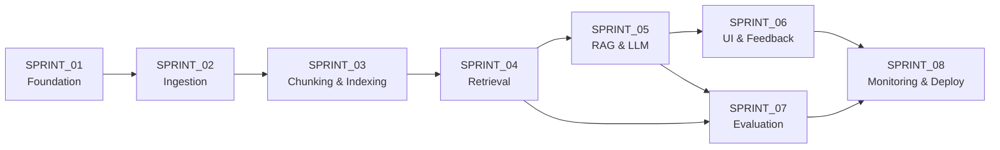

# SPRINT_01 — Foundation: Project Scaffold & Infrastructure Setup

> Part of the [Engineering Harness](../README.md). Requirements live in
> [`REQUIREMENTS.md`](../00_project/REQUIREMENTS.md); measurable targets in
> [`SUCCESS_CRITERIA.md`](../00_project/SUCCESS_CRITERIA.md). Task specs:
> [`TASKS_SPRINT_01.md`](../03_tasks/TASKS_SPRINT_01.md).

## Sprint Goal

Establish a reproducible, type-safe Clean-Architecture skeleton for the
`pokemon_tcg_rag` package so that every downstream sprint plugs into a stable
foundation: configuration, domain models, container skeleton, CI, and enforced
coding standards. **No RAG behavior is implemented here** — only the scaffold on
which it is built.

## Duration / Position

| Attribute | Value |
| :--- | :--- |
| Position | **Sprint 1 of 8** — the first sprint; blocks all others. |
| Nominal duration | 1 iteration (~1 week). |
| Roadmap phase | "Estruturar o projeto e configurar Docker" (Plan, Roadmap step 1). |

## Sprint Sequencing (whole harness)

## Inputs

- [`PROJECT.md`](../00_project/PROJECT.md), [`REQUIREMENTS.md`](../00_project/REQUIREMENTS.md), [`SUCCESS_CRITERIA.md`](../00_project/SUCCESS_CRITERIA.md).
- The nine official source URLs (for `DocumentSource` enum values only — not fetched yet).
- Fixed architectural facts: Python 3.11+, Clean Architecture layering, Qdrant + PostgreSQL, pinned dependencies.

## Outputs / Artifacts

| Artifact | Location | Notes |
| :--- | :--- | :--- |
| Package skeleton | `src/pokemon_tcg_rag/{domain,ingestion,retrieval,llm,evaluation,monitoring,storage,api,ui,config}/` | All layers present as importable modules. |
| Settings | [`config/settings.py`](../../src/pokemon_tcg_rag/config/settings.py) | `Settings` (pydantic-settings), `get_settings()` singleton. |
| Domain models | [`domain/models.py`](../../src/pokemon_tcg_rag/domain/models.py) | `DocumentSource`, `RuleType`, `DocumentMetadata`, `Document`, `Chunk`, `RetrievedChunk`, `AnswerResponse`, `FeedbackRecord`. |
| Domain exceptions | [`domain/exceptions.py`](../../src/pokemon_tcg_rag/domain/exceptions.py) | Typed exception hierarchy. |
| Project config | `pyproject.toml`, `requirements.txt`, `.env.example` | Pinned deps; `[tool.ruff]`, `[tool.mypy]`, `[tool.pytest]` with `--cov` addopts. |
| Docker skeleton | `Dockerfile`, `docker-compose.yml` (skeleton) | Base image + service stubs; full wiring lands in Sprint 8. |
| CI pipeline | `ci/` / `.github/workflows/` | ruff + mypy + pytest + coverage gate. |
| Coding standards doc | [`CodingStandards.md`](../01_architecture/CodingStandards.md) | Enforced conventions. |

## Scope (REQ IDs covered)

| REQ | Coverage in this sprint |
| :--- | :--- |
| [REQ-016](../00_project/REQUIREMENTS.md) | **Partial** — Docker Compose *skeleton* and service topology only; full orchestration in [SPRINT_08](./SPRINT_08_MONITORING_DEPLOY.md). |
| [REQ-017](../00_project/REQUIREMENTS.md) | **Partial** — CI harness, coverage gate wiring, ruff/mypy config established; the ≥90% coverage target is enforced continuously from here on. |

Out of scope: any ingestion, retrieval, LLM, UI, or evaluation logic.

## Task List

| Task | One-line description | Spec |
| :--- | :--- | :--- |
| **TASK-001** | Project scaffold, dependency pinning & tooling — the `pokemon_tcg_rag` Clean-Architecture layers, pinned deps, ruff/mypy/pytest-cov, and CI. | [TASKS_SPRINT_01 #task-001](../03_tasks/TASKS_SPRINT_01.md#task-001) |
| **TASK-002** | Application settings module (`config/settings.py`) — `Settings`/`get_settings()` and `.env.example` with every tunable from the plan. | [TASKS_SPRINT_01 #task-002](../03_tasks/TASKS_SPRINT_01.md#task-002) |
| **TASK-003** | Domain models & enums (`domain/models.py`) per [DomainModel.md](../01_architecture/DomainModel.md). | [TASKS_SPRINT_01 #task-003](../03_tasks/TASKS_SPRINT_01.md#task-003) |
| **TASK-004** | Domain exceptions (`domain/exceptions.py`) — typed exception hierarchy. | [TASKS_SPRINT_01 #task-004](../03_tasks/TASKS_SPRINT_01.md#task-004) |
| **TASK-005** | Structured JSON logging (`monitoring/logger.py`). | [TASKS_SPRINT_01 #task-005](../03_tasks/TASKS_SPRINT_01.md#task-005) |
| **TASK-006** | Docker Compose & service Dockerfiles skeleton (base image + service stubs). | [TASKS_SPRINT_01 #task-006](../03_tasks/TASKS_SPRINT_01.md#task-006) |

## Checklist

- [x] `src/pokemon_tcg_rag/` importable; all layer packages have `__init__.py`.
- [x] `Settings` loads from `.env`; `get_settings()` cached; `postgres_uri` property correct.
- [x] All 9 `DocumentSource` values match the official sources in [PROJECT.md](../00_project/PROJECT.md) §3.
- [x] All 7 `RuleType` values present; `DocumentMetadata` carries the 9 metadata fields.
- [x] `pyproject.toml` defines `[tool.ruff]`, `[tool.mypy]` (strict), `[tool.pytest]` with coverage addopts.
- [x] `requirements.txt` / `pyproject.toml`: every runtime dependency has a version specifier.
- [x] `Dockerfile` builds; `docker-compose.yml` skeleton lists streamlit, api, qdrant, postgres, prometheus, grafana, ingestion services.
- [x] `.env.example` documents every setting with a safe default.
- [x] CI runs ruff, mypy, pytest with coverage and fails on threshold breach.
- [x] [CodingStandards.md](../01_architecture/CodingStandards.md) published and linked from README.

## Acceptance Criteria (measurable)

| ID | Criterion | Target |
| :--- | :--- | :--- |
| AC-1.1 | `python -c "import pokemon_tcg_rag"` and all sub-packages import cleanly. | 0 import errors |
| AC-1.2 | `ruff check` and `mypy --strict src/pokemon_tcg_rag` on the scaffold. | 0 errors ([SC-020](../00_project/SUCCESS_CRITERIA.md)) |
| AC-1.3 | Test coverage gate is active in CI. | `--cov` fails build below 90% ([SC-016](../00_project/SUCCESS_CRITERIA.md)) |
| AC-1.4 | Every dependency is version-pinned. | 100% pinned ([SC-019](../00_project/SUCCESS_CRITERIA.md)) |
| AC-1.5 | `docker build` of the base image succeeds. | Image builds, no errors |
| AC-1.6 | Domain models round-trip via Pydantic `model_validate`/`model_dump`. | 100% of models |

## Definition of Done

- All checklist items ticked and all AC met.
- CI green on `main` with ruff, mypy, and the coverage gate active (even if coverage is trivially met by scaffold tests).
- Docs updated: [CodingStandards.md](../01_architecture/CodingStandards.md) and README sitemap reflect reality.
- No `TODO`/`FIXME` left on the branch; no hardcoded config (everything via `Settings`).
- Traceability updated in [TRACEABILITY_MATRIX.md](../05_agent_harness/TRACEABILITY_MATRIX.md) for REQ-016/017 (partial).

## Risks

| Risk | Impact | Mitigation |
| :--- | :--- | :--- |
| Layer boundaries blur early, causing later coupling. | High | Enforce import rules in [PROJECT_CONSTITUTION.md](../05_agent_harness/PROJECT_CONSTITUTION.md); ban cross-layer shortcuts in review. |
| Dependency versions drift / conflict with heavy ML libs (torch, transformers). | Medium | Pin exact versions; document resolution in [TECH_STACK.md](../00_project/TECH_STACK.md). |
| Over-building the compose file before services exist. | Low | Keep it a *skeleton*; defer wiring to [SPRINT_08](./SPRINT_08_MONITORING_DEPLOY.md). |

## Dependencies on Prior Sprints

None — this is the first sprint. It **unblocks every other sprint** (see sequencing diagram).
