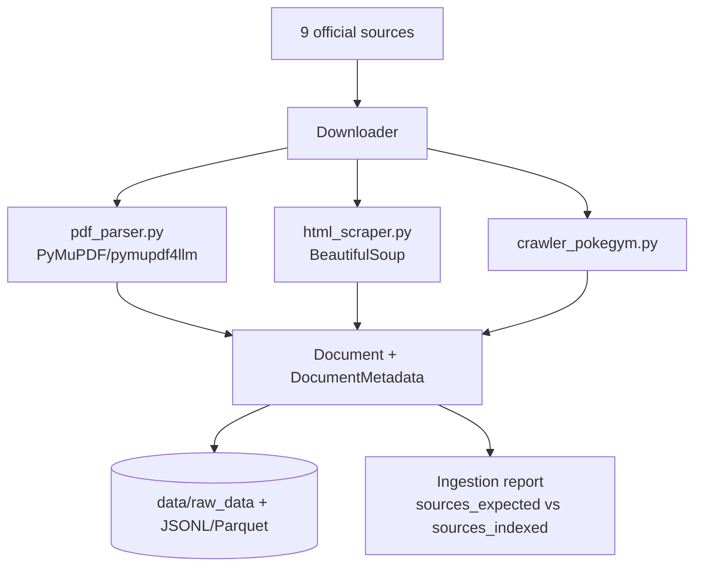

# SPRINT_02 — Ingestion: Web Scraping & PDF Parsing Pipeline

> Part of the [Engineering Harness](../README.md). Task specs:
> [`TASKS_SPRINT_02.md`](../03_tasks/TASKS_SPRINT_02.md). Architecture:
> [`IndexingPipeline.md`](../01_architecture/IndexingPipeline.md).

## Sprint Goal

Automatically acquire raw content from **all 9 official sources** and turn it
into a uniform stream of `Document` objects: crawl the Pokegym rulings
compendium, download and parse the official PDFs with PyMuPDF/pymupdf4llm, and
scrape the dynamic HTML pages (ban list, promo legality, mega rules). Output is
raw + structured artifacts on disk — **no chunking, embedding, or indexing yet**.

## Duration / Position

| Attribute | Value |
| :--- | :--- |
| Position | **Sprint 2 of 8**; depends on Sprint 1. |
| Nominal duration | 1 iteration (~1 week). |
| Roadmap phase | "Implementar a ingestão automatizada" (Plan, Roadmap step 2; Fase 1). |

## Inputs

- Sprint 1 scaffold: `Settings` (`DATA_RAW_DIR`), `Document`/`DocumentMetadata`, `DocumentSource`, `RuleType`.
- The 9 source URLs from [PROJECT.md](../00_project/PROJECT.md) §3.
- Dependencies: `requests`, `beautifulsoup4`, `pymupdf` / `pymupdf4llm`.

## Outputs / Artifacts

| Artifact | Location | Notes |
| :--- | :--- | :--- |
| Pokegym crawler | [`ingestion/crawler_pokegym.py`](../../src/pokemon_tcg_rag/ingestion/crawler_pokegym.py) | Extracts `date, set, card, question, answer, url` per ruling. |
| PDF parser | [`ingestion/pdf_parser.py`](../../src/pokemon_tcg_rag/ingestion/pdf_parser.py) | PyMuPDF/pymupdf4llm; preserves page numbers & structure. |
| HTML scraper | [`ingestion/html_scraper.py`](../../src/pokemon_tcg_rag/ingestion/html_scraper.py) | Ban list / promo legality / mega rules. |
| Ingestion orchestrator | [`ingestion/pipeline.py`](../../src/pokemon_tcg_rag/ingestion/pipeline.py) | Drives download → parse → `Document`; produces the ingestion report. |
| Raw + structured data | `data/raw_data/{pdfs,html,json}/`, JSONL/Parquet | Per [ADR-006](../04_decisions/ADR_006_INGESTION_ORCHESTRATOR.md). |

## Scope (REQ IDs covered)

| REQ | Coverage |
| :--- | :--- |
| [REQ-001](../00_project/REQUIREMENTS.md) | Crawl Pokegym rulings → JSONL/Parquet with the 6 fields. |
| [REQ-002](../00_project/REQUIREMENTS.md) | Download + extract text/layout from the 5+ official PDFs via PyMuPDF/pymupdf4llm. |
| [REQ-003](../00_project/REQUIREMENTS.md) | Scrape ban list, promo legality, mega rules HTML pages. |

Out of scope: normalization, chunking, embeddings, Qdrant (see [SPRINT_03](./SPRINT_03_CHUNKING_INDEXING.md)).

## Task List

| Task | One-line description | Spec |
| :--- | :--- | :--- |
| **TASK-007** | Pokegym rulings crawler (`ingestion/crawler_pokegym.py`) extracting `date/set/card/question/answer/url` to JSONL. | [TASKS_SPRINT_02 #task-007](../03_tasks/TASKS_SPRINT_02.md#task-007) |
| **TASK-008** | HTML pages scraper — Ban/Promo/Mega (`ingestion/html_scraper.py`). | [TASKS_SPRINT_02 #task-008](../03_tasks/TASKS_SPRINT_02.md#task-008) |
| **TASK-009** | PDF & Rulebook parser (`ingestion/pdf_parser.py`) — PyMuPDF/pymupdf4llm with page-number retention. | [TASKS_SPRINT_02 #task-009](../03_tasks/TASKS_SPRINT_02.md#task-009) |
| **TASK-010** | Ingestion orchestrator: download & raw persistence (`ingestion/pipeline.py`) emitting `Document`s + ingestion report. | [TASKS_SPRINT_02 #task-010](../03_tasks/TASKS_SPRINT_02.md#task-010) |
| **TASK-011** | Ingestion CLI & Docker ingestion service (`scripts/run_ingestion.py`). | [TASKS_SPRINT_02 #task-011](../03_tasks/TASKS_SPRINT_02.md#task-011) |

## Checklist

- [x] Pokegym crawler saves raw HTML and emits one record per ruling with all 6 fields.
- [x] Crawler is resumable / idempotent (re-runs do not duplicate records).
- [x] All PDF sources download to `data/raw_data/pdfs/` with checksums recorded.
- [x] PDF parser preserves `page_number` and section titles into `DocumentMetadata`.
- [x] HTML scraper handles the 3 dynamic pages; captures `publication_date`/`source_url`.
- [x] Each `Document` carries correct `source` (`DocumentSource`) and `rule_type` (`RuleType`).
- [x] Orchestrator writes JSONL/Parquet to `data/raw_data/json/` and prints an ingestion report.
- [x] Network calls are retried with backoff and time out gracefully.
- [x] Unit tests use recorded HTML/PDF fixtures (no live network in CI).

## Acceptance Criteria (measurable)

| ID | Criterion | Target |
| :--- | :--- | :--- |
| AC-2.1 | All 9 official sources ingested with 0 hard failures. | `sources_expected == sources_indexed` ([SC-015](../00_project/SUCCESS_CRITERIA.md)) |
| AC-2.2 | Every parsed PDF produces ≥1 `Document` and records page numbers. | chunk/doc count > 0 per source |
| AC-2.3 | Pokegym crawler field completeness. | ≥95% records have all 6 fields non-empty |
| AC-2.4 | Parsers are deterministic on fixtures. | Byte-stable output across runs |
| AC-2.5 | Test coverage on `ingestion/` (excl. Sprint 3 modules). | ≥90% ([SC-016](../00_project/SUCCESS_CRITERIA.md)) |
| AC-2.6 | ruff + mypy clean. | 0 errors ([SC-020](../00_project/SUCCESS_CRITERIA.md)) |

## Definition of Done

- All checklist + AC met; ingestion report shows 9/9 sources.
- Raw + structured artifacts committed as fixtures / documented as reproducible outputs (data access per [SC-024](../00_project/SUCCESS_CRITERIA.md)).
- Unit + integration tests green; coverage ≥90% on new code.
- Docs updated: [IndexingPipeline.md](../01_architecture/IndexingPipeline.md), README, [TRACEABILITY_MATRIX.md](../05_agent_harness/TRACEABILITY_MATRIX.md) for REQ-001/002/003.
- No live-network dependency in the test suite.

## Risks

| Risk | Impact | Mitigation |
| :--- | :--- | :--- |
| Source sites change layout / block scraping. | High | Record fixtures; isolate selectors; log & report per-source failures. See [Risks.md](../00_project/Risks.md). |
| PDF layout extraction loses structure (tables, columns). | Medium | Prefer pymupdf4llm markdown mode; validate section detection on rulebook. |
| Pokegym compendium is large → long crawl. | Medium | Incremental crawl by date; caching; polite rate-limiting. |
| Legality/ban pages are time-sensitive. | Medium | Capture `publication_date`; re-crawl on demand (page changes over time, per plan). |

## Dependencies on Prior Sprints

- **Sprint 1** — requires `Settings`, `Document`/`DocumentMetadata`, `DocumentSource`, `RuleType`, package scaffold and CI.
