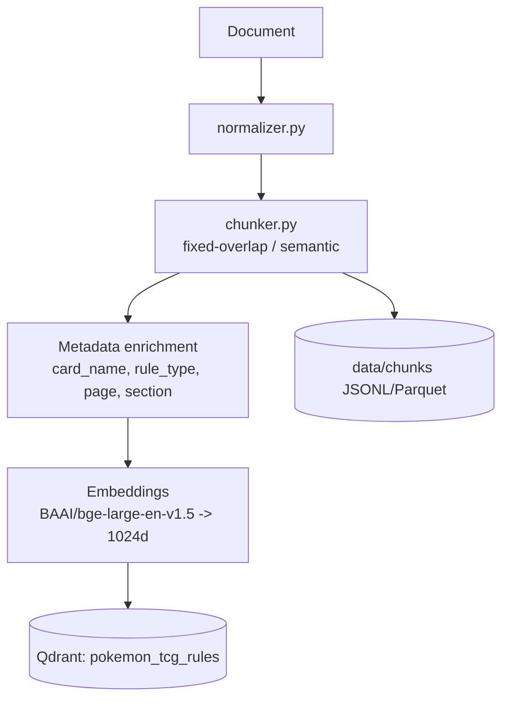

# SPRINT_03 — Normalization, Chunking & Qdrant Indexing

> Part of the [Engineering Harness](../README.md). Task specs:
> [`TASKS_SPRINT_03.md`](../03_tasks/TASKS_SPRINT_03.md). Architecture:
> [`IndexingPipeline.md`](../01_architecture/IndexingPipeline.md),
> [`EmbeddingStrategy.md`](../01_architecture/EmbeddingStrategy.md).

## Sprint Goal

Turn raw `Document`s into embedded, metadata-rich `Chunk`s indexed in Qdrant.
Normalize text, chunk by strategy (fixed-overlap vs semantic section), enrich
each chunk's `DocumentMetadata`, generate embeddings with the primary model, and
upsert into the `pokemon_tcg_rules` collection (dim 1024). This completes the
knowledge base — retrieval becomes possible from here on.

## Duration / Position

| Attribute | Value |
| :--- | :--- |
| Position | **Sprint 3 of 8**; depends on Sprints 1–2. |
| Nominal duration | 1 iteration (~1 week). |
| Roadmap phase | "Extrair e normalizar… enriquecendo cada chunk" + "Gerar embeddings e indexar" (Plan, Roadmap steps 3–4; Fases 2–3). |

## Inputs

- Sprint 2 `Document`s (raw + JSONL/Parquet in `data/raw_data/`).
- `Settings`: `EMBEDDING_MODEL_PRIMARY=BAAI/bge-large-en-v1.5`, `EMBEDDING_DIMENSION=1024`, `QDRANT_*`, `DATA_PROCESSED_DIR`, `DATA_CHUNKS_DIR`.
- Chunking decision [ADR-003](../04_decisions/ADR_003_CHUNKING.md); embedding decision [ADR-002](../04_decisions/ADR_002_EMBEDDINGS.md).

## Outputs / Artifacts

| Artifact | Location | Notes |
| :--- | :--- | :--- |
| Normalizer | [`ingestion/normalizer.py`](../../src/pokemon_tcg_rag/ingestion/normalizer.py) | Whitespace, unicode, boilerplate cleanup. |
| Chunker | [`ingestion/chunker.py`](../../src/pokemon_tcg_rag/ingestion/chunker.py) | Emits `Chunk` with `chunk_id`, `token_count`, propagated metadata. |
| Vector store client | [`storage/vector_db.py`](../../src/pokemon_tcg_rag/storage/vector_db.py) | Qdrant collection create + upsert + payload filtering. |
| Processed + chunk data | `data/processed/`, `data/chunks/` (JSONL/Parquet) | Intermediate artifacts. |
| Qdrant collection | `pokemon_tcg_rules` (dim 1024, cosine) | Payload = `DocumentMetadata` fields for filtering. |

## Scope (REQ IDs covered)

| REQ | Coverage |
| :--- | :--- |
| [REQ-004](../00_project/REQUIREMENTS.md) | Normalize + chunk into tokenized segments with full metadata + unique IDs. |
| [REQ-005](../00_project/REQUIREMENTS.md) | Embed chunks and index into the Qdrant `pokemon_tcg_rules` collection. |

Chunking experiments (fixed vs semantic; 256/512/1024 tokens) are *set up* here and *measured* in [SPRINT_07](./SPRINT_07_EVALUATION.md).

## Task List

| Task | One-line description | Spec |
| :--- | :--- | :--- |
| **TASK-012** | Document normalizer (`ingestion/normalizer.py`) — unicode, whitespace, boilerplate, long-paragraph handling. | [TASKS_SPRINT_03 #task-012](../03_tasks/TASKS_SPRINT_03.md#task-012) |
| **TASK-013** | Document chunker (`ingestion/chunker.py`) with configurable size/overlap, propagated metadata + Pokegym single-chunk rule. | [TASKS_SPRINT_03 #task-013](../03_tasks/TASKS_SPRINT_03.md#task-013) |
| **TASK-014** | Qdrant vector store client (`storage/vector_db.py`) — create `pokemon_tcg_rules`, upsert, payload filtering. | [TASKS_SPRINT_03 #task-014](../03_tasks/TASKS_SPRINT_03.md#task-014) |
| **TASK-015** | Embedding & indexing job (`scripts/seed_db.py`) — embed chunks, index, verify counts. | [TASKS_SPRINT_03 #task-015](../03_tasks/TASKS_SPRINT_03.md#task-015) |
| **TASK-016** | Ingestion→index integration + chunks Parquet (`ingestion/pipeline.py`). | [TASKS_SPRINT_03 #task-016](../03_tasks/TASKS_SPRINT_03.md#task-016) |

## Checklist

- [x] Normalizer is unicode-safe and idempotent.
- [x] Chunker respects configured chunk size/overlap; every `Chunk` has a unique `chunk_id` and correct `token_count`.
- [x] Pokegym Q&A becomes a single chunk (question + answer together, per plan Fase 2).
- [x] Metadata fully propagated from `Document` → `Chunk` (source, page, section, card, rule_type, date, url, checksum).
- [x] Qdrant collection created with dim **1024**, cosine distance, on first run (idempotent).
- [x] Payload stores all `DocumentMetadata` fields to enable metadata filtering downstream.
- [x] Upsert is idempotent by `chunk_id`; re-indexing does not duplicate.
- [x] Chunks persisted to `data/chunks/` as JSONL/Parquet.
- [x] Embedding dimension asserted == `EMBEDDING_DIMENSION`.

## Acceptance Criteria (measurable)

| ID | Criterion | Target |
| :--- | :--- | :--- |
| AC-3.1 | 100% of ingested documents chunked and indexed. | 0 dropped docs ([SC-015](../00_project/SUCCESS_CRITERIA.md)) |
| AC-3.2 | Chunk count in Qdrant == chunk count in `data/chunks/`. | Exact match |
| AC-3.3 | Every stored vector has dimension 1024. | 100% |
| AC-3.4 | Metadata filtering by `source`/`card_name`/`rule_type` returns correct subsets. | Verified in integration test |
| AC-3.5 | Coverage on `normalizer/chunker/vector_db`. | ≥90% ([SC-016](../00_project/SUCCESS_CRITERIA.md)) |
| AC-3.6 | ruff + mypy clean. | 0 errors ([SC-020](../00_project/SUCCESS_CRITERIA.md)) |

## Definition of Done

- All checklist + AC met; `pokemon_tcg_rules` populated and queryable.
- Integration test proves Document → Chunk → Embedding → Qdrant counts are consistent (plan's integration-test example).
- Docs updated: [IndexingPipeline.md](../01_architecture/IndexingPipeline.md), [DataModel.md](../01_architecture/DataModel.md), [TRACEABILITY_MATRIX.md](../05_agent_harness/TRACEABILITY_MATRIX.md) for REQ-004/005.
- Chunking/embedding knobs exposed via `Settings` (no hardcoding) for the Sprint 7 experiments.

## Risks

| Risk | Impact | Mitigation |
| :--- | :--- | :--- |
| Poor chunk boundaries hurt downstream Recall. | High | Support both fixed and semantic strategies; ablate in [SPRINT_07](./SPRINT_07_EVALUATION.md); record in [ADR-003](../04_decisions/ADR_003_CHUNKING.md). |
| BGE model download is heavy / slow in CI. | Medium | Cache model; mock embeddings in unit tests; real embed only in integration. |
| Metadata gaps (missing `card_name`) weaken filtering. | Medium | Best-effort extraction with graceful nulls; validate coverage. |
| Dimension mismatch between models. | Medium | Assert dim == `EMBEDDING_DIMENSION`; secondary model handled in eval only. |

## Dependencies on Prior Sprints

- **Sprint 1** — models, `Settings`, scaffold.
- **Sprint 2** — `Document`s to normalize and chunk.
