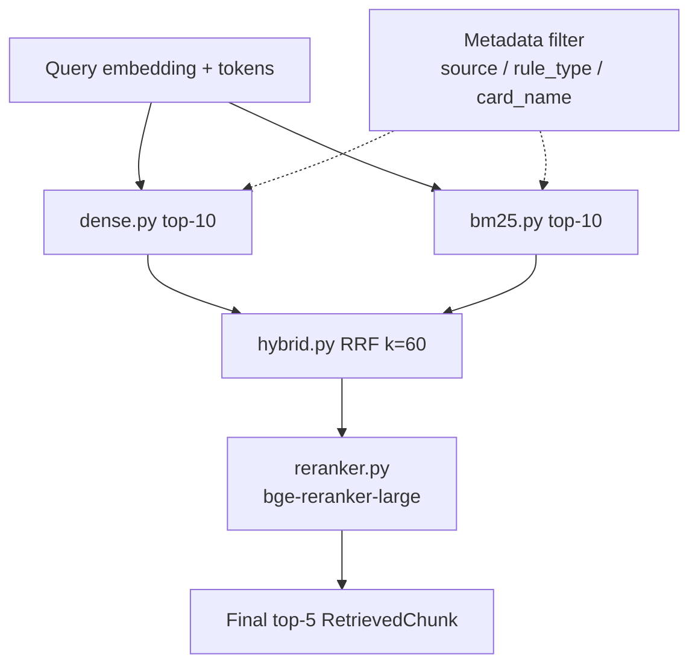

# SPRINT_04 — Retrieval: Hybrid Search & Cross-Encoder Reranking

> Part of the [Engineering Harness](../README.md). Task specs:
> [`TASKS_SPRINT_04.md`](../03_tasks/TASKS_SPRINT_04.md). Architecture:
> [`RetrievalPipeline.md`](../01_architecture/RetrievalPipeline.md).

## Sprint Goal

Implement the full multi-strategy retrieval layer over the Qdrant knowledge
base: Dense, BM25, Hybrid via Reciprocal Rank Fusion (RRF, k=60), and
Hybrid+Rerank via the `BAAI/bge-reranker-large` cross-encoder, plus metadata
filtering. Each strategy returns `RetrievedChunk`s and is independently
selectable so [SPRINT_07](./SPRINT_07_EVALUATION.md) can benchmark and pick the best.

## Duration / Position

| Attribute | Value |
| :--- | :--- |
| Position | **Sprint 4 of 8**; depends on Sprints 1–3. |
| Nominal duration | 1–2 iterations. |
| Roadmap phase | "Adicionar BM25 e Hybrid Search" + "Adicionar re-ranking" (Plan, Roadmap steps 6, 8; Fase 4). |

## Inputs

- Populated Qdrant `pokemon_tcg_rules` collection (Sprint 3).
- `Settings`: `RETRIEVAL_TOP_K_DENSE=10`, `RETRIEVAL_TOP_K_BM25=10`, `RETRIEVAL_HYBRID_RRF_K=60`, `RERANKER_MODEL=BAAI/bge-reranker-large`, `RETRIEVAL_FINAL_TOP_K=5`.
- Decisions [ADR-001](../04_decisions/ADR_001_VECTOR_DB.md), [ADR-004](../04_decisions/ADR_004_RERANKING.md).

## Outputs / Artifacts

| Artifact | Location | Notes |
| :--- | :--- | :--- |
| Dense retriever | [`retrieval/dense.py`](../../src/pokemon_tcg_rag/retrieval/dense.py) | Embedding search, top-10. |
| BM25 retriever | [`retrieval/bm25.py`](../../src/pokemon_tcg_rag/retrieval/bm25.py) | `rank-bm25` over chunk corpus, top-10. |
| Hybrid (RRF) | [`retrieval/hybrid.py`](../../src/pokemon_tcg_rag/retrieval/hybrid.py) | Reciprocal Rank Fusion, k=60. |
| Reranker | [`retrieval/reranker.py`](../../src/pokemon_tcg_rag/retrieval/reranker.py) | `BAAI/bge-reranker-large` cross-encoder → final top-5. |
| Retrieval pipeline | [`retrieval/pipeline.py`](../../src/pokemon_tcg_rag/retrieval/pipeline.py) | Strategy selector + metadata filtering. |

## Scope (REQ IDs covered)

| REQ | Coverage |
| :--- | :--- |
| [REQ-006](../00_project/REQUIREMENTS.md) | Dense retrieval with `BAAI/bge-large-en-v1.5`. |
| [REQ-007](../00_project/REQUIREMENTS.md) | BM25 lexical retrieval (`rank-bm25`). |
| [REQ-008](../00_project/REQUIREMENTS.md) | Hybrid search = Dense + BM25 fused via RRF. |
| [REQ-009](../00_project/REQUIREMENTS.md) | Cross-encoder reranking (`BAAI/bge-reranker-large`). |

Also: metadata filtering across strategies. Query rewriting is in [SPRINT_05](./SPRINT_05_RAG_LLM.md).

## Task List

| Task | One-line description | Spec |
| :--- | :--- | :--- |
| **TASK-017** | Dense retriever (`retrieval/dense.py`) — Qdrant vector search returning top-10 `RetrievedChunk`s. | [TASKS_SPRINT_04 #task-017](../03_tasks/TASKS_SPRINT_04.md#task-017) |
| **TASK-018** | BM25 lexical retriever (`retrieval/bm25.py`) over the chunk corpus. | [TASKS_SPRINT_04 #task-018](../03_tasks/TASKS_SPRINT_04.md#task-018) |
| **TASK-019** | Hybrid retriever — RRF k=60 (`retrieval/hybrid.py`) fusing dense + BM25 rankings. | [TASKS_SPRINT_04 #task-019](../03_tasks/TASKS_SPRINT_04.md#task-019) |
| **TASK-020** | Cross-encoder reranker (`retrieval/reranker.py`) → final top-5. | [TASKS_SPRINT_04 #task-020](../03_tasks/TASKS_SPRINT_04.md#task-020) |
| **TASK-021** | LLM client — OpenAI-compatible (`llm/client.py`); model + temperature from `Settings`. | [TASKS_SPRINT_04 #task-021](../03_tasks/TASKS_SPRINT_04.md#task-021) |
| **TASK-022** | LLM query rewriter (`retrieval/query_rewriter.py`) — zero-shot rewrite before retrieval. | [TASKS_SPRINT_04 #task-022](../03_tasks/TASKS_SPRINT_04.md#task-022) |

## Checklist

- [x] Dense retriever returns `RETRIEVAL_TOP_K_DENSE` chunks with `retrieval_method="dense"`.
- [x] BM25 retriever returns `RETRIEVAL_TOP_K_BM25` chunks with `retrieval_method="bm25"`.
- [x] Hybrid applies RRF with `RETRIEVAL_HYBRID_RRF_K=60`; `retrieval_method="hybrid_rrf"`.
- [x] Reranker consumes fused candidates → `RETRIEVAL_FINAL_TOP_K=5`; `retrieval_method="bge_reranked"`.
- [ ] `pipeline.py` selects any of the 4 strategies via a single parameter.
- [ ] Metadata filters (`source`, `rule_type`, `card_name`) pushed to Qdrant / applied to BM25 candidates.
- [ ] Scores populated and monotonic per method; ties broken deterministically.
- [ ] Empty-result and out-of-domain queries handled without error.

## Acceptance Criteria (measurable)

| ID | Criterion | Target |
| :--- | :--- | :--- |
| AC-4.1 | All 4 strategies are independently runnable and return well-formed `RetrievedChunk`s. | 4/4 selectable ([SC-005](../00_project/SUCCESS_CRITERIA.md)) |
| AC-4.2 | RRF fusion is order-independent and matches the reference formula (1/(k+rank)). | Unit-verified |
| AC-4.3 | Reranker improves ordering on a smoke query vs pre-rerank. | Top-1 relevance ≥ pre-rerank |
| AC-4.4 | Metadata filter returns only matching-payload chunks. | 100% precision on filter field |
| AC-4.5 | Coverage on `retrieval/`. | ≥90% ([SC-016](../00_project/SUCCESS_CRITERIA.md)) |
| AC-4.6 | ruff + mypy clean. | 0 errors ([SC-020](../00_project/SUCCESS_CRITERIA.md)) |

> Recall@K / MRR *targets* ([SC-001](../00_project/SUCCESS_CRITERIA.md)–SC-004) are formally measured in [SPRINT_07](./SPRINT_07_EVALUATION.md); this sprint only guarantees the strategies exist and are correct.

## Definition of Done

- All checklist + AC met; the 4 strategies + metadata filtering implemented and unit/integration-tested.
- Docs updated: [RetrievalPipeline.md](../01_architecture/RetrievalPipeline.md), [ADR-004](../04_decisions/ADR_004_RERANKING.md), [TRACEABILITY_MATRIX.md](../05_agent_harness/TRACEABILITY_MATRIX.md) for REQ-006..009.
- All retrieval knobs come from `Settings` (no hardcoding) to enable ablations.

## Risks

| Risk | Impact | Mitigation |
| :--- | :--- | :--- |
| Reranker latency dominates end-to-end time. | High | Rerank only fused top-N; cache model; budget against [SC-012](../00_project/SUCCESS_CRITERIA.md)/SC-013. |
| BM25 corpus and Qdrant drift out of sync. | Medium | Build BM25 index from the same `data/chunks/` snapshot; verify counts. |
| RRF weighting favors one modality. | Medium | Standard k=60; ablate in eval. |
| Cross-encoder model download heavy in CI. | Medium | Mock in unit tests; real model in integration only. |

## Dependencies on Prior Sprints

- **Sprint 3** — populated Qdrant collection + chunk corpus.
- **Sprint 1** — models, `Settings`.
