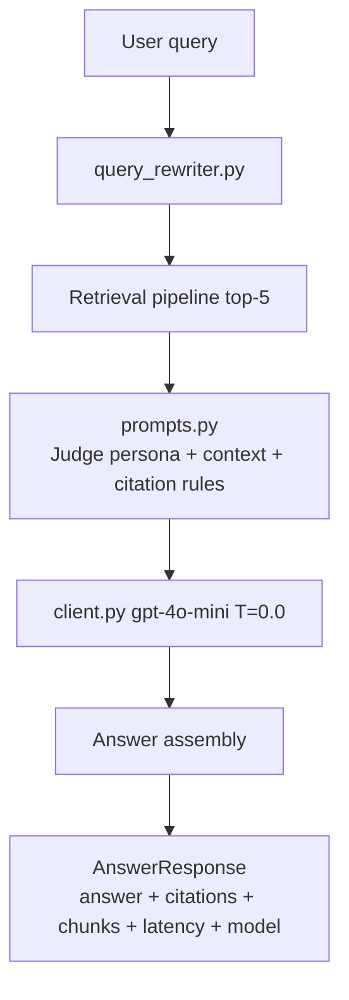

# SPRINT_05 — RAG & LLM: Query Rewriting, Prompt Builder & Answer Assembly

> Part of the [Engineering Harness](../README.md). Task specs:
> [`TASKS_SPRINT_05.md`](../03_tasks/TASKS_SPRINT_05.md). Architecture:
> [`RAGArchitecture.md`](../01_architecture/RAGArchitecture.md),
> [`PromptEngineering.md`](../01_architecture/PromptEngineering.md).

## Sprint Goal

Assemble the end-to-end RAG chain on top of the retrieval layer: LLM query
rewriting before retrieval, a Certified-Judge prompt builder that grounds
answers strictly in retrieved context, the LLM call (OpenAI-compatible), and
answer assembly with mandatory citations into a complete `AnswerResponse`.

## Duration / Position

| Attribute | Value |
| :--- | :--- |
| Position | **Sprint 5 of 8**; depends on Sprints 1–4. |
| Nominal duration | 1 iteration (~1 week). |
| Roadmap phase | "Pipeline RAG básico → LLM" + "query rewriting" (Plan, Roadmap steps 5, 7; Fase 4). |

## Inputs

- Retrieval pipeline (Sprint 4) returning final top-5 `RetrievedChunk`s.
- `Settings`: `OPENAI_MODEL_NAME=gpt-4o-mini`, `OPENAI_TEMPERATURE=0.0`, `OPENAI_API_KEY`.
- Decision [ADR-005](../04_decisions/ADR_005_QUERY_REWRITING.md); persona from [PromptEngineering.md](../01_architecture/PromptEngineering.md).

## Outputs / Artifacts

| Artifact | Location | Notes |
| :--- | :--- | :--- |
| Query rewriter | [`retrieval/query_rewriter.py`](../../src/pokemon_tcg_rag/retrieval/query_rewriter.py) | Zero-shot LLM rewrite before retrieval. |
| Prompt builder | [`llm/prompts.py`](../../src/pokemon_tcg_rag/llm/prompts.py) | Certified-Judge persona; context ordering; citation rules; Prompt A/B. |
| LLM client | [`llm/client.py`](../../src/pokemon_tcg_rag/llm/client.py) | OpenAI-compatible, temperature 0.0. |
| RAG chain | [`llm/rag_chain.py`](../../src/pokemon_tcg_rag/llm/rag_chain.py) | Orchestrates rewrite → retrieve → prompt → LLM → `AnswerResponse`. |

## Scope (REQ IDs covered)

| REQ | Coverage |
| :--- | :--- |
| [REQ-010](../00_project/REQUIREMENTS.md) | LLM-based user query rewriting prior to retrieval. |
| [REQ-011](../00_project/REQUIREMENTS.md) | Certified-Judge persona restricting answers to retrieved context; "I don't know" on unsupported. |
| [REQ-012](../00_project/REQUIREMENTS.md) | Every answer includes explicit source citations. |

Prompt A/B and model A/B are *implemented* here (selectable) and *compared* in [SPRINT_07](./SPRINT_07_EVALUATION.md).

## Task List

| Task | One-line description | Spec |
| :--- | :--- | :--- |
| **TASK-023** | Retrieval pipeline orchestrator (`retrieval/pipeline.py`) — strategy selector + metadata filtering over the Sprint 4 retrievers. | [TASKS_SPRINT_05 #task-023](../03_tasks/TASKS_SPRINT_05.md#task-023) |
| **TASK-024** | Prompt templates & Judge persona (`llm/prompts.py`) — context ordering, citation format, Prompt A/B. | [TASKS_SPRINT_05 #task-024](../03_tasks/TASKS_SPRINT_05.md#task-024) |
| **TASK-025** | RAG chain — retrieve→prompt→answer (`llm/rag_chain.py`) assembling `AnswerResponse` with citations + latency. | [TASKS_SPRINT_05 #task-025](../03_tasks/TASKS_SPRINT_05.md#task-025) |
| **TASK-026** | Relational DB & feedback ORM (`storage/relational_db.py`) — `feedback` table schema + connection management. | [TASKS_SPRINT_05 #task-026](../03_tasks/TASKS_SPRINT_05.md#task-026) |
| **TASK-027** | Feedback store service (`monitoring/feedback_store.py`) persisting `FeedbackRecord`. | [TASKS_SPRINT_05 #task-027](../03_tasks/TASKS_SPRINT_05.md#task-027) |

## Checklist

- [x] Query rewriter transforms conversational queries into retrieval-optimized queries; original preserved in `AnswerResponse.rewritten_query`.
- [x] Prompt enforces: answer only from context, always cite, "I don't know" if unsupported, never invent rules.
- [x] Prompt builder orders context by score and respects a max-token budget.
- [x] LLM client reads `OPENAI_MODEL_NAME` / `OPENAI_TEMPERATURE=0.0`; model switchable for A/B.
- [x] `AnswerResponse` populated: `query`, `rewritten_query`, `answer`, `citations`, `retrieved_chunks`, `model_name`, `latency_seconds`.
- [x] Citations derive from retrieved chunk `DocumentMetadata` (source, page, date, url).
- [x] Out-of-context query returns a grounded "I don't know" (no fabrication).
- [x] Two prompt variants (A/B) selectable via config.

## Acceptance Criteria (measurable)

| ID | Criterion | Target |
| :--- | :--- | :--- |
| AC-5.1 | Every answer includes ≥1 valid, resolvable citation. | ≥90% ([SC-008](../00_project/SUCCESS_CRITERIA.md)) |
| AC-5.2 | Adversarial unsupported queries abstain. | 100% "I don't know" on 10-item set ([SC-011](../00_project/SUCCESS_CRITERIA.md)) |
| AC-5.3 | `AnswerResponse` schema-valid and complete. | 100% of responses |
| AC-5.4 | Prompt A/B and model A/B are switchable via `Settings`. | ≥2 prompts, ≥2 models ([SC-010](../00_project/SUCCESS_CRITERIA.md)) |
| AC-5.5 | Coverage on `llm/` + `query_rewriter.py`. | ≥90% ([SC-016](../00_project/SUCCESS_CRITERIA.md)) |
| AC-5.6 | ruff + mypy clean. | 0 errors ([SC-020](../00_project/SUCCESS_CRITERIA.md)) |

> Faithfulness/Correctness/Completeness *targets* (SC-006/007/009) are measured in [SPRINT_07](./SPRINT_07_EVALUATION.md).

## Definition of Done

- All checklist + AC met; end-to-end `rag_chain` returns cited answers from real retrieval.
- LLM calls mocked in unit tests; a gated integration test hits a real/compatible endpoint.
- Docs updated: [RAGArchitecture.md](../01_architecture/RAGArchitecture.md), [PromptEngineering.md](../01_architecture/PromptEngineering.md), [ADR-005](../04_decisions/ADR_005_QUERY_REWRITING.md), [TRACEABILITY_MATRIX.md](../05_agent_harness/TRACEABILITY_MATRIX.md) for REQ-010/011/012.

## Risks

| Risk | Impact | Mitigation |
| :--- | :--- | :--- |
| LLM ignores grounding and hallucinates rules. | High | Strict system prompt + abstention test (SC-011); faithfulness gate in Sprint 7. |
| Rewriting distorts intent, hurting retrieval. | Medium | Ablate rewrite on/off in eval; keep original query fallback. |
| Prompt token overflow with 5 chunks. | Medium | Enforce max-token budget; truncate lowest-scored context. |
| API cost / rate limits during tests. | Medium | Mock in CI; temperature 0.0 for determinism. |

## Dependencies on Prior Sprints

- **Sprint 4** — retrieval pipeline (final top-5).
- **Sprint 1** — `Settings`, `AnswerResponse`, `RetrievedChunk`.
