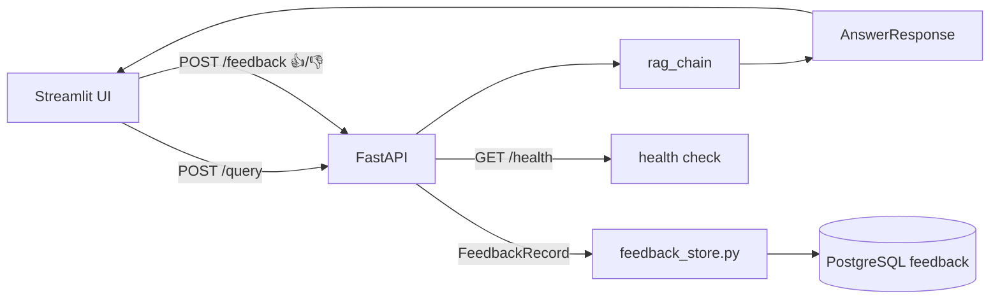

# SPRINT_06 — Interface: Streamlit Web UI, FastAPI & Feedback Store

> Part of the [Engineering Harness](../README.md). Task specs:
> [`TASKS_SPRINT_06.md`](../03_tasks/TASKS_SPRINT_06.md). Architecture:
> [`APIContracts.md`](../01_architecture/APIContracts.md).

## Sprint Goal

Expose the RAG chain through user- and machine-facing interfaces: a Streamlit UI
showing answer, sources, chunks, latency, model, and retrieved-doc count with
👍/👎 + comment feedback; a FastAPI service (`/query`, `/feedback`, `/health`);
and a PostgreSQL-backed feedback store persisting every rating.

## Duration / Position

| Attribute | Value |
| :--- | :--- |
| Position | **Sprint 6 of 8**; depends on Sprints 1–5. |
| Nominal duration | 1 iteration (~1 week). |
| Roadmap phase | "Construir a interface em Streamlit" + feedback (Plan, Roadmap step 9; Fase 6). |

## Inputs

- `rag_chain` producing `AnswerResponse` (Sprint 5).
- `Settings`: `POSTGRES_*` / `postgres_uri`.
- Models `AnswerResponse`, `FeedbackRecord`.

## Outputs / Artifacts

| Artifact | Location | Notes |
| :--- | :--- | :--- |
| Streamlit UI | [`ui/streamlit_app.py`](../../src/pokemon_tcg_rag/ui/streamlit_app.py) | Answer / sources / chunks / latency / model / doc count + feedback. |
| FastAPI app | [`api/main.py`](../../src/pokemon_tcg_rag/api/main.py) | App factory + startup wiring. |
| API routes | [`api/routes.py`](../../src/pokemon_tcg_rag/api/routes.py) | `/query`, `/feedback`, `/health`. |
| API schemas | [`api/schemas.py`](../../src/pokemon_tcg_rag/api/schemas.py) | Request/response models. |
| Feedback store | [`monitoring/feedback_store.py`](../../src/pokemon_tcg_rag/monitoring/feedback_store.py) | Writes `FeedbackRecord` → Postgres. |
| Relational DB client | [`storage/relational_db.py`](../../src/pokemon_tcg_rag/storage/relational_db.py) | `feedback` table schema + connection. |

## Scope (REQ IDs covered)

| REQ | Coverage |
| :--- | :--- |
| [REQ-013](../00_project/REQUIREMENTS.md) | Streamlit UI: answer, sources, chunks, feedback buttons, plus latency/model/doc count. |
| [REQ-014](../00_project/REQUIREMENTS.md) | Collect 👍/👎 + comment and persist in PostgreSQL. |

Also delivers the FastAPI interface (`/query`, `/feedback`, `/health`) satisfying the Interface rubric ([SC-021](../00_project/SUCCESS_CRITERIA.md)).

## Task List

| Task | One-line description | Spec |
| :--- | :--- | :--- |
| **TASK-028** | API request/response schemas (`api/schemas.py`) — request/response models. | [TASKS_SPRINT_06 #task-028](../03_tasks/TASKS_SPRINT_06.md#task-028) |
| **TASK-029** | FastAPI routes & app — `/query` `/feedback` `/health` (`api/routes.py`, `api/main.py`). | [TASKS_SPRINT_06 #task-029](../03_tasks/TASKS_SPRINT_06.md#task-029) |
| **TASK-030** | Streamlit Web UI (`ui/streamlit_app.py`) — answer/sources/chunks/latency/model/count + 👍/👎/comment. | [TASKS_SPRINT_06 #task-030](../03_tasks/TASKS_SPRINT_06.md#task-030) |
| **TASK-031** | Example client script (`examples/query_example.py`). | [TASKS_SPRINT_06 #task-031](../03_tasks/TASKS_SPRINT_06.md#task-031) |

## Checklist

- [ ] UI input box → calls `/query`; renders answer, citations (sources), and used chunks.
- [ ] UI displays latency (`latency_seconds`), model (`model_name`), and number of retrieved documents.
- [ ] UI shows expandable raw chunk text for inspectability.
- [ ] 👍/👎 buttons + optional comment submit to `/feedback`.
- [ ] `/query` returns `AnswerResponse`-shaped payload; `/feedback` accepts `FeedbackRecord` fields; `/health` returns 200.
- [ ] `feedback` table created (idempotent); `rating` in {1, -1}; stores query/answer/model/latency/comment/timestamp.
- [ ] Feedback writes are transactional; failures surface, not swallowed.
- [ ] API schemas validate input and reject malformed requests (422).

## Acceptance Criteria (measurable)

| ID | Criterion | Target |
| :--- | :--- | :--- |
| AC-6.1 | `/query`, `/feedback`, `/health` respond per OpenAPI schema. | 3/3 conform ([SC-021](../00_project/SUCCESS_CRITERIA.md)) |
| AC-6.2 | 100% of 👍/👎 events reach Postgres. | row count == UI events ([SC-018](../00_project/SUCCESS_CRITERIA.md)) |
| AC-6.3 | UI renders all six required panels (answer, sources, chunks, latency, model, count). | 6/6 present ([REQ-013](../00_project/REQUIREMENTS.md)) |
| AC-6.4 | Coverage on `api/` + `monitoring/feedback_store` + `storage/relational_db`. | ≥90% ([SC-016](../00_project/SUCCESS_CRITERIA.md)) |
| AC-6.5 | ruff + mypy clean. | 0 errors ([SC-020](../00_project/SUCCESS_CRITERIA.md)) |

## Definition of Done

- All checklist + AC met; UI and API run against the live RAG chain and Postgres.
- Integration test hits FastAPI end-to-end (`AnswerResponse`/`FeedbackRecord` shapes) and asserts a feedback row is written.
- Docs updated: [APIContracts.md](../01_architecture/APIContracts.md), [DataModel.md](../01_architecture/DataModel.md), [TRACEABILITY_MATRIX.md](../05_agent_harness/TRACEABILITY_MATRIX.md) for REQ-013/014.
- Connection strings from `Settings`/`postgres_uri` — no hardcoded credentials.

## Risks

| Risk | Impact | Mitigation |
| :--- | :--- | :--- |
| Streamlit ↔ FastAPI coupling causes duplicated logic. | Medium | UI calls the API; no direct RAG calls from UI. |
| Postgres unavailable → lost feedback. | High | Health check gating; transactional writes; surfaced errors; retry. |
| Long RAG latency degrades UX. | Medium | Spinner + streaming; enforce latency budget ([SC-012](../00_project/SUCCESS_CRITERIA.md)). |
| Schema drift between API and domain models. | Medium | Derive API schemas from domain models; contract test. |

## Dependencies on Prior Sprints

- **Sprint 5** — `rag_chain` / `AnswerResponse`.
- **Sprint 1** — `FeedbackRecord`, `Settings`/`postgres_uri`.
