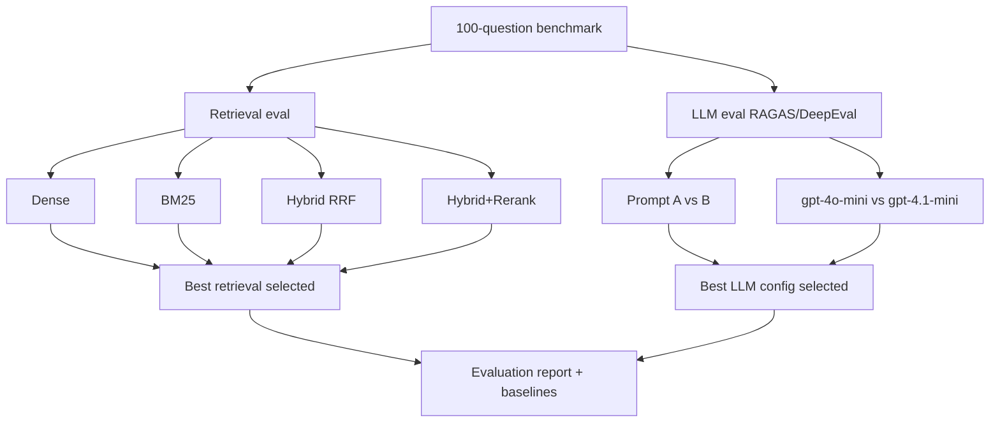

# SPRINT_07 — Evaluation: Benchmark Dataset & RAG Evaluation Suite

> Part of the [Engineering Harness](../README.md). Task specs:
> [`TASKS_SPRINT_07.md`](../03_tasks/TASKS_SPRINT_07.md). Architecture:
> [`EvaluationPlan.md`](../01_architecture/EvaluationPlan.md).

## Sprint Goal

Prove and pick the best configuration through experimentation. Build a
100-question benchmark with expected sources, measure retrieval metrics
(Recall@5, Recall@10, MRR, Hit Rate) across all 4 strategies, measure LLM
quality (Faithfulness, Correctness, Citation Quality, Completeness) via
RAGAS/DeepEval across prompt A/B and model A/B, and produce a comparison report
selecting the winning retrieval + LLM configuration.

## Duration / Position

| Attribute | Value |
| :--- | :--- |
| Position | **Sprint 7 of 8**; depends on Sprints 3–6. |
| Nominal duration | 1–2 iterations. |
| Roadmap phase | "Criar um conjunto de perguntas… medir Retrieval e LLM" (Plan, Roadmap step 10; Fase 5). |

## Inputs

- Retrieval strategies (Sprint 4), RAG chain + prompt/model variants (Sprint 5).
- Indexed knowledge base (Sprint 3); optional secondary embedding `text-embedding-3-small` for the embedding experiment.
- Experiment matrix from the plan (embeddings, chunking, chunk size, retrieval, rerank, rewrite, prompt, LLM).

## Outputs / Artifacts

| Artifact | Location | Notes |
| :--- | :--- | :--- |
| Benchmark dataset | [`evaluation/dataset.py`](../../src/pokemon_tcg_rag/evaluation/dataset.py) + `data/` | 100 questions → expected sources/chunks. |
| Retrieval metrics | [`evaluation/metrics.py`](../../src/pokemon_tcg_rag/evaluation/metrics.py) | Recall@5, Recall@10, MRR, Hit Rate. |
| Evaluator | [`evaluation/evaluator.py`](../../src/pokemon_tcg_rag/evaluation/evaluator.py) | Runs strategies + LLM eval; RAGAS/DeepEval. |
| Evaluation report | `data/`/`docs` artifact | Comparison tables + selected best config + baselines. |

## Scope (REQ IDs covered)

| REQ | Coverage |
| :--- | :--- |
| [REQ-018](../00_project/REQUIREMENTS.md) | Evaluate Dense vs BM25 vs Hybrid vs Reranker; Recall@K + MRR + Hit Rate; pick best. |
| [REQ-019](../00_project/REQUIREMENTS.md) | Evaluate LLM Faithfulness + Correctness (+ Citation Quality, Completeness); compare prompts/models. |

## Task List

| Task | One-line description | Spec |
| :--- | :--- | :--- |
| **TASK-032** | Benchmark dataset loader + 100 questions (`evaluation/dataset.py`) with expected sources. | [TASKS_SPRINT_07 #task-032](../03_tasks/TASKS_SPRINT_07.md#task-032) |
| **TASK-033** | Retrieval metrics — Recall@K, MRR, Hit Rate (`evaluation/metrics.py`). | [TASKS_SPRINT_07 #task-033](../03_tasks/TASKS_SPRINT_07.md#task-033) |
| **TASK-034** | Retrieval strategy comparison evaluator (`evaluation/evaluator.py`) — all 4 strategies + ablations (rewrite/rerank on-off). | [TASKS_SPRINT_07 #task-034](../03_tasks/TASKS_SPRINT_07.md#task-034) |
| **TASK-035** | LLM answer evaluation — Faithfulness/Correctness (`evaluation/metrics.py`, `evaluation/evaluator.py`) over prompt A/B and model A/B. | [TASKS_SPRINT_07 #task-035](../03_tasks/TASKS_SPRINT_07.md#task-035) |
| **TASK-036** | Evaluation CLI & regression gate (`scripts/run_evaluation.py`) — emit report + baselines. | [TASKS_SPRINT_07 #task-036](../03_tasks/TASKS_SPRINT_07.md#task-036) |

## Checklist

- [x] Benchmark has exactly 100 questions, each with expected source(s)/chunk(s).
- [x] Retrieval metrics implemented and unit-tested against hand-computed fixtures.
- [x] All 4 strategies evaluated on the same dataset; results tabulated.
- [x] Ablations recorded: Hybrid on/off, Rerank on/off, Query rewrite on/off.
- [x] Embedding experiment (BGE vs `text-embedding-3-small`) recorded.
- [x] LLM eval computes Faithfulness, Correctness, Citation Quality, Completeness.
- [x] Prompt A vs B and `gpt-4o-mini` vs `gpt-4.1-mini` compared.
- [x] Best retrieval config and best LLM config explicitly selected and justified.
- [x] Baselines persisted for the regression gate.

## Acceptance Criteria (measurable)

| ID | Criterion | Target |
| :--- | :--- | :--- |
| AC-7.1 | Best-strategy Recall@10. | > 0.90 ([SC-001](../00_project/SUCCESS_CRITERIA.md)) |
| AC-7.2 | Best-strategy Recall@5 / MRR / Hit Rate@10. | ≥0.80 / ≥0.75 / ≥0.92 ([SC-002](../00_project/SUCCESS_CRITERIA.md)–SC-004) |
| AC-7.3 | Strategies benchmarked and best documented. | ≥4 strategies ([SC-005](../00_project/SUCCESS_CRITERIA.md)) |
| AC-7.4 | Faithfulness / Correctness / Completeness. | >0.85 / ≥0.80 / ≥0.75 ([SC-006](../00_project/SUCCESS_CRITERIA.md)/007/009) |
| AC-7.5 | Citation quality. | ≥0.90 answers with valid citation ([SC-008](../00_project/SUCCESS_CRITERIA.md)) |
| AC-7.6 | LLM approaches compared. | ≥2 prompts + ≥2 models, best selected ([SC-010](../00_project/SUCCESS_CRITERIA.md)) |
| AC-7.7 | Best-practice ablations present. | Hybrid + Rerank + Rewrite each on/off ([SC-022](../00_project/SUCCESS_CRITERIA.md)) |
| AC-7.8 | ruff + mypy clean; coverage on `evaluation/`. | 0 errors; ≥90% ([SC-020](../00_project/SUCCESS_CRITERIA.md)/016) |

## Definition of Done

- All checklist + AC met; evaluation report published with comparison tables and the selected best config wired into defaults.
- Regression baselines stored so future changes fail if Recall/Faithfulness drop or latency rises (plan's TDD/regression rule).
- Docs updated: [EvaluationPlan.md](../01_architecture/EvaluationPlan.md), [SUCCESS_CRITERIA.md](../00_project/SUCCESS_CRITERIA.md) evidence links, [TRACEABILITY_MATRIX.md](../05_agent_harness/TRACEABILITY_MATRIX.md) for REQ-018/019.

## Risks

| Risk | Impact | Mitigation |
| :--- | :--- | :--- |
| Benchmark labels are subjective / noisy. | High | Multiple reviewers; document labeling protocol in [EvaluationPlan.md](../01_architecture/EvaluationPlan.md). |
| Recall@10 target (>0.90) not met by any strategy. | High | Iterate chunking ([ADR-003](../04_decisions/ADR_003_CHUNKING.md)) and rerank; document gap in [Risks.md](../00_project/Risks.md). |
| RAGAS/DeepEval cost + variance. | Medium | Cache; fixed seeds/temperature; sample subset for CI, full run for release. |
| Overfitting config to the benchmark. | Medium | Hold-out subset; report on unseen questions. |

## Dependencies on Prior Sprints

- **Sprint 3** — indexed KB.
- **Sprint 4** — 4 retrieval strategies.
- **Sprint 5** — RAG chain + prompt/model variants.
- **Sprint 6** — API (optional, for end-to-end eval harness).
