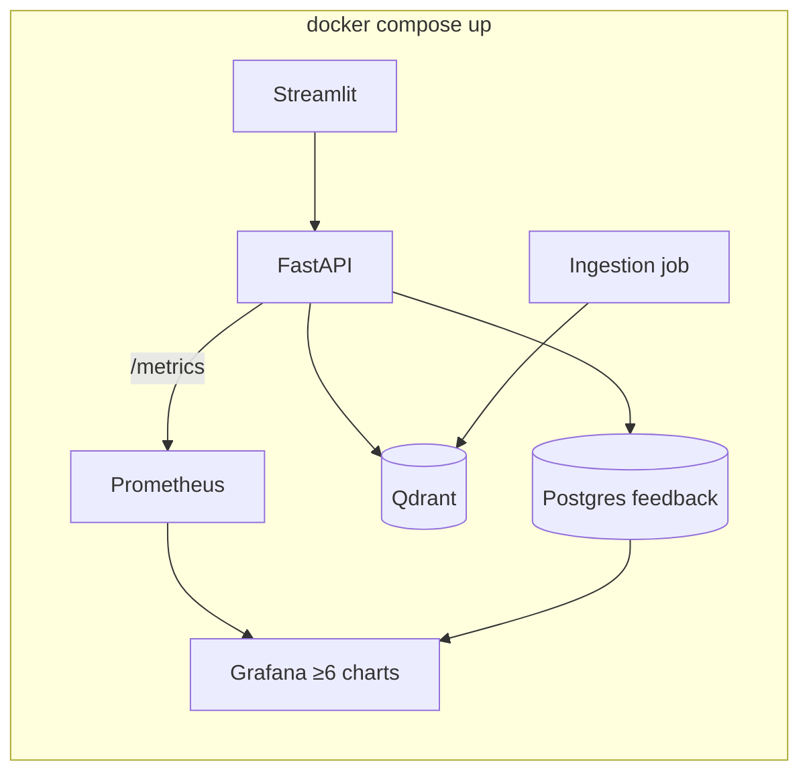

# SPRINT_08 — Monitoring & Deploy: Prometheus, Grafana & Full Compose

> Part of the [Engineering Harness](../README.md). Task specs:
> [`TASKS_SPRINT_08.md`](../03_tasks/TASKS_SPRINT_08.md). Architecture:
> [`Observability.md`](../01_architecture/Observability.md),
> [`Deployment.md`](../01_architecture/Deployment.md).

## Sprint Goal

Make the system observable, fully containerized, and (bonus) cloud-deployable.
Expose Prometheus metrics, ship a Grafana dashboard with ≥6 charts, wire every
service into a single `docker compose up`, optionally deploy to the cloud, and
harden the stack (secrets, healthchecks, logging).

## Duration / Position

| Attribute | Value |
| :--- | :--- |
| Position | **Sprint 8 of 8** — final sprint; depends on Sprints 6–7. |
| Nominal duration | 1–2 iterations. |
| Roadmap phase | "Feedback e monitoramento com Grafana" + "Deploy / docker compose up" (Plan, Roadmap steps 11–12; Fases 6–7). |

## Inputs

- Running API + UI + feedback store (Sprint 6); evaluation report (Sprint 7).
- Docker skeleton + `Settings` (Sprint 1).
- Metric hooks: [`monitoring/metrics_collector.py`](../../src/pokemon_tcg_rag/monitoring/metrics_collector.py), [`monitoring/logger.py`](../../src/pokemon_tcg_rag/monitoring/logger.py).

## Outputs / Artifacts

| Artifact | Location | Notes |
| :--- | :--- | :--- |
| Prometheus exporter | [`monitoring/metrics_collector.py`](../../src/pokemon_tcg_rag/monitoring/metrics_collector.py) | Query count, latency, retrieved-doc count, feedback counters, source distribution. |
| Structured logging | [`monitoring/logger.py`](../../src/pokemon_tcg_rag/monitoring/logger.py) | JSON logs (structlog). |
| Grafana dashboard | `monitoring/grafana/` (dashboard JSON) | ≥6 panels. |
| Prometheus config | `monitoring/prometheus/` | Scrape config. |
| Full compose | `docker-compose.yml` | streamlit, api, qdrant, postgres, prometheus, grafana, ingestion. |
| Deploy manifests (bonus) | `deploy/` (IaC / K8s / Render/Railway) | [REQ-020](../00_project/REQUIREMENTS.md). |

## Scope (REQ IDs covered)

| REQ | Coverage |
| :--- | :--- |
| [REQ-015](../00_project/REQUIREMENTS.md) | Prometheus exporter + Grafana dashboard (≥5 charts; we target ≥6 per [PROJECT.md](../00_project/PROJECT.md) §4). |
| [REQ-016](../00_project/REQUIREMENTS.md) | **Full** Docker Compose orchestration of all 7 services (completes the Sprint 1 skeleton). |
| [REQ-020](../00_project/REQUIREMENTS.md) | Kubernetes / IaC deployment manifests for cloud hosting (bonus). |

## Task List

| Task | One-line description | Spec |
| :--- | :--- | :--- |
| **TASK-037** | Prometheus metrics collector (`monitoring/metrics_collector.py`) + `/metrics` on the API. | [TASKS_SPRINT_08 #task-037](../03_tasks/TASKS_SPRINT_08.md#task-037) |
| **TASK-038** | Prometheus config + Grafana dashboard (≥5 charts; we target ≥6) + scrape config. | [TASKS_SPRINT_08 #task-038](../03_tasks/TASKS_SPRINT_08.md#task-038) |
| **TASK-039** | Full Docker Compose integration + smoke tests — wire all 7 services with healthchecks. | [TASKS_SPRINT_08 #task-039](../03_tasks/TASKS_SPRINT_08.md#task-039) |
| **TASK-040** | Cloud deployment IaC (Kubernetes / Render) — deploy manifests (bonus). | [TASKS_SPRINT_08 #task-040](../03_tasks/TASKS_SPRINT_08.md#task-040) |

## Checklist

- [ ] `/metrics` endpoint exposes queries/day, mean & P95 latency, retrieved-doc count, positive/negative feedback, source distribution, top questions.
- [ ] Structured JSON logging enabled across services.
- [ ] Grafana dashboard has **≥6 panels** backed by real Prometheus/Postgres data.
- [ ] `docker-compose.yml` brings up all 7 services with healthchecks and correct dependency order.
- [ ] All services read config from `.env`/`Settings`; no secrets hardcoded.
- [ ] Ingestion service runs as a one-shot/compose job populating Qdrant.
- [ ] `.env.example` complete; README documents `docker compose up` from a clean clone.
- [ ] (Bonus) Cloud deploy reachable with `/health` 200 from public internet.

## Acceptance Criteria (measurable)

| ID | Criterion | Target |
| :--- | :--- | :--- |
| AC-8.1 | Grafana dashboard live with real data. | ≥6 charts (≥5 required) ([SC-017](../00_project/SUCCESS_CRITERIA.md)) |
| AC-8.2 | Feedback visible in dashboard and persisted. | 100% feedback shown ([SC-018](../00_project/SUCCESS_CRITERIA.md)) |
| AC-8.3 | `docker compose up` brings the stack healthy. | < 60 s, images pre-pulled ([SC-014](../00_project/SUCCESS_CRITERIA.md)) |
| AC-8.4 | Everything in one compose file. | 7/7 services ([SC-024](../00_project/SUCCESS_CRITERIA.md)) |
| AC-8.5 | Clean-clone reproducibility. | Fresh clone → `.env` → `up` → answered query ([SC-024](../00_project/SUCCESS_CRITERIA.md)) |
| AC-8.6 | (Bonus) Public cloud URL responds. | `/health` 200 ([SC-023](../00_project/SUCCESS_CRITERIA.md)) |
| AC-8.7 | ruff + mypy clean; coverage on `monitoring/`. | 0 errors; ≥90% ([SC-020](../00_project/SUCCESS_CRITERIA.md)/016) |

## Definition of Done

- All checklist + AC met; full stack reproducible from a clean clone via `docker compose up`.
- Grafana dashboard screenshot + panel-count evidence archived; feedback flowing.
- Docs updated: [Observability.md](../01_architecture/Observability.md), [Deployment.md](../01_architecture/Deployment.md), [Security.md](../01_architecture/Security.md), README, [TRACEABILITY_MATRIX.md](../05_agent_harness/TRACEABILITY_MATRIX.md) for REQ-015/016/020.
- [DONE_CHECKLIST.md](./DONE_CHECKLIST.md) run to green as the final release gate.

## Risks

| Risk | Impact | Mitigation |
| :--- | :--- | :--- |
| Compose startup exceeds 60 s (model downloads). | Medium | Exclude build/model-download from SLA per [ASSUMPTION-008](../00_project/Assumptions.md); pre-pull/pre-bake models. |
| Dashboards show no data (metric names mismatch). | Medium | Contract-test metric names; seed a smoke query on startup. |
| Secrets leak into images/compose. | High | Use `.env`/secrets; [Security.md](../01_architecture/Security.md) review; never commit real keys. |
| Cloud deploy cost/complexity (bonus). | Low | Keep optional; document but don't block acceptance ([SC-023](../00_project/SUCCESS_CRITERIA.md) non-blocking). |

## Dependencies on Prior Sprints

- **Sprint 6** — API + UI + feedback store to observe.
- **Sprint 7** — evaluation report referenced in release gate.
- **Sprint 1** — compose skeleton + `Settings`.
