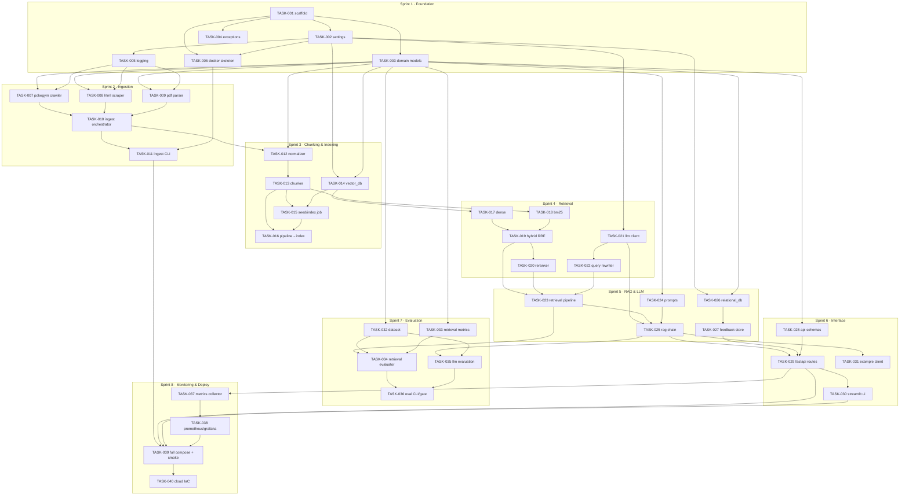
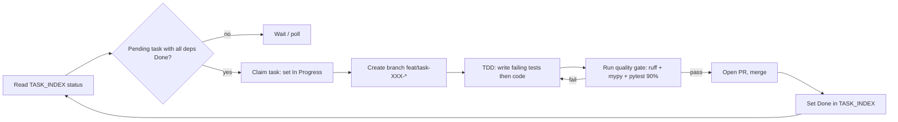

# TASK_DEPENDENCY_GRAPH.md — Dependency Graph & Parallel Execution Waves

## Objective

Give AI Code Agents an explicit, machine-readable map of which tasks unblock which, so
multiple agents can execute **in parallel without file conflicts**. Pair this with
[`TASK_INDEX.md`](./TASK_INDEX.md) (IDs, status) and the per-sprint specs.

## Scope

- The full `graph TD` dependency graph for `TASK-001` … `TASK-040`.
- A **wave** table: batches of tasks that are simultaneously executable and touch disjoint files.
- The operating strategy for concurrent agents.

---

## 1. Dependency graph

Edges point **from a prerequisite to the task it unblocks** (`A --> B` = "B depends on A").

---

## 2. Parallel execution waves

A **wave** is a set of tasks whose prerequisites are all `Done` at the start of the wave and
whose **Files affected** are pairwise disjoint. Every task in a wave can be assigned to a
distinct agent and run concurrently. Waves are executed in order; a wave completes (all
merged + green quality gate) before the next begins.

| Wave | Tasks (run concurrently) | Rationale / file-disjointness |
| :--- | :--- | :--- |
| **W1** | TASK-001 | Repo skeleton must exist first; everything else imports the package. |
| **W2** | TASK-002, TASK-003, TASK-004 | Distinct files (`config/`, `domain/models.py`, `domain/exceptions.py`); all depend only on W1. |
| **W3** | TASK-005, TASK-006, TASK-014, TASK-021, TASK-024, TASK-026, TASK-028, TASK-032, TASK-033 | All depend only on `{002,003}`; each writes a different module (`logger`, docker, `vector_db`, `llm/client`, `llm/prompts`, `relational_db`, `api/schemas`, `evaluation/dataset`, `evaluation/metrics`). |
| **W4** | TASK-007, TASK-008, TASK-009, TASK-017, TASK-022, TASK-027 | Producers (crawler/scraper/parser) are independent files; `dense`←014, `query_rewriter`←021, `feedback_store`←026 now unblocked. |
| **W5** | TASK-010, TASK-018 | Orchestrator needs all producers; BM25 needs chunker's data contract (fixtures). |
| **W6** | TASK-011, TASK-012 | CLI wraps orchestrator; normalizer consumes ingested Documents. |
| **W7** | TASK-013 | Chunker consumes normalized Documents (gates indexing + BM25 data). |
| **W8** | TASK-015, TASK-016, TASK-019 | Indexing job + pipeline→index wiring + hybrid (dense+bm25) run in parallel (disjoint files). |
| **W9** | TASK-020, TASK-023, TASK-034, TASK-035 | Reranker, retrieval pipeline, and evaluators once retrieval + rag chain contracts exist. |
| **W10** | TASK-025, TASK-029 | RAG chain then API surface. (029 also needs 027 from W4, 028 from W3.) |
| **W11** | TASK-030, TASK-031, TASK-036, TASK-037 | UI, example client, eval CLI, metrics collector — disjoint files atop the API + evaluators. |
| **W12** | TASK-038 | Grafana/Prometheus config atop the metrics collector. |
| **W13** | TASK-039 | Full compose integration + smoke — needs UI, API, ingestion CLI, dashboards. |
| **W14** | TASK-040 | Cloud IaC last, atop a working compose stack. |

> Note: tasks appear in the wave of their *earliest* eligibility; an agent pool may also
> pull any later task whose dependencies are already `Done`. The waves are the safe lower
> bound, not a hard ceiling.

---

## 3. Concurrent-agent operating strategy

**Rules for conflict-free parallelism**

1. **One task = one branch = one agent.** Branch name is fixed per task (see each spec's *Branch*).
2. **File ownership.** Two agents never edit the same file in the same wave. The only files
   touched by multiple tasks (`docker-compose.yml`, `ingestion/pipeline.py`,
   `config/settings.py`, `evaluation/metrics.py`, `evaluation/evaluator.py`) are always on a
   **dependency chain**, so their edits are serialized, never concurrent.
3. **Shared-file appends only.** When a task adds settings keys or a new function to an
   existing module, it *appends*; it never rewrites another task's code.
4. **Contract-first.** Domain models (TASK-003) and schemas (TASK-028) are frozen early so
   downstream agents code against stable types.
5. **Green-gate merge.** A task is `Done` only after the
   [`QUALITY_GATE_SPECIFICATION`](../05_agent_harness/QUALITY_GATE_SPECIFICATION.md) passes
   (lint, mypy, ≥90% coverage, smoke). Waves advance only when fully green.
6. **Rebase, don't diverge.** Before opening a PR, rebase on the default branch so merged
   upstream tasks (e.g. new settings keys) are picked up.
