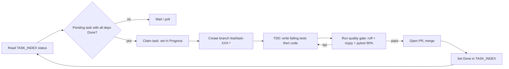

# TASK_DEPENDENCY_GRAPH.md — Dependency Graph & Parallel Execution Waves

## Objective

Give AI Code Agents an explicit, machine-readable map of which tasks unblock which, so
multiple agents can execute **in parallel without file conflicts**. Pair this with
[`TASK_INDEX.md`](./TASK_INDEX.md) (IDs, status) and the per-sprint specs.

## Scope

- The full `graph TD` dependency graph for `TASK-001` … `TASK-090`.
- A **wave** table: batches of tasks that are simultaneously executable and touch disjoint files.
- The operating strategy for concurrent agents.

---

## 1. Dependency graph

Edges point **from a prerequisite to the task it unblocks** (`A --> B` = "B depends on A").

```mermaid
graph TD
    subgraph S1["Sprint 1 · Foundation"]
        T001[TASK-001 scaffold]
        T002[TASK-002 settings]
        T003[TASK-003 domain models]
        T004[TASK-004 exceptions]
        T005[TASK-005 logging]
        T006[TASK-006 docker skeleton]
    end
    subgraph S2["Sprint 2 · Ingestion"]
        T007[TASK-007 pokegym crawler]
        T008[TASK-008 html scraper]
        T009[TASK-009 pdf parser]
        T010[TASK-010 ingest orchestrator]
        T011[TASK-011 ingest CLI]
    end
    subgraph S3["Sprint 3 · Chunking & Indexing"]
        T012[TASK-012 normalizer]
        T013[TASK-013 chunker]
        T014[TASK-014 vector_db]
        T015[TASK-015 seed/index job]
        T016[TASK-016 pipeline→index]
    end
    subgraph S4["Sprint 4 · Retrieval"]
        T017[TASK-017 dense]
        T018[TASK-018 bm25]
        T019[TASK-019 hybrid RRF]
        T020[TASK-020 reranker]
        T021[TASK-021 llm client]
        T022[TASK-022 query rewriter]
    end
    subgraph S5["Sprint 5 · RAG & LLM"]
        T023[TASK-023 retrieval pipeline]
        T024[TASK-024 prompts]
        T025[TASK-025 rag chain]
        T026[TASK-026 relational_db]
        T027[TASK-027 feedback store]
    end
    subgraph S6["Sprint 6 · Interface"]
        T028[TASK-028 api schemas]
        T029[TASK-029 fastapi routes]
        T030[TASK-030 streamlit ui]
        T031[TASK-031 example client]
    end
    subgraph S7["Sprint 7 · Evaluation"]
        T032[TASK-032 dataset]
        T033[TASK-033 retrieval metrics]
        T034[TASK-034 retrieval evaluator]
        T035[TASK-035 llm evaluation]
        T036[TASK-036 eval CLI/gate]
    end
    subgraph S8["Sprint 8 · Monitoring & Deploy"]
        T037[TASK-037 metrics collector]
        T038[TASK-038 prometheus/grafana]
        T039[TASK-039 full compose + smoke]
        T040[TASK-040 cloud IaC]
    end
    subgraph S9["Sprint 9 · Security Containment"]
        T041[TASK-041 dependency security]
        T042[TASK-042 active security CI]
        T043[TASK-043 service isolation]
        T044[TASK-044 SSRF containment]
        T045[TASK-045 scoped secrets]
    end
    subgraph S10["Sprint 10 · API, LLM & Data Security"]
        T046[TASK-046 API authz]
        T047[TASK-047 resource guards]
        T048[TASK-048 prompt/citation integrity]
        T049[TASK-049 safe boundaries]
        T050[TASK-050 feedback/privacy]
    end
    subgraph S11["Sprint 11 · Platform Hardening"]
        T051[TASK-051 DB least privilege]
        T052[TASK-052 rootless images]
        T053[TASK-053 restricted K8s]
        T054[TASK-054 network/TLS]
        T055[TASK-055 immutable IaC]
    end
    subgraph S12["Sprint 12 · Security Assurance"]
        T056[TASK-056 secure ingestion]
        T057[TASK-057 truthful readiness]
        T058[TASK-058 automated security gates]
        T059[TASK-059 DAST/adversarial]
        T060[TASK-060 release closure]
    end
    subgraph S13["Sprint 13 · Runtime Stabilization"]
        T061[TASK-061 BM25 parity]
        T062[TASK-062 query contract]
        T063[TASK-063 corpus bootstrap]
        T064[TASK-064 composition root]
        T065[TASK-065 query/feedback journey]
    end
    subgraph S14["Sprint 14 · Quality"]
        T066[TASK-066 static quality]
        T067[TASK-067 coverage/clean CI]
        T068[TASK-068 real integration]
        T069[TASK-069 full E2E]
        T070[TASK-070 truthful docs]
    end
    subgraph S15["Sprint 15 · Retrieval Quality"]
        T071[TASK-071 reviewed benchmark]
        T072[TASK-072 real retrieval eval]
        T073[TASK-073 ablations]
        T074[TASK-074 incremental corpus]
        T075[TASK-075 retrieval gate]
    end
    subgraph S16["Sprint 16 · LLM Quality"]
        T076[TASK-076 real LLM runner]
        T077[TASK-077 RAG scoring]
        T078[TASK-078 human review]
        T079[TASK-079 citation validation]
        T080[TASK-080 LLM gate]
    end
    subgraph S17["Sprint 17 · Observability & UX"]
        T081[TASK-081 tracing]
        T082[TASK-082 SLO/cost alerts]
        T083[TASK-083 live dashboards]
        T084[TASK-084 complete UX]
        T085[TASK-085 runbooks]
    end
    subgraph S18["Sprint 18 · Production"]
        T086[TASK-086 cache/filter/MMR]
        T087[TASK-087 load/cost]
        T088[TASK-088 cloud staging]
        T089[TASK-089 recovery/DORA]
        T090[TASK-090 final scorecard]
    end

    T001 --> T002 --> T005
    T001 --> T003
    T001 --> T004
    T001 --> T006
    T002 --> T006
    T003 --> T007
    T003 --> T008
    T003 --> T009
    T005 --> T007
    T005 --> T008
    T005 --> T009
    T007 --> T010
    T008 --> T010
    T009 --> T010
    T010 --> T011
    T006 --> T011
    T003 --> T012
    T010 --> T012
    T012 --> T013
    T002 --> T014
    T003 --> T014
    T013 --> T015
    T014 --> T015
    T013 --> T016
    T015 --> T016
    T014 --> T017
    T013 --> T018
    T017 --> T019
    T018 --> T019
    T019 --> T020
    T002 --> T021
    T021 --> T022
    T019 --> T023
    T020 --> T023
    T022 --> T023
    T003 --> T024
    T021 --> T025
    T023 --> T025
    T024 --> T025
    T002 --> T026
    T003 --> T026
    T026 --> T027
    T003 --> T028
    T025 --> T029
    T027 --> T029
    T028 --> T029
    T029 --> T030
    T025 --> T031
    T003 --> T032
    T003 --> T033
    T023 --> T034
    T032 --> T034
    T033 --> T034
    T025 --> T035
    T032 --> T035
    T034 --> T036
    T035 --> T036
    T029 --> T037
    T037 --> T038
    T011 --> T039
    T029 --> T039
    T030 --> T039
    T038 --> T039
    T039 --> T040
    T001 --> T041
    T041 --> T042
    T039 --> T043
    T030 --> T044
    T043 --> T045
    T029 --> T046
    T042 --> T046
    T046 --> T047
    T025 --> T048
    T041 --> T048
    T047 --> T049
    T046 --> T050
    T027 --> T050
    T045 --> T051
    T026 --> T051
    T041 --> T052
    T043 --> T052
    T052 --> T053
    T040 --> T053
    T043 --> T054
    T044 --> T054
    T053 --> T054
    T041 --> T055
    T053 --> T055
    T054 --> T055
    T041 --> T056
    T010 --> T056
    T047 --> T057
    T050 --> T057
    T051 --> T057
    T054 --> T057
    T042 --> T058
    T055 --> T058
    T056 --> T058
    T048 --> T059
    T049 --> T059
    T057 --> T059
    T058 --> T059
    T059 --> T060
    T057 --> T061
    T063 --> T061
    T057 --> T062
    T041 --> T063
    T056 --> T063
    T061 --> T064
    T062 --> T064
    T063 --> T064
    T050 --> T065
    T051 --> T065
    T064 --> T065
    T042 --> T066
    T041 --> T067
    T042 --> T067
    T066 --> T067
    T063 --> T068
    T064 --> T068
    T065 --> T068
    T067 --> T068
    T068 --> T069
    T067 --> T070
    T069 --> T070
    T063 --> T071
    T061 --> T072
    T071 --> T072
    T072 --> T073
    T056 --> T074
    T063 --> T074
    T072 --> T075
    T073 --> T075
    T074 --> T075
    T057 --> T076
    T071 --> T076
    T076 --> T077
    T076 --> T078
    T048 --> T079
    T076 --> T079
    T077 --> T080
    T078 --> T080
    T079 --> T080
    T049 --> T081
    T057 --> T081
    T047 --> T082
    T081 --> T082
    T065 --> T083
    T081 --> T083
    T082 --> T083
    T044 --> T084
    T050 --> T084
    T065 --> T084
    T049 --> T085
    T083 --> T085
    T084 --> T085
    T073 --> T086
    T075 --> T086
    T047 --> T087
    T080 --> T087
    T082 --> T087
    T086 --> T087
    T055 --> T088
    T058 --> T088
    T069 --> T088
    T083 --> T088
    T087 --> T088
    T051 --> T089
    T055 --> T089
    T083 --> T089
    T088 --> T089
    T060 --> T090
    T070 --> T090
    T075 --> T090
    T080 --> T090
    T085 --> T090
    T087 --> T090
    T088 --> T090
    T089 --> T090
```

---

## 2. Parallel execution waves

A **wave** is a set of tasks whose prerequisites are all `Done` at the start of the wave and
whose **Files affected** are pairwise disjoint. Every task in a wave can be assigned to a
distinct agent and run concurrently. Waves are executed in order; a wave completes (all
merged + green quality gate) before the next begins.

| Wave | Tasks (run concurrently) | Rationale / file-disjointness |
| :--- | :--- | :--- |
| **W1** | TASK-001 | Repo skeleton must exist first; everything else imports the package. |
| **W2** | TASK-002, TASK-003, TASK-004 | Distinct files (`config/`, `domain/models.py`, `domain/exceptions.py`); all depend only on W1. |
| **W3** | TASK-005, TASK-006, TASK-014, TASK-021, TASK-024, TASK-026, TASK-028, TASK-032, TASK-033 | All depend only on `{002,003}`; each writes a different module (`logger`, docker, `vector_db`, `llm/client`, `llm/prompts`, `relational_db`, `api/schemas`, `evaluation/dataset`, `evaluation/metrics`). |
| **W4** | TASK-007, TASK-008, TASK-009, TASK-017, TASK-022, TASK-027 | Producers (crawler/scraper/parser) are independent files; `dense`←014, `query_rewriter`←021, `feedback_store`←026 now unblocked. |
| **W5** | TASK-010, TASK-018 | Orchestrator needs all producers; BM25 needs chunker's data contract (fixtures). |
| **W6** | TASK-011, TASK-012 | CLI wraps orchestrator; normalizer consumes ingested Documents. |
| **W7** | TASK-013 | Chunker consumes normalized Documents (gates indexing + BM25 data). |
| **W8** | TASK-015, TASK-016, TASK-019 | Indexing job + pipeline→index wiring + hybrid (dense+bm25) run in parallel (disjoint files). |
| **W9** | TASK-020, TASK-023, TASK-034, TASK-035 | Reranker, retrieval pipeline, and evaluators once retrieval + rag chain contracts exist. |
| **W10** | TASK-025, TASK-029 | RAG chain then API surface. (029 also needs 027 from W4, 028 from W3.) |
| **W11** | TASK-030, TASK-031, TASK-036, TASK-037 | UI, example client, eval CLI, metrics collector — disjoint files atop the API + evaluators. |
| **W12** | TASK-038 | Grafana/Prometheus config atop the metrics collector. |
| **W13** | TASK-039 | Full compose integration + smoke — needs UI, API, ingestion CLI, dashboards. |
| **W14** | TASK-040 | Cloud IaC last, atop a working compose stack. |
| **W15** | TASK-041, TASK-043, TASK-044 | Dependency files, compose topology and UI client are disjoint containment surfaces. |
| **W16** | TASK-042, TASK-045, TASK-048, TASK-056 | CI, service config, RAG prompts and ingestion modules are disjoint after W15. |
| **W17** | TASK-046, TASK-051, TASK-052 | API identity, database privileges and Docker image builds are independent. |
| **W18** | TASK-047, TASK-053 | API abuse controls and Kubernetes workload policy touch disjoint surfaces. |
| **W19** | TASK-049, TASK-054 | API boundary handling and platform network/TLS policy can proceed concurrently. |
| **W20** | TASK-050, TASK-055 | Feedback/data governance and canonical IaC are disjoint; serialization avoids API and manifest conflicts. |
| **W21** | TASK-057, TASK-058 | Runtime wiring and CI security automation consume completed platform controls without shared implementation files. |
| **W22** | TASK-059 | DAST/adversarial suite requires the complete hardened stack and security gates. |
| **W23** | TASK-060 | Final audit closure and accountable release decision. |
| **W24** | TASK-062, TASK-063, TASK-066, TASK-081 | Query contract, corpus, static quality and tracing touch separable surfaces after security prerequisites. |
| **W25** | TASK-061, TASK-067, TASK-071 | Index hydration, quality tests and benchmark authoring are separable. |
| **W26** | TASK-064, TASK-074, TASK-076 | Composition, incremental ingestion and LLM runner can progress after their respective data prerequisites. |
| **W27** | TASK-065, TASK-077, TASK-078, TASK-079 | Runtime journey and three independent evaluation/guardrail branches. |
| **W28** | TASK-068, TASK-080, TASK-082, TASK-084 | Integration, LLM report, telemetry rules and UI are file-disjoint. |
| **W29** | TASK-069, TASK-072, TASK-083 | Full-stack E2E, retrieval evaluator and dashboards use stable runtime boundaries. |
| **W30** | TASK-070, TASK-073, TASK-085 | Documentation, experiments and runbooks proceed independently. |
| **W31** | TASK-075 | Retrieval report waits for ablations and incremental corpus lifecycle. |
| **W32** | TASK-086 | Cache/filter/MMR policy consumes the approved retrieval baseline. |
| **W33** | TASK-087 | Performance qualification consumes selected LLM/retrieval and telemetry. |
| **W34** | TASK-088 | Staging deploy consumes approved artifacts, E2E, dashboards and capacity evidence. |
| **W35** | TASK-089 | Recovery/rollback drill executes against proven staging. |
| **W36** | TASK-090 | Final scorecard is the sole program-level production gate. |

> Note: tasks appear in the wave of their *earliest* eligibility; an agent pool may also
> pull any later task whose dependencies are already `Done`. The waves are the safe lower
> bound, not a hard ceiling.

---

## 3. Concurrent-agent operating strategy

**Rules for conflict-free parallelism**

1. **One task = one branch = one agent.** Branch name is fixed per task (see each spec's *Branch*).
2. **File ownership.** Two agents never edit the same file in the same wave. The only files
   touched by multiple tasks (`docker-compose.yml`, `ingestion/pipeline.py`,
   `config/settings.py`, `evaluation/metrics.py`, `evaluation/evaluator.py`) are always on a
   **dependency chain**, so their edits are serialized, never concurrent.
3. **Shared-file appends only.** When a task adds settings keys or a new function to an
   existing module, it *appends*; it never rewrites another task's code.
4. **Contract-first.** Domain models (TASK-003) and schemas (TASK-028) are frozen early so
   downstream agents code against stable types.
5. **Green-gate merge.** A task is `Done` only after the
   [`QUALITY_GATE_SPECIFICATION`](../05_agent_harness/QUALITY_GATE_SPECIFICATION.md) passes
   (lint, mypy, ≥90% coverage, smoke). Waves advance only when fully green.
6. **Rebase, don't diverge.** Before opening a PR, rebase on the default branch so merged
   upstream tasks (e.g. new settings keys) are picked up.
