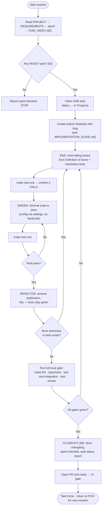

# AGENT_PLAYBOOK.md — Operating Procedure for Code Agents

> Part of the [Engineering Harness](../README.md) · Sibling docs: [PROJECT_CONSTITUTION.md](./PROJECT_CONSTITUTION.md) · [IMPLEMENTATION_GUIDE.md](./IMPLEMENTATION_GUIDE.md) · [QUALITY_GATE_SPECIFICATION.md](./QUALITY_GATE_SPECIFICATION.md) · [TRACEABILITY_MATRIX.md](./TRACEABILITY_MATRIX.md)

## Objective

Give an autonomous code agent (Claude Code, Codex, Cursor) a **deterministic, repeatable operating procedure**: how to orient in the repository, choose exactly one ready task, implement it test-first, validate it, and close it out — with zero context loss and zero scope creep. Following this playbook literally should make two different agents produce interchangeable, mergeable work.

## Scope

- **In scope:** the read order, the "pick the next task" algorithm, the TDD execution loop, the validation commands, and the closeout procedure.
- **Out of scope:** the *law* (see [PROJECT_CONSTITUTION.md](./PROJECT_CONSTITUTION.md)), commit/branch mechanics and report templates (see [IMPLEMENTATION_GUIDE.md](./IMPLEMENTATION_GUIDE.md)), and the merge gate detail (see [QUALITY_GATE_SPECIFICATION.md](./QUALITY_GATE_SPECIFICATION.md)).

This playbook operationalizes [PRINCIPLE-006](./PROJECT_CONSTITUTION.md) (TDD) and [PRINCIPLE-015](./PROJECT_CONSTITUTION.md) (one task, in scope).

---

## 1. The Golden Rules (read before anything)

1. **One task at a time.** Never start a second task before the current one is fully closed out.
2. **Never work outside the task scope.** If you spot unrelated work, record it as a new backlog item in [`../00_project/Backlog.md`](../00_project/Backlog.md) — do not do it now.
3. **Test first.** No production line exists before a failing test demands it.
4. **The Constitution overrides your instincts.** When in doubt, obey [PROJECT_CONSTITUTION.md](./PROJECT_CONSTITUTION.md).
5. **Leave `main` green.** Every closeout ends with all gates passing and docs in sync.

---

## 2. Mandatory Orientation Read Order

Before touching code, read in this exact order (stop as soon as you have what the task needs, but never skip 1–4):

| # | Document | What you extract |
| :--- | :--- | :--- |
| 1 | [`../00_project/PROJECT.md`](../00_project/PROJECT.md) | Problem, scope, rubric — the "why". |
| 2 | [`../00_project/REQUIREMENTS.md`](../00_project/REQUIREMENTS.md) | The `REQ-###` your task must satisfy. |
| 3 | Current sprint spec in [`../02_sprints/`](../02_sprints/) (e.g. `SPRINT_04_RETRIEVAL.md`) | The sprint objective + its slice of scope. |
| 4 | [`../03_tasks/TASK_INDEX.md`](../03_tasks/TASK_INDEX.md) + [`TASK_DEPENDENCY_GRAPH.md`](../03_tasks/TASK_DEPENDENCY_GRAPH.md) | The candidate `TASK-###` list and dependencies. |
| 5 | The chosen task's spec (`TASKS_SPRINT_0X.md`) | Definition of Ready/Done, mandatory tests, inputs/outputs. |
| 6 | Relevant `src/pokemon_tcg_rag/**` + [`config/settings.py`](../../src/pokemon_tcg_rag/config/settings.py) | Real modules, class names, settings to reuse. |
| 7 | [`PROJECT_CONSTITUTION.md`](./PROJECT_CONSTITUTION.md) + [`QUALITY_GATE_SPECIFICATION.md`](./QUALITY_GATE_SPECIFICATION.md) | The law and the gate you must pass. |

---

## 3. How to Choose the Next Task (algorithm)

A task is **eligible** only if it is `ready`. Formally:

```
READY(task) :=
      task.status == "Todo"
  AND task.sprint == active_sprint
  AND ALL(dep.status == "Done" for dep in task.dependencies)   # TASK_DEPENDENCY_GRAPH.md
  AND Definition_of_Ready(task) is fully met                    # its task spec
```

Selection procedure:

1. Load all tasks for the **active sprint** from [`TASK_INDEX.md`](../03_tasks/TASK_INDEX.md).
2. Filter to `READY(task) == true` using the dependency graph.
3. If none are ready → the sprint is blocked; report it and stop (do **not** jump sprints).
4. Among ready tasks, pick by tie-break order: **(a)** highest unblocking degree (most downstream dependents in [`TASK_DEPENDENCY_GRAPH.md`](../03_tasks/TASK_DEPENDENCY_GRAPH.md)), then **(b)** highest-priority `REQ-###`, then **(c)** lowest `TASK-###` number.
5. Claim exactly **one** task: set its status `Todo → In Progress` in `TASK_INDEX.md`.

---

## 4. The Agent Decision Loop



---

## 5. The TDD Execution Loop (detail)

For each behaviour the task's Definition of Done specifies:

1. **RED** — write the test in the matching `tests/` tree (`tests/unit/`, `tests/integration/`, `tests/smoke/`) using the correct marker (`unit`, `integration`, `smoke`, `e2e`, `evaluation`, `performance` per [`pyproject.toml`](../../pyproject.toml)). Name it against a `TEST-###` in [TRACEABILITY_MATRIX.md](./TRACEABILITY_MATRIX.md). Run and confirm it **fails for the right reason**.
2. **GREEN** — write the *minimal* production code to pass. Pull every value from `Settings` ([PRINCIPLE-011](./PROJECT_CONSTITUTION.md)); reuse `domain/models.py` types and `domain/exceptions.py` errors.
3. **REFACTOR** — remove duplication ([PRINCIPLE-010](./PROJECT_CONSTITUTION.md)), keep tests green, keep the change inside task scope.

Repeat until the task's Definition of Done is fully covered — then run the whole local gate (§4, `GATE` node).

---

## 6. Closeout Procedure (before opening the PR)

Execute the mandatory post-task checklist from [IMPLEMENTATION_GUIDE.md](./IMPLEMENTATION_GUIDE.md) §"Post-Task Checklist":

1. Update affected docs (`docs/`), `README.md`, `.env.example` ([PRINCIPLE-014](./PROJECT_CONSTITUTION.md)).
2. `make test` (full suite + ≥90% coverage), `make test-integration`, `make test-smoke`.
3. `make lint` and `make typecheck` — zero errors.
4. Append a `CHANGELOG.md` entry (format in [IMPLEMENTATION_GUIDE.md](./IMPLEMENTATION_GUIDE.md)).
5. Tick the task in the sprint [`DONE_CHECKLIST.md`](../02_sprints/DONE_CHECKLIST.md).
6. Update the task status `In Progress → Done` in [`TASK_INDEX.md`](../03_tasks/TASK_INDEX.md) and any `REQ`/`TEST` rows in [TRACEABILITY_MATRIX.md](./TRACEABILITY_MATRIX.md).
7. Produce the **Implementation Report** (template in [IMPLEMENTATION_GUIDE.md](./IMPLEMENTATION_GUIDE.md)).

Only then open the PR — one task per PR — and let the CI merge gate ([QUALITY_GATE_SPECIFICATION.md](./QUALITY_GATE_SPECIFICATION.md)) run.

---

## 7. Validation Commands (single source)

| Purpose | Command | Gate |
| :--- | :--- | :--- |
| Lint | `make lint` (`ruff check src/ tests/`) | [GATE-001](./QUALITY_GATE_SPECIFICATION.md) |
| Format check | `make format` locally / `black --check` in CI | [GATE-002](./QUALITY_GATE_SPECIFICATION.md) |
| Type check | `make typecheck` (`mypy src/`) | [GATE-003](./QUALITY_GATE_SPECIFICATION.md) |
| All tests + coverage | `make test` | [GATE-004](./QUALITY_GATE_SPECIFICATION.md)/[GATE-005](./QUALITY_GATE_SPECIFICATION.md) |
| Integration | `make test-integration` | [GATE-004](./QUALITY_GATE_SPECIFICATION.md) |
| Smoke | `make test-smoke` | [GATE-006](./QUALITY_GATE_SPECIFICATION.md) |
| Everything at once | `bash scripts/check_quality.sh` | — |

---

## 8. Tool-Specific Notes

| Tool | Notes |
| :--- | :--- |
| **Claude Code** | Prefer read-then-act: open the docs in §2 order before editing. Make independent reads in parallel. Use the `Makefile` targets rather than raw commands so behaviour matches CI. Keep each session to one task; end with the closeout in §6. |
| **Codex** | Ground every generation in the real module paths/class names (`domain/models.py`, `config/settings.py`) — do not invent APIs. Emit the failing test first, then the implementation, matching the RED→GREEN order. Respect `ruff`/`mypy --strict` config from `pyproject.toml`. |
| **Cursor** | Add `docs/05_agent_harness/` and the active sprint/task specs to context. Use the composer for the whole TDD loop of one task, then run `scripts/check_quality.sh` in the terminal before proposing the PR. Do not let multi-file edits stray outside task scope. |

**All tools, always:** one task, in scope, test-first, config from `.env`, docs in sync, gates green.

---

## Cross-References

- [`PROJECT_CONSTITUTION.md`](./PROJECT_CONSTITUTION.md) — the principles this playbook enforces.
- [`IMPLEMENTATION_GUIDE.md`](./IMPLEMENTATION_GUIDE.md) — branch/commit/checklist/report procedure.
- [`QUALITY_GATE_SPECIFICATION.md`](./QUALITY_GATE_SPECIFICATION.md) — the gate the closeout must satisfy.
- [`TRACEABILITY_MATRIX.md`](./TRACEABILITY_MATRIX.md) — REQ ↔ TASK ↔ TEST to name your tests.
- [`../03_tasks/TASK_INDEX.md`](../03_tasks/TASK_INDEX.md) · [`../03_tasks/TASK_DEPENDENCY_GRAPH.md`](../03_tasks/TASK_DEPENDENCY_GRAPH.md) — the task backlog & dependencies.
