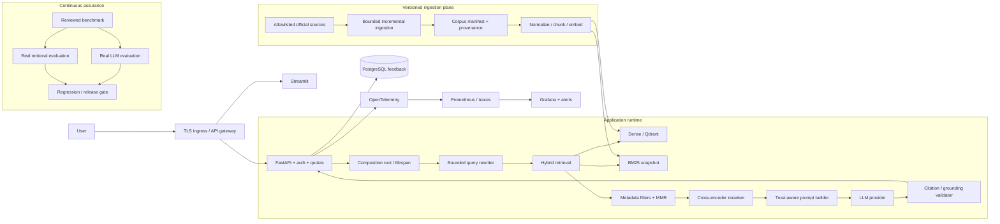
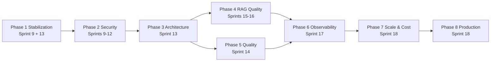
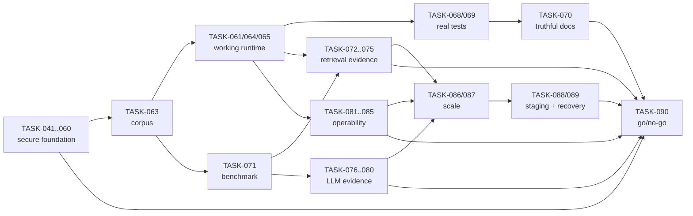

# EVOLUTION_PROGRAM — Production RAG Roadmap

> Official execution harness for evolving PokeRAG from an architectural prototype into a
> secure, measurable and operable production RAG service. Backlog:
> [`CONSOLIDATED_BACKLOG.md`](../03_tasks/CONSOLIDATED_BACKLOG.md) · Findings:
> [`TECHNICAL_AUDIT_FINDINGS.md`](./TECHNICAL_AUDIT_FINDINGS.md).

## 1. Program Overview

### Current state

The repository contains modular ingestion, hybrid retrieval, reranking, prompting, API/UI,
metrics and deployment definitions. It is an **alpha/MVP**: components pass isolated tests,
but the production entrypoint does not wire the application, clean clones lack corpus and
benchmark artifacts, evaluation results are synthetic, and the documented quality gate is
not green.

### Evolution objective

Deliver a production-qualified service whose behavior is proven by real-stack tests and
versioned evidence:

1. close SEC-01..SEC-17 and TECH-01..TECH-30;
2. make API/UI/feedback functional from a clean clone;
3. evaluate retrieval and LLM configurations against a reviewed benchmark;
4. enforce secure CI/CD, observability, performance and cost controls;
5. deploy to a staging cloud target and pass a final release scorecard.

### Non-negotiable principles

- Measured evidence overrides README claims.
- A test labelled integration/e2e must cross a real process or infrastructure boundary.
- Synthetic fixtures test mechanics; they cannot establish model or retrieval quality.
- Critical/High security findings and broken readiness block release.
- Corpus, benchmark, model/configuration and report versions are inseparable.

## 2. Target Architecture

## 3. Epics and Features

| Epic | Outcome | Features | Primary tasks |
| :--- | :--- | :--- | :--- |
| EPIC-01 Security & Trust | Close exploitable findings and reduce blast radius | Supply chain, auth/authz, SSRF, prompt trust, secrets, hardening, DAST | TASK-041..060 |
| EPIC-02 Runtime Architecture | Functional production composition and truthful health | Composition root, corpus hydration, top-k contract, query/feedback runtime | TASK-057, TASK-061..065 |
| EPIC-03 Quality & Reproducibility | Green deterministic clean-clone gate | Static quality, coverage, real test pyramid, compose E2E, truthful docs | TASK-066..070 |
| EPIC-04 Retrieval Quality | Defensible retrieval choice based on real evidence | Benchmark, real handlers, ablations, incremental corpus, regression baseline | TASK-071..075 |
| EPIC-05 LLM Quality & Guardrails | Defensible prompt/model choice with verified grounding | Real model matrix, RAGAS/DeepEval, human review, citation entailment, report | TASK-076..080 |
| EPIC-06 Observability & UX | Operable product with traceable user outcomes | Tracing, SLO/cost alerts, live dashboards, UX, operational analytics | TASK-081..085 |
| EPIC-07 Performance & Cost | Bounded latency/cost at expected load | Cache/MMR/filter policy, model lifecycle, batching, load tests | TASK-086..087 |
| EPIC-08 Cloud & Operations | Repeatable staged deployment and release decision | Staging proof, backup/restore/rollback, DORA, production scorecard | TASK-088..090 |

### Feature register

| Feature | Epic | Description | Stories/tasks |
| :--- | :--- | :--- | :--- |
| FEAT-01 Supply-chain assurance | EPIC-01 | Locked dependencies, active CI, SBOM and provenance | TASK-041, 042, 055, 058 |
| FEAT-02 Application/API security | EPIC-01 | Auth, quotas, SSRF prevention, safe boundaries and feedback integrity | TASK-043..050 |
| FEAT-03 Platform least privilege | EPIC-01 | DB, containers, K8s, network and immutable IaC | TASK-051..055 |
| FEAT-04 Security verification | EPIC-01 | Secure ingestion, DAST/adversarial tests and release closure | TASK-056..060 |
| FEAT-05 Runtime composition | EPIC-02 | Initialize and inject all real dependencies with truthful readiness | TASK-057, 061, 064, 065 |
| FEAT-06 Query contract | EPIC-02 | Honor top-k and deterministic corpus/runtime configuration | TASK-062, 063 |
| FEAT-07 Green quality gate | EPIC-03 | Ruff/mypy/format/coverage and supported runtimes | TASK-066, 067 |
| FEAT-08 Real test pyramid | EPIC-03 | Infrastructure integration and browser/API E2E without fakes | TASK-068, 069 |
| FEAT-09 Documentation truth | EPIC-03 | Reconcile README, API, deployment and evidence claims | TASK-070 |
| FEAT-10 Retrieval benchmark | EPIC-04 | Reviewed versioned questions and labels | TASK-071 |
| FEAT-11 Retrieval experimentation | EPIC-04 | Real strategy runners and parameter/model ablations | TASK-072, 073, 075 |
| FEAT-12 Corpus lifecycle | EPIC-04 | Incremental manifest-driven ingestion | TASK-074 |
| FEAT-13 LLM experimentation | EPIC-05 | Real prompt/model runs and automatic/human scoring | TASK-076..078 |
| FEAT-14 Grounding verification | EPIC-05 | Structured output and citation/claim validation | TASK-079, 080 |
| FEAT-15 Product telemetry | EPIC-06 | Tracing, SLOs, cost and populated dashboards | TASK-081..083 |
| FEAT-16 User workflow | EPIC-06 | History, citation actions, feedback comments and degraded UX | TASK-084, 085 |
| FEAT-17 Runtime optimization | EPIC-07 | Cache, diversity/filtering, warm-up, batching and load | TASK-086, 087 |
| FEAT-18 Production operations | EPIC-08 | Cloud proof, recovery/rollback and release scorecard | TASK-088..090 |

## 4. Roadmap Phases & Milestones

| Milestone | Exit evidence |
| :--- | :--- |
| M1 Contained | Critical exposure/dependency findings closed; active CI baseline |
| M2 Secure core | Auth, quotas, prompt/data boundaries and least privilege verified |
| M3 Functional alpha | Clean runtime serves real query and feedback; readiness is truthful |
| M4 Reproducible beta | Clean clone plus real integration/E2E and green quality gate |
| M5 Measured RAG | Reviewed benchmark; real retrieval and LLM reports select configurations |
| M6 Operable release candidate | Tracing, SLOs, cost, dashboards and load targets pass |
| M7 Production qualified | Cloud staging, recovery/rollback drill and final scorecard approved |

## 5. Program Success Indicators

| KPI | Baseline | Target / gate | Evidence owner |
| :--- | :--- | :--- | :--- |
| Line coverage | 83.52% | >=90% on application package | Quality |
| Real integration/E2E ratio | Predominantly fake/static | 100% critical user journeys cross real boundaries | QA/Platform |
| Open Critical/High vulnerabilities | Audit findings open | 0 unaccepted | Security |
| Retrieval Recall@10 | Unverified | >0.90 on reviewed benchmark | ML/Retrieval |
| Retrieval MRR | Unverified | >=0.75 | ML/Retrieval |
| Context Precision / Recall | Unverified | Baseline recorded; no release regression >2% | ML/Retrieval |
| Faithfulness | Synthetic | >0.85 real evaluation | ML/LLM |
| Citation validity | Unverified | >=0.95 claims map to retrieved evidence | ML/LLM |
| Query latency | Unverified | P50 <2s; P95 <4s warm | Backend/ML |
| LLM latency | Unverified | P95 budget recorded per selected model | ML/Platform |
| Cost/request | Not measured | Budget selected and 100% requests metered | Platform/FinOps |
| Positive feedback | Not operational | >=80% over >=100 rated production-like queries | Product |
| Availability | No measured SLO | >=99.5% staging rolling 7d | SRE |
| Deployment lead time | Unknown | <30 min commit-to-staging | DevOps |
| Change failure rate | Unknown | <15% | DevOps |
| MTTR | Unknown | <60 min for staging incidents | SRE |
| Technical debt | 30 technical + 17 security findings | 0 expired Critical/High; declining open count each sprint | Tech Lead |

## 6. Governance

- `TASK_INDEX.md` is the authoritative task state.
- `CONSOLIDATED_BACKLOG.md` owns priority, effort, owner and audit origin.
- Sprint specs own sprint goals and exit gates.
- Finding registers own audit closure.
- `TRACEABILITY_MATRIX.md` owns REQ -> task -> test -> SC traceability.
- Any deferred item requires owner, reason, compensating control and review date.

## 7. Program Risk Matrix

| Risk | Probability | Impact | Mitigation / treatment sprint |
| :--- | :--- | :--- | :--- |
| Broken composition or false readiness survives hardening | High | Critical | Typed composition, corpus parity and real journey — Sprint 13 |
| Corpus cannot be redistributed or reproduced | High | High | Legal fixture + allowlisted checksum bootstrap — Sprint 13 |
| Passing tests still do not represent production | High | High | Real infrastructure and browser/API E2E — Sprint 14 |
| Benchmark labels are weak, leaked or synthetic | High | High | Dataset card, held-out split and human review — Sprint 15 |
| LLM judge bias or hardcoded metrics selects the wrong model | High | High | Calibrated automatic + blinded human evaluation — Sprint 16 |
| Prompt/context/citation trust remains exploitable | High | Critical | TASK-048/059 plus claim-level entailment — Sprints 10, 12, 16 |
| Telemetry leaks content or creates cardinality/cost incidents | Medium | High | Attribute allowlist, redaction and cardinality tests — Sprint 17 |
| Cold start/concurrency breaches SLO or budget | High | High | Safe cache, warm-up, backpressure and load qualification — Sprint 18 |
| IaC is valid but cloud deployment/recovery fails | Medium | High | Remote staging smoke plus restore/rollback drill — Sprint 18 |
| Findings are closed without fresh evidence | Medium | Critical | Signed/retained evidence index and multi-role TASK-090 gate — Sprint 18 |

The detailed operational register, owner and requirement links live in
[`Risks.md`](../00_project/Risks.md), RISK-001..RISK-024.

## 8. Dependency Map and Critical Path

- **Blocking chain:** TASK-041 → 042 → 046 → 047 → 057 → 063 → 061 → 064 → 065 →
  068 → 069; retrieval, LLM and observability branches then converge through TASK-087 →
  088 → 089 → 090.
- **Parallel work:** TASK-062/063/066/081; TASK-071/074; TASK-077/078/079; and
  TASK-081/084 are explicitly separable after their prerequisites.
- **Human/external dependencies:** source-license approval (TASK-063), domain reviewers
  (TASK-071/078), provider budget/credentials (TASK-076/077), cloud account/DNS (TASK-088),
  and release risk owners (TASK-090).

## 9. Documentation Evolution Plan

| Artifact | Action | Owner | Sprint / task |
| :--- | :--- | :--- | :--- |
| README + development/setup guide | Correct clean-clone, profiles, limitations and commands | Tech Lead | Sprint 14 / TASK-070 |
| OpenAPI/API authentication guide | Generate contract; document auth, quotas, errors and examples | Backend | Sprints 10, 14 |
| C4 context/container/component diagrams | Update current and target architecture/composition boundaries | Architect | Sprint 13 |
| RAG sequence and trust-zone diagrams | Document ingestion/query/feedback and prompt/context trust | ML + Security | Sprints 12, 16 |
| ADRs | Record corpus distribution, auth, cache, evaluation, telemetry and cloud choices | Architect | With each material decision |
| Dataset/model cards and evaluation reports | Version benchmark, corpus, retrieval and LLM evidence | ML Lead | Sprints 15–16 |
| Security guide/threat model | Track SEC closure, secure defaults and residual risk | AppSec | Sprints 9–12, 18 |
| Testing plan and fixture taxonomy | Distinguish unit/fake, real integration, E2E, security and evaluation | QA | Sprint 14 |
| Observability/SLO/FinOps guide | Define spans, redaction, metrics, alerts and budgets | SRE | Sprint 17 |
| Deploy/operations manual | Staging, promotion, migration, backup, restore and rollback | DevOps/SRE | Sprint 18 |
| Incident/runbooks/troubleshooting | Alert-to-action procedures, ownership and escalation | SRE | Sprint 17 / TASK-085 |
| Production scorecard/evidence index | Map all findings and criteria to released hashes | Tech Lead | Sprint 18 / TASK-090 |

Documentation acceptance follows the same evidence rule as code: commands, links, diagrams and
quantitative claims are checked in CI or during the matching acceptance test.

## 10. Recommended Start

1. Complete Sprint 9's TASK-041/042 first: every later gate depends on a reproducible active CI.
2. Run containment tasks TASK-043/044 in parallel, then follow the dependency waves in
   [`TASK_DEPENDENCY_GRAPH.md`](../03_tasks/TASK_DEPENDENCY_GRAPH.md).
3. Reserve domain reviewer and cloud-account capacity before Sprints 15 and 18.
4. Re-score RISK-001..024 and KPI baselines at each sprint review; create no untracked work.
5. Use TASK-090—not a calendar date—as the only production-readiness declaration.
