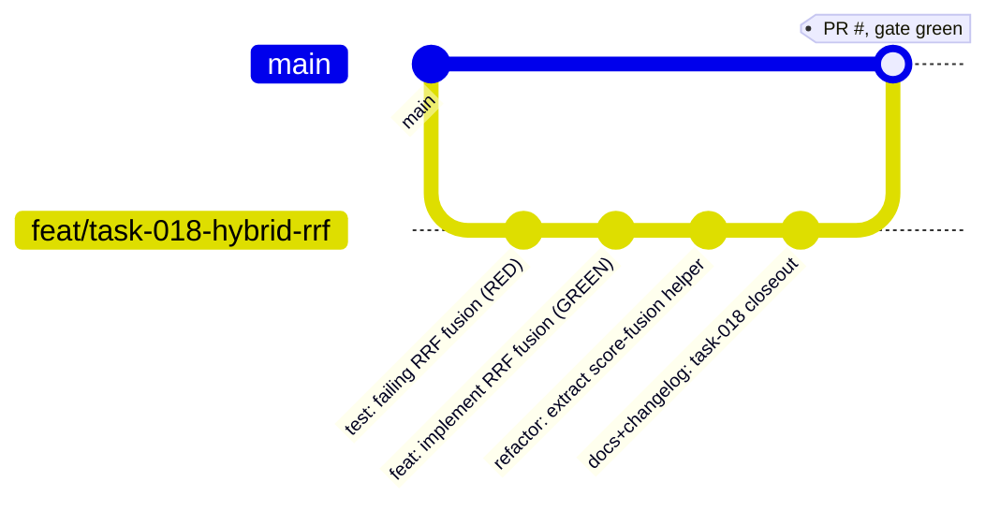

# IMPLEMENTATION_GUIDE.md — Workflow, Commits, and Closeout

> Part of the [Engineering Harness](../README.md) · Sibling docs: [PROJECT_CONSTITUTION.md](./PROJECT_CONSTITUTION.md) · [AGENT_PLAYBOOK.md](./AGENT_PLAYBOOK.md) · [QUALITY_GATE_SPECIFICATION.md](./QUALITY_GATE_SPECIFICATION.md) · [TRACEABILITY_MATRIX.md](./TRACEABILITY_MATRIX.md)

## Objective

Define the **concrete mechanics** of turning one ready task into a merged change: the branch strategy, the commit convention, the mandatory post-task checklist, the changelog format, and the implementation-report template. This is the plan's "most important document for code agents" made executable and tied to the real [`Makefile`](../../Makefile) and [`ci/workflows/ci.yml`](../../ci/workflows/ci.yml).

## Scope

- **In scope:** git branch/commit/PR workflow, the 7-step post-task checklist, changelog format, implementation-report template, and the Makefile/CI mapping.
- **Out of scope:** *which* task to pick and the TDD loop (see [AGENT_PLAYBOOK.md](./AGENT_PLAYBOOK.md)); the pass/fail merge criteria (see [QUALITY_GATE_SPECIFICATION.md](./QUALITY_GATE_SPECIFICATION.md)); the governing principles (see [PROJECT_CONSTITUTION.md](./PROJECT_CONSTITUTION.md)).

Grounded in `PlanejamentoRAG_Pokemon` ("IMPLEMENTATION_GUIDE.md" section) and [PRINCIPLE-006](./PROJECT_CONSTITUTION.md), [PRINCIPLE-014](./PROJECT_CONSTITUTION.md), [PRINCIPLE-015](./PROJECT_CONSTITUTION.md).

---

## 1. Branch Strategy

- `main` is **protected**: no direct pushes; merges only via PR that passed the CI gate.
- One branch per task, named: `feat/task-###-slug` (slug = short kebab summary).
  - Non-feature types use the same shape: `fix/task-###-slug`, `docs/task-###-slug`, `refactor/task-###-slug`, `test/task-###-slug`, `chore/task-###-slug`.
- One PR per task. A PR closes exactly one [`TASK-###`](../03_tasks/TASK_INDEX.md) ([PRINCIPLE-015](./PROJECT_CONSTITUTION.md)).



| Rule | Value |
| :--- | :--- |
| Branch pattern | `feat/task-###-slug` |
| Base branch | `main` (protected) |
| Merge unit | 1 task = 1 branch = 1 PR |
| Merge method | Squash or merge only after [QUALITY_GATE_SPECIFICATION.md](./QUALITY_GATE_SPECIFICATION.md) passes |
| Release branches | `release/*` (also run CI, per [`ci.yml`](../../ci/workflows/ci.yml) triggers) |

---

## 2. Commit Strategy — Conventional Commits

Every commit follows the [Conventional Commits](https://www.conventionalcommits.org) format, references the task, and represents one logical step of the TDD loop.

```
<type>(task-###): <imperative summary>

<optional body: what & why, not how>

Refs: TASK-###, REQ-###
```

**Allowed types:** `feat`, `fix`, `test`, `refactor`, `docs`, `chore`, `perf`, `ci`, `build`.

**Examples**

```
test(task-018): add failing test for RRF fusion ordering

Refs: TASK-018, REQ-008

feat(task-018): implement Reciprocal Rank Fusion (k from settings)

Combines dense + BM25 rankings via RRF(k=RETRIEVAL_HYBRID_RRF_K).

Refs: TASK-018, REQ-008
```

Rules: imperative mood, no trailing period in the subject, subject ≤ 72 chars, RED commit precedes its GREEN commit, and no commit leaves a `TODO`/`FIXME` on the branch destined for `main` ([PRINCIPLE-013](./PROJECT_CONSTITUTION.md)).

---

## 3. Mandatory Post-Task Checklist

Run **all seven** steps before opening the PR. This is the plan's canonical closeout ("Após finalizar…").

| # | Step | Command / Artifact | Enforced by |
| :--- | :--- | :--- | :--- |
| 1 | **Update documentation** | edit affected `docs/`, `README.md`, `.env.example` | [PRINCIPLE-014](./PROJECT_CONSTITUTION.md), [GATE-009](./QUALITY_GATE_SPECIFICATION.md) |
| 2 | **Run all tests** | `make test` (full suite, `--cov-fail-under=90`) | [GATE-004](./QUALITY_GATE_SPECIFICATION.md)/[GATE-005](./QUALITY_GATE_SPECIFICATION.md) |
| 3 | **Run lint** | `make lint` (`ruff check src/ tests/`) | [GATE-001](./QUALITY_GATE_SPECIFICATION.md) |
| 4 | **Run type checking** | `make typecheck` (`mypy src/`) | [GATE-003](./QUALITY_GATE_SPECIFICATION.md) |
| 5 | **Update changelog** | append entry to `CHANGELOG.md` (§4) | review |
| 6 | **Update sprint checklist** | tick item in [`DONE_CHECKLIST.md`](../02_sprints/DONE_CHECKLIST.md) + task status `Done` in [`TASK_INDEX.md`](../03_tasks/TASK_INDEX.md) | review |
| 7 | **Generate implementation report** | fill the template (§5) | review |

Shortcut for steps 2–4: `bash scripts/check_quality.sh` runs ruff → mypy → pytest(≥90%) in one pass.

---

## 4. Changelog Format

`CHANGELOG.md` follows [Keep a Changelog](https://keepachangelog.com) with sections `Added`, `Changed`, `Fixed`, `Removed`. Each line references the task and requirement.

```markdown
## [Unreleased]

### Added
- Hybrid retrieval via Reciprocal Rank Fusion (RRF, k from settings). (TASK-018, REQ-008)

### Fixed
- Chunker dropped trailing section on unicode input; added regression test. (TASK-021, REQ-004)
```

Every `Fixed` line MUST correspond to a regression test ([PRINCIPLE-009](./PROJECT_CONSTITUTION.md)).

---

## 5. Implementation Report Template

Produced at closeout (checklist step 7) and included in the PR description. Keep it factual and traceable.

```markdown
# Implementation Report — TASK-###: <title>

## Summary
<1–3 sentences: what was implemented and why.>

## Traceability
- Requirement(s): REQ-###
- Sprint: SPRINT_##
- Tests added: TEST-### (unit), TEST-### (integration)
- Acceptance criteria satisfied: <criterion IDs / SC-###>

## Changes
- Modules touched: src/pokemon_tcg_rag/<...>
- New config keys (settings.py / .env.example): <none | KEY=default>
- Public classes added/changed: <names> (each has a test — PRINCIPLE-008)

## Validation Evidence
| Check | Command | Result |
| :--- | :--- | :--- |
| Lint | make lint | PASS |
| Type check | make typecheck | PASS |
| Tests + coverage | make test | PASS · coverage NN% (≥90%) |
| Integration | make test-integration | PASS |
| Smoke | make test-smoke | PASS |
| Regression / eval (if retrieval/LLM touched) | make eval | no regression vs baseline |

## Docs & Bookkeeping
- Docs updated: <files>
- CHANGELOG.md updated: yes
- DONE_CHECKLIST.md + TASK_INDEX.md status → Done: yes
- TRACEABILITY_MATRIX.md rows updated: yes

## Notes / Follow-ups
- Out-of-scope items recorded in Backlog.md: <IDs or none>
```

---

## 6. Makefile & CI Mapping

| Workflow step | Local (`make`) | CI job in [`ci/workflows/ci.yml`](../../ci/workflows/ci.yml) |
| :--- | :--- | :--- |
| Install | `make install` (`pip install -e ".[dev]"`) | "Install Dependencies" |
| Lint | `make lint` | `quality-gate` → "Run Ruff Linter" |
| Format check | `make format` | `quality-gate` → "Run Black Code Format Verification" |
| Type check | `make typecheck` | `quality-gate` → "Run MyPy Type Checker" |
| Tests + coverage | `make test` | `unit-and-integration-tests` → "Execute Unit Tests with Coverage (Min 90%)" |
| Integration | `make test-integration` | (extend `unit-and-integration-tests`) |
| Smoke | `make test-smoke` | smoke gate |
| Evaluation / regression | `make eval` | regression gate (see [SUCCESS_CRITERIA.md](../00_project/SUCCESS_CRITERIA.md) §3) |

CI triggers on `push` to `main`/`release/*` and on every `pull_request` to `main`; `quality-gate` must pass before `unit-and-integration-tests` runs (`needs: quality-gate`).

---

## Cross-References

- [`AGENT_PLAYBOOK.md`](./AGENT_PLAYBOOK.md) — when in the loop each step here happens.
- [`QUALITY_GATE_SPECIFICATION.md`](./QUALITY_GATE_SPECIFICATION.md) — the exact merge conditions.
- [`PROJECT_CONSTITUTION.md`](./PROJECT_CONSTITUTION.md) — the principles behind the checklist.
- [`../02_sprints/DONE_CHECKLIST.md`](../02_sprints/DONE_CHECKLIST.md) · [`../03_tasks/TASK_INDEX.md`](../03_tasks/TASK_INDEX.md) — bookkeeping targets.
- [`../../Makefile`](../../Makefile) · [`../../ci/workflows/ci.yml`](../../ci/workflows/ci.yml) · [`../../scripts/check_quality.sh`](../../scripts/check_quality.sh) — the tooling.
