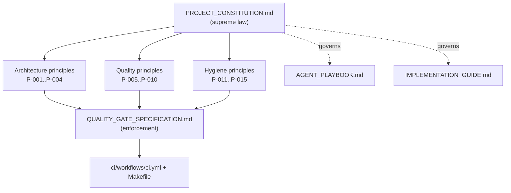

# PROJECT_CONSTITUTION.md — The Governing Principles

> Part of the [Engineering Harness](../README.md) · Sibling docs: [AGENT_PLAYBOOK.md](./AGENT_PLAYBOOK.md) · [IMPLEMENTATION_GUIDE.md](./IMPLEMENTATION_GUIDE.md) · [QUALITY_GATE_SPECIFICATION.md](./QUALITY_GATE_SPECIFICATION.md) · [TRACEABILITY_MATRIX.md](./TRACEABILITY_MATRIX.md)

## Objective

Establish the **immutable, non-negotiable principles** that govern every line of code written for the **Pokemon TCG Rules RAG Expert Assistant** — whether authored by a human or an autonomous code agent (Claude Code, Codex, Cursor). This document is the supreme reference of the harness: when any other document, task, or agent instinct conflicts with a principle here, **the Constitution wins**.

## Scope

- **In scope:** architectural law (Clean Architecture, SOLID, DDD), type-safety mandate, TDD-first discipline, coverage floor, configuration hygiene, documentation-sync law, and the enforcement mechanism behind each.
- **Out of scope:** *how* to execute a task (see [AGENT_PLAYBOOK.md](./AGENT_PLAYBOOK.md)), *how* to commit/branch (see [IMPLEMENTATION_GUIDE.md](./IMPLEMENTATION_GUIDE.md)), and the exact merge checks (see [QUALITY_GATE_SPECIFICATION.md](./QUALITY_GATE_SPECIFICATION.md)). The Constitution states the *law*; those docs state the *procedure*.

Every principle carries a stable ID (`PRINCIPLE-###`), a **Rationale** (why it exists) and an **Enforcement** mechanism (what makes it real — a tool, a gate, or a review rule). Principles are grounded in `PlanejamentoRAG_Pokemon` ("IMPLEMENTATION_GUIDE" / "Minha principal recomendação") and the real code under `src/pokemon_tcg_rag/`.

---

## 1. Principle Hierarchy

---

## 2. Architecture Principles

### PRINCIPLE-001 — Clean Architecture layering is law
Code MUST live in one of the fixed layers and dependencies MUST point **inward only**: `api`/`ui` → `llm`/`retrieval`/`evaluation`/`monitoring` → `ingestion`/`storage` → `domain`/`config`. The `domain` layer (`src/pokemon_tcg_rag/domain/`) depends on nothing framework-specific; outer layers may depend on it, never the reverse.

- **Rationale:** Business rules (what a `Chunk`, `RetrievedChunk`, `AnswerResponse` *is*) must survive swapping Qdrant, OpenAI, or Streamlit. Testability and substitutability depend on the dependency rule.
- **Enforcement:** Import-direction review in code review + the layer map in [`../01_architecture/Architecture.md`](../01_architecture/Architecture.md). No outward import from `domain/` may be introduced; a violation blocks merge (see [GATE-003](./QUALITY_GATE_SPECIFICATION.md)).

### PRINCIPLE-002 — SOLID is the default shape of every module
Single-responsibility modules (one reason to change), interfaces/protocols for boundaries (e.g. a retriever contract shared by `dense.py`, `bm25.py`, `hybrid.py`), and dependency inversion at every I/O edge (Qdrant, Postgres, LLM providers injected, never `import`-hardwired inside business logic).

- **Rationale:** The project ships **4 retrieval strategies** and **2 embedding models / 2 LLMs** as swappable experiments; only interface-driven design lets them be compared without rewrites ([REQ-018](../00_project/REQUIREMENTS.md), [REQ-019](../00_project/REQUIREMENTS.md)).
- **Enforcement:** Design review against this principle before implementation; new external calls must be injected. `mypy --strict` catches broken protocol conformance.

### PRINCIPLE-003 — Domain-Driven Design vocabulary is canonical
The ubiquitous language is defined once in `src/pokemon_tcg_rag/domain/models.py` (`DocumentSource`, `RuleType`, `DocumentMetadata`, `Document`, `Chunk`, `RetrievedChunk`, `AnswerResponse`, `FeedbackRecord`) and `domain/exceptions.py` (`DomainError` hierarchy). Code, tests, and docs MUST reuse these names verbatim — no synonyms ("passage" for `Chunk`, "result" for `RetrievedChunk`).

- **Rationale:** A single vocabulary shared across docs, code and traceability IDs is what lets an agent map [REQUIREMENTS.md](../00_project/REQUIREMENTS.md) → code → test without ambiguity.
- **Enforcement:** Review against [`../01_architecture/DomainModel.md`](../01_architecture/DomainModel.md); domain models are Pydantic and validated at runtime.

### PRINCIPLE-004 — Errors are domain-typed, never bare
Failures MUST raise a member of the `DomainError` hierarchy (`IngestionError`, `ChunkingError`, `VectorDBError`, `RetrievalError`, `LLMProviderError`). No bare `except:` and no swallowing exceptions silently.

- **Rationale:** Typed errors make the grounding/abstention behaviour ([REQ-011](../00_project/REQUIREMENTS.md)) and monitoring signals deterministic and testable.
- **Enforcement:** `ruff` rule set (`B`, `E`) + code review; regression tests assert the specific exception type.

---

## 3. Quality Principles

### PRINCIPLE-005 — Type hints are mandatory and strict
Every function, method, and public attribute MUST be fully type-annotated. `mypy` runs in **strict** mode (`disallow_untyped_defs = true`, per [`pyproject.toml`](../../pyproject.toml) `[tool.mypy]`).

- **Rationale:** Strict typing is the cheapest defect filter for an agent-authored codebase and documents intent for the next agent.
- **Enforcement:** `make typecheck` (`mypy src/`) locally and the `quality-gate` job in [`../../ci/workflows/ci.yml`](../../ci/workflows/ci.yml). Zero errors required — see [GATE-003](./QUALITY_GATE_SPECIFICATION.md).

### PRINCIPLE-006 — Test-Driven Development, first, always
Production code is written **only after** a failing test that specifies it. The loop is: red (failing test) → green (minimal code) → refactor. No implementation commit may exist without a test that would fail against the previous state.

- **Rationale:** Directly mandated by the plan ("Sempre escrever testes antes da implementação (TDD)"). TDD keeps agent output scoped and verifiable.
- **Enforcement:** Commit ordering reviewed (see [IMPLEMENTATION_GUIDE.md](./IMPLEMENTATION_GUIDE.md)); coverage gate ([PRINCIPLE-007](#principle-007--minimum-90-test-coverage)) makes untested code fail CI.

### PRINCIPLE-007 — Minimum 90% test coverage
Line coverage on `src/pokemon_tcg_rag` MUST be **≥ 90%** at all times.

- **Rationale:** Plan mandate + [REQ-017](../00_project/REQUIREMENTS.md) + [SC-016](../00_project/SUCCESS_CRITERIA.md).
- **Enforcement:** `pytest --cov=src/pokemon_tcg_rag --cov-fail-under=90` in `make test`, [`scripts/check_quality.sh`](../../scripts/check_quality.sh), and the `unit-and-integration-tests` CI job. Below 90% ⇒ merge blocked ([GATE-005](./QUALITY_GATE_SPECIFICATION.md)).

### PRINCIPLE-008 — Every public class has tests
Each public class (all `domain/models.py` models, every retriever, parser, chunker, the RAG chain, stores, API routes) MUST have at least one dedicated unit test asserting its contract.

- **Rationale:** Plan mandate ("Toda classe pública deve possuir testes"). Public surface is the contract other layers rely on.
- **Enforcement:** Reviewed against [TRACEABILITY_MATRIX.md](./TRACEABILITY_MATRIX.md) (`TEST-###` per component) + coverage report.

### PRINCIPLE-009 — Every bug fix ships with a regression test
A bug MUST NOT be fixed without first adding a test that reproduces it (fails before the fix, passes after). The test is committed **in the same PR** as the fix.

- **Rationale:** Plan mandate ("Todo bug corrigido deve ganhar um teste de regressão"); prevents the same defect from recurring under agent churn.
- **Enforcement:** PR review + the regression suite; retrieval/LLM regressions additionally guarded by [GATE-010](./QUALITY_GATE_SPECIFICATION.md) against [SUCCESS_CRITERIA.md](../00_project/SUCCESS_CRITERIA.md) baselines.

### PRINCIPLE-010 — No duplicated code
Logic MUST NOT be copy-pasted. Shared behaviour is extracted into a single function/class/module (DRY). Score fusion, embedding calls, metadata construction, etc. have exactly one home.

- **Rationale:** Plan mandate ("Nunca criar código duplicado"). Duplication multiplies the surface a future agent must keep consistent.
- **Enforcement:** `ruff` (`C4`, `SIM`) + code review; refactor step of the TDD loop is where duplication is removed.

---

## 4. Hygiene Principles

### PRINCIPLE-011 — No hardcoded configuration or magic values
Every tunable value (model names, hosts, ports, `TOP_K`, RRF `k`, temperatures, paths) MUST come from `src/pokemon_tcg_rag/config/settings.py` (`Settings`, loaded from `.env`). No literals like `"gpt-4o-mini"`, `6333`, `60`, or `"pokemon_tcg_rules"` embedded in business logic.

- **Rationale:** Plan mandate ("Não utilizar valores hardcoded. Todas as configurações devem vir do arquivo .env"); enables the model/strategy experiments and reproducibility ([SC-019](../00_project/SUCCESS_CRITERIA.md)).
- **Enforcement:** Code review against `settings.py`; new config keys added there with a default; `.env.example` kept current ([PRINCIPLE-014](#principle-014--documentation-and-examples-stay-in-sync)).

### PRINCIPLE-012 — No secrets in the repository
API keys, passwords, and tokens MUST never be committed. They live only in `.env` (git-ignored) and are surfaced through `Settings` (e.g. `OPENAI_API_KEY`, `QDRANT_API_KEY`, `POSTGRES_PASSWORD`).

- **Rationale:** Security and reproducibility; a leaked key breaks the deploy and the grade.
- **Enforcement:** `.gitignore` + secret-scan review ([GATE-008](./QUALITY_GATE_SPECIFICATION.md)); `.env.example` holds placeholders only.

### PRINCIPLE-013 — No TODO / FIXME on `main`
The `main` branch MUST NOT contain `TODO`, `FIXME`, or commented-out dead code. Unfinished work stays on a feature branch or becomes a tracked [TASK_INDEX](../03_tasks/TASK_INDEX.md) item.

- **Rationale:** Plan mandate ("Nenhum TODO pode permanecer na branch principal"). `main` is always demo-ready.
- **Enforcement:** Grep check in the merge gate ([GATE-007](./QUALITY_GATE_SPECIFICATION.md)) + review.

### PRINCIPLE-014 — Documentation and examples stay in sync
Any change to behaviour, config, API, or data model MUST update the affected docs (`docs/`), `README.md`, and `.env.example` **in the same PR**. Docs are part of the definition of done, not an afterthought.

- **Rationale:** Plan mandate ("Sempre atualize a documentação"); the harness only works if docs never drift from code.
- **Enforcement:** Post-task checklist in [IMPLEMENTATION_GUIDE.md](./IMPLEMENTATION_GUIDE.md) + [GATE-009](./QUALITY_GATE_SPECIFICATION.md) + review.

### PRINCIPLE-015 — One task at a time, never out of scope
An agent works on exactly **one** [`TASK-###`](../03_tasks/TASK_INDEX.md) at a time and implements **only** what that task's scope defines. No opportunistic refactors, no "while I'm here" features.

- **Rationale:** Plan mandate ("Sempre execute apenas uma task. Nunca implemente funcionalidades fora do escopo da task"); keeps PRs reviewable and traceable.
- **Enforcement:** [AGENT_PLAYBOOK.md](./AGENT_PLAYBOOK.md) decision loop + one-task-per-commit/PR rule in [IMPLEMENTATION_GUIDE.md](./IMPLEMENTATION_GUIDE.md).

---

## 5. Amendment Policy

The Constitution is **immutable during a sprint**. Amendments require an [Architecture Decision Record](../04_decisions/) (`ADR-###`) that explicitly cites the `PRINCIPLE-###` being changed, its rationale, and the migration impact. No agent may amend it autonomously — an amendment is a human-approved decision recorded in `docs/04_decisions/`.

---

## Cross-References

- [`AGENT_PLAYBOOK.md`](./AGENT_PLAYBOOK.md) — how an agent obeys these principles step by step.
- [`IMPLEMENTATION_GUIDE.md`](./IMPLEMENTATION_GUIDE.md) — commit/branch/checklist procedure.
- [`QUALITY_GATE_SPECIFICATION.md`](./QUALITY_GATE_SPECIFICATION.md) — the checks that enforce each principle.
- [`TRACEABILITY_MATRIX.md`](./TRACEABILITY_MATRIX.md) — REQ ↔ TASK ↔ TEST evidence chain.
- [`../00_project/REQUIREMENTS.md`](../00_project/REQUIREMENTS.md) · [`../00_project/SUCCESS_CRITERIA.md`](../00_project/SUCCESS_CRITERIA.md) — what and how-well.
- [`../../pyproject.toml`](../../pyproject.toml) · [`../../Makefile`](../../Makefile) · [`../../ci/workflows/ci.yml`](../../ci/workflows/ci.yml) — the tooling that makes the law real.
