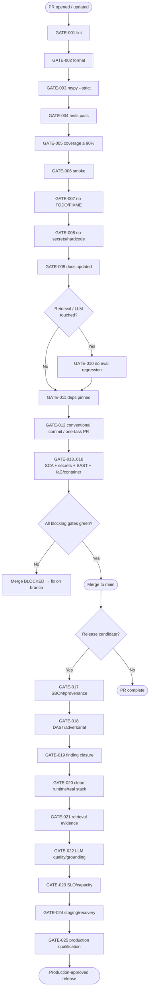

# QUALITY_GATE_SPECIFICATION.md — The Merge Gate

> Part of the [Engineering Harness](../README.md) · Sibling docs: [PROJECT_CONSTITUTION.md](./PROJECT_CONSTITUTION.md) · [AGENT_PLAYBOOK.md](./AGENT_PLAYBOOK.md) · [IMPLEMENTATION_GUIDE.md](./IMPLEMENTATION_GUIDE.md) · [TRACEABILITY_MATRIX.md](./TRACEABILITY_MATRIX.md)

## Objective

Enumerate **every mandatory check** a change must pass before it can merge into `main`, with a stable gate ID (`GATE-###`), what runs it (local `make` target and/or CI job), the exact pass condition, and whether it is blocking. This is the single, authoritative definition of "green" for the Pokemon TCG RAG project — the checklist in [IMPLEMENTATION_GUIDE.md](./IMPLEMENTATION_GUIDE.md) and the loop in [AGENT_PLAYBOOK.md](./AGENT_PLAYBOOK.md) both terminate here.

## Scope

- **In scope:** the concrete gate list, its mapping to [`../../Makefile`](../../Makefile) and
  the target workflow `.github/workflows/ci.yml`, and
  the PR pipeline order. Until TASK-042 relocates the current `ci/workflows/ci.yml`, CI
  discovery is itself a release blocker.
- **Out of scope:** the principles the gates enforce (see [PROJECT_CONSTITUTION.md](./PROJECT_CONSTITUTION.md)) and the numeric quality targets themselves (see [`../00_project/SUCCESS_CRITERIA.md`](../00_project/SUCCESS_CRITERIA.md)).

---

## 1. Gate Register

| Gate ID | Check | Runner (local / CI) | Pass condition | Blocking? | Enforces |
| :--- | :--- | :--- | :--- | :--- | :--- |
| **GATE-001** | Ruff **lint** | `make lint` / `quality-gate` → "Run Ruff Linter" (`ruff check src/ tests/`) | 0 lint errors (rules `E,F,W,I,N,UP,B,A,C4,SIM`) | **Yes** | [PRINCIPLE-004](./PROJECT_CONSTITUTION.md), [PRINCIPLE-010](./PROJECT_CONSTITUTION.md) |
| **GATE-002** | Ruff/Black **format** | `make format` / `quality-gate` → "Run Black Code Format Verification" (`black --check src/ tests/`) | No formatting diff | **Yes** | code hygiene |
| **GATE-003** | **mypy --strict** types | `make typecheck` / `quality-gate` → "Run MyPy Type Checker" (`mypy src/`) | 0 type errors, strict mode | **Yes** | [PRINCIPLE-001](./PROJECT_CONSTITUTION.md), [PRINCIPLE-005](./PROJECT_CONSTITUTION.md) |
| **GATE-004** | **Unit + integration tests** pass | `make test` / `unit-and-integration-tests` (`pytest`) | All `unit` + `integration` tests pass, 0 failures/errors | **Yes** | [PRINCIPLE-006](./PROJECT_CONSTITUTION.md), [PRINCIPLE-008](./PROJECT_CONSTITUTION.md) |
| **GATE-005** | **Coverage ≥ 90%** | `make test` (`--cov-fail-under=90`) / CI "Execute Unit Tests with Coverage (Min 90%)" | Line coverage on `src/pokemon_tcg_rag` ≥ 90% | **Yes** | [PRINCIPLE-007](./PROJECT_CONSTITUTION.md), [REQ-017](../00_project/REQUIREMENTS.md), [SC-016](../00_project/SUCCESS_CRITERIA.md) |
| **GATE-006** | **Smoke tests** | `make test-smoke` (`pytest tests/smoke/ -m smoke`) / smoke CI step | Stack-up → DB connect → embed → simple query → LLM answers, all pass in minutes | **Yes** | [SC-014](../00_project/SUCCESS_CRITERIA.md), [SC-021](../00_project/SUCCESS_CRITERIA.md) |
| **GATE-007** | **No `TODO`/`FIXME`** on merge target | grep check in review/CI | 0 `TODO`/`FIXME`/dead commented code in `src/` diff to `main` | **Yes** | [PRINCIPLE-013](./PROJECT_CONSTITUTION.md) |
| **GATE-008** | **No hardcoded secrets / config** | secret-scan + review vs `config/settings.py` | No keys/passwords committed; no magic literals bypassing `Settings` | **Yes** | [PRINCIPLE-011](./PROJECT_CONSTITUTION.md), [PRINCIPLE-012](./PROJECT_CONSTITUTION.md) |
| **GATE-009** | **Docs updated** | review (checklist step 1) | Affected `docs/`, `README.md`, `.env.example` updated in the same PR | **Yes** | [PRINCIPLE-014](./PROJECT_CONSTITUTION.md) |
| **GATE-010** | **Regression / eval not degraded** | `make eval` (`pytest tests/evaluation/ -m evaluation`) | Recall@K, Faithfulness, latency **not worse** than stored baseline (only runs when retrieval/chunking/prompt/model changed) | **Yes** (conditional) | [SC-001..SC-013](../00_project/SUCCESS_CRITERIA.md), [REQ-018](../00_project/REQUIREMENTS.md)/[REQ-019](../00_project/REQUIREMENTS.md) |
| **GATE-011** | **Dependency pinning** | review of [`../../pyproject.toml`](../../pyproject.toml) / [`../../requirements.txt`](../../requirements.txt) | Every runtime dependency has a version specifier | Yes | [SC-019](../00_project/SUCCESS_CRITERIA.md) |
| **GATE-012** | **Conventional commit / one-task PR** | review | Commits follow `<type>(task-###)` and PR closes exactly one `TASK-###` | Yes | [PRINCIPLE-015](./PROJECT_CONSTITUTION.md), [IMPLEMENTATION_GUIDE.md](./IMPLEMENTATION_GUIDE.md) |
| **GATE-013** | **Resolved dependency and image SCA** | locked install + SCA/container scanner | 0 unaccepted Critical/High findings; exceptions have owner and expiry | **Yes** | [REQ-021](../00_project/REQUIREMENTS.md), [SC-025](../00_project/SUCCESS_CRITERIA.md) |
| **GATE-014** | **Repository and history secret scan** | CI secret scanner + pre-commit | 0 verified secrets in working tree or reachable history | **Yes** | [REQ-028](../00_project/REQUIREMENTS.md), [SC-030](../00_project/SUCCESS_CRITERIA.md) |
| **GATE-015** | **SAST** | language-aware CI scanner | 0 unaccepted Critical/High findings; seeded-rule self-test detected | **Yes** | [REQ-030](../00_project/REQUIREMENTS.md), [SC-034](../00_project/SUCCESS_CRITERIA.md) |
| **GATE-016** | **IaC and container policy** | rendered manifests + policy-as-code/image scan | Restricted workload, immutable image and network policies pass; 0 unaccepted Critical/High | **Yes** | [REQ-027](../00_project/REQUIREMENTS.md), [SC-031](../00_project/SUCCESS_CRITERIA.md) |
| **GATE-017** | **SBOM and provenance** | release workflow | CycloneDX/SPDX SBOM and verified signature/provenance exist for each release image | **Yes** (release) | [REQ-021](../00_project/REQUIREMENTS.md), [SC-025](../00_project/SUCCESS_CRITERIA.md) |
| **GATE-018** | **DAST and LLM adversarial regression** | ephemeral-stack authenticated DAST + adversarial corpus | No exploitable Critical/High result; SC-026..SC-029 and SC-032 pass | **Yes** (conditional/nightly + release) | [REQ-022](../00_project/REQUIREMENTS.md)–[REQ-026](../00_project/REQUIREMENTS.md) |
| **GATE-019** | **Security finding closure** | TEST-148 evidence bundle and accountable review | SEC-01..SEC-17 closed or accepted with owner/expiry; all SC-025..SC-034 pass | **Yes** (release) | [REQ-030](../00_project/REQUIREMENTS.md), [SC-034](../00_project/SUCCESS_CRITERIA.md) |
| **GATE-020** | **Clean runtime and real-stack test** | TEST-149..158 in active CI | Corpus parity, production composition, query/feedback, clean clone, real integration/E2E and docs pass | **Yes** | REQ-031..034, SC-035..038 |
| **GATE-021** | **Reviewed retrieval evaluation** | Real ranked outputs + benchmark/report registry | SC-039/040 pass with matched corpus/config and no >2% regression | **Yes** (retrieval/corpus change) | REQ-035/036 |
| **GATE-022** | **LLM quality and grounding** | Real output, automatic/human and citation reports | SC-041/042 pass within approved model/cost configuration | **Yes** (prompt/model change) | REQ-037 |
| **GATE-023** | **Operational SLO and capacity** | Trace/metrics/alert/load evidence | SC-043..045 pass; no sensitive telemetry; workload remains bounded | **Yes** (release) | REQ-038..040 |
| **GATE-024** | **Staging and recovery** | Remote smoke + restore/rollback drill | SC-046/047 pass against approved digest and RPO/RTO | **Yes** (release) | REQ-041 |
| **GATE-025** | **Combined production qualification** | TEST-178 scorecard | All blocking SCs and all SEC/TECH finding evidence are current and approved | **Yes** (production) | REQ-042, SC-048 |

**Blocking = Yes** means merge is refused until the gate is green. GATE-010 is *conditionally*
blocking when retrieval/LLM behavior changes. GATE-013..GATE-019 become automated blocking
controls as TASK-042/TASK-058 deliver their runners; GATE-020..025 become available in
Sprints 13–18. Before then, each remediation task's
mandatory security test and Sprint Exit Gate provide the blocking evidence.

---

## 2. Mapping to `.github/workflows/ci.yml`

```mermaid
flowchart LR
    subgraph JOB1["CI job: quality-gate"]
        A["Run Ruff Linter → GATE-001"]
        B["Black --check → GATE-002"]
        C["MyPy Type Checker → GATE-003"]
    end
    subgraph JOB2["CI job: unit-and-integration-tests (needs: quality-gate)"]
        D["pytest --cov-fail-under=90<br/>GATE-004 + GATE-005"]
        E["Upload coverage.xml"]
    end
    subgraph LOCAL["Local / review-enforced gates"]
        F["make test-smoke → GATE-006"]
        G["grep TODO/FIXME → GATE-007"]
        H["secret & settings review → GATE-008"]
        I["docs review → GATE-009"]
        J["make eval → GATE-010"]
        K["deps pin review → GATE-011"]
        L["commit/PR review → GATE-012"]
    end
    subgraph SECURITY["Security jobs (TASK-042/TASK-058)"]
        M["SCA + image scan → GATE-013"]
        N["secret history + SAST → GATE-014/015"]
        O["IaC/container policy → GATE-016"]
        P["SBOM/provenance → GATE-017"]
        Q["DAST/adversarial → GATE-018"]
        R["release evidence → GATE-019"]
    end
    JOB1 --> JOB2
    JOB2 --> SECURITY
```

The `quality-gate` job is a hard prerequisite (`needs: quality-gate`) for the test job, so lint/format/type failures short-circuit the pipeline before any test runs — matching the fail-fast ordering agents should reproduce locally with `scripts/check_quality.sh`.

---

## 3. PR Merge Pipeline (end to end)

---

## 4. Failure Protocol

If any blocking gate fails, the agent MUST return to the TDD loop on the feature branch ([AGENT_PLAYBOOK.md](./AGENT_PLAYBOOK.md) §4), fix the cause (adding a regression test if it was a bug — [PRINCIPLE-009](./PROJECT_CONSTITUTION.md)), and re-run the full local gate (`scripts/check_quality.sh` + `make test-smoke`) before pushing again. A gate is **never** bypassed, disabled, or its threshold lowered to force a merge; changing a gate requires an `ADR-###` amending the relevant `PRINCIPLE-###`.

---

## Cross-References

- [`PROJECT_CONSTITUTION.md`](./PROJECT_CONSTITUTION.md) — the principles each gate enforces.
- [`IMPLEMENTATION_GUIDE.md`](./IMPLEMENTATION_GUIDE.md) — the checklist that feeds this gate.
- [`AGENT_PLAYBOOK.md`](./AGENT_PLAYBOOK.md) — where in the loop gates are run.
- [`../00_project/SUCCESS_CRITERIA.md`](../00_project/SUCCESS_CRITERIA.md) — numeric targets (SC-###) behind GATE-005/006/010/011.
- [`../../Makefile`](../../Makefile) · target `.github/workflows/ci.yml` ·
  [`../../scripts/check_quality.sh`](../../scripts/check_quality.sh) — the runners.
