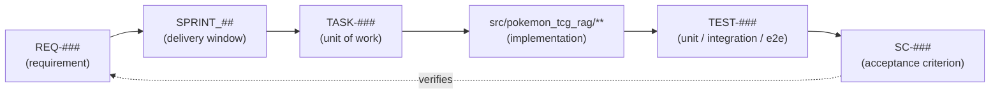

# TRACEABILITY_MATRIX.md — Requirement ↔ Sprint ↔ Task ↔ Test ↔ Criterion

> Part of the [Engineering Harness](../README.md) · Sibling docs: [PROJECT_CONSTITUTION.md](./PROJECT_CONSTITUTION.md) · [AGENT_PLAYBOOK.md](./AGENT_PLAYBOOK.md) · [IMPLEMENTATION_GUIDE.md](./IMPLEMENTATION_GUIDE.md) · [QUALITY_GATE_SPECIFICATION.md](./QUALITY_GATE_SPECIFICATION.md)

## Objective

Provide the **master traceability matrix** that links every requirement ([`REQ-###`](../00_project/REQUIREMENTS.md)) to the sprint that delivers it, the tasks ([`TASK-###`](../03_tasks/TASK_INDEX.md)) that implement it, the tests (`TEST-###`) that verify it, and the acceptance criterion ([`SC-###`](../00_project/SUCCESS_CRITERIA.md)) that declares it done. This guarantees that **no requirement is unimplemented and no implementation is unverified**.

## Scope

- **In scope:** the full REQ-001 → REQ-020 mapping and the traceability-chain concept.
- **Out of scope:** requirement text (see [`../00_project/REQUIREMENTS.md`](../00_project/REQUIREMENTS.md)), numeric targets (see [`../00_project/SUCCESS_CRITERIA.md`](../00_project/SUCCESS_CRITERIA.md)), and per-task detail (see [`../03_tasks/`](../03_tasks/)). `TASK-###`/`TEST-###` IDs below are the canonical links; their full definitions live in the task and test docs.

> **⚠️ Living document — agents MUST keep this matrix updated.** Whenever you implement a task, add a test, or change a requirement's status, update the matching rows here **in the same PR** (closeout step 6, [IMPLEMENTATION_GUIDE.md](./IMPLEMENTATION_GUIDE.md)). A stale matrix is a merge-blocking documentation failure ([PRINCIPLE-014](./PROJECT_CONSTITUTION.md), [GATE-009](./QUALITY_GATE_SPECIFICATION.md)).

---

## 1. The Traceability Chain (concept)

Read it as: a requirement is scheduled into a sprint, decomposed into tasks, realized in code, proven by tests, and accepted against a measurable criterion that closes the loop back to the requirement.

---

## 2. Master Traceability Matrix (REQ-001 → REQ-020)

| REQ | Sprint | Task(s) | Test(s) | Acceptance Criterion | Status |
| :--- | :--- | :--- | :--- | :--- | :--- |
| [REQ-001](../00_project/REQUIREMENTS.md) Pokegym rulings scrape → JSON | SPRINT_02 | TASK-007, TASK-010 | TEST-007 (unit: `crawler_pokegym`), TEST-010 (integration: crawl→JSON) | [SC-015](../00_project/SUCCESS_CRITERIA.md) 100% sources indexed | Pending |
| [REQ-002](../00_project/REQUIREMENTS.md) 5 PDFs text/layout via PyMuPDF | SPRINT_02 | TASK-009, TASK-010 | TEST-009 (unit: `pdf_parser`), TEST-010 (integration: 5 PDFs parsed) | [SC-015](../00_project/SUCCESS_CRITERIA.md) | Pending |
| [REQ-003](../00_project/REQUIREMENTS.md) HTML scrape Ban/Promo/Mega | SPRINT_02 | TASK-008, TASK-010 | TEST-008 (unit: `html_scraper` fields), TEST-010 (integration: HTML→JSON) | [SC-015](../00_project/SUCCESS_CRITERIA.md) | Pending |
| [REQ-004](../00_project/REQUIREMENTS.md) Normalize + chunk with metadata | SPRINT_03 | TASK-012, TASK-013, TASK-016 | TEST-012 (unit: `normalizer`), TEST-013 (unit: `chunker` size/overlap/unicode/metadata) | [SC-015](../00_project/SUCCESS_CRITERIA.md) | Pending |
| [REQ-005](../00_project/REQUIREMENTS.md) Index embeddings into Qdrant | SPRINT_03 | TASK-014, TASK-015, TASK-016 | TEST-014 (unit: `vector_db`), TEST-016 (integration: ingest→index count) | [SC-015](../00_project/SUCCESS_CRITERIA.md) | Pending |
| [REQ-006](../00_project/REQUIREMENTS.md) Dense retrieval (bge-large) | SPRINT_04 | TASK-017 | TEST-017 (unit: `retrieval/dense`) | [SC-001](../00_project/SUCCESS_CRITERIA.md), [SC-005](../00_project/SUCCESS_CRITERIA.md) | Pending |
| [REQ-007](../00_project/REQUIREMENTS.md) BM25 lexical retrieval | SPRINT_04 | TASK-018 | TEST-018 (unit: `retrieval/bm25`) | [SC-005](../00_project/SUCCESS_CRITERIA.md) | Pending |
| [REQ-008](../00_project/REQUIREMENTS.md) Hybrid search via RRF | SPRINT_04 | TASK-019, TASK-023 | TEST-019 (unit: RRF fusion ordering, k from settings) | [SC-022](../00_project/SUCCESS_CRITERIA.md) hybrid on/off ablation | Pending |
| [REQ-009](../00_project/REQUIREMENTS.md) Cross-encoder rerank (bge-reranker) | SPRINT_04 | TASK-020, TASK-023 | TEST-020 (unit: `retrieval/reranker`) | [SC-022](../00_project/SUCCESS_CRITERIA.md) rerank ablation | Pending |
| [REQ-010](../00_project/REQUIREMENTS.md) LLM query rewriting | SPRINT_05 | TASK-022, TASK-023 | TEST-022 (unit: `query_rewriter`) | [SC-022](../00_project/SUCCESS_CRITERIA.md) rewrite ablation | Pending |
| [REQ-011](../00_project/REQUIREMENTS.md) Certified-Judge persona, context-only | SPRINT_05 | TASK-021, TASK-024, TASK-025 | TEST-024 (unit: prompt builder), TEST-025 (e2e: abstention "I don't know") | [SC-006](../00_project/SUCCESS_CRITERIA.md), [SC-011](../00_project/SUCCESS_CRITERIA.md) | Pending |
| [REQ-012](../00_project/REQUIREMENTS.md) Every answer cites sources | SPRINT_05 | TASK-003, TASK-024, TASK-025 | TEST-003 (unit: citations on `AnswerResponse`) | [SC-008](../00_project/SUCCESS_CRITERIA.md) citation quality | Pending |
| [REQ-013](../00_project/REQUIREMENTS.md) Streamlit UI (answer/sources/chunks/feedback) | SPRINT_06 | TASK-028, TASK-029, TASK-030, TASK-031 | TEST-030 (unit: UI render), TEST-029 (integration: `/query` API contract) | [SC-021](../00_project/SUCCESS_CRITERIA.md) API contract | Pending |
| [REQ-014](../00_project/REQUIREMENTS.md) Feedback 👍/👎 + comment → Postgres | SPRINT_06 | TASK-026, TASK-027, TASK-029, TASK-030 | TEST-027 (integration: `/feedback`→`feedback` table row) | [SC-018](../00_project/SUCCESS_CRITERIA.md) feedback persistence | Pending |
| [REQ-015](../00_project/REQUIREMENTS.md) Prometheus + Grafana ≥5 charts | SPRINT_08 | TASK-005, TASK-037, TASK-038 | TEST-037 (unit: `metrics_collector`), TEST-038 (integration: `/metrics` scrape) | [SC-017](../00_project/SUCCESS_CRITERIA.md), [SC-012](../00_project/SUCCESS_CRITERIA.md), [SC-013](../00_project/SUCCESS_CRITERIA.md) | Pending |
| [REQ-016](../00_project/REQUIREMENTS.md) All services in Docker Compose | SPRINT_08 | TASK-001, TASK-002, TASK-006, TASK-011, TASK-039 | TEST-039 (smoke: `docker compose up` healthy) | [SC-014](../00_project/SUCCESS_CRITERIA.md), [SC-024](../00_project/SUCCESS_CRITERIA.md) | Pending |
| [REQ-017](../00_project/REQUIREMENTS.md) ≥90% coverage enforced by CI | SPRINT_01 (all sprints) | TASK-001, TASK-004 (+ every task via 90% coverage gate) | TEST-001 (CI coverage gate), whole suite | [SC-016](../00_project/SUCCESS_CRITERIA.md), [SC-020](../00_project/SUCCESS_CRITERIA.md) | Pending |
| [REQ-018](../00_project/REQUIREMENTS.md) Eval retrieval strategies (Recall@K, MRR) | SPRINT_07 | TASK-032, TASK-033, TASK-034, TASK-036 | TEST-033 (unit: `metrics` Recall/MRR), TEST-034 (evaluation: 4-strategy benchmark) | [SC-001](../00_project/SUCCESS_CRITERIA.md)–[SC-005](../00_project/SUCCESS_CRITERIA.md) | Pending |
| [REQ-019](../00_project/REQUIREMENTS.md) Eval LLM (Faithfulness, Correctness) | SPRINT_07 | TASK-035, TASK-036 | TEST-035 (evaluation: RAGAS faithfulness), TEST-036 (evaluation: 2 prompts × 2 models) | [SC-006](../00_project/SUCCESS_CRITERIA.md)–[SC-010](../00_project/SUCCESS_CRITERIA.md) | Pending |
| [REQ-020](../00_project/REQUIREMENTS.md) Kubernetes / IaC manifests (cloud) | SPRINT_08 | TASK-040 | TEST-040 (smoke: manifest validity), TEST-040e (e2e: public `/health` 200) | [SC-023](../00_project/SUCCESS_CRITERIA.md) cloud deploy (bonus) | Pending |

**Status legend:** `Pending` → `In Progress` → `Done`. A REQ is `Done` only when all its tasks are `Done`, all its tests pass, and its acceptance criteria (`SC-###`) meet target in the evaluation/CI evidence.

---

## 3. Coverage Assertions

- **Every `REQ-###` has ≥1 task and ≥1 test.** A requirement with an empty Task or Test cell is a traceability gap and blocks the sprint.
- **Every best-practice feature is ablated** ([REQ-008](../00_project/REQUIREMENTS.md)/[REQ-009](../00_project/REQUIREMENTS.md)/[REQ-010](../00_project/REQUIREMENTS.md) → [SC-022](../00_project/SUCCESS_CRITERIA.md)).
- **Every public class has a test** ([PRINCIPLE-008](./PROJECT_CONSTITUTION.md)); the `TEST-###` unit rows above name the responsible tests per component in `src/pokemon_tcg_rag/`.
- **Regression coverage:** any change to REQ-006–REQ-012 or REQ-018/REQ-019 areas triggers [GATE-010](./QUALITY_GATE_SPECIFICATION.md) against the [SUCCESS_CRITERIA.md](../00_project/SUCCESS_CRITERIA.md) baselines.

---

## 4. How to Update This Matrix (agent procedure)

1. When you **claim a task**, confirm its REQ row exists here; if the task splits a REQ further, add the new `TASK-###` to that row's Task cell.
2. When you **add a test**, register its `TEST-###` in the row's Test cell (matching the name you used in `tests/`).
3. When a task reaches **Done**, re-evaluate the REQ Status; set it `Done` only when the §2 completion rule holds.
4. Never delete a row — requirements are traceable for the life of the project. Deprecations are struck through with an `ADR-###` reference.

---

## Cross-References

- [`../00_project/REQUIREMENTS.md`](../00_project/REQUIREMENTS.md) — REQ definitions & priorities.
- [`../00_project/SUCCESS_CRITERIA.md`](../00_project/SUCCESS_CRITERIA.md) — SC-### targets and measurement cadence.
- [`../03_tasks/TASK_INDEX.md`](../03_tasks/TASK_INDEX.md) · [`../03_tasks/TASK_DEPENDENCY_GRAPH.md`](../03_tasks/TASK_DEPENDENCY_GRAPH.md) — TASK definitions & order.
- [`../02_sprints/`](../02_sprints/) — sprint delivery windows.
- [`QUALITY_GATE_SPECIFICATION.md`](./QUALITY_GATE_SPECIFICATION.md) · [`IMPLEMENTATION_GUIDE.md`](./IMPLEMENTATION_GUIDE.md) — when/how this matrix is updated and enforced.
